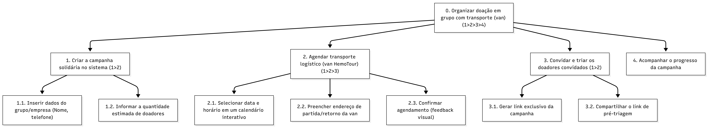

## Introdução

A [Análise Hierárquica de Tarefas](#ref1) (HTA - *Hierarchical Task Analysis*) é um dos métodos de análise de tarefas mais consolidados na área de Interação Humano-Computador (IHC). Diferente de métodos que focam em uma lista sequencial de cliques ou ações, a HTA inicia sua abordagem pela definição dos **objetivos** dos usuários. Seu propósito central é relacionar o que as pessoas fazem, o porquê de fazerem e quais as consequências caso a tarefa não seja executada de maneira correta. A partir de um objetivo de alto nível, o método realiza uma decomposição em subobjetivos (organizados por planos lógicos) até atingir as operações fundamentais, que são especificadas pelas condições de entrada (*input*), ações propriamente ditas e condições de satisfação (*feedback*).

No escopo de um projeto de IHC, a HTA serve para avaliar sistemas existentes, guiar o (re)design de novas interfaces ou validar a introdução de uma nova tecnologia no cotidiano dos usuários. Ao detalhar o comportamento do usuário dessa forma, o designer consegue identificar com precisão como o sistema facilita ou impede que as pessoas alcancem seus objetivos, embasando a identificação de gargalos de usabilidade e a formulação de recomendações de design para o produto final.

## Analise HTA - Doação em Grupo

1. **Decidir os objetivos da análise:** O objetivo desta análise é projetar uma funcionalidade nova. Define-se como o usuário o perfil de usuário 1 que organizará o fluxo de Doação em Grupo de forma autônoma, mapeando a criação da campanha, o agendamento logístico de transporte (van) em um calendário interativo e a geração do link para triagem prévia dos convidados, baseando-se nas diretrizes citadas por [Barbosa et al. (2021)](#ref1).

2. **Obter consenso sobre objetivos e medidas de sucesso:**

    - Evidência objetiva de que o objetivo foi atingido: A confirmação imediata da reserva da van exibida na tela (feedback instantâneo) e a geração de um link exclusivo e rastreável da campanha para envio em aplicativos de mensagens.

    - Consequências da falha em atingir o objetivo: O cancelamento da ação solidária por falta de transporte ou organização, resultando na perda de potenciais doadores para a Fundação Hemocentro de Brasília (FHB) e na quebra de expectativa do usuário organizador.

3. **Identificar as fontes de informações:** Por tratar-se da ideação de uma funcionalidade nova, as fontes de aquisição de dados baseiam-se nos requisitos documentados no perfil da Persona 1, nos Cenários de Problema previamente estabelecidos e nas normativas operacionais da FHB (que exigem grupos entre 10 e 19 pessoas para viabilizar o transporte).

4. **Coletar dados e esboçar decomposição:** O objetivo principal "0. Organizar doação em grupo com transporte (van)" foi decomposto de forma exaustiva e mutuamente exclusiva nos seguintes subobjetivos: criar campanha, agendar van, convidar doadores e acompanhar progresso. (A representação gráfica e tabular é apresentada nas seções a seguir).

5. **Verificar a validade:** A validação desta nova estrutura hierárquica será realizada em etapas futuras de prototipação e testes de usabilidade, visando garantir que a lógica de "link de triagem" e "calendário de vans" atenda aos modelos mentais dos usuários e à logística real do Hemocentro.

6. **Identificar operações significativas:** Considerando o critério estatístico de probabilidade vezes custo (p×c), as operações mais críticas para o sucesso do objetivo são a 2.1 (Selecionar data e horário em um calendário interativo) e a 3.1 (Gerar link exclusivo da campanha). Se o calendário apresentar falhas de legibilidade, o transporte não é efetivado; se o link de triagem apresentar erro, o grupo pode se deslocar inapto ao Hemocentro, gerando prejuízo de tempo e recursos.

7. **Gerar e testar hipóteses sobre erros:** O design da nova funcionalidade deve prevenir as seguintes falhas hipotéticas:

    - Desempenho baseado em habilidades: O usuário selecionar a data errada do calendário por desatenção motora. O sistema deve exigir confirmação final explícita na tela.

    - Desempenho baseado em regras: O usuário tentar solicitar a van para menos de 10 pessoas, contrariando a regra do Hemocentro. O sistema deve desabilitar o botão de avanço se o valor inserido na etapa 1.2 for inferior a 10.

    - Desempenho baseado em conhecimento: O usuário desconhecer o termo "Verificador de Aptidão" por tratar-se de jargão clínico. A interface necessitará de linguagem simples e comunicabilidade clara, instruindo que o link tem o propósito de realizar uma pré-triagem.

---

<b>Tabela 1</b> - Análise Hierárquica de Tarefas (HTA) - Doação em Grupo

| Objetivos / Operações | Problemas e Recomendações de Design |
| :--- | :--- |
| **0. Organizar doação em grupo com transporte (van) 1>2>3>4**    *Input:* O usuário (Persona 1) deseja agendar a ida de um grupo de colegas ao Hemocentro de forma 100% online.   *Feedback:* Tela de sucesso com barra de progresso da campanha e resumo dos dados da van.   *Plano:* Criar a campanha, reservar a van no calendário, gerar o link de convite e acompanhar adesão. | **Recomendação:** A interface deve ser projetada guiando o usuário passo a passo, priorizando a eficiência da tarefa e a eliminação de processos burocráticos externos. |
| **1. Criar a campanha solidária no sistema 1>2**    *Plano:* Preencher um formulário simplificado de escopo do grupo. | |
| 1.1. Inserir dados do grupo/empresa (Nome, telefone) | **Recomendação:** Utilizar preenchimento automático para os dados previamente cadastrados do usuário organizador. |
| 1.2. Informar a quantidade estimada de doadores | **Prevenção de erro (Regra):** O sistema deve exibir um aviso explícito sobre os limites de capacidade ("A van está disponível apenas para grupos de 10 a 19 doadores") e impedir a submissão de valores fora deste intervalo. |
| **2. Agendar transporte logístico (van HemoTour) 1>2>3**    *Plano:* Escolher a data e confirmar a logística de ida e volta de forma sistêmica. | |
| 2.1. Selecionar data e horário em um calendário interativo | **Recomendação:** O calendário deve exibir de forma clara e legível apenas os dias que possuem disponibilidade real de frota, prevenindo o agendamento de horários indisponíveis. |
| 2.2. Preencher endereço de partida/retorno da van | **Recomendação:** Oferecer suporte via API de geolocalização para autocompletar endereços e mitigar a carga de trabalho na digitação. |
| 2.3. Confirmar agendamento (obter feedback visual) | **Prevenção de erro (Conhecimento):** Para atravessar o "Golfo de Avaliação", a interface deve apresentar um feedback de estado forte (ex.: ícone de confirmação em cor verde) assegurando que a reserva foi efetivada. |
| **3. Convidar e triar os doadores convidados 1>2**    *Plano:* Capturar o link sistêmico e difundi-lo entre o grupo convidado. | |
| 3.1. Gerar link exclusivo da campanha | **Recomendação:** O link gerado deve estar atrelado à pré-triagem (Verificador de Aptidão), garantindo que os usuários convidados verifiquem seus impeditivos clínicos antes do embarque. |
| 3.2. Compartilhar o link de pré-triagem | **Recomendação:** Posicionar botões de atalho (ex.: "Copiar Link") na interface final para acelerar a difusão da informação. |
| **4. Acompanhar o progresso da campanha (Opcional)**    *Plano:* Retornar ao sistema em momento futuro para verificar a taxa de confirmação dos convidados. | **Recomendação:** Implementar um painel de controle (dashboard) contendo indicadores visuais simples (ex.: "X de 15 pessoas concluíram a pré-triagem"), assegurando o controle informacional por parte do organizador da campanha. |

Fonte: [Pedro Américo](https://github.com/dev-americo) - (2026).

---

  
<strong>Figura 1</strong> - Análise Hierárquica de Tarefas (HTA) - Doação em Grupo

  
  

  
Fonte: <a href="https://github.com/dev-americo" style="color: red; text-decoration: none;"> Pedro Américo</a> (2026).

## Referências Bibliográficas

>  [1] BARBOSA, Simone Diniz Junqueira et al. *Interação Humano-Computador e Experiência do Usuário*. 1. ed. Rio de Janeiro: Autopublicação, 2021.

## Histórico de Versões

| Versão | Descrição | Data | Autor(es) | Data de revisão | Revisor(es) |
| :---: | :--- | :---: | :---: | :---: | :---: |
| 1.0 | Analise HTA | 03/05/2026 | [Pedro Américo](https://github.com/dev-americo)| 03/05/2026 | [Pedro Ian](https://github.com/pedroiaan) |