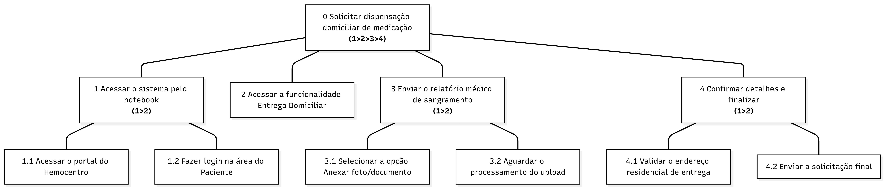

## Introdução

A [Análise Hierárquica de Tarefas](#ref1) (HTA - *Hierarchical Task Analysis*) é um dos métodos de análise de tarefas mais consolidados na área de Interação Humano-Computador (IHC). Diferente de métodos que focam em uma lista sequencial de cliques ou ações, a HTA inicia sua abordagem pela definição dos **objetivos** dos usuários. Seu propósito central é relacionar o que as pessoas fazem, o porquê de fazerem e quais as consequências caso a tarefa não seja executada de maneira correta. A partir de um objetivo de alto nível, o método realiza uma decomposição em subobjetivos (organizados por planos lógicos) até atingir as operações fundamentais, que são especificadas pelas condições de entrada (*input*), ações propriamente ditas e condições de satisfação (*feedback*).

No escopo de um projeto de IHC, a HTA serve para avaliar sistemas existentes, guiar o (re)design de novas interfaces ou validar a introdução de uma nova tecnologia no cotidiano dos usuários. Ao detalhar o comportamento do usuário dessa forma, o designer consegue identificar com precisão como o sistema facilita ou impede que as pessoas alcancem seus objetivos, embasando a identificação de gargalos de usabilidade e a formulação de recomendações de design para o produto final.

## Análise HTA - Solicitar Dispensação Domiciliar de Medicação

1. **Decidir os objetivos da análise**: O objetivo desta análise é avaliar a modificação de um sistema existente (o portal da Fundação Hemocentro de Brasília)[¹](#ref1) através da criação de uma nova funcionalidade digital (Mobile First) focada na solicitação autônoma de dispensação domiciliar de fatores de coagulação e envio de relatórios médicos.
2. **Obter consenso sobre objetivos e medidas de sucesso**

    - Qual evidência objetiva indicará que o objetivo foi atingido? O sucesso da tarefa será evidenciado pela emissão de um comprovante na tela (e envio por e-mail/SMS) com o número de protocolo, confirmando que o relatório foi anexado e a entrega da medicação foi agendada para o endereço do paciente.
    - Quais as consequências da falha em atingir esse objetivo? A falha na execução ou ausência da funcionalidade resultará na falta de medicação na casa do paciente, forçando-o a realizar um deslocamento presencial burocrático, o que pode agravar sua condição clínica (como sangramentos articulares severos).

3. **Identificar fontes de informação**: Como base para esta análise, utilizamos o cenário de uso previamente modelado (frustração com a burocracia do agendamento presencial), os perfis de usuários mapeados, a literatura de padrões de interfaces web e heurísticas de usabilidade.
4. **Coletar dados e esboçar a decomposição**: A tarefa principal foi desdobrada nos seguintes subobjetivos, de forma mutuamente exclusiva e exaustiva:

    0. Solicitar dispensação domiciliar de medicação
    1. Acessar o sistema logado (Portal do Paciente) pelo Notebook
    2. Acessar a nova funcionalidade "Entrega Domiciliar"
    3. Enviar a foto do relatório médico de sangramento (Hemartrose)
    4. Confirmar os detalhes de entrega e finalizar solicitação
    

5. **Verificar a validade**: A decomposição estruturada neste documento passará por uma verificação de validade prática junto às partes interessadas, mediante a apresentação do cenário e a simulação dos passos da interface com usuários que possuam perfil semelhante ao da persona.
6. **Identificar operações significativas**: As operações mais críticas para o sucesso do objetivo são o "Upload da foto do relatório médico" e a "Validação do endereço", dado que a usuária realiza essas ações através de um dispositivo, possivelmente com restrições de rede ou tempo curto (horário de almoço).
7. **Gerar e testar hipóteses sobre erros**: A análise prevê a ocorrência de falhas tecnológicas relacionadas ao ambiente *desktop*, como o envio de fotos muito pesadas que podem travar o sistema ou falhar devido a conexões instáveis. Para mitigar esse erro, recomenda-se que o sistema realize a compressão automática da imagem no próprio navegador antes do envio.

---

<b>Tabela 1</b> - Análise Hierárquica de Tarefas (HTA) - Solicitar Dispensação Domiciliar de Medicação

| Objetivos / Operações | Problemas e Recomendações |
| :--- | :--- |
| **0. Solicitar dispensação domiciliar de medicação** (1>2>3>4) | **entrada:** Paciente com estoque de fatores de coagulação baixo e relatório médico em mãos.  **feedback:** Exibição de mensagem visual "Solicitação enviada com sucesso" acompanhada de um número de protocolo.  **plano:** Executar os passos 1, 2, 3 e 4 sequencialmente.  **recomendação:** O sistema deve ter um design responsivo e linear, focado em agilidade para usuários móveis. |
| **1. Acessar o sistema pelo aparelho** (1>2) | **plano:** Realizar 1.1 e 1.2 sequencialmente. |
| 1.1. Acessar o portal do Hemocentro | **problema:** Em redes móveis (3G/4G), o carregamento pode ser lento.  **recomendação:** A página inicial voltada para o paciente deve ser otimizada e leve. |
| 1.2. Fazer login na área do Paciente | |
| **2. Acessar a funcionalidade "Entrega Domiciliar"** | **ação:** Clicar no botão ou atalho rápido "Solicitar Entrega de Medicação" no painel inicial. |
| **3. Enviar o relatório médico de sangramento** (1>2) | **plano:** Executar 3.1 e depois 3.2.  **problema:** O arquivo da foto pode exceder o limite de tamanho do servidor.  **recomendação:** O sistema deve integrar-se facilmente à câmera nativa do aparelho e realizar compressão automática da imagem. |
| 3.1. Selecionar a opção "Anexar foto/documento" | **ação:** Acionar a câmera do dipositivo ou escolher foto da galeria. |
| 3.2. Aguardar o processamento do upload | **feedback:** O sistema deve exibir uma barra de progresso clara e um ícone de "check" ao concluir. |
| **4. Confirmar detalhes e finalizar** (1>2) | **plano:** Executar 4.1 e depois 4.2. |
| 4.1. Validar o endereço residencial de entrega | **recomendação:** Para evitar digitação excessiva no aparelho, o sistema já deve trazer o endereço pré-cadastrado do banco de dados, exigindo apenas uma confirmação. |
| 4.2. Enviar a solicitação final | **ação:** Clicar no botão "Confirmar Solicitação de Entrega". |

Fonte: [Breno Teixeira](https://github.com/brenolteixeira) - (2026).

---

  
<strong>Figura 1</strong> - Análise Hierárquica de Tarefas (HTA) - Solicitar Dispensação Domiciliar de Medicação

  
  

  
Fonte: <a href="https://github.com/brenolteixeira" style="color: red; text-decoration: none;">Breno Teixeira</a> (2026).

## Referências Bibliográficas

>  [1] BARBOSA, Simone Diniz Junqueira et al. *Interação Humano-Computador e Experiência do Usuário*. 1. ed. Rio de Janeiro: Autopublicação, 2021.

## Histórico de Versões

| Versão | Descrição | Data | Autor(es) | Data de revisão | Revisor(es) |
| :---: | :--- | :---: | :---: | :---: | :---: |
| 1.0 | Criação do documento da análise de tarefa HTA (Persona 2) | 02/05/2026 | [Breno Teixeira](https://github.com/brenolteixeira)| 03/05/2026 | [Pedro Américo](https://github.com/dev-americo) |