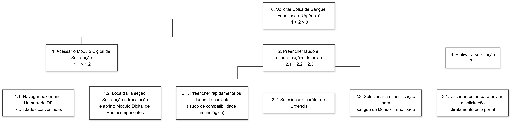

## Introdução

A [Análise Hierárquica de Tarefas](#ref1) (HTA - *Hierarchical Task Analysis*) é um dos métodos de análise de tarefas mais consolidados na área de Interação Humano-Computador (IHC). Diferente de métodos que focam em uma lista sequencial de cliques ou ações, a HTA inicia sua abordagem pela definição dos **objetivos** dos usuários. Seu propósito central é relacionar o que as pessoas fazem, o porquê de fazerem e quais as consequências caso a tarefa não seja executada de maneira correta. A partir de um objetivo de alto nível, o método realiza uma decomposição em subobjetivos (organizados por planos lógicos) até atingir as operações fundamentais, que são especificadas pelas condições de entrada (*input*), ações propriamente ditas e condições de satisfação (*feedback*).

No escopo de um projeto de IHC, a HTA serve para avaliar sistemas existentes, guiar o (re)design de novas interfaces ou validar a introdução de uma nova tecnologia no cotidiano dos usuários. Ao detalhar o comportamento do usuário dessa forma, o designer consegue identificar com precisão como o sistema facilita ou impede que as pessoas alcancem seus objetivos, embasando a identificação de gargalos de usabilidade e a formulação de recomendações de design para o produto final.

## Analise HTA - Solicitação Urgente de Bolsa de Sangue Fenotipado

A Análise Hierárquica de Tarefas (HTA) foi aplicada para decompor a interação do usuário com o sistema em objetivos e subobjetivos, permitindo identificar gargalos operacionais e pontos críticos de erro. Esta análise foca na transição do processo analógico/estático para um fluxo digital otimizado, garantindo que a hierarquia das ações responda à urgência clínica exigida pela Persona.

1. **Decidir os objetivos da análise:** O objetivo desta análise é avaliar a modificação de um sistema existente (o portal da Fundação Hemocentro de Brasília)[¹](#ref1) através da criação de uma nova funcionalidade interativa (Módulo Digital de Solicitação de Hemocomponentes) focada na substituição de PDFs estáticos por um fluxo digital para pedido urgente de sangue fenotipado.
2. Obter consenso sobre objetivos e medidas de sucesso:
    - **Qual evidência objetiva indicará que o objetivo foi atingido?** O sucesso da tarefa será evidenciado pela emissão imediata de um alerta visual e claro de status do sistema na tela, confirmando que os dados clínicos e a solicitação de urgência foram recebidos com sucesso pela central de distribuição.
    - **Quais as consequências da falha em atingir esse objetivo?** A falha na execução, erros de digitação no laudo não validados pelo sistema ou a lentidão burocrática resultarão em atrasos no envio do sangue fenotipado vital, podendo levar o paciente a uma severa reação transfusional e colocando sua vida em risco.
3. **Identificar fontes de informação:** Considerando que a observação direta no pronto-socorro em momentos de extrema urgência e risco de vida contribui pouco e é inviável, utilizamos como fontes de informação a literatura médica da área de hematologia, o cenário de problema previamente modelado (relato de intercorrência e alta pressão temporal no pronto-socorro) e o conhecimento de especialistas (médicos) que participarão das avaliações.
4. **Coletar dados e esboçar a decomposição:** A tarefa principal foi fragmentada nos subobjetivos abaixo, garantindo uma cobertura completa e sem sobreposições: 

    0. Solicitar Bolsa de Sangue Fenotipado (Urgência)
    1. Acessar o Módulo Digital de Solicitação de Hemocomponentes no portal
    2. Preencher os dados do paciente e o laudo de compatibilidade imunológica
    3. Selecionar as especificações de "Urgência" e "Doador Fenotipado"
    4. Efetivar o envio da solicitação diretamente pelo portal

5. **Verificar a validade:** A decomposição estruturada neste documento passará por uma verificação de validade prática junto às partes interessadas, mediante a apresentação do cenário e simulação dos passos da interface com um médico especialista (hematologista ou plantonista) ou alguém que esteja inserido no meio garantindo a confiabilidade da validação operando sob simulação de limite de tempo.
6. **Identificar operações significativas:** As operações mais críticas para o sucesso do objetivo, devido ao critério de probabilidade de erro versus custo da falha *(p×c)*, são o "preenchimento do laudo de compatibilidade imunológica" e a ação final de "Efetivar o envio da solicitação", pois erros nestes pontos definem se o paciente receberá a bolsa correta a tempo.
7. **Gerar e testar hipóteses sobre erros:** A análise prevê a ocorrência de falhas baseadas em conhecimento ou habilidades devido à altíssima carga cognitiva, interrupções no pronto-socorro e urgência da situação  (como erros de preenchimento de parâmetros imunológicos). Para mitigar esse erro, recomenda-se que o novo design aplique validações de "prevenção ativa" nos campos do laudo em tempo real, impedindo que solicitações incompletas ou incompatíveis sejam enviadas à rede do Hemocentro.

---

<b>Tabela 1</b> - Análise Hierárquica de Tarefas (HTA) - Solicitação Urgente de Bolsa de Sangue Fenotipado

| Objetivos / Operações | Problemas e Recomendações |
| ----- | ----- |
| 0. Solicitar Bolsa de Sangue Fenotipado (Urgência)   1>2>3 | **Entrada:** Necessidade imperativa de sangue de um doador específico para evitar severa reação transfusional no paciente.   **Feedback:** Alerta de status claro na interface indicando que a solicitação urgente foi recebida com sucesso pela central de distribuição.   **Plano 0:** Fazer 1, 2 e 3 em sequência.   **Problema:** Atrasos na solicitação ou ineficiência burocrática podem custar vidas, e o modelo anterior exigia baixar PDFs e enviar por e-mail externo.  **Recomendação:** Projetar um formulário digital 100% integrado no portal para permitir economia de tempo e respostas imediatas. |
| 1. Acessar o Módulo Digital de Solicitação   1.1>1.2 | **Plano 1:** Fazer 1.1 e depois 1.2 em sequência. |
| 1.1. Navegar pelo menu "Hemorrede DF" > "Unidades conveniadas". | **Problema:** O usuário atua num ambiente caótico (Pronto-Socorro) e usa o sistema de forma esporádica.  **Recomendação:** A navegação até o módulo deve ser direta e intuitiva, minimizando a carga cognitiva. |
| 1.2. Localizar a seção "Solicitação e transfusão" e abrir o Módulo Digital de Hemocomponentes. | |
| 2. Preencher laudo e especificações da bolsa   2.1+2.2+2.3 | **Plano 2:** Fazer 2.1, 2.2 e 2.3 de forma independente de ordem (podem ser preenchidos simultaneamente ou em qualquer ordem no formulário). |
| 2.1. Preencher rapidamente os dados do paciente (laudo de compatibilidade imunológica). | **Problema:** Erro humano no preenchimento de dados clínicos complexos de compatibilidade (desempenho baseado em habilidades ou conhecimento).  **Recomendação:** Aplicar mecanismos de prevenção ativa de erros, como validações em tempo real nos campos do formulário para impedir envio de laudos com dados incompletos. |
| 2.2. Selecionar o caráter de "Urgência". | |
| 2.3. Selecionar a especificação para sangue de "Doador Fenotipado". |
| 3. Efetivar a solicitação   3.1 | **Plano 3:** Fazer 3.1. |
| 3.1. Clicar no botão para enviar a solicitação diretamente pelo portal. | **Problema:** Ausência de feedback gera insegurança no médico, que não saberá se a central visualizou o pedido.  **Recomendação:** O sistema deve reduzir o "golfo de avaliação", processando os dados imediatamente e exibindo uma mensagem de sucesso explícita informando que a solicitação foi efetivada e a bolsa já está sendo providenciada. |

Fonte: [Pedro Lucas](https://github.com/pwdrinho) - (2026).

---

  
<strong>Figura 1</strong> - Análise Hierárquica de Tarefas (HTA) - Solicitação Urgente de Bolsa de Sangue Fenotipado

  
  

  
Fonte: <a href="https://github.com/pwdrinho" style="color: red; text-decoration: none;">Pedro Lucas</a> (2026).

## Referências Bibliográficas

>  [1] BARBOSA, Simone Diniz Junqueira et al. *Interação Humano-Computador e Experiência do Usuário*. 1. ed. Rio de Janeiro: Autopublicação, 2021.

## Histórico de Versões

| Versão | Descrição | Data | Autor(es) | Data de revisão | Revisor(es) |
| :---: | :--- | :---: | :---: | :---: | :---: |
| 1.0 | Criação do documento HTA | 01/05/2026 | [Pedro Lucas](https://github.com/pwdrinho)| 02/05/2026 | [Breno Teixeira](https://github.com/BrenoLTeixeira) |
| 1.1 | Adiciona Tabela HTA e Diagrama HTA | 02/05/2026 | [Pedro Lucas](https://github.com/pwdrinho)| 03/05/2026 | [Breno Teixeira](https://github.com/BrenoLTeixeira) |