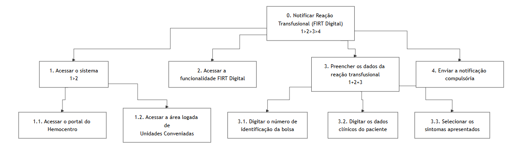

## Introdução

A [Análise Hierárquica de Tarefas](#ref1) (HTA - *Hierarchical Task Analysis*) é um dos métodos de análise de tarefas mais consolidados na área de Interação Humano-Computador (IHC). Diferente de métodos que focam em uma lista sequencial de cliques ou ações, a HTA inicia sua abordagem pela definição dos **objetivos** dos usuários. Seu propósito central é relacionar o que as pessoas fazem, o porquê de fazerem e quais as consequências caso a tarefa não seja executada de maneira correta. A partir de um objetivo de alto nível, o método realiza uma decomposição em subobjetivos (organizados por planos lógicos) até atingir as operações fundamentais, que são especificadas pelas condições de entrada (*input*), ações propriamente ditas e condições de satisfação (*feedback*).

No escopo de um projeto de IHC, a HTA serve para avaliar sistemas existentes, guiar o (re)design de novas interfaces ou validar a introdução de uma nova tecnologia no cotidiano dos usuários. Ao detalhar o comportamento do usuário dessa forma, o designer consegue identificar com precisão como o sistema facilita ou impede que as pessoas alcancem seus objetivos, embasando a identificação de gargalos de usabilidade e a formulação de recomendações de design para o produto final.

### Analise HTA - Notificar Reação Transfusional (FIRT Digital)

A Análise Hierárquica de Tarefas (HTA) foi utilizada para desdobrar a interação entre usuário e sistema em metas e submetas, facilitando a detecção de gargalos e falhas críticas. O foco reside em converter processos analógicos em fluxos digitais eficientes, assegurando que a estrutura de ações atenda à prontidão clínica necessária para a Persona.

1. **Decidir os objetivos da análise**: O objetivo desta análise é avaliar a modificação de um sistema existente (o portal da Fundação Hemocentro de Brasília)[¹](#ref1) através da criação de uma nova funcionalidade interativa (FIRT Digital) focada na notificação compulsória e bloqueio sistemático de lotes de sangue.
2. **Obter consenso sobre objetivos e medidas de sucesso**
    - **Qual evidência objetiva indicará que o objetivo foi atingido?** O sucesso da tarefa será evidenciado pela emissão de um alerta sonoro e visual na tela confirmando que a notificação foi enviada e o lote de sangue suspeito foi bloqueado preventivamente no sistema.
    - **Quais as consequências da falha em atingir esse objetivo?** A falha na execução ou lentidão do sistema resultará na disponibilidade contínua de um hemocomponente incompatível ou contaminado, colocando em risco de morte outros pacientes da Hemorrede.
3. **Identificar fontes de informação**: Considerando que a observação direta no hospital sobre um evento de emergência é inviável, utilizamos como fontes de informação a literatura da área, o cenário previamente modelado (relato de intercorrência transfusional aguda) e o conhecimento de especialistas que participarão da validação técnica.
4. **Coletar dados e esboçar a decomposição**: A tarefa principal foi desdobrada nos seguintes subobjetivos, de forma mutuamente exclusiva e exaustiva:

    0. Notificar Reação Transfusional (FIRT Digital) e bloquear lote
    1. Acessar o sistema logado de Unidades Conveniadas
    2. Acessar a nova funcionalidade FIRT Digital
    3. Preencher os dados da reação transfusional e da bolsa
    4. Enviar a notificação de urgência

5. **Verificar a validade**: A decomposição estruturada neste documento passará por uma verificação de validade prática junto às partes interessadas, mediante a apresentação do cenário e simulação dos passos da interface com um profissional de enfermagem real, utilizando uma lista de verificação.
6. **Identificar operações significativas**: As operações mais críticas para o sucesso do objetivo são a "digitação do número de identificação da bolsa" e a ação final de "Enviar Notificação de Urgência", dado o contexto de forte pressão temporal em que o usuário se encontra.
7. **Gerar e testar hipóteses sobre erros**: A análise prevê a ocorrência de falhas baseadas em habilidades devido à urgência e ao estresse da situação, como erros de coordenação motora ao digitar rapidamente a numeração extensa da bolsa. Para mitigar esse erro, recomenda-se que o sistema faça o cruzamento em tempo real do número da bolsa com o banco de dados do Hemocentro para validar a entrada instantaneamente.

---

<b>Tabela 1</b> - Análise Hierárquica de Tarefas (HTA) - Notificar Reação Transfusional (FIRT Digital)

| Objetivos / Operações | Problemas e Recomendações |
| :--- | :--- |
| **0. Notificar Reação Transfusional (FIRT Digital)**   (1>2>3>4) | **entrada:** Paciente apresentando sintomas de reação transfusional durante o plantão.  **feedback:** Emissão de alerta sonoro e visual com a mensagem "FIRT enviado com sucesso. Lote bloqueado preventivamente".  **plano:** Executar os passos 1, 2, 3 e 4 sequencialmente.  **recomendação:** O sistema deve garantir alta disponibilidade, dada a gravidade dos erros e o risco de morte em caso de falha. |
| **1. Acessar o sistema**   (1>2) | **plano:** Realizar 1.1 e 1.2 sequencialmente. |
| 1.1. Acessar o portal do Hemocentro | **problema:** Em situações de urgência, a navegação comum pode ser lenta.  **recomendação:** Oferecer um atalho direto e destacado na página inicial para "Emergências / Hemovigilância". |
| 1.2. Acessar a área logada de Unidades Conveniadas | |
| **2. Acessar a funcionalidade FIRT Digital** | **ação:** Clicar no botão ou link "Notificação Compulsória de Reação Transfusional". |
| **3. Preencher os dados da reação transfusional**   (1+2+3) | **plano:** Executar 3.1, 3.2 e 3.3 de forma independente de ordem (em paralelo).  **problema:** Devido à forte pressão de tempo do contexto de uso, o usuário pode digitar a numeração da bolsa com erros de coordenação motora ou aplicar dados invertidos.  **recomendação:** O sistema deve cruzar o número da bolsa em tempo real com o banco de dados do Hemocentro para validar a entrada instantaneamente. |
| 3.1. Digitar o número de identificação da bolsa | |
| 3.2. Digitar os dados clínicos do paciente | |
| 3.3. Selecionar os sintomas apresentados | **ação:** Marcar caixas de seleção (*checkboxes*) correspondentes aos sintomas (ex: febre, calafrios). |
| **4. Enviar a notificação compulsória** | **ação:** Clicar no botão "Enviar Notificação Compulsória / Bloquear Lote".  **recomendação:** Minimizar diálogos de confirmação excessivos para não atrasar a tarefa crítica, utilizando prevenção ativa de erros. |

Fonte: [Gabriel Diniz](https://github.com/GabrielDiniz12) - (2026).

---

  
<strong>Figura 1</strong> - Análise Hierárquica de Tarefas (HTA) - Notificar Reação Transfusional (FIRT Digital)

  
  

  
Fonte: <a href="https://github.com/GabrielDiniz12" style="color: red; text-decoration: none;">Gabriel Diniz</a> (2026).

## Referências Bibliográficas

>  [1] BARBOSA, Simone Diniz Junqueira et al. *Interação Humano-Computador e Experiência do Usuário*. 1. ed. Rio de Janeiro: Autopublicação, 2021.

## Histórico de Versões

| Versão | Descrição | Data | Autor(es) | Data de revisão | Revisor(es) |
| :---: | :--- | :---: | :---: | :---: | :---: |
| 1.0 | Criação do documento da análise de tarefa HTA | 01/05/2026 | [Gabriel Diniz](https://github.com/GabrielDiniz12)| 03/05/2026 | [Pedro Lucas](https://github.com/pwdrinho) |