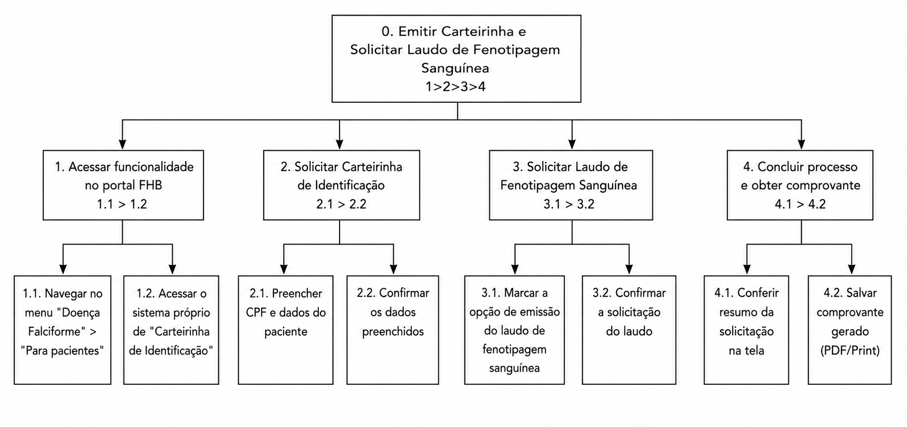

## Introdução

A [Análise Hierárquica de Tarefas](#ref1) (HTA - *Hierarchical Task Analysis*) é um dos métodos de análise de tarefas mais consolidados na área de Interação Humano-Computador (IHC). Diferente de métodos que focam em uma lista sequencial de cliques ou ações, a HTA inicia sua abordagem pela definição dos **objetivos** dos usuários. Seu propósito central é relacionar o que as pessoas fazem, o porquê de fazerem e quais as consequências caso a tarefa não seja executada de maneira correta. A partir de um objetivo de alto nível, o método realiza uma decomposição em subobjetivos (organizados por planos lógicos) até atingir as operações fundamentais, que são especificadas pelas condições de entrada (*input*), ações propriamente ditas e condições de satisfação (*feedback*).

No escopo de um projeto de IHC, a HTA serve para avaliar sistemas existentes, guiar o (re)design de novas interfaces ou validar a introdução de uma nova tecnologia no cotidiano dos usuários. Ao detalhar o comportamento do usuário dessa forma, o designer consegue identificar com precisão como o sistema facilita ou impede que as pessoas alcancem seus objetivos, embasando a identificação de gargalos de usabilidade e a formulação de recomendações de design para o produto final.

## Analise HTA - Emitir a Carteirinha de Identificação

A condução desta análise segue as etapas metodológicas para construção da HTA, conforme citado em Barbosa et al. (2021)[¹](#ref1):

**1. Decidir os objetivos da análise:** O objetivo desta análise é projetar o fluxo e a estrutura de uma nova funcionalidade que será introduzida no portal da Fundação Hemocentro de Brasília (FHB). O escopo envolve a integração nativa do formulário da carteirinha e a solicitação do laudo de fenotipagem sanguínea.

**2. Obter consenso sobre objetivos e medidas de sucesso:** A evidência de sucesso será a geração da carteirinha junto com o feedback de que o laudo de fenotipagem sanguínea será enviado ao e-mail cadastrado. A consequência da falha em atingir esse objetivo seria forçar a mãe cuidadora a lidar com sistemas separados, resultando em perda de tempo, desgaste do pacote de dados e risco à segurança transfusional do paciente.

**3. Identificar as fontes de informações das tarefas:** A fonte principal para o design desta nova tarefa foi o cenário construído (a dor da mãe que atua como agente familiar). Além disso, a literatura orienta o uso de cenários e o conhecimento das dores de stakeholders para embasar a análise.

**4. Coletar dados e esboçar a decomposição (Tabela e Diagrama):** O objetivo principal ("0. Emitir carteirinha e solicitar laudo de fenotipagem sanguínea") foi desdobrado hierarquicamente em subobjetivos mutuamente exclusivos. A decomposição detalhada encontra-se no diagrama e na tabela (Tabela HTA) na seção a seguir.

**5. Verificar a validade da decomposição:** A validação deste fluxo idealizado seria feita apresentando o modelo (ou um protótipo construído a partir dele) a partes interessadas, como as próprias mães cuidadoras que utilizam a FHB, assegurando que o novo fluxo condiz com as suas expectativas e capacidades cognitivas.

**6. Identificar operações significativas:** Utilizando o critério *p*×*c* (probabilidade de falha × custo da falha), a operação mais significativa é a **3.1. Marcar a opção de emissão do laudo de fenotipagem**. Embora a nova interface reduza a probabilidade de falha (*p*), o custo da falha (*c*) nessa etapa seria catastrófico: o paciente ficaria sem o documento atualizado necessário para garantir a segurança em procedimentos transfusionais.

**7. Gerar e testar hipóteses (Fatores e Classificação de Erros de Reason):** Para investigar os fatores que afetam o desempenho da mãe cuidadora na nova funcionalidade, aplicamos a classificação de erros humanos:

- **Desempenho baseado em habilidades (Skills):** Como a mãe cuidadora utilizará a tela de um smartphone com outras demandas simultâneas, erros motores (como clicar em opções erradas do formulário) são possíveis. *Hipótese de design:* O formulário integrado precisa de áreas de clique amplas e confirmação visual forte.
- **Desempenho baseado em regras (Rules):** Ao preencher dados de identificação, o usuário aplica regras mentais de preenchimento de formulários. *Hipótese de design:* Para evitar o abandono, a nova interface deve preencher automaticamente campos secundários a partir da inserção do CPF, minimizando a aplicação exaustiva de regras de validação por parte da usuária.
- **Desempenho baseado em conhecimento (Knowledge):** Ocorre em situações novas de planejamento consciente. Como a usuária pode não ter o conhecimento de que o paciente de Doença Falciforme necessita do laudo de fenotipagem para garantir a segurança transfusional. *Hipótese de design:* O sistema deve induzir esse conhecimento, já exibindo a opção de solicitação do laudo de forma destacada e explicativa na tela de emissão da carteirinha.

---

<b>Tabela 1</b> - Análise Hierárquica de Tarefas (HTA) - Emitir a Carteirinha de Identificação

| **Objetivos / Operações** | **Problemas e Recomendações** |
|---|---|
| **0. Emitir Carteirinha e Solicitar Laudo de Fenotipagem Sanguínea 1>2>3>4** | **Input:** Acesso ao site via smartphone usando 4G; Posse do CPF do paciente. **Feedback:** Carteirinha gerada na tela com o número de protocolo, e confirmação de que o laudo de fenotipagem será enviado ao e-mail cadastrado. **Plano:** Acessar o sistema de documentos, solicitar a carteirinha com os dados, opcionalmente solicitar o laudo de fenotipagem e salvar o protocolo final.   |
| **1. Acessar funcionalidade no portal FHB 1.1>1.2** | **Plano:** Localizar menu de pacientes e acessar a área de emissão documental. **Problema:** Hoje o sistema "joga" o usuário para um Google Forms externo. **Recomendação:** A nova funcionalidade deve manter a usuária estritamente dentro do domínio oficial da FHB.   |
| 1.1. Navegar no menu "Doença Falciforme" > "Para pacientes" | |
| 1.2. Acessar link da carteirinha interna | **problema:** Se a chamada para a funcionalidade estiver oculta, a usuária perderá muito tempo na navegação inicial. **recomendação:** Destacar a nova funcionalidade de carteirinha na área nobre da seção de pacientes. |
| **2. Solicitar Carteirinha de Identificação 2.1>2.2** | **Plano:** Informar os dados do paciente para validação oficial do Hemocentro. **Problema:** Formulários muito longos desencorajam o perfil de usuário com pressa.   |
| 2.1. Preencher CPF e validar dados do paciente | **Problema:** A conexão móvel pode falhar durante um preenchimento muito longo. **Recomendação:** O sistema deve requerer apenas o CPF do dependente, preenchendo automaticamente os demais dados e mantendo a ação salva em cache.   |
| 2.2. Submeter solicitação | |
| **3. Solicitar Fenotipagem Sanguínea 3.1>3.2** | **Plano:** Indicar a necessidade do laudo de fenotipagem e confirmar o envio da solicitação.   |
| 3.1. Marcar opção opcional "Deseja emitir o laudo de fenotipagem?" (Sim/Não) | **Problema:** A usuária leiga pode não compreender a importância clínica da opção ou não perceber o campo. **Recomendação:** Exibir a opção de forma destacada, com uma breve explicação sobre a necessidade do laudo para a segurança transfusional do paciente.   |
| 3.2. Clicar em enviar e receber feedback de confirmação na tela | **Problema:** A ausência de retorno claro pode gerar dúvida sobre o envio da solicitação. **Recomendação:** Exibir imediatamente uma mensagem de confirmação informando que o sistema buscará o laudo na base e o enviará ao e-mail cadastrado.   |
| **4. Obter a carteirinha digital e confirmar o envio do laudo 4.1>4.2** | **Plano:** Validar a emissão da carteirinha na tela e confirmar o recebimento do feedback sobre o envio do laudo por e-mail. |
| 4.1. Conferir carteirinha e protocolo exibidos na tela (sucesso) | |
| 4.2. Salvar/printar comprovante digital | **Problema:** Usuárias com pouca habilidade de gerenciar arquivos podem se confundir ao baixar PDFs. **Recomendação:** Exibir todos os dados do protocolo e da carteirinha diretamente no corpo da tela web de sucesso de forma clara e visível para facilitar a captura de tela (*screenshot*).   |

Fonte: [Julia Gabriella](https://github.com/juliagabriellafs) - (2026).

---

  
<strong>Figura 1</strong> - Análise Hierárquica de Tarefas (HTA) - Emitir a Carteirinha de Identificação

  
  

  
Fonte: <a href="https://github.com/juliagabriellafs" style="color: red; text-decoration: none;">Julia Gabriella</a> (2026).

## Referências Bibliográficas

>  [1] BARBOSA, Simone Diniz Junqueira et al. *Interação Humano-Computador e Experiência do Usuário*. 1. ed. Rio de Janeiro: Autopublicação, 2021.

## Histórico de Versões

| Versão | Descrição | Data | Autor(es) | Data de revisão | Revisor(es) |
| ------ | ------ | ------ | ------ | ------ | ------ |
| 1.0 | Criação do HTA da Persona 5 | 02/05/2026 | [Julia Gabriella](https://github.com/juliagabriellafs) | 02/05/2026 | [Gabriel Diniz](https://github.com/GabrielDiniz12) |
| 1.1 | Inserção da imagem do diagrama HTA| 02/05/2026 | [Julia Gabriella](https://github.com/juliagabriellafs) | 03/05/2026 | [Gabriel Diniz](https://github.com/GabrielDiniz12) |
| 2.0 | Revisão do HTA 5 e correção do diagrama| 22/06/2026 | [Julia Gabriella](https://github.com/juliagabriellafs) | 23/06/2026 | [Pedro Américo](https://github.com/dev-americo) |