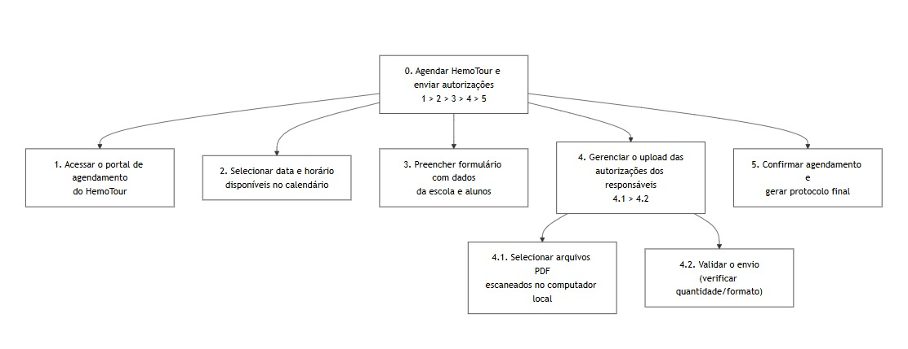

## Introdução

A [Análise Hierárquica de Tarefas](#ref1) (HTA - *Hierarchical Task Analysis*) é um dos métodos de análise de tarefas mais consolidados na área de Interação Humano-Computador (IHC). Diferente de métodos que focam em uma lista sequencial de cliques ou ações, a HTA inicia sua abordagem pela definição dos **objetivos** dos usuários. Seu propósito central é relacionar o que as pessoas fazem, o porquê de fazerem e quais as consequências caso a tarefa não seja executada de maneira correta. A partir de um objetivo de alto nível, o método realiza uma decomposição em subobjetivos (organizados por planos lógicos) até atingir as operações fundamentais, que são especificadas pelas condições de entrada (*input*), ações propriamente ditas e condições de satisfação (*feedback*).

No escopo de um projeto de IHC, a HTA serve para avaliar sistemas existentes, guiar o (re)design de novas interfaces ou validar a introdução de uma nova tecnologia no cotidiano dos usuários. Ao detalhar o comportamento do usuário dessa forma, o designer consegue identificar com precisão como o sistema facilita ou impede que as pessoas alcancem seus objetivos, embasando a identificação de gargalos de usabilidade e a formulação de recomendações de design para o produto final.

## Analise HTA - Agendar HemoTour e Enviao de Autorizações

A condução desta análise segue as etapas metodológicas para construção da HTA, conforme citado em Barbosa et al. (2021)[¹](#ref1):

**1. Decidir os objetivos da análise:** Modificar um sistema existente. Vamos analisar a tarefa projetando a inserção de um módulo interativo de agendamento e upload de documentos no portal da Fundação Hemocentro de Brasília, eliminando o fluxo manual via e-mail.

**2. Obter consenso sobre objetivos e medidas de sucesso:** A evidência objetiva de sucesso será a emissão de um comprovante de agendamento na tela (com número de protocolo) e a confirmação de que os arquivos PDF foram salvos no banco de dados da instituição sem intervenção humana. As consequências da falha incluem o abandono da página pela educadora, envio de documentação incompleta (faltando a autorização de algum aluno) ou a duplicidade de agendamentos para a mesma data.

**3. Identificar as fontes de informações das tarefas:** O Cenário e a Persona (Professora Lúcia) criados anteriormente. Eles evidenciam os incidentes atuais (demora, falta de feedback, alta carga de arquivos manuais) e a pressão de tempo no ambiente de trabalho (sala dos professores).

**4. Coletar dados e esboçar a decomposição:** A tarefa principal foi desdobrada nos seguintes subobjetivos:
   0. Agendar HemoTour e enviar autorizações
   1. Acessar o portal de agendamento do HemoTour
   2. Selecionar data e horário disponíveis no calendário
   3. Preencher formulário com dados da escola e quantidade de alunos
   4. Gerenciar o upload das autorizações dos responsáveis
   5. Confirmar agendamento e gerar protocolo final

**5. Verificar a validade da decomposição:** *Nota metodológica do projeto:* Esta decomposição assume que a sequência (Data > Dados > Documentos) é a mais lógica para o usuário. Em um cenário real, isso seria validado apresentando este esboço para educadores ou para os atendentes do Hemocentro para checar se o fluxo faz sentido.

**6. Identificar operações significativas:** A operação **4 (Gerenciar o upload das autorizações)** é a mais crítica para o sucesso do objetivo. Como são até 15 alunos (menores de idade), qualquer falha no envio ou processamento desses documentos acarreta a recusa da escola na porta do Hemocentro. A interface precisará dar atenção especial a esse passo, mostrando claramente quais arquivos foram carregados com sucesso.

**7. Gerar e testar hipóteses (Fatores e Classificação de Erros de Reason):** Para investigar os fatores que afetam o desempenho de Lúcia, aplicamos a classificação de erros:

- **Desempenho baseado em habilidades (Skills):** Lúcia, com pressa no intervalo, clica em uma data errada no calendário ou arrasta o PDF da prova de matemática ao invés da autorização do aluno.
- **Desempenho baseado em regras (Rules):** O sistema exige arquivos estritamente em `.pdf`, mas Lúcia tenta fazer o upload de fotos `.jpg` das autorizações tiradas com o celular, gerando um bloqueio na submissão.
- **Desempenho baseado em conhecimento (Knowledge):** Lúcia tenta iniciar o agendamento no site antes de ter recolhido as autorizações dos pais, sem saber que o upload simultâneo é uma restrição obrigatória do novo sistema para travar a data.

---

<b>Tabela 1</b> - Análise Hierárquica de Tarefas (HTA) - Agendar HemoTour e Enviao de Autorizações

| **Objetivos / Operações** | **Problemas e Recomendações** |
|---|---|
| **0. Agendar HemoTour e enviar autorizações 1>2>3>4>5** | **Feedback:** Emissão de um comprovante de agendamento na tela e confirmação de PDFs salvos. **Plano:** Fazer 1, depois 2, depois 3, depois 4, depois 5.   |
| **1. Acessar o portal de agendamento do HemoTour** | |
| **2. Selecionar data e horário disponíveis no calendário** | **Problema:** Com pressa no intervalo, o usuário pode clicar em uma data errada no calendário (erro baseado em habilidade).   |
| **3. Preencher formulário com dados da escola e quantidade de alunos** | **Problema:** Iniciar o agendamento antes de ter recolhido as autorizações, desconhecendo a restrição do sistema (erro baseado em conhecimento).   |
| **4. Gerenciar o upload das autorizações dos responsáveis 4.1>4.2** | **Plano:** Fazer 4.1 e, se correto, 4.2. **Recomendação:** Como é a operação mais crítica, a interface precisa mostrar claramente quais arquivos foram carregados com sucesso para evitar a recusa da escola.   |
| 4.1. Selecionar arquivos PDF escaneados no computador local | **Problema:** Tentar fazer upload de fotos `.jpg` ou arrastar arquivos incorretos, como provas (erro baseado em regras e habilidades).   |
| 4.2. Validar o envio (verificar quantidade/formato) | **Plano:** Verificar se o número de PDFs bate com o de alunos. Se houver erro de formato ou quantidade, repetir 4.1.   |
| **5. Confirmar agendamento e gerar protocolo final** | **Ação:** Gerar protocolo final após a validação correta de todos os passos anteriores.   |

Fonte: [Lucas Oliveira](https://github.com/dev-LucasDpaula) - (2026).

---

  
<strong>Figura 1</strong> - Análise Hierárquica de Tarefas (HTA) - Agendar HemoTour e Enviao de Autorizações

  
  

  
Fonte: <a href="https://github.com/dev-LucasDpaula" style="color: red; text-decoration: none;">Lucas Oliveira</a> (2026).

## Referências Bibliográficas

>  [1] BARBOSA, Simone Diniz Junqueira et al. *Interação Humano-Computador e Experiência do Usuário*. 1. ed. Rio de Janeiro: Autopublicação, 2021.

## Histórico de Versões

| Versão | Descrição | Data | Autor(es) | Data de revisão | Revisor(es) |
| :---: | :--- | :---: | :---: | :---: | :---: |
| 1.0 | Criação do documento de Análise de Tarefas HTA | 01/05/2026 | [Lucas Oliveira](https://github.com/dev-LucasDpaula)| 02/05/2026 | [Julia Gabriella](https://github.com/juliagabriellafs) |
| 1.1 | Adição da Imagem do Diagrama de HTA | 02/05/2026 | [Lucas Oliveira](https://github.com/dev-LucasDpaula)| 02/05/2026 | [Julia Gabriella](https://github.com/juliagabriellafs) |
