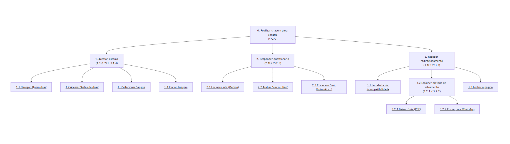

## Introdução

A [Análise Hierárquica de Tarefas](#ref1) (HTA - *Hierarchical Task Analysis*) é um dos métodos de análise de tarefas mais consolidados na área de Interação Humano-Computador (IHC). Diferente de métodos que focam em uma lista sequencial de cliques ou ações, a HTA inicia sua abordagem pela definição dos **objetivos** dos usuários. Seu propósito central é relacionar o que as pessoas fazem, o porquê de fazerem e quais as consequências caso a tarefa não seja executada de maneira correta. A partir de um objetivo de alto nível, o método realiza uma decomposição em subobjetivos (organizados por planos lógicos) até atingir as operações fundamentais, que são especificadas pelas condições de entrada (*input*), ações propriamente ditas e condições de satisfação (*feedback*).

No escopo de um projeto de IHC, a HTA serve para avaliar sistemas existentes, guiar o (re)design de novas interfaces ou validar a introdução de uma nova tecnologia no cotidiano dos usuários. Ao detalhar o comportamento do usuário dessa forma, o designer consegue identificar com precisão como o sistema facilita ou impede que as pessoas alcancem seus objetivos, embasando a identificação de gargalos de usabilidade e a formulação de recomendações de design para o produto final.

## Analise HTA - Triagem e Redirecionamento (Usuário de Exceção)

A condução desta análise segue as etapas metodológicas para construção da HTA, conforme citado em Barbosa et al. (2021)[¹](#ref1):

**1. Decidir os objetivos da análise:** Modificar um sistema existente. Vamos analisar a tarefa projetando a inclusão de uma nova funcionalidade de "Triagem Digital" no portal da Fundação Hemocentro de Brasília, interceptando usuários de exceção (incompatíveis com o serviço de Sangria Terapêutica espontânea) antes que realizem deslocamentos físicos.

**2. Obter consenso sobre objetivos e medidas de sucesso:** A evidência objetiva de sucesso será o usuário concluir o questionário de pergunta única, receber o alerta de incompatibilidade na tela e conseguir salvar o guia de encaminhamento ou enviar o endereço para o WhatsApp. As consequências da falha incluem o abandono da página sem entender o aviso, gerando a ida presencial ao Hemocentro para buscar um serviço não oferecido por livre demanda.

**3. Identificar as fontes de informações das tarefas:** O Cenário e a Persona (Seu José - Usuário de Exceção) criados anteriormente. Eles evidenciam os incidentes de comunicação, a falta de familiaridade com o sistema de saúde e a tentativa de forçar um agendamento inadequado.

**4. Coletar dados e esboçar a decomposição:** A tarefa principal foi desdobrada nos seguintes subobjetivos:
   0. Realizar triagem para Sangria Terapêutica
   1. Acessar o sistema de triagem
   2. Responder ao questionário de validação
   3. Receber o redirecionamento (Sucesso do Fluxo de Exceção)

**5. Verificar a validade da decomposição:** *Nota metodológica do projeto:* Esta decomposição assume que a sequência (Acesso > Resposta Única > Redirecionamento) é a mais tolerante a erros para o usuário idoso. Em um cenário real, isso seria validado mediante simulação narrativa com usuários idosos e de letramento digital básico para checar se a clareza do redirecionamento faz sentido.

**6. Identificar operações significativas:** As operações **2.3 (Clicar na opção "Sim")** e **3.2 (Escolher o método de salvamento)** são as mais críticas para o sucesso do objetivo. A opção "Sim" atua como gatilho imediato de bloqueio, exigindo clareza, enquanto a escolha do salvamento garante que o idoso retenha a instrução de para onde deve ir. A interface precisará dar atenção especial a essas áreas de clique.

**7. Gerar e testar hipóteses (Fatores e Classificação de Erros de Reason):** Para investigar os fatores que afetam o desempenho de Seu José, aplicamos a classificação de erros:

- **Desempenho baseado em habilidades (Skills):** Seu José, por falta de coordenação motora fina no smartphone, esbarra na opção "Não" em vez de "Sim". Como não há botão de avançar, o sistema o deixaria prosseguir incorretamente.
- **Desempenho baseado em regras (Rules):** Seu José ignora o alerta em texto vermelho de "Atendimento Incompatível" por não ler instruções longas na tela, continuando a procurar o calendário de agendamento por hábito.
- **Desempenho baseado em conhecimento (Knowledge):** Seu José não compreende se o seu plano de saúde (convênio) se enquadra na regra de "médico externo/particular" do questionário de triagem, travando logo na primeira etapa.

---

<b>Tabela 1</b> - Análise Hierárquica de Tarefas (HTA) - Triagem e Redirecionamento (Usuário de Exceção)

| **Objetivos / Operações** | **Problemas e Recomendações** |
|---|---|
| **0. Realizar triagem para Sangria Terapêutica 1>2>3** | **Feedback:** O usuário recebe o alerta de incompatibilidade na tela e salva o endereço de redirecionamento. **Plano:** Fazer 1, depois 2, depois 3.   |
| **1. Acessar o sistema de triagem 1.1>1.2>1.3>1.4** | **Plano:** Fazer 1.1, 1.2, 1.3 e 1.4 em sequência.   |
| 1.1. Navegar até o menu "Quero doar" | |
| 1.2. Acessar a subpágina "Antes de doar" | |
| 1.3. Selecionar "Sangria Terapêutica" | **Problema:** O usuário leigo pode ter dificuldade em achar esse termo técnico logo de cara. **Recomendação:** Incluir sinônimos ou atalhos visuais na página inicial para esse serviço.   |
| 1.4. Clicar no botão "Iniciar Triagem para Sangria" | |
| **2. Responder ao questionário de validação 2.1>2.2>2.3** | **Plano:** Fazer 2.1, depois 2.2, depois 2.3.   |
| 2.1. Ler a Pergunta: "O pedido foi feito por um médico externo/particular?" | **Input:** Tela carregada com a pergunta única. **Feedback:** Compreensão da restrição do serviço.   |
| 2.2. Avaliar as opções apresentadas ("Sim" ou "Não") | **Problema:** Dúvida se o plano de saúde se enquadra como médico externo (erro baseado em conhecimento).   |
| 2.3. Clicar na opção "Sim" | **Problema:** Esbarrar na opção "Não" por falta de precisão na tela touch (erro baseado em habilidade). **Feedback:** Sistema aciona a tela de incompatibilidade imediatamente.   |
| **3. Receber o redirecionamento (Sucesso do Fluxo de Exceção) 3.1>3.2>3.3** | **Plano:** Fazer 3.1, depois 3.2, depois 3.3.   |
| 3.1. Ler o alerta de "Atendimento Incompatível" | **Problema:** Risco de ignorar o alerta de texto e achar que conseguiu agendar (erro baseado em regras). **Recomendação:** Destaque visual forte (vermelho/ícone de parada) e texto direto focando no próximo passo.   |
| 3.2. Escolher o método de salvamento do endereço de encaminhamento 3.2.1 / 3.2.2 | **Plano:** Escolher 3.2.1 ou 3.2.2. **Recomendação:** Apresentar ambas as opções em conjunto na interface, priorizando o WhatsApp para usuários de letramento digital básico.   |
| 3.2.1. Baixar Guia de Encaminhamento SES-DF (PDF) | |
| 3.2.2. Enviar endereço para o WhatsApp | |
| 3.3. Fechar a página | |

Fonte: [Pedro Ian](https://github.com/pedroiaan) - (2026).

---

  
<strong>Figura 1</strong> - Análise Hierárquica de Tarefas (HTA) - Triagem e Redirecionamento (Usuário de Exceção)

  
  

  
Fonte: <a href="https://github.com/pedroiaan" style="color: red; text-decoration: none;">Pedro Ian</a> (2026).

## Referências Bibliográficas

>  [1] BARBOSA, Simone Diniz Junqueira et al. *Interação Humano-Computador e Experiência do Usuário*. 1. ed. Rio de Janeiro: Autopublicação, 2021.

## Histórico de Versões

| Versão | Descrição | Data | Autor(es) | Data de revisão | Revisor(es) |
| :---: | :--- | :---: | :---: | :---: | :---: |
| 1.0 | Criação do documento de Análise de Tarefas HTA | 03/05/2026 | [Pedro Ian](https://github.com/pedroiaan)| 03/05/2026 | [Lucas Oliveira](https://github.com/dev-LucasDpaula) |
| 1.1 | Adição da Imagem do Diagrama de HTA e adequação da estrutura | 19/05/2026 | [Pedro Ian](https://github.com/pedroiaan)| 19/05/2026 | [Lucas Oliveira](https://github.com/dev-LucasDpaula) |