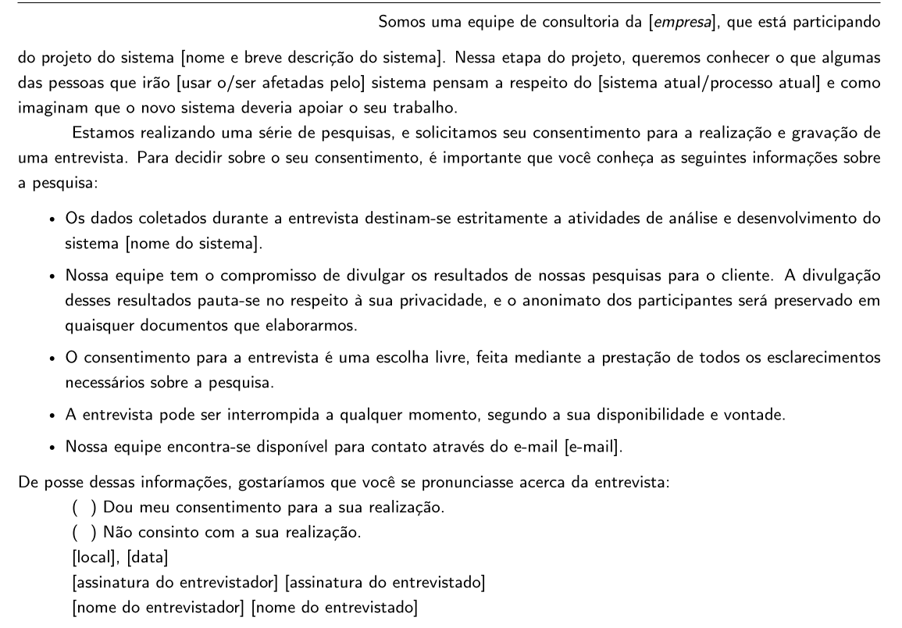

# Aspectos Éticos

## Introdução

Em conformidade com as diretrizes de Interação Humano-Computador, o desenvolvimento deste projeto é pautado por princípios éticos rigorosos, visando proteger a integridade e a autonomia dos participantes. Conforme destacado por [Barbosa e Silva (2021)¹](#ref1) no Capítulo 7, a ética em IHC é essencial para garantir que a coleta de dados não cause danos físicos ou psicológicos e que a privacidade seja integralmente respeitada.

Este documento e as atividades relacionadas foram desenvolvidos pelos integrantes [Pedro Ian](https://github.com/pedroiaan) e [Lucas Oliveira](https://github.com/dev-LucasDpaula). Para este projeto, seguimos as recomendações da [Resolução nº 466/2012²](#ref2) e da [Resolução nº 510/2016³](#ref3) do Conselho Nacional de Saúde, além de códigos de ética profissional como os da [ACM⁴](#ref4) e [IEEE⁵](#ref5). Nossas atividades são fundamentadas em quatro pilares:

* **Princípio da Autonomia:** Garantimos que a participação ocorra mediante consentimento livre e esclarecido, respeitando a vontade do indivíduo de participar ou se retirar a qualquer momento.
* **Princípio da Beneficência:** Buscamos maximizar os benefícios para a comunidade doadora de sangue e usuários do sistema, minimizando qualquer possível ônus.
* **Princípio da Não Maleficência:** Garantimos que a pesquisa não trará danos previsíveis, imediatos ou tardios, ressaltando sempre que o foco da avaliação é o sistema, e não o desempenho do participante.
* **Princípio da Justiça e Equidade:** Asseguramos que a pesquisa possui relevância social e trata todos os envolvidos com dignidade e imparcialidade.

---

## Modelos Utilizados

Utilizamos o modelo de Termo de Consentimento Livre e Esclarecido (TCLE) apresentado no livro de [Barbosa e Silva⁶](#ref1). De acordo com a obra, a aplicação deste termo é fundamental para garantir os princípios éticos da pesquisa com seres humanos, assegurando que os participantes sejam devidamente informados sobre os objetivos do estudo, os procedimentos de coleta de dados e seus direitos de privacidade e anonimato. O modelo adotado segue as diretrizes apresentados na [figura 1](#fig1).

  
<strong>Figura 1</strong> - Modelo TCLE

  
   

  
Fonte: <a href="#ref1">BARBOSA e SILVA, 2021, p.128.¹</a> (2021).

### Modelo - Brainstorm

**TERMO DE CONSENTIMENTO LIVRE E ESCLARECIDO (TCLE)**

Somos a equipe do **Grupo 04**, estudantes da **Universidade de Brasília (UnB)**, e estamos conduzindo um projeto para a disciplina de **Interação Humano-Computador**. Estamos participando do reprojeto e avaliação do sistema do Hemocentro e precisamos entender quais informações, tarefas e características você deseja e precisa no nosso produto.

Para isso, convidamos você a participar de uma sessão de **Brainstorming**, que durará aproximadamente 1 hora. Durante a sessão, faremos uma geração livre de ideias em grupo e, na segunda parte, pediremos que você priorize individualmente os itens levantados.

Solicitamos sua permissão para gravar a sessão em áudio/vídeo. A gravação será utilizada exclusivamente para que possamos registrar todas as sugestões e ideias geradas de forma precisa, sem que nada se perca.

Garantimos que os dados coletados serão tratados com total confidencialidade e que a sua identidade será mantida em absoluto anonimato nos relatórios do projeto. A sua participação é totalmente voluntária. Você tem a autonomia para se recusar a responder qualquer pergunta, interromper a sua participação ou retirar o seu consentimento a qualquer momento, sem nenhum tipo de penalidade ou prejuízo.

---

**Consentimento de Gravação**

- [ ] Consinto com a gravação de áudio/vídeo da sessão.
- [ ] Não consinto com a gravação da sessão.

**Local e Data:** `____________________________________________________`

**Assinatura do Participante** 

`____________________________________________________`

**Assinatura do Moderador / Avaliador** 

`____________________________________________________`

---

### Modelo - Card Sorting

**TERMO DE CONSENTIMENTO LIVRE E ESCLARECIDO (TCLE)**

Somos a equipe do **Grupo 04**, estudantes da **Universidade de Brasília (UnB)**, e estamos conduzindo um projeto para a disciplina de **Interação Humano-Computador**. Estamos participando do reprojeto e avaliação do sistema do Hemocentro e precisamos entender quais informações, tarefas e características você deseja e precisa no nosso produto.

Para isso, convidamos você a participar de uma atividade de **Classificação de Cartões (Card Sorting)**. O objetivo desta atividade é aprender como você pensa sobre a organização do conteúdo do Hemocentro. Entregaremos a você um conjunto de cartões contendo informações e tarefas, e pediremos que você os organize em grupos que façam sentido para você.

Solicitamos sua permissão para gravar a sessão em áudio/vídeo. A gravação será utilizada exclusivamente para que possamos registrar todas as sugestões e ideias geradas de forma precisa, sem que nada se perca.

Garantimos que os dados coletados serão tratados com total confidencialidade e que a sua identidade será mantida em absoluto anonimato nos relatórios do projeto. A sua participação é totalmente voluntária. Você tem a autonomia para se recusar a responder qualquer pergunta, interromper a sua participação ou retirar o seu consentimento a qualquer momento, sem nenhum tipo de penalidade ou prejuízo.

---

**Consentimento de Gravação**

- [ ] Consinto com a gravação de áudio/vídeo da sessão.
- [ ] Não consinto com a gravação da sessão.

**Local e Data:** `____________________________________________________`

**Assinatura do Participante** 

`____________________________________________________`

**Assinatura do Moderador / Avaliador** 

`____________________________________________________`

---

## Referências Bibliográficas

>  [1] BARBOSA, Simone Diniz Junqueira et al. *Interação Humano-Computador e Experiência do Usuário*. 1. ed. Rio de Janeiro: Autopublicação, 2021.

>  [2] BRASIL. Conselho Nacional de Saúde. *Resolução nº 466, de 12 de dezembro de 2012*. Aprova diretrizes e normas regulamentadoras de pesquisas envolvendo seres humanos. Brasília, DF: Diário Oficial da União, 2012.

>  [3] BRASIL. Conselho Nacional de Saúde. *Resolução nº 510, de 7 de abril de 2016*. Dispõe sobre as normas aplicáveis a pesquisas em Ciências Humanas e Sociais. Brasília, DF: Diário Oficial da União, 2016.

>  [4] ASSOCIATION FOR COMPUTING MACHINERY. *ACM Code of Ethics and Professional Conduct*. Nova York: ACM, 2018. Disponível em: https://www.acm.org/code-of-ethics. Acesso em: 20 abril 2026.

>  [5] INSTITUTE OF ELECTRICAL AND ELECTRONICS ENGINEERS. *IEEE Code of Ethics*. Piscataway: IEEE, 2020. Disponível em: https://www.ieee.org/about/corporate/governance/p7-8.html. Acesso em: 20 abril 2026.

---

## Histórico de Versões

| Versão | Descrição | Data | Autor(es) | Data de revisão | Revisor(es) |
| :---: | :--- | :---: | :---: | :---: | :---: |
| 1.0 | Criação do documento de Aspectos Éticos e TCLE | 20/04/2026 | [Pedro Ian](https://github.com/pedroiaan) e [Lucas Oliveira](https://github.com/dev-LucasDpaula) | 03/05/2026 | [Gabriel Diniz](https://github.com/GabrielDiniz12) e [Pedro Américo](https://github.com/dev-americo) |