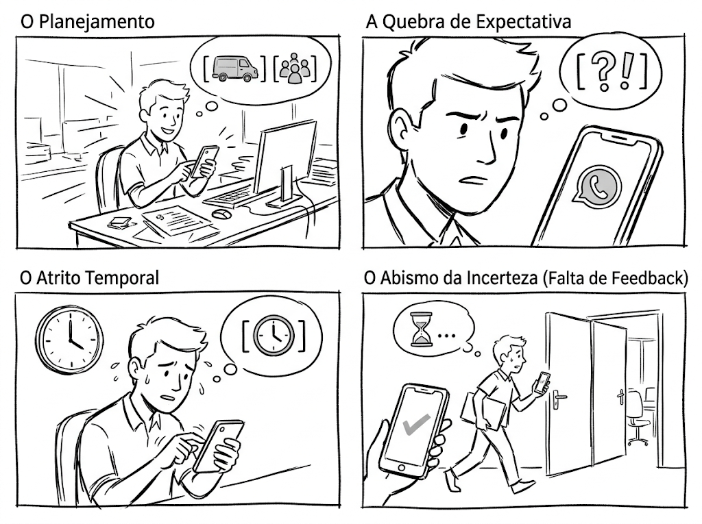
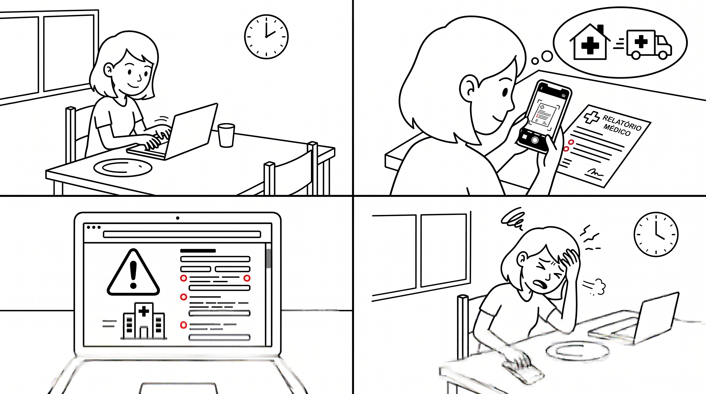
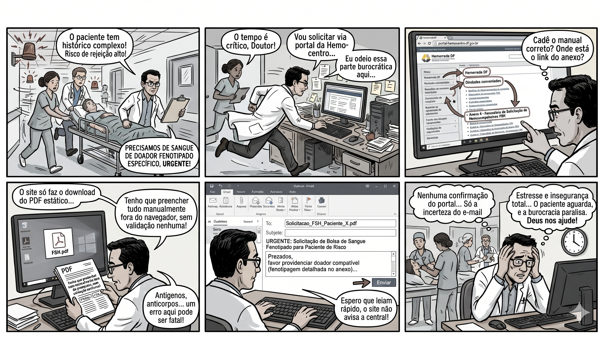
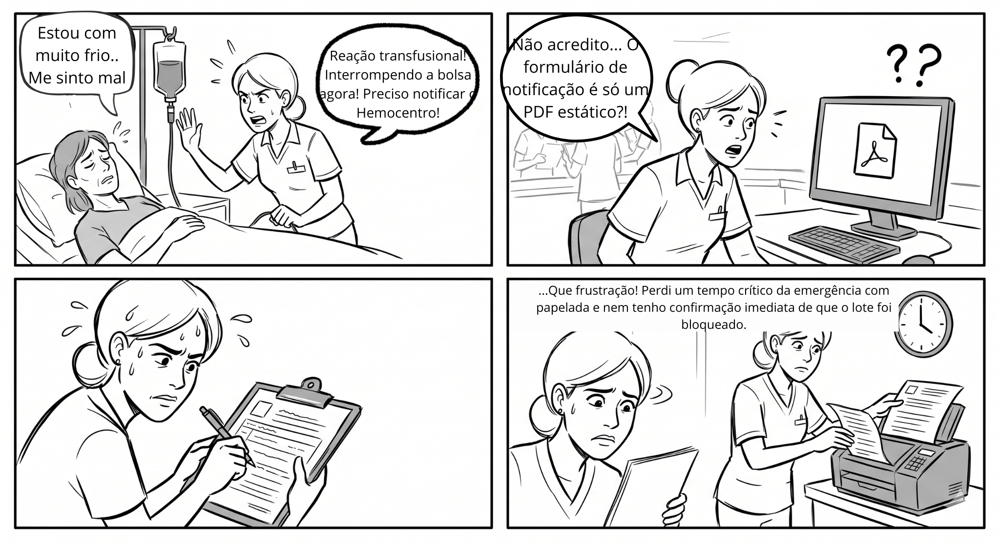
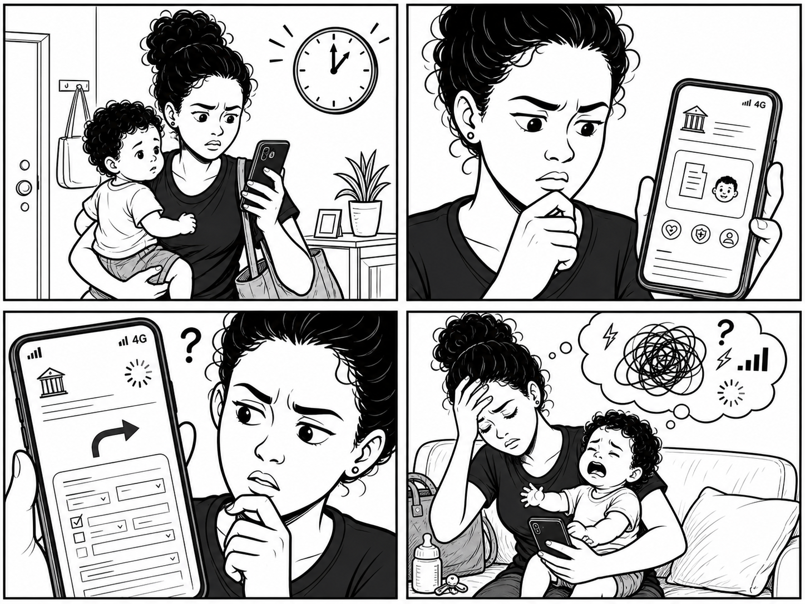
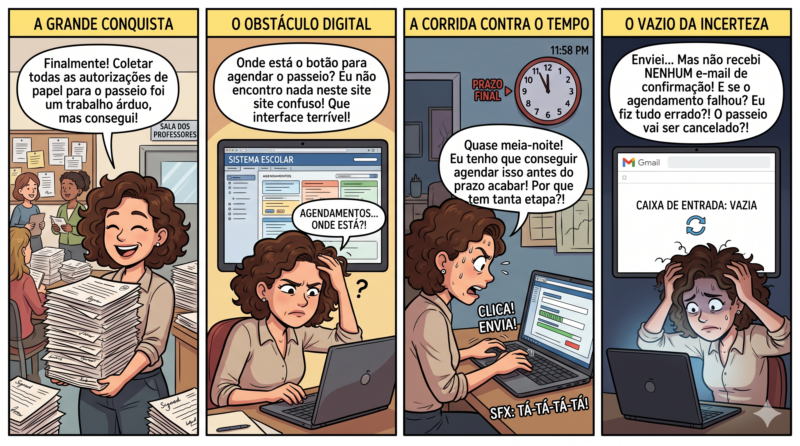
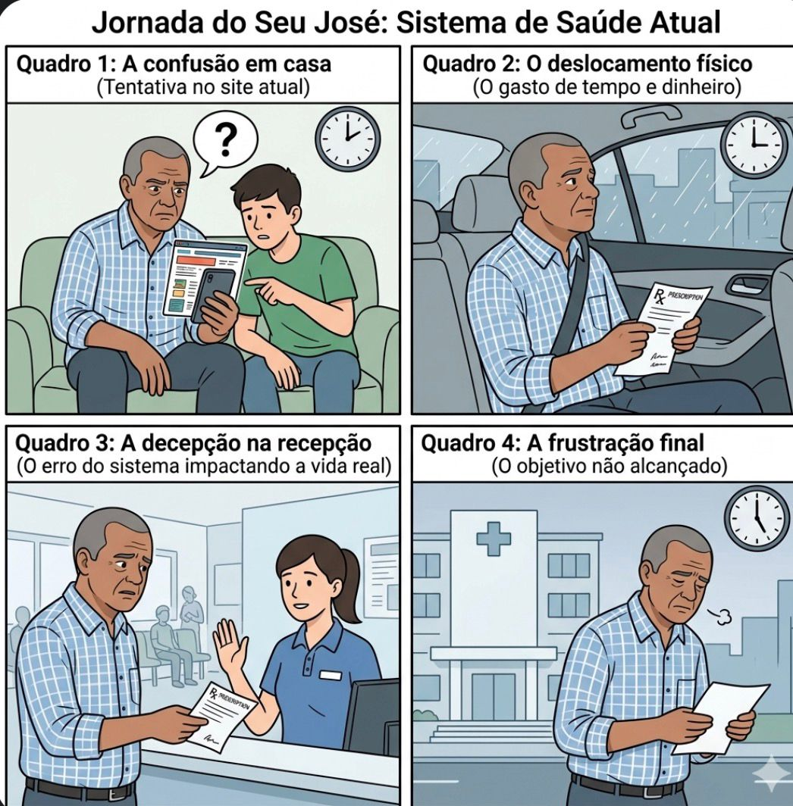

## Introdução

De acordo com [Barbosa et al. (2021)](#ref1), os cenários são basicamente narrativas concretas e ricas em detalhes contextuais sobre pessoas realizando atividades. Na etapa de Organização do Espaço de Problema, a elaboração de **Cenários de Problema** (ou cenários de análise) é uma técnica fundamental para descrever a situação atual do domínio, evidenciando como os usuários tentam alcançar seus objetivos e quais obstáculos ou atritos enfrentam com a tecnologia vigente.

## Cenário 1

O desenho do cenário pode ser visto na [Figura 1](#fig1).

**Título do Cenário:** Agendamento de Doação em Grupo e solicitação do transporte gratuito (Van).

**Situação Inicial:** João, analista de marketing, realizou uma campanha interna na sua empresa e convenceu 14 colegas de trabalho a doarem sangue juntos. Agora, como líder ("multiplicador") da ação, ele precisa oficializar a ida do grupo à Fundação Hemocentro de Brasília (FHB) e solicitar o transporte gratuito disponibilizado pela instituição.

**Atores:** 

- **João Silva** (Doador Engajado, 28 anos, tecnófilo. Busca resolver pendências com rapidez, tem rotina agitada e evita fazer ligações telefônicas).
- **Atendente da FHB** (Atua passivamente no canal de comunicação da Gerência de Registro, Orientação e Captação de Doadores).

**Ambiente ou contexto:** João está no escritório, utilizando seu smartphone. É um dia de semana agitado e ele tem apenas um intervalo de 15 minutos entre reuniões para resolver essa pendência. O ambiente possui algumas distrações visuais e sonoras, aumentando sua pressa.

**Objetivos:** Agendar a data da doação para o grupo de 15 pessoas, garantir a reserva do transporte logístico (van) para buscar a equipe na empresa e obter o material/regras de triagem para repassar aos colegas.

**Planejamento:** João pensa: *"Vou acessar o site do Hemocentro, encontrar o botão de doação em grupo, preencher um formulário online com a quantidade de pessoas e o endereço da empresa, confirmar a van na hora e depois só jogar o link com as regras no grupo do WhatsApp do trabalho para o pessoal conferir se pode doar."*

**Ações:** 

1. João acessa o portal oficial do Hemocentro (`fhb.df.gov.br`) pelo navegador do smartphone.
2. Navega pelo menu principal acessando "Quero doar" > "Tipos de doação" > "Doação em Grupo".
3. Lê a página procurando um botão de "Agendar Van" ou um calendário interativo, mas descobre nas instruções do Passo a Passo que precisa entrar em contato direto com a equipe de captação.
4. Frustrado por não poder resolver de forma 100% autônoma, clica no ícone/número de WhatsApp do Hemocentro disponibilizado na página.
5. O aplicativo do WhatsApp abre e ele digita uma mensagem informando que deseja agendar uma data para 15 pessoas e solicitar o transporte.
6. Enquanto aguarda a resposta do atendente, ele retorna ao site do Hemocentro, procura pelo "Verificador de Aptidão" (Posso Doar?), copia a URL da página e envia no grupo de WhatsApp da empresa, instruindo os colegas a lerem as regras antes do dia marcado.

**Eventos:** O site do Hemocentro exibe a página informativa de Doação em Grupo, listando as regras de transporte para grupos de 10 a 19 pessoas e fornecendo os números de telefone e WhatsApp. Ao clicar no link, o sistema operacional do smartphone redireciona João para o aplicativo WhatsApp. O sistema não fornece confirmação imediata da reserva, pois a resposta depende da interação manual de um humano (atendente).

**Avaliação:** João avalia a interação como ineficiente. Ele percebe que o sistema lhe forneceu a informação, mas falhou em permitir o agendamento direto. Ele se sente frustrado pois só saberá se o seu objetivo final foi concluído (garantir o dia e a van) horas ou dias depois, quando o atendente humano visualizar a mensagem e responder confirmando a disponibilidade, quebrando sua expectativa de ter um serviço rápido, integrado e resolvido na hora.

  
<strong>Figura 1</strong> - Tirinha Cenario 1

  
  

  
Fonte: <a href="#ref2" style="color: red; text-decoration: none;">Gerada por IA</a> (2026).

## Cenário 2

O desenho do cenário pode ser visto na [Figura 2](#fig2).

**Título do Cenário:** Frustração e burocracia na solicitação de medicação domiciliar.

**Situação Inicial:** Júlia percebe que seu estoque de fatores de coagulação está chegando ao fim. Além disso, ela teve um sangramento articular (hemartrose) recente durante a semana e precisa enviar o relatório clínico para justificar a nova remessa do seu tratamento.

**Atores:** Júlia Martins (25 anos, paciente crônica com Hemofilia B). Jovem, nativa digital e com uma rotina agitada de estudos e trabalho, ela busca resolver pendências de saúde de forma ágil e autônoma pelo notebook.

**Ambiente ou contexto:** Júlia está no intervalo do seu trabalho, utilizando seu Notebook conectado à rede móvel. Ela quer resolver o pedido da medicação rapidamente em poucos minutos para não atrapalhar seu horário de almoço.

**Objetivos:** Enviar o relatório do seu sangramento recente e solicitar a renovação da "Dispensação Domiciliar de Fatores de Coagulação" para receber os remédios em casa.

**Planejamento:** Habituada com serviços digitais, Júlia planeja acessar o portal do Hemocentro pelo Notebook, localizar a área de pacientes, anexar a foto do seu relatório de hemartrose e apertar um botão para confirmar o pedido de entrega na sua residência.

**Ações:** 

1. Júlia acessa o portal da Fundação Hemocentro[¹](#ref1) pelo notebook.
2. Navega pelos menus buscando a rota "Coagulopatias" > "Atendimento ambulatorial".
3. Encontra a seção "Entrega domiciliar de medicamentos" e procura o botão de upload ou solicitação online.
4. Descobre que a página é apenas um texto descritivo e que não há nenhum botão ou formulário digital para solicitar a entrega.
5. Lê a instrução engessada do site: "Para solicitar a inclusão no programa de entrega domiciliar, fale com o médico do ambulatório durante sua próxima consulta".
6. Frustrada, ela é obrigada a sair da página e tentar agendar uma consulta médica presencial apenas para entregar um papel e fazer um pedido administrativo.

**Eventos:** O site do Hemocentro atua apenas como um mural informativo estático. O sistema falha em oferecer um fluxo digital transacional para pacientes crônicos, forçando uma interação física e presencial (consulta médica) como barreira para um serviço de entrega que deveria ser facilitado e remoto.

**Avaliação:** Júlia sente-se frustrada e impotente, pois seu tempo é desperdiçado com uma burocracia desnecessária. Ela fica preocupada com a possibilidade de ficar sem medicação em casa devido à demora e à dificuldade de conseguir uma vaga para uma consulta médica presencial apenas para liberar sua entrega domiciliar.

  
<strong>Figura 2</strong> - Tirinha Cenario 2

  
  

  
Fonte: <a href="#ref2" style="color: red; text-decoration: none;">Gerada por IA</a> (2026).

## Cenário 3

O desenho do cenário pode ser visto na [Figura 3](#fig3).

**Título do Cenário:** Solicitação urgente de sangue fenotipado para paciente com risco de rejeição imunológica.

**Situação Inicial:** Um paciente dá entrada no hospital necessitando de uma transfusão de sangue imediata. Ao analisar o prontuário, a equipe médica nota que o paciente possui um histórico complexo de transfusões e o médico responsável identifica a necessidade imperativa de utilizar sangue de um "Doador Fenotipado" específico para evitar uma severa reação transfusional, um procedimento de alta complexidade regulado pelas diretrizes da Instrução Normativa FHB nº 245/2022[³](#ref3).

**Atores:** Dr. Roberto Noleto (47 anos, médico hematologista atuando na linha de frente de um hospital conveniado). Ele é um especialista técnico com alto grau de instrução e domínio do jargão da área, mas que acessa o sistema do Hemocentro apenas de forma intermitente.

**Ambiente ou contexto:** O ambiente do pronto-socorro é caracterizado por caos, alta carga cognitiva e interrupções constantes. O tempo é crítico e a gravidade de um erro é altíssima: qualquer falha no preenchimento do laudo ou atraso burocrático pode resultar em consequências fatais para o paciente. O Dr. Roberto acessa o portal através de um computador desktop compartilhado, localizado no próprio posto de atendimento.

**Objetivos:** Realizar a solicitação de urgência de uma bolsa de sangue fenotipado, preenchendo adequadamente o rigoroso laudo de compatibilidade imunológica (Formulário de Solicitação de Hemocomponentes).

**Planejamento:** Consciente da extrema urgência, o Dr. Roberto planeja acessar o portal da Fundação Hemocentro de Brasília (FHB) para buscar a documentação necessária. Ele sabe, com frustração, que precisará perder tempo precioso procurando o manual correto, fazendo o download de um PDF estático, preenchendo-o manualmente (ou em um editor de texto externo) e enviando-o por malote ou e-mail, já que o site não permite o envio direto.

**Ações:**

  1. O Dr. Roberto acessa o portal da FHB. [²](#ref2)
  2. Navega pelo menu "Hemorrede DF" > "Unidades conveniadas". [¹](#ref1)
  3. Ele rola a página, localiza a seção de "Solicitação e transfusão" e clica no link referente ao Anexo 4 ("Formulário de Solicitação de Hemocomponentes FSH"), conforme exigido pelo Manual para Unidades Conveniadas[⁴](#ref4).
  4. O site faz o download de um arquivo PDF estático para o computador do hospital.
  5. O Dr. Roberto abre o PDF fora do navegador e preenche os dados complexos do paciente e o laudo de compatibilidade imunológica por conta própria.
  6. Ele salva o arquivo preenchido, abre seu cliente de e-mail institucional e anexa a solicitação com caráter de "Urgência" pedindo um "Doador Fenotipado".
  7. Envia o e-mail por fora do site do Hemocentro para efetivar o pedido.

**Eventos:** O site da FHB atua apenas como um repositório de links, disparando o download do arquivo em PDF sem fazer qualquer validação dos dados do paciente ou das regras de compatibilidade. O sistema também não emite nenhum alerta ao Hemocentro, delegando toda a comunicação para o servidor de e-mail externo que o médico precisou usar.

**Avaliação:** O Dr. Roberto não recebe nenhuma mensagem do site da FHB confirmando o sucesso da operação, ficando à mercê de uma resposta por e-mail. Ele sente grande insegurança e estresse, pois não tem certeza imediata se a central de distribuição do Hemocentro visualizou seu e-mail urgente. Ele se sente frustrado com a ineficiência burocrática, ciente de que um erro de preenchimento (que o PDF não valida) ou um atraso na leitura do e-mail podem ter consequências fatais para o paciente que o aguarda.

  
<strong>Figura 3</strong> - Tirinha Cenario 3

  
  

  
Fonte: <a href="#ref2" style="color: red; text-decoration: none;">Gerada por IA</a> (2026).

## Cenario 4

O desenho do cenário pode ser visto na [Figura 4](#fig4).

**Título do Cenário:** Dificuldade e lentidão na notificação de Reação Transfusional no plantão.

**Situação Inicial:** Um paciente internado no Pronto-Socorro começou a apresentar suspeita de reação hemolítica aguda (calafrios, febre e hipotensão severa) logo após o início de uma transfusão de concentrado de hemácias. A transfusão foi imediatamente interrompida pela equipe médica, exigindo a abertura imediata do protocolo compulsório, conforme determinado pelo POP Gvig 04[⁵](#ref5). 

**Atores:** Enfermeira Ana Cavalcanti (35 anos, enfermeira plantonista). Atua sob forte pressão de tempo, possui alto conhecimento técnico e utiliza jargões de hemoterapia. Ela precisa realizar a sua tarefa rapidamente para voltar a cuidar do paciente.

**Ambiente ou contexto:** Ana está no posto de enfermagem do Pronto-Socorro, um ambiente agitado e com constantes interrupções. Ela utiliza um computador *desktop* compartilhado e tem extrema urgência para garantir o bloqueio do lote do hemocomponente no Distrito Federal.

**Objetivos:** Realizar a notificação da intercorrência preenchendo o Formulário de Investigação de Reação Transfusional (FIRT) para que o Hemocentro bloqueie a distribuição do lote de sangue associado.

**Planejamento:** Sabendo da urgência, Ana planeja acessar o portal do Hemocentro, localizar a área de formulários, preencher rapidamente os dados do paciente e o número da bolsa suspeita para que o lote seja bloqueado o quanto antes.

**Ações:** 
    
1. Ana acessa o portal da Fundação Hemocentro[¹](#ref1) no computador do posto.
2. Navega pelos menus buscando a seção de intercorrências ou formulários.
3. Encontra a página do FIRT, mas descobre que o formulário é apenas um arquivo PDF estático.
4. Ela faz o download do arquivo, manda imprimir na impressora do posto de enfermagem e aguarda a impressão.
5. Preenche à mão o longo formulário de papel com os dados clínicos do paciente, jargões dos sintomas e o longo número de identificação da bolsa.
6. Vai até o aparelho de scanner (ou fax), digitaliza o formulário preenchido e, seguindo o fluxo moroso ditado pelo POP Gvig 06[⁶](#ref6), o anexa em um e-mail endereçado à central de hemovigilância do Hemocentro, além de precisar realizar um contato telefônico paralelo para relatar a emergência.

**Eventos:** O site do Hemocentro atua apenas como um repositório passivo de arquivos, fornecendo o PDF para download sem nenhuma interatividade. Não há cruzamento de dados imediato nem notificação compulsória instantânea. O sistema do Hemocentro permanece sem registrar o alerta até que um funcionário do outro lado abra o e-mail, leia o formulário manuscrito e bloqueie o lote manualmente.

**Avaliação:** Ana sente-se frustrada, tensa e sobrecarregada, pois sabe que perdeu um tempo crítico lidando com burocracia de papel durante uma emergência médica. Ela fica insegura, pois não tem nenhuma confirmação imediata de que o lote suspeito foi efetivamente bloqueado no sistema geral para proteger outros pacientes.

  
<strong>Figura 4</strong> - Tirinha Cenario 4

  
  

  
Fonte: <a href="#ref2" style="color: red; text-decoration: none;">Gerada por IA</a> (2026).

## Cenario 5

O desenho do cenário pode ser visto na [Figura 5](#fig5).

**Título do Cenário:** Emissão integrada de carteirinha e solicitação de laudo de fenotipagem sanguínea para paciente com Doença Falciforme.

**Situação Inicial:** Uma mãe cuidadora precisa garantir a continuidade dos direitos e do tratamento de saúde do seu filho recém-diagnosticado com Doença Falciforme. Para isso, ela necessita emitir o documento oficial de identificação da doença e, no mesmo processo, solicitar o laudo de fenotipagem sanguínea, documento vital para garantir a segurança em futuras transfusões.

**Atores:** Mãe cuidadora (26 anos). Possui letramento digital básico, mas como atua como agente familiar, valoriza ferramentas práticas e não lida bem com fluxos que lhe façam perder tempo. O filho não interage com o sistema, mas é o motivador da ação.

**Ambiente ou contexto:** A mãe cuidadora está em casa, acessando o portal da FHB através da tela pequena de seu smartphone, utilizando seu pacote de dados móveis (4G) que costuma ser instável e restrito. O ambiente é agitado, pois ela precisa cuidar da criança pequena enquanto resolve a pendência, o que gera pequenas interrupções e pressão para finalizar a tarefa rapidamente.

**Objetivos:** Solicitar a carteirinha de identificação de forma segura no site oficial e, no mesmo fluxo, obter o laudo de fenotipagem sanguínea do filho.

**Planejamento:** A mãe cuidadora planeja acessar a seção "Para pacientes" no site da FHB, preencher os dados solicitados para a carteirinha e, logo em seguida, buscar no mesmo portal uma forma de solicitar o laudo de fenotipagem sanguínea, esperando que o sistema consulte o histórico de coletas da criança de forma integrada e gere o documento automaticamente.

**Ações:**

1. A mãe cuidadora navega pelo menu principal em "Doença Falciforme" e clica em "Para pacientes".
2. Ela encontra a subseção "Carteirinha de identificação do paciente" e clica no link para preencher o formulário online.
3. Após preencher o formulário externo, ela tenta retornar ao site da FHB para buscar, na mesma plataforma, uma forma de solicitar o laudo de fenotipagem sanguínea do filho.
4. Ela percorre as seções do portal em busca de qualquer campo, botão ou fluxo que permita solicitar o laudo ou cruzar os dados de coletas anteriores da criança com o banco do Hemocentro.

**Eventos:**

1. Ao clicar no link da carteirinha, o sistema redireciona a mãe cuidadora para fora do site oficial da FHB, direcionando-a para um formulário genérico de terceiros hospedado no Google Forms.
2. O sistema atual não oferece nenhum cruzamento entre a solicitação da carteirinha e o banco de dados de coletas do Hemocentro para a geração do laudo de fenotipagem sanguínea.
3. Não há nenhum campo, botão ou fluxo no portal que permita solicitar o laudo de fenotipagem de forma integrada à emissão do documento de identificação da doença.

**Avaliação:** A mãe cuidadora se sente insegura ao ser redirecionada para um link externo (Google Forms) para inserir dados sensíveis de saúde do filho, quebrando sua expectativa de um portal governamental unificado e seguro. Além disso, ela se sente profundamente frustrada ao constatar que o sistema não oferece nenhuma forma de solicitar o laudo de fenotipagem sanguínea na mesma plataforma. Ela avalia a interação como falha e conclui que precisará realizar ligações telefônicas separadas ou ir presencialmente ao Hemocentro para resolver a questão do laudo, não alcançando seu objetivo de emitir os dois documentos críticos em um único fluxo integrado.

  
<strong>Figura 5</strong> - Tirinha Cenario 5

  
  

  
Fonte: <a href="#ref2" style="color: red; text-decoration: none;">Gerada por IA</a> (2026).

## Cenario 6

O desenho do cenário pode ser visto na [Figura 6](#fig6).

**Título do Cenário:** Tentativa de agendamento do HemoTour e envio manual de autorizações.

**Situação Inicial:** Lúcia passou a última semana cobrando os alunos e finalmente conseguiu recolher as 15 autorizações impressas e assinadas pelos pais. Com todos os papéis em mãos, ela precisa oficializar o agendamento da visita técnica no Hemocentro para a próxima sexta-feira.

**Atores:** Professora Lúcia (Persona 6: educadora da rede pública, proativa, porém com o tempo muito escasso e sobrecarregada com tarefas burocráticas extraclasse).

**Ambiente ou contexto:** Lúcia está na sala dos professores durante o seu intervalo de apenas 20 minutos. Ela usa o seu próprio notebook conectado à rede Wi-Fi da escola. O ambiente é movimentado, com outros professores conversando e alunos batendo na porta, o que gera distrações e a deixa com muita pressa.

**Objetivos:** Conseguir reservar o dia e horário exatos para a visita dos 15 alunos e enviar o lote de autorizações exigidas pela instituição, garantindo que o passeio escolar aconteça sem imprevistos.

**Planejamento:** Lúcia mentaliza o processo como faria em outros sistemas modernos: ela planeja entrar no site do Hemocentro, encontrar um calendário interativo de agendamento, selecionar a data desejada, preencher um formulário com os dados da escola, fazer o upload dos PDFs das autorizações em um ambiente seguro e receber uma tela de confirmação imediata.

**Ações:**

1. Lúcia escaneia as 15 autorizações na impressora da sala dos professores e salva os arquivos em uma pasta no seu notebook.
2. Acessa o site oficial da Fundação Hemocentro de Brasília (FHB).
3. Navega pelo menu clicando em "Educação" e depois em "Visita técnica".
4. Rola a página para baixo procurando um botão de agendamento ou formulário de envio de arquivos.
5. Ao ler o texto estático, percebe que não há sistema e que precisará enviar um e-mail.
6. Abre uma nova aba com o seu e-mail institucional.
7. Redige uma mensagem manual para `unitec@fhb.gov.br` solicitando a data, anexa os 15 arquivos PDF um por um, confere se não esqueceu de nenhum aluno, e clica em enviar.

**Eventos:** O portal da FHB exibe apenas texto informativo estático, sem disparar nenhum evento sistêmico para o usuário. O provedor de e-mail de Lúcia processa o upload dos arquivos e envia a mensagem. A caixa de entrada de Lúcia não recebe nenhuma resposta automática, protocolo de atendimento ou confirmação de que a vaga no Hemocentro foi reservada.

**Avaliação:** Lúcia se sente frustrada e insegura. Ela interpreta a ausência de resposta do sistema como uma incerteza: ela não sabe se o objetivo final foi concluído com sucesso, pois ignora se a data solicitada estava livre e se alguém vai ler o e-mail a tempo. Ela conclui que terá que gastar o intervalo do dia seguinte ligando para a instituição para checar o status, gerando retrabalho e estresse.

  
<strong>Figura 1</strong> - Tirinha Cenario 6

  
  

  
Fonte: <a href="#ref2" style="color: red; text-decoration: none;">Gerada por IA</a> (2026).

## Cenario 7

O desenho do cenário pode ser visto na [Figura 7](#fig7).

**Título do Cenário:** Tentativa frustrada de agendamento de sangria terapêutica e deslocamento desnecessário.

**Situação Inicial:** Seu José recebeu uma receita do seu cardiologista particular para fazer uma "sangria". Ele associa "tirar sangue" ao Hemocentro e pede ajuda ao seu neto para tentar marcar pelo celular no site da FHB antes de ir presencialmente.

**Atores:** Seu José (65 anos, leigo em jargões médicos e inseguro com tecnologia) e seu neto (auxilia com a navegação no smartphone).

**Ambiente ou contexto:** Começa na sala de casa, confortáveis, utilizando um smartphone conectado ao Wi-Fi. Termina no ambiente físico do Hemocentro, gerando cansaço e frustração.

**Objetivos:** Conseguir agendar o procedimento de sangria receitado pelo médico particular o mais rápido possível.

**Planejamento:** O neto vai acessar o site da FHB, procurar pelo serviço de "Sangria Terapêutica" e tentar encontrar um botão, formulário ou calendário para agendar o dia e horário.

**Ações:** O neto acessa o portal pelo celular e navega pelos menus até achar uma página sobre Sangria. Eles leem a tela, mas não encontram nenhuma opção clicável para agendar. Diante da falta de opções no sistema, Seu José decide desistir do site, pede um Uber e vai presencialmente ao Hemocentro com a receita de papel nas mãos. Chegando lá, ele vai até a recepção e entrega o documento.

**Eventos:** O site exibe apenas blocos de texto informativos genéricos, sem nenhum botão de triagem ou marcação. Na recepção física, a atendente analisa a receita e informa que a instituição não realiza o procedimento para pacientes de médicos da rede privada, recusando o atendimento.

**Avaliação:** Seu José fica extremamente frustrado e cansado. Ele percebe que gastou tempo, energia física e dinheiro com transporte à toa. Ele avalia que o site falhou com ele, pois deveria ter avisado de forma clara e imediata que ele não seria atendido, evitando toda a viagem perdida.

  
<strong>Figura 1</strong> - Tirinha Cenario 7

  
  

  
Fonte: <a href="#ref2" style="color: red; text-decoration: none;">Gerada por IA</a> (2026).

## Referências Bibliográficas

>  [1] BARBOSA, Simone Diniz Junqueira et al. *Interação Humano-Computador e Experiência do Usuário*. 1. ed. Rio de Janeiro: Autopublicação, 2021.

>  [2] OPENAI. ChatGPT. Versão 3.5. São Francisco, Califórnia, 2026. Inteligência Artificial. Disponível em: <https://chatgpt.com/>. Acesso em: 03 maio. 2026.

>  [3] DISTRITO FEDERAL. Instrução Normativa nº 245, de 01 de dezembro de 2022. Sistema Integrado de Normas Jurídicas do Distrito Federal (SINJ-DF), Brasília, DF, 2022. Disponível em: https://www.sinj.df.gov.br/sinj/Norma/51e2f91d942742eea00c0985b3e2745b/fhb_int_245_2022.html#art7. Acesso em: 16 maio 2026.

>  [4] FUNDAÇÃO HEMOCENTRO DE BRASÍLIA. Manual para Unidades Conveniadas. Versão 2. Brasília, DF: FHB, 2026. Disponível em: https://www.fhb.df.gov.br/documents/d/fhb/manual-para-unidades-conveniadas-v-2. Acesso em: 16 maio 2026.

>  [5] FUNDAÇÃO HEMOCENTRO DE BRASÍLIA. GQUALI-POP-GVIG-04: Eventos Adversos Relacionados ao Procedimento Transfusional. Brasília, DF: FHB, 2025. Disponível em: https://www.fhb.df.gov.br/documents/d/fhb/gquali-pop-gvig-04. Acesso em: 16 maio 2026.

>  [6] FUNDAÇÃO HEMOCENTRO DE BRASÍLIA. Hemovigilância em Suspeita de Contaminação Bacteriana. Brasília, DF: FHB, 2025. Disponível em: https://www.fhb.df.gov.br/documents/d/fhb/hemovigilancia-em-suspeita-de-contaminacao-bacteriana-1b108688-3819-4ab4-88b9-90f9b500e5a1-pdf. Acesso em: 16 maio 2026.

## Histórico de Versões

| Versão | Descrição | Data | Autor(es) | Data de revisão | Revisor(es) |
| :---: | :--- | :---: | :---: | :---: | :---: |
| 1.0 | Criação do Cenário 5 | 01/05/2026 | [Julia Gabriella](https://github.com/juliagabriellafs) | 02/05/2026 | [Gabriel Diniz](https://github.com/GabrielDiniz12) |
| 1.1 | Criação do documento do Cenário 6 | 01/05/2026 | [Lucas Oliveira](https://github.com/dev-LucasDpaula) | 02/05/2026 | [Julia Gabriella](https://github.com/juliagabriellafs) |
| 1.2 | Criação do documento do Cenário 7 | 01/05/2026 | [Pedro Ian](https://github.com/pedroiaan) | 02/05/2026 | [Lucas Oliveira](https://github.com/dev-LucasDpaula) |
| 1.3 | Criação do cenário 2 | 02/05/2026 | [Breno Teixeira](https://github.com/BrenoLTeixeira) | 03/05/2026 | [Pedro Américo](https://github.com/dev-americo) |
| 1.4 | Criação documento Cenario 1 | 03/05/2026 | [Pedro Américo](https://github.com/dev-americo)| 03/05/2026 | [Pedro Ian](https://github.com/pedroiaan) |
| 1.5 | Criação do cenário 3 | 03/05/2026 | [Pedro Lucas](https://github.com/Pwdrinho) | 03/05/2026 | [Breno Teixeira](https://github.com/BrenoLTeixeira) |
| 1.6 | Criação do cenário 4 | 03/05/2026 | [Gabriel Diniz](https://github.com/GabrielDiniz12) | 03/05/2026 | [Pedro Lucas](https://github.com/Pwdrinho) |
| 2.0 | Junção dos Cenários | 11/05/2026 | [Pedro Américo](https://github.com/dev-americo)| 12/05/2026 | [Lucas Oliveira](https://github.com/dev-LucasDpaula) |
| 2.1 | Adição da rastreabilidade dos cenários 3 e 4 | 16/05/2026 | [Gabriel Diniz](https://github.com/GabrielDiniz12)| 16/05/2026 | [Pedro Lucas](https://github.com/Pwdrinho) |
| 2.2 | Revisão e correções Cenários | 20/06/2026 | [Julia Gabriella](https://github.com/juliagabriellafs) | 20/06/2026 | [Pedro Américo](https://github.com/dev-americo) |