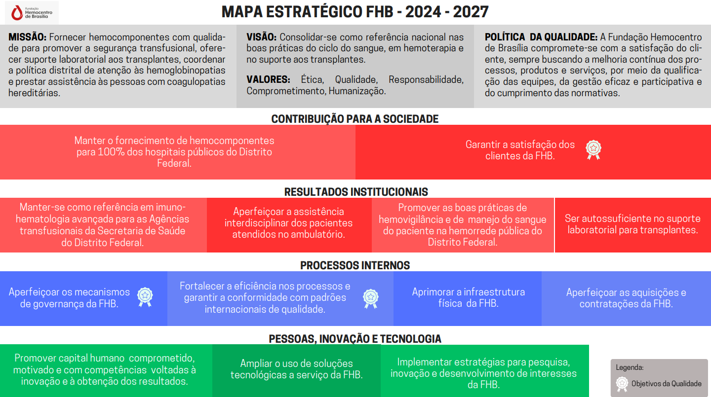

# Análise Documental: Mapa Estratégico FHB 2024 - 2027

## Introdução

Este documento compila as diretrizes estratégicas centrais da Fundação Hemocentro de Brasília (FHB) [¹](#ref1), extraídas do documento [Mapa Estratégico FHB 2024-2027](../../assets/entrega2/AnaliseDocumentosMapaEstrategico.png) [²](#ref2) disponibilizado no próprio site da FHB. Seu propósito é **fornecer uma base sólida sobre o que a instituição busca alcançar**, servindo como **guia** para o **desenvolvimento e alinhamento** da interface aos **objetivos reais de negócio** da fundação. Ao compreender a visão, a missão e os resultados institucionais esperados, o projeto de interface poderá refletir com precisão o compromisso da FHB com a sociedade, focando na excelência do serviço, acessibilidade e na satisfação do usuário.

## Missão
Fornecer hemocomponentes com qualidade para promover a segurança transfusional, oferecer suporte laboratorial aos transplantes, coordenar a política distrital de atenção às hemoglobinopatias e prestar assistência às pessoas com coagulopatias hereditárias. [²](#ref2)

## Visão
Consolidar-se como referência nacional nas boas práticas do ciclo do sangue, em hemoterapia e no suporte aos transplantes. [²](#ref2)

## Valores
**Ética, Qualidade, Responsabilidade, Comprometimento, Humanização**. [²](#ref2)

## Política da Qualidade
A Fundação Hemocentro de Brasília compromete-se com a satisfação do cliente, sempre buscando a melhoria contínua dos processos, produtos e serviços, por meio da qualificação das equipes, da gestão eficaz e participativa e do cumprimento das normativas. [²](#ref2)

## Resultados Institucionais e Objetivos Estratégicos

Para que a interface atenda de forma eficaz às necessidades de negócio da FHB, ela deve facilitar, suportar ou comunicar os seguintes resultados esperados, divididos por perspectivas: [²](#ref2)

### Contribuição para a Sociedade 
- **Cobertura Total:** Manter o fornecimento de hemocomponentes para 100% dos hospitais públicos do Distrito Federal;
- **Satisfação:** Garantir a satisfação dos clientes da FHB;
- **Autossuficiência:** Ser autossuficiente no suporte laboratorial para transplantes;
- **Excelência Técnica:** Manter-se como referência em imuno-hematologia avançada para as Agências transfusionais da Secretaria de Saúde do Distrito Federal;
- **Cuidado e Assistência:** Aperfeiçoar a assistência interdisciplinar dos pacientes atendidos no ambulatório;
- **Segurança e Boas Práticas:** Promover as boas práticas de hemovigilância e de manejo do sangue do paciente na hemorrede pública do Distrito Federal.

### Processos Internos
- **Governança:** Aperfeiçoar os mecanismos de governança da FHB;
- **Qualidade Global:** Fortalecer a eficiência nos processos e garantir a conformidade com padrões internacionais de qualidade;
- **Infraestrutura:** Aprimorar a infraestrutura física da FHB;
- **Gestão e Contratos:** Aperfeiçoar as aquisições e contratações da FHB.

### Pessoas, Inovação e Tecnologia
- **Tecnologia:** Ampliar o uso de soluções tecnológicas a serviço da FHB;
- **Pesquisa e Inovação:** Implementar estratégias para pesquisa, inovação e desenvolvimento de interesses;
- **Capital Humano:** Promover capital humano comprometido, motivado e com competências voltadas à instituição.

## Figura 1 - Mapa Estratégico FHB 2024-2027

  
<strong>Figura 1</strong> - Mapa estratégico FHB

  
  

  
Fonte: <a href="#ref2" style="color: red; text-decoration: none;">Mapa estratégico FHB</a> (2026).

## Referências Bibliográficas

> [1] FUNDAÇÃO HEMOCENTRO DE BRASÍLIA. **Página Inicial**. Brasília, DF, 2026. Disponível em: [https://www.fhb.df.gov.br/](https://www.fhb.df.gov.br/). Acesso em: 30 abril 2026.

> [2] FUNDAÇÃO HEMOCENTRO DE BRASÍLIA. Mapa estratégico FHB 2026.1. Brasília: FHB, [s.d.]. Disponível em: https://www.fhb.df.gov.br/documents/d/fhb/mapa-estrategico-fhb-2026-1-1-. Acesso em: 30 abr. 2026.

## Histórico de Versões

| Versão | Descrição | Data | Autor(es) | Data de revisão | Revisor(es) |
| :---: | :--- | :---: | :---: | :---: | :---: |
| 1.0 | Criação do documento Mapa Estratégico | 30/04/2026 | [Pedro Lucas](https://github.com/pwdrinho)| 01/05/2026 | [Breno Teixeira](https://github.com/BrenoLTeixeira) |
| 1.1 | Adiciona figura do mapa estratégico | 02/05/2026 | [Pedro Lucas](https://github.com/pwdrinho)| 03/05/2026 | [Breno Teixeira](https://github.com/BrenoLTeixeira) |