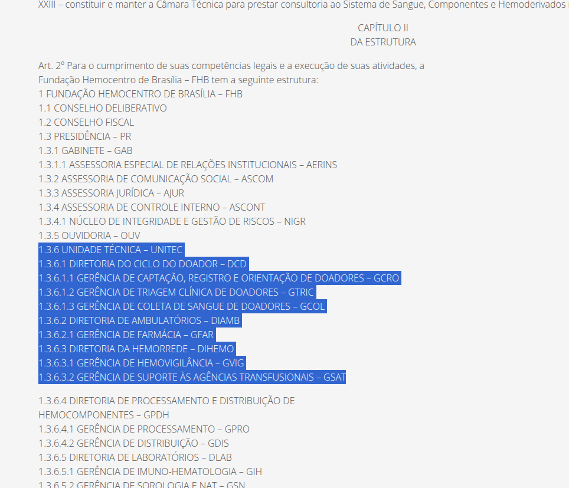
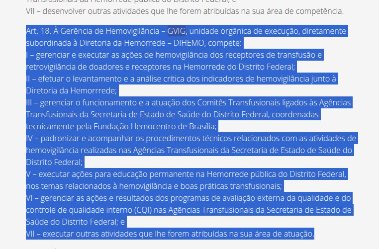
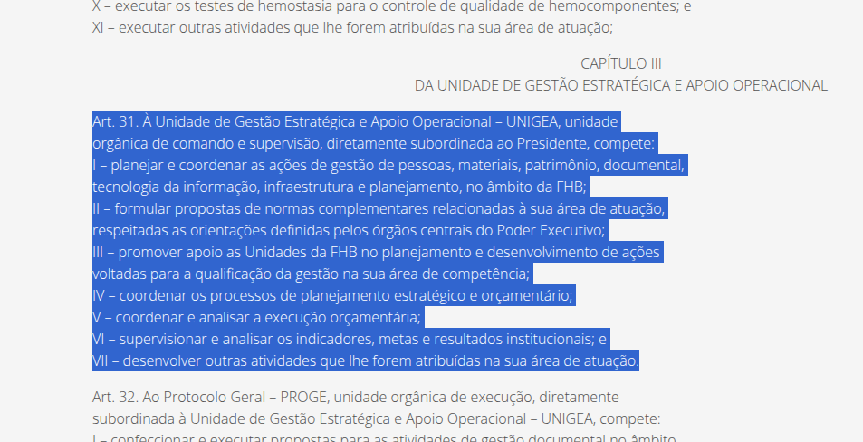

# Análise Documental: Regimento Interno (Decreto nº 43.477/2022)

---

## Introdução

O desenvolvimento de sistemas interativos responsáveis exige, antes de qualquer decisão de design, a compreensão do ambiente legal e normativo em que o sistema será inserido. Conforme [Barbosa et al. (2021)¹](#ref1), a documentação de processos e normas é insumo essencial da fase de análise em IHC, pois define restrições sobre o que o usuário poderá ou não fazer através do sistema — limites que não são negociáveis, independentemente de preferências de usuário ou conveniências técnicas.

Para fundamentar a análise de IHC e criação de novas funcionalidades do portal da Fundação Hemocentro de Brasília (FHB), foi analisado o seu [Regimento Interno (Decreto nº 43.477/2022)²](#ref2). O objetivo desta análise é mapear as competências administrativas ("quem faz o quê") da instituição para definir os possíveis perfis de usuário.

---

## A Análise Documental em IHC

Em IHC, a fase de análise precede qualquer decisão de design: é nela que se compreende quem são os usuários, quais tarefas realizam e em que contexto operam. Dentre as fontes de dados dessa fase, documentos normativos e institucionais ocupam posição especial, pois delimitam o espaço de soluções juridicamente válidas. [Barbosa et al. (2021)¹](#ref1) são diretos ao afirmar que a documentação de processos e normas define restrições sobre o que o usuário poderá ou não fazer através do sistema, e às vezes até como ele poderá utilizá-lo. Inserindo-se no [ciclo de Engenharia de Usabilidade de Mayhew (1999, apud BARBOSA et al., 2021¹)](#ref1), o Estatuto da FHB é, portanto, uma fonte primária de requisitos: informa quem são os atores do sistema, quais processos devem ser suportados e, sobretudo, quais ações são proibidas por lei.

---

## Mapeamento das Unidades e Perfis de Usuários Internos

A leitura do organograma e das competências descritas no Regimento revelou que os funcionários do Hemocentro possuem atuações extremamente segmentadas. Isso indica que, no design da interface, o "usuário interno" não é um perfil único, exemplo na [Figura 1](#fig1). Os perfis dividem-se nas seguintes unidades:

*   **Unidade Técnica (UNITEC):** É a área finalística da FHB, responsável por coordenar e supervisionar a execução das atividades de atenção hematológica, hemoterápica e de suporte aos transplantes. É aqui que se encontram os profissionais de saúde (médicos, enfermeiros, biomédicos). Suas diretorias detalham os fluxos dos nossos cenários:
    *   **Diretoria do Ciclo do Doador (DCD):** Composta pelas gerências de captação, triagem clínica e coleta de sangue. São os profissionais que interagem com a jornada de doação.
    *   **Diretoria da Hemorrede (DIHEMO) e Gerência de Hemovigilância (GVIG):** São responsáveis por planejar, coordenar e executar as ações de hemovigilância e dar suporte às agências transfusionais nos hospitais do DF. Representam o perfil dos profissionais de saúde externos que reportam problemas com bolsas de sangue.
    *   **Diretoria de Ambulatórios (DIAMB) e Gerência de Farmácia (GFAR):** Gerenciam os medicamentos destinados ao tratamento de pacientes com coagulopatias.

*   **Unidade de Gestão Estratégica e Apoio Operacional (UNIGEA):** Unidade responsável por planejar e coordenar as ações de tecnologia da informação (através da DTIC), infraestrutura e materiais. Este perfil abriga os servidores responsáveis por dar manutenção aos sistemas e à rede do Hemocentro.

*   **Ouvidoria (OUV):** Unidade de assessoramento que atua prestando auxílio e mediando o contato com a população e demais setores.

  
<strong>Figura 1</strong> - Descrição da Estrutura Organizacional do Hemocentro

  
  

  
Fonte: <a href="#ref1" style="color: red; text-decoration: none;">DECRETO Nº 43.477</a> (2022).

## Entendimento das Restrições e Hierarquia de Tarefas

O Regimento Interno estabelece uma clara divisão hierárquica das responsabilidades, o que afeta diretamente o fluxo de tarefas (quem executa e quem supervisiona):

*   **Nível de Execução (Gerências):** O documento atribui às gerências verbos de ação direta. Por exemplo, a Gerência de Hemovigilância (GVIG) tem a competência de *"executar as ações de hemovigilância"* e *"efetuar o levantamento de indicadores"*. Em termos de modelagem de tarefas, isso significa que estes são os usuários que primariamente inserem, preenchem e manipulam os dados no dia a dia [Figura 2](#fig2).

  
<strong>Figura 2</strong> - Exemplo de descrição de Excução do Hemocentro

  
  

  
Fonte: <a href="#ref1" style="color: red; text-decoration: none;">DECRETO Nº 43.477</a> (2022).

*   **Nível de Direção e Supervisão (Diretorias e Chefias):** As diretorias possuem atribuições estratégicas, descritas com verbos como *"planejar"*, *"coordenar"* e *"supervisionar"*. Na análise de tarefas, esse perfil não costuma fazer a inserção primária de dados, atuando mais na visualização de informações consolidadas e coordenação das gerências subordinadas [Figura 3](#fig3).

  
<strong>Figura 3</strong> -  Exemplo de descrição de Planejamento do Hemocentro

  
  

  
Fonte: <a href="#ref1" style="color: red; text-decoration: none;">DECRETO Nº 43.477</a> (2022).

**Conclusão da Análise:**
Neste contexto, a análise do Regimento Interno validou a necessidade de segmentar os fluxos de tarefas. Compreendemos que as regras da instituição proíbem que um mesmo profissional atue em todos os processos simultaneamente. Assim, os fluxos de interação (como a triagem de doadores ou o relato de reações transfusionais) devem ser projetados considerando as competências e as restrições estritas do cargo de cada profissional de saúde envolvido.

## Referências Bibliográficas

>  [1] BARBOSA, Simone Diniz Junqueira et al. Interação Humano-Computador e Experiência do Usuário. 1. ed. Rio de Janeiro: Simone Diniz Junqueira Barbosa, 2021. E-book.

>  [2] FUNDAÇÃO HEMOCENTRO DE BRASÍLIA. Regimento Interno. Brasília, DF: FHB, 2022. Disponível em: <https://www.fhb.df.gov.br/regimento-interno/>. Acesso em: 01 maio 2026.

## Histórico de Versões

| Versão | Descrição | Data | Autor(es) | Data de revisão | Revisor(es) |
| :---: | :--- | :---: | :---: | :---: | :---: |
| 1.0 | Criação do documento | 01/05/2026 | [Pedro Américo](https://github.com/dev-americo) | 02/05/2026 | [Pedro Ian](https://github.com/pedroiaan) |