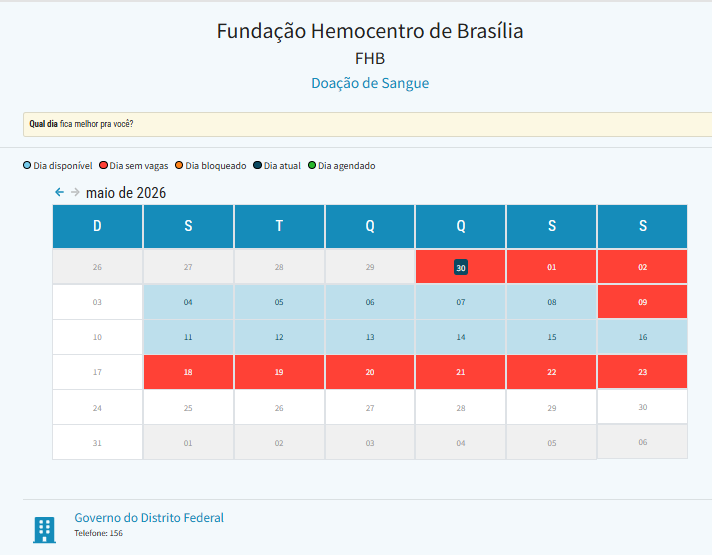
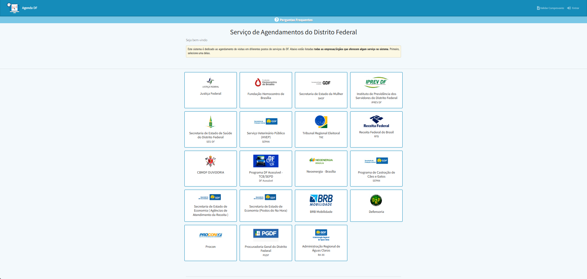

# Análise Documental: Relatório Anual da Ouvidoria e a Avaliação do Agendamento

---

## Introdução

Este documento apresenta uma análise detalhada do [Relatório Anual da Ouvidoria da Fundação Hemocentro de Brasília (FHB)¹](#ref1) referente ao ano de 2023. O objetivo desta análise é identificar os principais pontos de insatisfação e as necessidades dos usuários em relação aos serviços prestados, utilizando esses dados como insumo para o levantamento de requisitos de IHC. Ao examinar as manifestações registradas, busca-se compreender as falhas de interação nos sistemas atuais e propor melhorias que alinhem a interface digital às expectativas e à jornada real do doador.

---

## A Análise Documental e o Diagnóstico de Problemas

A análise de documentos em Interação Humano-Computador (IHC) busca examinar materiais que registram o domínio e a utilização de um sistema para identificar restrições, conhecer o perfil dos usuários e descobrir problemas inerentes ao próprio design atual [Barbosa et al. (2021)²](#ref2). Para este projeto, o artefato base analisado foi o [Relatório Anual (2023) da Ouvidoria da FHB¹](#ref1). 

O documento compila as manifestações reais dos usuários e funciona como um diagnóstico das dores do público, registrando que a tipologia de manifestação mais recebida abrange centenas de reclamações e sugestões. O tema de maior recorrência nessas manifestações é disparado o "Atendimento para doação", métrica que contou com 445 registros no ano e engloba diretamente os questionamentos e frustrações com o processo de agendamento e a espera.

---

## Falhas de Usabilidade no Fluxo de Agendamento

Sob a ótica de IHC, os altos índices de reclamação atrelados ao agendamento são sintomas diretos de problemas na usabilidade e na estrutura das tarefas da interface atual. Ao mapear o fluxo de uso que gera as queixas documentadas, constata-se que o usuário é redirecionado para um portal genérico externo (Agenda DF). 

Dependendo do link acessado ou do serviço desejado (como doação de sangue ou cadastro de medula), ele é obrigado a procurar o Hemocentro em uma grade visual misturada com diversos outros serviços não relacionados do Distrito Federal, conforme a [Figura 1](#fig1).

  
<strong>Figura 1</strong> - Grade visual de serviços no portal Agenda DF

  
  

  
Fonte: <a href="#ref1" style="color: red; text-decoration: none;">RELATÓRIO ANUAL DA OUVIDORIA</a> (2024).

Apenas após concluir essa busca e selecionar o tipo de agendamento, o usuário deve selecionar o dia em um calendário visualizado na [Figura 2](#fig2), escolher o horário e, por fim, realizar o login na plataforma governamental (Gov.br). 

  
<strong>Figura 2</strong> - Calendário de agendamento do sistema

  
  

  
Fonte: <a href="#ref1" style="color: red; text-decoration: none;">RELATÓRIO ANUAL DA OUVIDORIA</a> (2024).

Esse processo longo e não focado viola o princípio de simplicidade nas estruturas das tarefas, exigindo excessivo planejamento e resolução de problemas por parte do usuário [Barbosa et al. (2021)²](#ref2). O sistema atual reflete o modelo burocrático de organização do Estado, e não o modelo mental e os objetivos do doador, o que justifica as dezenas de queixas documentadas pela ouvidoria.

---

## Impacto na Comunicabilidade e Tempo de Espera

Ademais, o relatório anual destaca o "Tempo de espera" (com 46 manifestações específicas) e demandas isoladas por informações gerais, solicitações e dúvidas. Em IHC, essa carência informacional indica falhas de comunicabilidade. O sistema web falha ao não atuar como um "preposto do designer" eficiente [Barbosa et al. (2021)²](#ref2), omitindo-se de antecipar e sanar as dúvidas do usuário sobre as regras para doar antes do seu deslocamento físico. 

Logo, a análise documental evidencia que a interface atual não comunica adequadamente a lógica do serviço, transferindo a carga cognitiva e o esforço de descoberta para o ambiente presencial, o que culmina nas métricas negativas de espera e insatisfação registradas pela instituição. 

**Conclusão da Análise:**
Conclui-se, portanto, a necessidade imperativa de um reprojeto da interface para mitigar os gargalos de usabilidade e comunicabilidade evidenciados na fase de levantamento de dados.

## Referências Bibliográficas

>  [1] FUNDAÇÃO HEMOCENTRO DE BRASÍLIA. **Relatório Anual 2023 - Ouvidoria.** Brasília, DF: FHB, 2024. Disponível em: <https://fhb.df.gov.br/documents/d/fhb/ouvidoria-relatorio-2023-anual-pdf>. Acesso em: 30 abr. 2026.

>  [2] BARBOSA, Simone Diniz Junqueira et al. **Interação Humano-Computador e Experiência do Usuário**. 1. ed. Rio de Janeiro: Simone Diniz Junqueira Barbosa, 2021.

## Histórico de Versões

| Versão | Descrição | Data | Autor(es) | Data de revisão | Revisor(es) |
| :---: | :--- | :---: | :---: | :---: | :---: |
| 1.0 | Criação do documento | 30/04/2026 | [Gabriel Diniz](https://github.com/GabrielDiniz12) | 02/05/2026 | [Julia Gabriella](https://github.com/juliagabriellafs) |