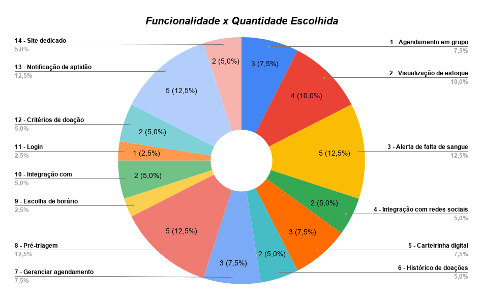

# Brainstorming

## Introdução
O [Brainstorming (Tempestade de Ideias)¹](#ref1) é uma técnica de elicitação de requisitos e ideação amplamente utilizada em IHC e Engenharia de Software. Seu principal objetivo é estimular a criatividade de um grupo para gerar um grande volume de ideias inovadoras sobre um determinado problema ou oportunidade, sem julgamentos prévios. Neste projeto, a técnica foi aplicada para levantar e priorizar possíveis funcionalidades para a plataforma do Hemocentro (FHB).

## Metodologia e Roteiro
Utilizando o [livro de IHC¹](#ref1) como base, Estruturamos a sessão de brainstorming em duas fases principais: ideação e priorização (votação). O roteiro seguiu os seguintes passos:

1.  **Pergunta-chave:** A sessão foi iniciada com a apresentação de uma pergunta central para guiar o foco dos participantes em relação às necessidades dos doadores e do hemocentro.
2.  **Ideação e Registro:** Os participantes tiveram um momento para desenvolver e anotar suas ideias individualmente. Em seguida, as ideias eram repassadas ao Apresentador, que as expunha ao grupo, enquanto o Escriba realizava a transcrição oficial.
3.  **Votação (Priorização):** Após o esgotamento e registro de todas as ideias, iniciou-se o processo de priorização. Cada um dos 8 participantes teve direito a **5 votos**. 
    * *Regras de votação:* Não havia peso de importância entre os votos (todos valiam 1 ponto) e um mesmo participante não poderia votar na mesma ideia mais de uma vez.

A assinatura do TCLE precedeu obrigatoriamente o início da gravação em vídeo e da atividade de classificação, garantindo a integridade ética do processo. Os documentos assinados podem ser conferidos [aqui](../../../assets/pdfs/TCLE/brainstorm/TCLE-brainstorm.pdf).

## Equipe e Papéis
Para garantir a fluidez da dinâmica e o registro adequado das informações, a equipe de facilitação foi dividida nos seguintes papéis:

* **Apresentador:** [Pedro Lucas](https://github.com/Pwdrinho) (Responsável por mediar a sessão, receber as ideias e expô-las ao grupo).
* **Cinegrafista:** [Breno Teixeira](https://github.com/BrenoLTeixeira) (Responsável pela gravação e registro audiovisual da sessão).
* **Escriba:** [Pedro Ian](https://github.com/pedroiaan) (Responsável por transcrever e documentar as ideias geradas).
* **Observador:** [Gabriel Diniz](https://github.com/GabrielDiniz12) (Responsável por analisar o engajamento, comportamento e a dinâmica do grupo).

## Resultados

Abaixo está a tabela consolidada com todas as 15 funcionalidades levantadas durante a sessão, suas respectivas descrições e o total de votos recebidos após a etapa de priorização.

**Tabela 1: Ideias levantadas e quantitativo de votos**

| ID | Funcionalidade | Descrição | Qntd. Votos |
| :---: | :--- | :--- | :---: |
| **1** | Agendamento em grupo | Permitir agendamento coletivo por instituição. | 3 |
| **2** | Visualização de estoque | Mostrar estoque de sangue sem limitação. | 4 |
| **3** | Alerta de falta de sangue | Notificar quando faltar tipo específico. | 5 |
| **4** | Integração com redes sociais | Divulgação para atrair doadores. | 2 |
| **5** | Carteirinha digital | Acessar carteirinha no login. | 3 |
| **6** | Histórico de doações | Visualizar doações anteriores. | 2 |
| **7** | Gerenciar agendamento | Realizar e cancelar agendamentos. | 3 |
| **8** | Pré-triagem | Questionário antes do cadastro. | 5 |
| **9** | Escolha de horário | Selecionar horário do agendamento. | 1 |
| **10** | Integração com geolocalização | Melhorar visualização de locais. | 2 |
| **11** | Login | Sistema de autenticação. | 1 |
| **12** | Critérios de doação | Informações sobre aptidão para doar. | 2 |
| **13** | Notificação de aptidão | Avisar quando pode doar novamente. | 5 |
| **14** | Site dedicado | Hemocentro com site exclusivo. | 2 |
| **15** | Data próxima doação | Mostrar quando poderá doar novamente. | 0 |

### Representação Gráfica dos Resultados

Para facilitar a visualização da distribuição de interesses, os dados votados foram dispostos nos gráficos abaixo:

  
<strong>Figura 1</strong> - Distribuição percentual dos votos por funcionalidade

  
  

  
Fonte: Elaborado pelo autor, 2026.

## Análise e Justificativas

A partir dos resultados da votação, é possível identificar claramente um agrupamento de funcionalidades consideradas de alta prioridade pelos participantes. As necessidades mais urgentes do sistema giram em torno de comunicação proativa e otimização do fluxo de atendimento:

1.  **Pré-triagem, Alerta de falta de sangue e Notificação de aptidão (5 votos cada):** Essas três funcionalidades concentraram o maior número de votos e indicam a prioridade do grupo por soluções que atuem de forma proativa. A pré-triagem ajuda a evitar deslocamentos desnecessários, o alerta de falta de sangue cria um gatilho de urgência para doação e a notificação de aptidão reduz a necessidade de o usuário calcular manualmente quando poderá doar novamente.
2.  **Visualização de estoque (4 votos):** A possibilidade de consultar o estoque de sangue atende à necessidade de transparência e reforça o engajamento do doador, que passa a ter mais autonomia para acompanhar a situação do hemocentro.
3.  **Agendamento e identidade digital (3 a 2 votos):** *Agendamento em grupo*, *Carteirinha digital* e *Gerenciar agendamento* obtiveram 3 votos cada, enquanto *Site dedicado* recebeu 2 votos. Esse conjunto mostra interesse em recursos de apoio à organização da doação e ao acesso rápido à identidade digital do usuário.

Por outro lado, a lista completa de ideias também revelou propostas que não refletem as necessidades primárias neste momento[¹](#ref1). Ideias como *Escolha de horário* e *Login* (1 voto cada) e *Data próxima doação* (0 votos, possivelmente ofuscada pela funcionalidade de "Notificação de aptidão") foram preteridas. Essa hierarquização permite que a equipe foque os esforços iniciais de design e desenvolvimento no primeiro bloco de alta prioridade, mantendo as demais documentadas para futuras iterações ou inspiração do projeto [¹](#ref1).

---

## Link do Vídeo de Brainstorming

    <iframe width="100%" height="400" src="https://www.youtube.com/embed/58CZOAqQF0k" title="Vídeo de avaliação" frameborder="0" allowfullscreen></iframe>
    <figcaption>
        Fonte: <a href="https://github.com/BrenoLTeixeira">Breno Teixeira</a> (2026).
        <a href="https://youtu.be/58CZOAqQF0k">Clique para assistir no YouTube</a>.
    </figcaption>

## Referências Bibliográficas

>  [1] BARBOSA, Simone Diniz Junqueira et al. Interação Humano-Computador e Experiência do Usuário. 1. ed. Rio de Janeiro: Simone Diniz Junqueira Barbosa, 2021. E-book.

## Histórico de Versões

| Versão | Descrição | Data | Autor(es) | Data de revisão | Revisor(es) |
| :---: | :--- | :---: | :---: | :---: | :---: |
| 1.0 | Documentação e Resultados do Brainstorming | 01/05/2026 | [Pedro Ian](https://github.com/pedroiaan) e [Pedro Lucas](https://github.com/Pwdrinho) | 02/05/2026 | [Breno Teixeira](https://github.com/brenolteixeira) |
| 1.1 | Reordenação da tabela por prioridade (mais votos) e inserção do "top" 5 no tópico 5 | 01/05/2026 | [Gabriel Diniz](https://github.com/GabrielDiniz12) | 03/05/2026 | [Julia Gabriella](https://github.com/juliagabriellafs) |
| 1.2 | Adição do video do brainstorming | 03/05/2026 | [Breno Teixeira](https://github.com/brenolteixeira) | 03/05/2026 | [Lucas Oliveira](https://github.com/dev-LucasDpaula) |