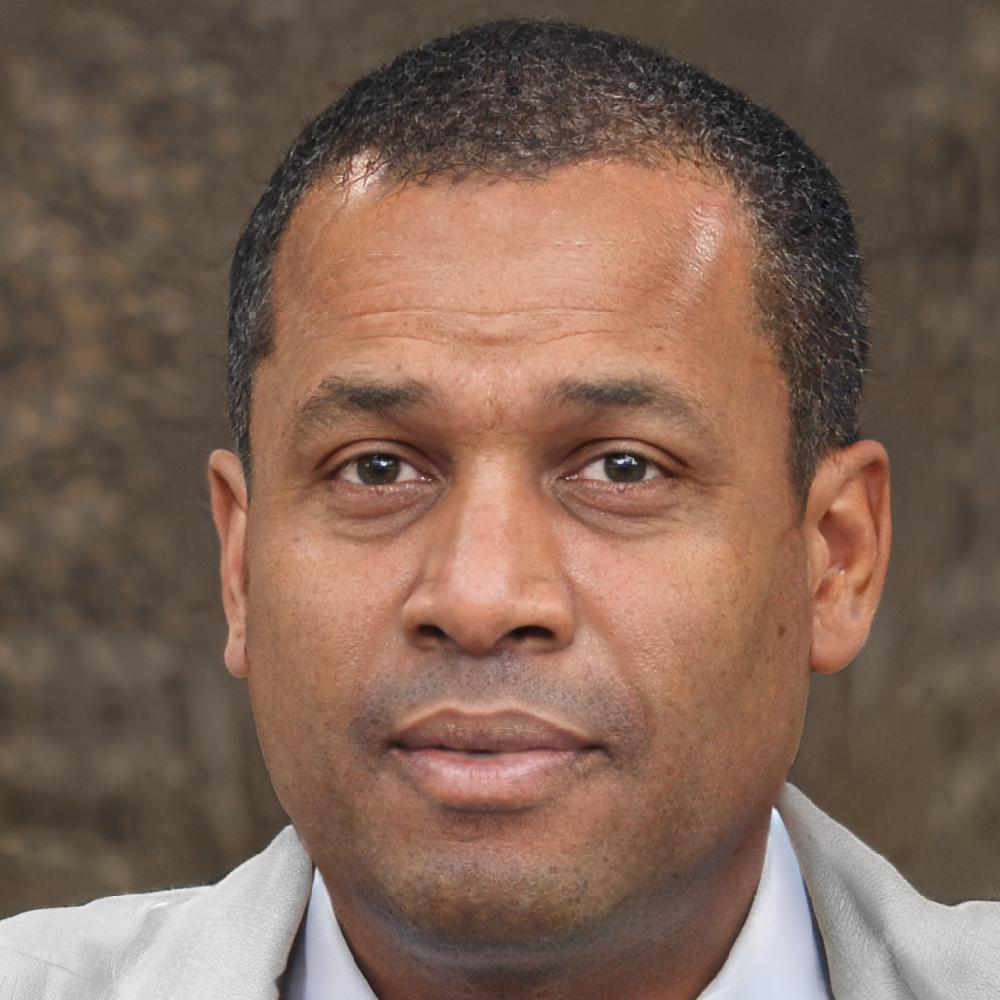
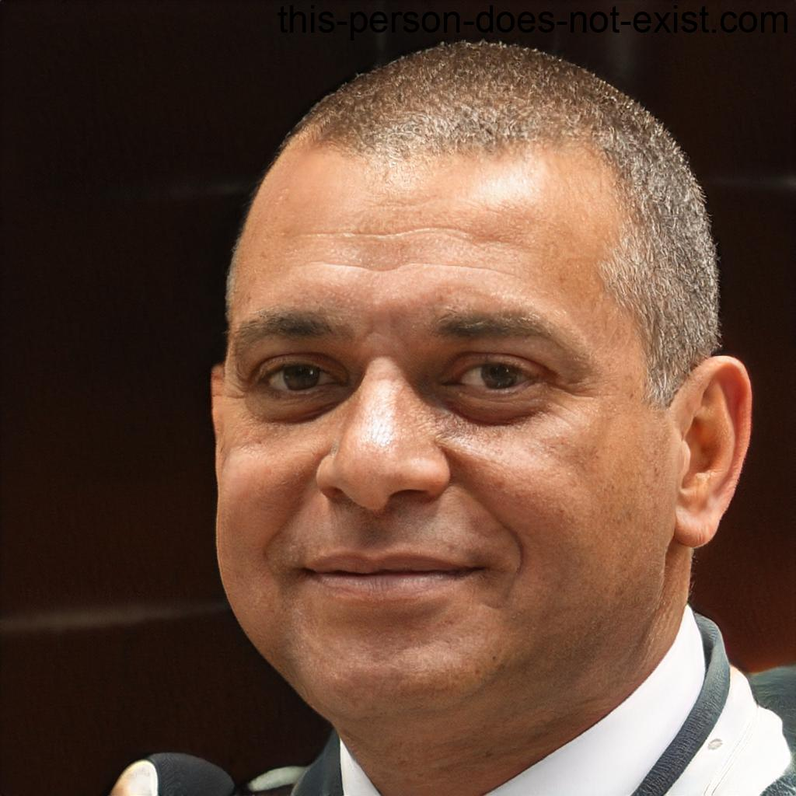

## Introdução

As [personas¹](#ref1) são arquétipos hipotéticos de usuários reais criadas para representar os usuários típicos do sistema, servindo como uma ferramenta poderosa de design e comunicação para a equipe. Elas são definidas principalmente por seus objetivos e expectativas perante a tecnologia, evitando que a equipe projete para um "usuário genérico".

## Persona 1

Com base nos perfis de usuários levantados na fase de Organização do Espaço de Problema, o elenco de personas do novo sistema da Fundação Hemocentro de Brasília (FHB) foi elaborado. A [Tabela 1](#tab1) apresenta a nossa Persona Primária responsável por interagir com o módulo de Doação em Grupo, essa persona foi criada com base na coleta de dados [Brainstorm](../analiseRequisitos/coletaDados/brainstorm.md).

<b>Tabela 1</b> - Persona Primária - João

| Atributo | Detalhes |
| :--- | :--- |
| **Foto:** |    Fonte: [This Person does not exit](#ref2)|
| **Status:** | Persona Primária |
| **Nome:** | João Silva |
| **Gênero:** | Masculino |
| **Idade:** | 28 anos |
| **Profissão:** | Analista de Marketing |
| **Escolaridade:** | Ensino Superior Completo |
| **Localidade:** | Plano Piloto, DF |
| **Relacionamentos:** | Relaciona-se com sua rede de amigos/colegas de trabalho (os doadores convidados) e, indiretamente, com a equipe de captação da Diretoria do Ciclo do Doador (DCD) da FHB que aprovará a van. |
| **Habilidades:** | Possui alto letramento digital (tecnófilo) e utiliza muito o smartphone e as redes sociais. Tem grande habilidade de comunicação e mobilização digital, mas é completamente leigo em relação aos jargões médicos e critérios clínicos rigorosos de doação. |
| **Tarefas:** | **Primária:** Organizar o fluxo de "Doação em Grupo".    **Passos e Frequência:** Cria campanhas no sistema, dispara links do "Verificador de Aptidão" para pré-triagem no WhatsApp dos convidados e agenda a van logística. Realiza essa tarefa com frequência média (a cada 3 ou 4 meses, respeitando o intervalo de doação masculina). |
| **Objetivos:** | Seu principal objetivo é organizar ações solidárias coletivas de doação de sangue de forma rápida e engajadora, garantindo a logística de transporte gratuito (van HemoTour) sem perder tempo com burocracias ou ligações telefônicas. |
| **Expectativas:** | João acredita e espera que o sistema do Hemocentro funcione com a mesma fluidez de um aplicativo de prestação de serviços (como agendamento de viagens ou e-commerce). Ele espera uma interface que o guie passo a passo, mostre uma barra de progresso do agendamento da van e evite redirecionamentos confusos para páginas genéricas do governo. |
| **Requisitos:** | *"Preciso de uma plataforma em que eu consiga agendar a van para o meu grupo de forma 100% online, com links fáceis que eu possa jogar no grupo do WhatsApp da empresa para o pessoal se cadastrar sozinho."* |

Fonte: [Pedro Américo](https://github.com/dev-americo), 2026.

## Persona 2

Com base nos perfis de usuários levantados na fase de Organização do Espaço de Problema, o elenco de personas do novo sistema da Fundação Hemocentro de Brasília (FHB) foi elaborado. A [Tabela 2](#tab2) apresenta a nossa Persona Primária responsável por interagir com o módulo de Dispensação Domiciliar de Fatores de Coagulação.

<b>Tabela 2</b> - Persona Primária - Júlia Martins

| Atributo | Detalhes |
| :--- | :--- |
| **Foto:** |    Fonte: [This Person does not exit](#ref2) |
| **Status:** | Primário |
| **Nome:** | Júlia Martins |
| **Gênero:** | Feminino |
| **Idade:** | 25 anos |
| **Profissão:** | Arquiteta |
| **Escolaridade:** | Ensino Superior Completo |
| **Localidade:** | Ceilândia, DF |
| **Relacionamentos:** | Mantém contato com a equipe de hematologia do ambulatório e com o setor de logística da Fundação Hemocentro de Brasília para a entrega dos fatores de coagulação. |
| **Habilidades:** | Como nativa digital, possui alta proficiência no uso de aplicativos móveis. Busca resolver tudo com poucos cliques e valoriza interfaces que permitam o upload instantâneo de documentos. |
| **Tarefas:** | A tarefa complexa que Júlia realiza é o controle de estoque de medicação em sua casa e o upload de relatórios de sangramentos articulares (hemartrose) para validação médica no sistema. |
| **Objetivos:** | Seu objetivo principal é gerenciar de forma independente a "Dispensação Domiciliar de Fatores de Coagulação". Ela precisa garantir que o medicamento chegue à sua residência sem a necessidade de deslocamentos burocráticos constantes ao Hemocentro. |
| **Expectativas:** | Ela espera que o portal seja responsivo e intuitivo. Deseja um fluxo onde possa submeter seus registros clínicos online e solicitar a renovação da entrega de seus fatores de coagulação de maneira autônoma, rápida e eficiente. |
| **Requisitos:** | Júlia necessita de um sistema que elimine a necessidade de consultas presenciais apenas para renovação de pedidos. Ela requer uma funcionalidade que permita tirar uma foto do relatório e enviá-la diretamente pelo Notebook.    *"Preciso de um sistema prático; se eu puder enviar a foto do meu relatório de sangramento pelo Notebook e já confirmar minha entrega domiciliar, ganho muito mais tempo no meu dia!"* |

Fonte: [Breno Teixeira](https://github.com/BrenoLTeixeira), 2026.

## Persona 3

Com base nos perfis de usuários levantados na fase de Organização do Espaço de Problema, o elenco de personas do novo sistema da Fundação Hemocentro de Brasília (FHB) foi elaborado. A [Tabela 3](#tab3) apresenta a nossa Persona primária responsável por interagir com o módulo de Solicitação Urgente de Bolsa de Sangue Fenotipado.

<b>Tabela 3</b> - Persona Secundária - Roberto Noleto

| Atributo | Detalhes |
| :--- | :--- |
| **Foto:** |    Fonte: [This Person does not exit](#ref2) |
| **Status:** | Primário |
| **Nome:** | Roberto Noleto |
| **Gênero:** | Masculino |
| **Idade:** | 47 anos |
| **Profissão:** | Médico Hematologista |
| **Escolaridade:** | Alto grau de instrução na área da saúde (Especialista) |
| **Localidade:** | *(Hospital/Pronto-socorro conveniado no DF - não especificado)* |
| **Relacionamentos:** | Trabalha em conjunto com a equipe médica e de enfermagem, destacando-se a colaboração com a **Enfermeira Ana** na execução dos protocolos transfusionais. Também interage com técnicos de laboratório e com o setor de distribuição de hemocomponentes da Fundação Hemocentro de Brasília. |
| **Habilidades:** | Possui habilidades técnicas avançadas no diagnóstico e tratamento de patologias do sangue. Ele é altamente capacitado para interpretar laudos de compatibilidade imunológica e tomar decisões clínicas críticas sob pressão. Possui domínio completo da terminologia técnica da área e familiaridade com protocolos de urgência hospitalar, embora prefira ferramentas digitais que priorizem a agilidade e a precisão técnica em vez de processos burocráticos manuais. O acesso à tecnologia se dá prioritariamente por computadores desktop localizados no próprio ambiente hospitalar. |
| **Tarefas:** | A tarefa complexa consiste em realizar um procedimento estrito e de urgência: **solicitar uma bolsa de sangue de "Doador Fenotipado"**, o que exige o preenchimento de laudos rigorosos de compatibilidade imunológica. A execução correta dessa tarefa é crítica, pois a gravidade de um erro ou a ineficiência no tempo de resposta pode resultar em consequências fatal para pacientes que necessitam da transfusão. |
| **Objetivos:** | Solicitar e garantir o recebimento rápido e seguro de hemocomponentes específicos para pacientes em situação de risco. |
| **Expectativas:** | Roberto espera a substituição de processos manuais e PDFs estáticos por um módulo de solicitação digital nativo. O foco deve ser a agilidade técnica, oferecendo formulários inteligentes que permitam o envio imediato dos laudos e forneçam confirmação de recebimento em tempo real, garantindo segurança e fluidez ao fluxo hospitalar crítico. |
| **Requisitos:** | Roberto necessita de uma interface que permita a inserção rápida de dados fenotípicos, validação automática de campos obrigatórios para evitar devoluções por erro de preenchimento e um canal de comunicação direta com o laboratório de imuno-hematologia do Hemocentro. |

Fonte: [Pedro Lucas](https://github.com/pwdrinho), 2026.

## Persona 4

Com base nos perfis de usuários levantados na fase de Organização do Espaço de Problema, o elenco de personas do novo sistema da Fundação Hemocentro de Brasília (FHB) foi elaborado. A [Tabela 4](#tab4) apresenta a nossa Persona primária responsável por interagir com o módulo de Notificação de Reação Transfusional (FIRT).

<b>Tabela 4</b> - Persona Secundária - Ana Cavalcanti

| Atributo | Detalhes |
| :--- | :--- |
| **Foto:** |    Fonte: [This Person does not exit](#ref2) |
| **Status:** | Primário |
| **Nome:** | Ana Cavalcanti |
| **Gênero:** | Feminino |
| **Idade:** | 35 anos |
| **Profissão:** | Enfermeira especialista em hematologia e hemoterapia |
| **Escolaridade:** | Ensino Superior Completo (Especialização) |
| **Localidade:** | *(Hospital conveniado no DF - não especificado)* |
| **Relacionamentos:** | Relaciona-se com médicos hematologistas como o Doutor Roberto que solicitam as transfusões, equipe de técnicos de enfermagem, pacientes e com a central de hemovigilância da Fundação Hemocentro de Brasília. |
| **Habilidades:** | É uma profissional de saúde altamente capacitada que lida diariamente com emergências médicas e trabalha sob forte pressão de tempo. Possui alto conhecimento técnico em hemoterapia e hematologia e utiliza jargões técnicos no seu dia a dia. |
| **Tarefas:** | A tarefa complexa e crítica que ela precisa realizar é o preenchimento do Formulário de Investigação de Reação Transfusional (FIRT). Devido à urgência do contexto, é necessário uma notificação compulsória dentro da plataforma para bloquear sistematicamente o lote de sangue após um paciente passar mal durante a transfusão, fluxo este hoje operacionalizado de forma morosa e manual através das diretrizes do POP Gvig 04[⁵](#ref5). |
| **Objetivos:** | Seu objetivo principal é proteger a integridade dos pacientes do hospital, garantindo que o Hemocentro seja alertado imediatamente sobre qualquer intercorrência. Ela precisa bloquear a distribuição de lotes de sangue suspeitos o mais rápido possível para evitar riscos a outras pessoas, superando os canais analógicos e telefônicos previstos no atual POP Gvig 06[⁶](#ref6). |
| **Expectativas:** | Ela espera que o sistema de Unidades Conveniadas funcione como uma extensão do seu ambiente de urgência, ou seja, de forma rápida, eficiente e integrada. Acredita que, ao preencher os sintomas na tela, a plataforma já faça o cruzamento de dados com o banco de sangue e realize o bloqueio preventivo de forma automática. |
| **Requisitos:** | Ana precisa que a funcionalidade seja ágil, ddispensando o preenchimento físico e o envio de e-mails paralelos exigidos atualmente pelo processo burocrático do POP Gvig 04[⁵](#ref5). |

Fonte: [Gabriel Diniz](https://github.com/GabrielDiniz12), 2026.

## Persona 5

Com base nos perfis de usuários levantados na fase de Organização do Espaço de Problema, o elenco de personas do novo sistema da Fundação Hemocentro de Brasília (FHB) foi elaborado. A [Tabela 5](#tab5) apresenta a nossa Persona *Stakeholder* responsável por interagir com o módulo de Doença Falciforme para a emissão de documentos.

<b>Tabela 5</b> - Persona Stakeholder - Maria Silva

| Atributo | Detalhes |
| :--- | :--- |
| **Foto:** |    Fonte: [This Person does not exit](#ref2) |
| **Status:** | Stakeholder |
| **Nome:** | Maria Silva |
| **Gênero:** | Feminino |
| **Idade:** | 26 anos |
| **Profissão:** | Dona de casa / Cuidadora em tempo integral |
| **Escolaridade:** | Ensino Fundamental Completo |
| **Localidade:** | Samambaia, DF |
| **Relacionamentos:** | Maria atua como uma ponte. Ela se relaciona diretamente com o filho (o usuário primário em essência), com a equipe multidisciplinar da Hemorrede (hematologistas e técnicos do laboratório de imuno-hematologia do Hemocentro) e, possivelmente, com outros agentes familiares que a ajudam no dia a dia. |
| **Habilidades:** | Possui alfabetismo digital básico, navegando na internet pelo celular e utilizando redes sociais ou aplicativos de mensagens, mas não é especialista em tecnologia. Além disso, ela é leiga no domínio clínico: não tem treinamento formal em saúde nem domina jargões hematológicos. Sua especialidade, na prática, é a gestão rotineira dos cuidados de seu filho. |
| **Tarefas:** | **Primária:** Emissão online da "Carteirinha de Identificação da Doença Falciforme" para a criança.    **Passos e Frequência:** Acesso via Menu "Doença Falciforme" > "Para pacientes". Atualmente, a solicitação é feita num formulário online onde a Maria é jogada para fora do site do Hemocentro (Google Forms). Associado a isso, ela precisa solicitar conjuntamente o laudo de fenotipagem sanguínea no próprio fluxo da carteirinha, documento exigido para a segurança transfusional do filho. Trata-se de uma tarefa que exige precisão e que possui grande gravidade em caso de erro. |
| **Objetivos:** | Os objetivos de Maria não se limitam apenas ao uso do sistema. Seu grande objetivo de vida e foco pessoal é cuidar da saúde do filho e garantir seus direitos com dignidade e rapidez. Em termos práticos, seus objetivos são emitir a carteirinha de identificação e, no mesmo processo, garantir o laudo de fenotipagem sanguínea, documento crítico para prevenir complicações transfusionais e assegurar a realização de transfusões seguras para o filho. |
| **Expectativas:** | Ela acredita que um portal governamental deva ser centralizado e seguro. Sua expectativa é que o sistema retenha suas informações e organize os serviços em um único fluxo. Ao invés de preencher dados repetidos, ela espera que o sistema consulte automaticamente o histórico de coletas na base do Hemocentro para gerar o laudo de fenotipagem sanguínea na mesma hora, sem a necessidade de etapas adicionais ou deslocamentos presenciais. |
| **Requisitos:** | Maria necessita de uma interface integrada, que não consuma muitos dados e que seja direta. Atualmente, ela tem a necessidade crítica de solicitar a **carteirinha de identificação** e o **laudo de fenotipagem sanguínea** na mesma tela, de forma integrada e sem redirecionamentos externos.    *"Eu preciso conseguir a carteirinha do meu filho e o laudo de sangue num só lugar, sem ter que ficar pulando de link em link ou ligando para vários números, pois meu tempo e minha internet são curtos."* |

Fonte: [Julia Gabriella](https://github.com/juliagabriellafs), 2026.

## Persona 6

Com base nos perfis de usuários levantados na fase de Organização do Espaço de Problema, o elenco de personas do novo sistema da Fundação Hemocentro de Brasília (FHB) foi elaborado. A [Tabela 6](#tab6) apresenta a nossa Persona *Stakeholder* responsável por interagir com o módulo de Educação para o agendamento de Visitas Técnicas (HemoTour).

<b>Tabela 6</b> - Persona Stakeholder - Lúcia 

| Atributo | Detalhes |
| :--- | :--- |
| **Foto:** |    Fonte: [This Person does not exit](#ref2) |
| **Status:** | Stakeholder (Usuária externa representando um grupo escolar) |
| **Nome:** | Lúcia |
| **Gênero:** | Feminino |
| **Idade:** | 40 anos |
| **Profissão:** | Educadora da rede pública de ensino |
| **Escolaridade:** | Ensino Superior Completo |
| **Localidade:** | Brasília, DF |
| **Relacionamentos:** | Interage constantemente com alunos, pais de alunos (para recolher assinaturas) e coordenação escolar. |
| **Habilidades:** | Possui nível intermediário de afinidade tecnológica. Usa bem o pacote Office, e-mails e portais do governo, mas não tem tempo a perder com sistemas confusos. Lúcia é uma educadora dedicada que acredita que a cidadania deve ser ensinada na prática, mas tem uma rotina extremamente corrida lidando com planejamento de aulas e burocracias escolares. |
| **Tarefas:** | **Primária:** Acessar o site do Hemocentro, encontrar o menu de Visita Técnica, agendar o passeio e fazer o upload em lote de arquivos PDF contendo as autorizações dos alunos menores de idade.    **Passos e Frequência:** O acesso é feito via link oficial de Visita Técnica (`https://www.fhb.df.gov.br/visita-tecnica`). Atualmente, o site informa as regras restritas, mas não há um botão de "Agendar". Lúcia precisa abrir seu provedor de e-mail, escrever a solicitação, anexar documentos manualmente e iniciar um longo processo de troca de mensagens com os atendentes através do e-mail oficial. |
| **Objetivos:** | Seu objetivo é conseguir visualizar datas disponíveis, reservar uma vaga para até 15 alunos e enviar as dezenas de autorizações dos pais de forma centralizada para o "HemoTour". |
| **Expectativas:** | Espera um processo de agendamento ágil, autônomo, e a garantia imediata (via protocolo) de que a visita escolar está confirmada e a documentação validada. |
| **Requisitos:** | Um sistema que permita ver um calendário com datas livres em tempo real e um formulário rápido para anexar arquivos com confirmação imediata, eliminando a dificuldade logística de recolher, escanear e organizar dezenas de autorizações físicas sem um sistema de apoio.    *"Eu preciso de um sistema onde eu possa ver as datas e mandar as autorizações de uma vez. Minha rotina é muito corrida para ficar redigindo e-mails e esperando dias por uma resposta de confirmação."* |

Fonte: [Lucas Oliveira](https://github.com/dev-LucasDpaula), 2026.

## Persona 7

Com base nos perfis de usuários levantados na fase de Organização do Espaço de Problema, o elenco de personas do novo sistema da Fundação Hemocentro de Brasília (FHB) foi elaborado. A [Tabela 7](#tab7) apresenta a nossa Persona **Secundária**, que representa um perfil de exceção. Trata-se de um usuário que busca um serviço indisponível por demanda espontânea e que necessita de um design focado na prevenção de erros e no redirecionamento rápido, influenciando ativamente a criação do nosso módulo de Triagem Digital.

<b>Tabela 7</b> - Persona Secundária (Cenário de Exceção) - José da Silva 

| Atributo | Detalhes |
| :--- | :--- |
| **Foto:** |    Fonte: [This Person does not exit](#ref2) |
| **Status:** | Secundária |
| **Nome:** | José da Silva |
| **Gênero:** | Masculino |
| **Idade:** | 65 anos |
| **Profissão:** | Aposentado |
| **Escolaridade:** | Ensino Fundamental Incompleto |
| **Localidade:** | Taguatinga, DF |
| **Relacionamentos:** | Possui um vínculo forte com o neto, que atua como um stakeholder secundário e seu principal influenciador digital. É o neto (ou outro familiar mais jovem) quem geralmente o auxilia com a tecnologia e insiste para que ele tente resolver os problemas pelo celular antes de sair de casa. Também se relaciona passivamente com os médicos particulares que emitem as receitas. |
| **Habilidades:** | Possui letramento digital básico; usa o smartphone majoritariamente para o WhatsApp e para ver vídeos. Sente-se inseguro ao usar portais de saúde, pois tem medo de "apertar o botão errado e cancelar tudo". É leigo em jargões médicos: para ele, "Sangria Terapêutica" e "Doação de Sangue" acontecem no mesmo lugar e da mesma forma. Não sabe que o Hemocentro só faz sangria para pacientes crônicos já acompanhados por eles. |
| **Tarefas:** | **Primária:** Tentar marcar o exame de "Sangria Terapêutica" o mais rápido possível.    **Passos e Frequência:** Sua rotina envolve resolver problemas de saúde de forma analógica, indo presencialmente aos postos ou ligando, o que demanda muito tempo e esforço físico. A tentativa de usar o site do Hemocentro é uma tarefa atípica (frequência única), impulsionada pela necessidade pontual do agendamento. |
| **Objetivos:** | Conseguir agendar o procedimento de "Sangria" que o seu cardiologista particular receitou. Resolver a pendência de saúde sem precisar de muita ajuda para não preocupar a família. |
| **Expectativas:** | Espera encontrar um botão claro de "Agendar" e um calendário logo nas primeiras páginas.    **Se for frustrado (Onde nosso sistema atua):** Espera ser avisado *imediatamente* se estiver no lugar errado, recebendo instruções claras de para onde deve ir (encaminhamento para a rede pública), para não se deslocar em vão. |
| **Requisitos:** | Precisa de um sistema tolerante a erros, que não exija preenchimento de formulários longos ou conhecimento de termos técnicos. Necessita de redirecionamento imediato e claro caso esteja no lugar errado, evitando perda de tempo e locomoção desnecessária.    *"O médico mandou eu tirar sangue para melhorar a circulação, vou marcar lá no Hemocentro que é mais garantido."* |

Fonte: [Pedro Ian](https://github.com/pedroiaan), 2026.

## Persona 8

Com base na necessidade metodológica de delimitar rigorosamente o escopo do sistema, a [Tabela 8](#tab8) apresenta a nossa **Antipersona**. A justificativa para a inclusão deste perfil fundamenta-se na definição da literatura de Interação Humano-Computador: a antipersona é alguém que não utilizará o produto e, por essa razão, não deve influenciar as decisões de projeto. Ao mapear uma criança sem autonomia ou letramento para acessar um portal de saúde, estabelece-se o limite de que a equipe não dedicará recursos projetando funcionalidades, adaptações de linguagem ou interfaces lúdicas para tentar atendê-la.

<b>Tabela 8</b> - Antipersona / Antiusuário - Enzo Gabriel 

| Atributo | Detalhes |
| :--- | :--- |
| **Foto:** |    Fonte: [This Person does not exit](#ref2) |
| **Status:** | Antipersona / Antiusuário |
| **Nome:** | Enzo Gabriel |
| **Gênero:** | Masculino |
| **Idade:** | 5 anos |
| **Profissão:** | Estudante (Educação Infantil) |
| **Escolaridade:** | Não alfabetizado |
| **Localidade:** | Guará, DF |
| **Relacionamentos:** | Interage majoritariamente com os pais, avós e colegas da pré-escola. Depende de adultos para o acesso seguro à internet. |
| **Habilidades:** | Possui habilidades voltadas apenas para o entretenimento. Interage com telas para assistir vídeos infantis, ver fotos ou jogar aplicativos lúdicos, sempre operando em dispositivos dos responsáveis. |
| **Tarefas:** | Nenhuma. A antipersona não possui maturidade biológica, capacidade cognitiva ou necessidade real para acessar um portal institucional de saúde e preencher fluxos burocráticos. |
| **Objetivos:** | Não possui nenhum objetivo relacionado ao sistema da FHB. Seu foco está no desenvolvimento infantil e atividades lúdicas. |
| **Expectativas:** | Nenhuma. |
| **Requisitos:** | **Restrição de Escopo:** O sistema ignorará completamente a existência desta persona. A equipe de design **não** criará interfaces coloridas com foco lúdico, validações específicas ou elementos gamificados. O escopo arquitetural permanecerá focado exclusivamente em doadores, pacientes crônicos e educadores. |

Fonte: [Pedro Ian](https://github.com/pedroiaan), 2026.

## Referências Bibliográficas

>  [1] BARBOSA, Simone Diniz Junqueira et al. Interação Humano-Computador e Experiência do Usuário. 1. ed. Rio de Janeiro: Simone Diniz Junqueira Barbosa, 2021. E-book.

>  [2] THIS PERSON DOES NOT EXIST. Face Generator. Disponível em: https://this-person-does-not-exist.com/pt. Acesso em: 01 maio 2026.

>  [3] DISTRITO FEDERAL. Instrução Normativa nº 245, de 01 de dezembro de 2022. Sistema Integrado de Normas Jurídicas do Distrito Federal (SINJ-DF), Brasília, DF, 2022. Disponível em: https://www.sinj.df.gov.br/sinj/Norma/51e2f91d942742eea00c0985b3e2745b/fhb_int_245_2022.html#art7. Acesso em: 16 maio 2026.

>  [4] FUNDAÇÃO HEMOCENTRO DE BRASÍLIA. Manual para Unidades Conveniadas. Versão 2. Brasília, DF: FHB, 2026. Disponível em: https://www.fhb.df.gov.br/documents/d/fhb/manual-para-unidades-conveniadas-v-2. Acesso em: 16 maio 2026.

>  [5] FUNDAÇÃO HEMOCENTRO DE BRASÍLIA. GQUALI-POP-GVIG-04: Eventos Adversos Relacionados ao Procedimento Transfusional. Brasília, DF: FHB, 2025. Disponível em: https://www.fhb.df.gov.br/documents/d/fhb/gquali-pop-gvig-04. Acesso em: 16 maio 2026.

>  [6] FUNDAÇÃO HEMOCENTRO DE BRASÍLIA. Hemovigilância em Suspeita de Contaminação Bacteriana. Brasília, DF: FHB, 2025. Disponível em: https://www.fhb.df.gov.br/documents/d/fhb/hemovigilancia-em-suspeita-de-contaminacao-bacteriana-1b108688-3819-4ab4-88b9-90f9b500e5a1-pdf. Acesso em: 16 maio 2026.

## Histórico de Versões

| Versão | Descrição | Data | Autor(es) | Data de revisão | Revisor(es) |
| :---: | :--- | :---: | :---: | :---: | :---: |
| 1.0 | Criação do documento da persona 4 | 30/04/2026 | [Gabriel Diniz](https://github.com/GabrielDiniz12)| 01/05/2026 | [Pedro Lucas](https://github.com/pwdrinho) |
| 1.1 | Criação documento Persona 3 | 01/05/2026 | [Pedro Lucas](https://github.com/pwdrinho)| 03/05/2026 | [Breno Teixeira](https://github.com/BrenoLTeixeira) |
| 1.2 | Criação documento Persona 1 | 01/05/2026 | [Pedro Américo](https://github.com/dev-americo) | 03/05/2026 | [Pedro Ian](https://github.com/pedroiaan) |
| 1.3 | Criação da Persona 5 | 01/05/2026 | [Julia Gabriella](https://github.com/juliagabriellafs) | 02/05/2026 | [Gabriel Diniz](https://github.com/GabrielDiniz12) |
| 1.4 | Criação da Persona 7 | 01/05/2026 | [Pedro Ian](https://github.com/pedroiaan) | 02/05/2026 | [Lucas Oliveira](https://github.com/dev-LucasDpaula) |
| 1.5 | Adiciona Introdução e correções hyperlinks | 01/05/2026 | [Pedro Lucas](https://github.com/pwdrinho)| 02/05/2026 | [Gabriel Diniz](https://github.com/GabrielDiniz12) |
| 1.6 | Criação do documento da persona 2 | 02/05/2026 | [Breno Teixeira](https://github.com/Brenolteixeira)| 03/05/2026 | [Pedro Américo](https://github.com/dev-americo) |
| 1.7 | Criação do documento da persona 6 | 02/05/2026 | [Lucas Oliveira](https://github.com/dev-LucasDpaula) | 03/05/2026 | [Julia Gabriella](https://github.com/juliagabriellafs) |
| 1.8 | Inserção de imagem | 02/05/2026 | [Julia Gabriella](https://github.com/juliagabriellafs) | 02/05/2026 | [Gabriel Diniz](https://github.com/GabrielDiniz12) |
| 1.9 | Junção das Personas em Elenco de Personas | 11/05/2026 | [Pedro Américo](https://github.com/dev-americo) | 12/05/2026 | [Julia Gabriella](https://github.com/juliagabriellafs) |
| 2.0 | Adição rastreabilidade Personas 3 e 4 | 16/05/2026 | [Gabriel Diniz](https://github.com/GabrielDiniz12) | 16/05/2026 | [Pedro Lucas](https://github.com/pwdrinho) |
| 2.1 | Reclassificação da Persona 7 e Inclusão da Persona 8 (Antipersona) | 11/05/2026 | [Pedro Ian](https://github.com/pedroiaan) | 11/05/2026 | [Lucas Oliveira](https://github.com/dev-LucasDpaula) |
| 2.2 | Revisa elenco de Personas | 20/06/2026 | [Julia Gabriella](https://github.com/juliagabriellafs) | 20/06/2026 | [Pedro Américo](https://github.com/dev-americo) |