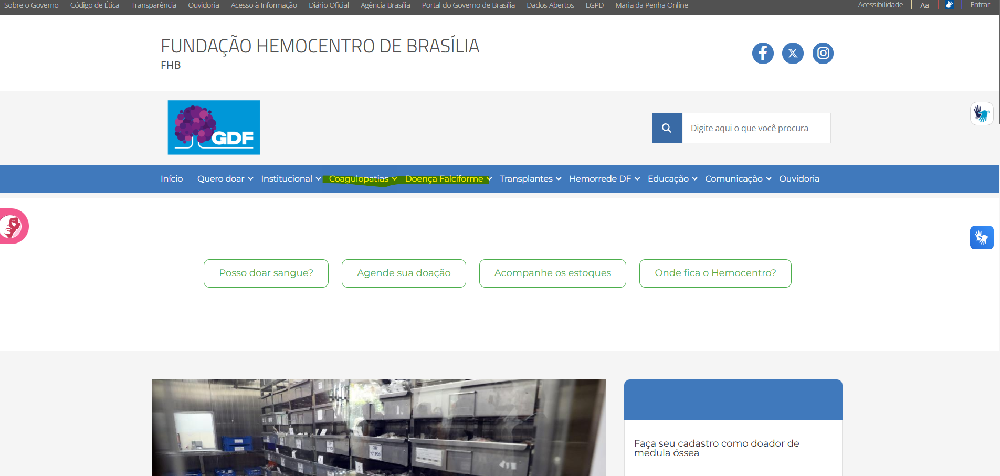
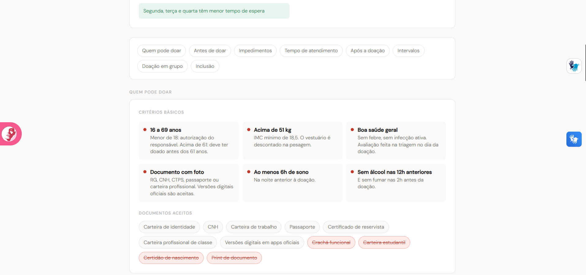
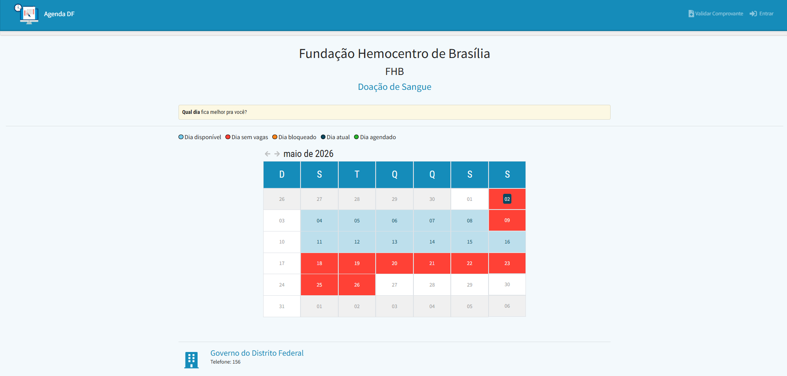
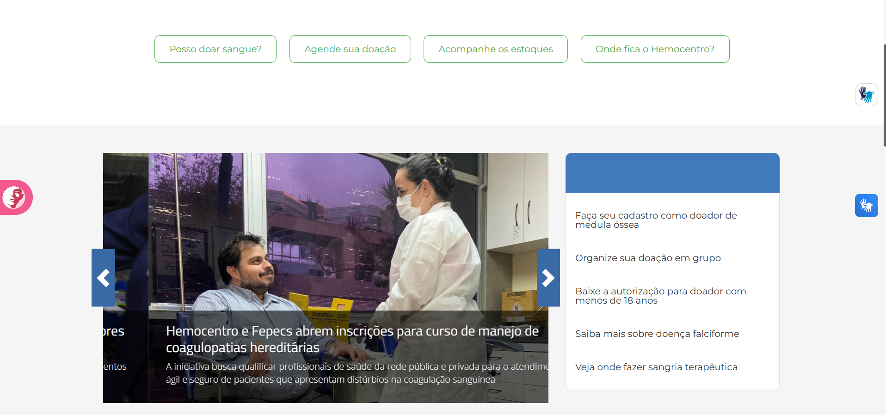
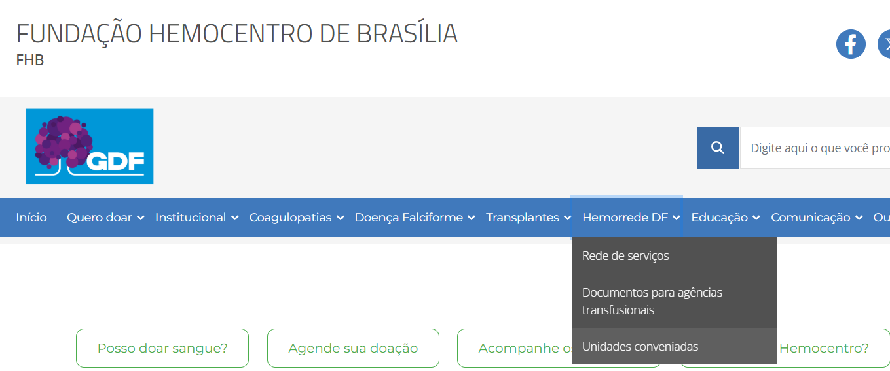
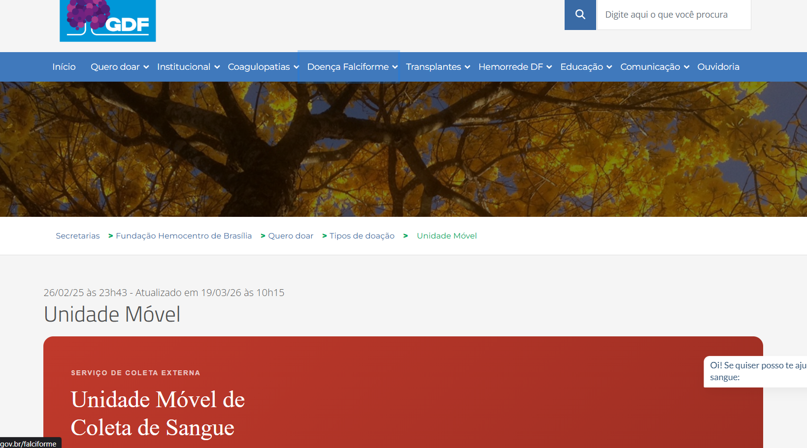
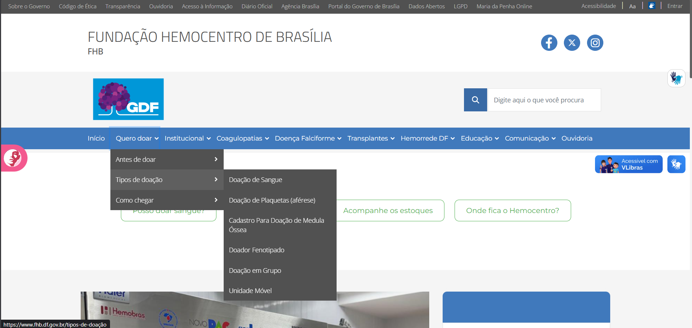
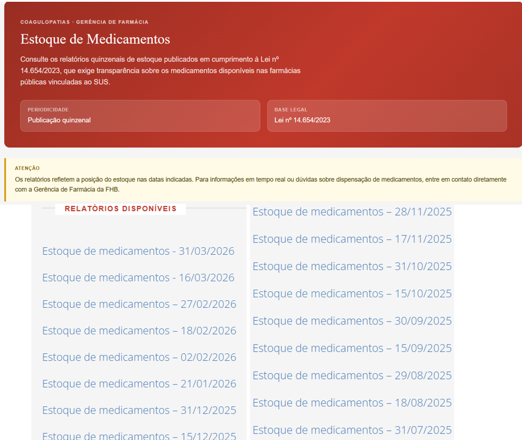

# Princípios Gerais de Projeto

## 1. Introdução
A avaliação da qualidade de uso de um sistema interativo exige o embasamento em diretrizes consolidadas pela Engenharia de Software e pela literatura de Interação Humano-Computador (IHC). Os Princípios Gerais de Projeto atuam como regras de alto nível que orientam o design de interfaces, garantindo que o sistema seja compreensível, eficiente e tolerante a erros. 

Neste documento, analisamos o atual portal web da Fundação Hemocentro de Brasília (FHB)[²](#ref2) sob a ótica dos Princípios Gerais de Projeto definidos por Barbosa *et al.* (2021)[¹](#ref1). O objetivo desta inspeção é identificar violações de usabilidade na interface atual, documentando as falhas através de capturas de tela e propondo sugestões arquiteturais para o novo sistema.

## 2. Metodologia
A avaliação foi conduzida de forma conjunta pela equipe (Pedro Ian e Gabriel Diniz) por meio do método de Inspeção baseada em Diretrizes. Inspecionamos o portal da FHB[²](#ref2) tendo como lente os 9 Princípios Gerais de Projeto propostos na literatura base [¹](#ref1). 

Para cada princípio, a estrutura de documentação segue o formato:

*   **Definição:** Base teórica do princípio extraída da literatura.
*   **Violação no Sistema Atual:** Captura de tela do site demonstrando a quebra da diretriz.
*   **Análise:** Explicação do impacto negativo da interface atual no usuário.
*   **Sugestão de Melhoria:** Como a nova interface proposta resolverá este problema.

---

## 3. Avaliação dos Princípios

### 3.1. Correspondência com as expectativas dos usuários

*   **Definição:** O design deve explorar os mapeamentos naturais entre variáveis mentais e físicas, garantindo que os usuários consigam determinar facilmente os relacionamentos entre suas intenções e as ações possíveis [¹](#ref1). O sistema deve utilizar o idioma do usuário (palavras e conceitos familiares) em vez de termos orientados ao sistema ou jargões técnicos.

*   **Violação no Sistema Atual:**

  
  
<em>Figura 1: Uso de termos médicos complexos no menu de navegação principal. (Fonte: <a href="https://fhb.df.gov.br/" target="_blank">Portal FHB - Página Inicial</a>, 2026).</em>

*   **Análise:** Logo na página inicial, o menu de navegação principal apresenta links com nomenclaturas altamente técnicas e médicas, como "Coagulopatias" e "Hemorrede DF"[²](#ref2). Para um usuário leigo, como a persona do Antiusuário estabelecida no projeto, esses termos não possuem significado claro, quebrando a expectativa e dificultando a localização de serviços por falta de uma linguagem cidadã.
*   **Sugestão de Melhoria:** Reorganizar a arquitetura de informação agrupando termos técnicos sob menus mais amigáveis e descritivos, como "Doenças Tratadas" (onde Coagulopatias e Doença Falciforme entrariam como subtópicos acompanhados de breves explicações). A interface deve sempre priorizar o vocabulário do dia a dia do usuário.

### 3.2. Simplicidade nas estruturas das tarefas

*   **Definição:** Refere-se à necessidade de simplificar a estrutura das tarefas, reduzindo a quantidade de planejamento e resolução de problemas que elas exigem do usuário, muitas vezes reestruturando tarefas desnecessariamente complexas com inovações tecnológicas [¹](#ref1).
*   **Violação no Sistema Atual:**

  
  
<em>Figura 2: Apresentação de regras estáticas que exigem avaliação manual do usuário. (Fonte: <a href="https://fhb.df.gov.br/doacao-de-sangue/" target="_blank">Portal FHB - Doação de Sangue</a>, 2026).</em>

*   **Análise:** Embora a interface tente organizar visualmente os "Critérios Básicos" em cards, a estrutura da tarefa "Descobrir se estou apto a doar" continua complexa e manual[²](#ref2). O sistema transfere a carga de processamento para o usuário, que precisa ler todas as regras, exceções e impedimentos da página inteira e cruzar essas informações mentalmente com o seu histórico de saúde recente. Essa falta de automação exige um esforço cognitivo desnecessário.
*   **Sugestão de Melhoria:** Modificar a natureza da apresentação da tarefa. Em vez de disponibilizar as regras de forma estática para o cidadão ler e se autoavaliar, a nova proposta implementa uma "Pré-triagem" interativa. Através de um questionário guiado passo a passo, o sistema automatiza o cruzamento de dados e informa diretamente se o usuário está apto, simplificando drasticamente a resolução do problema.

### 3.3. Equilíbrio entre controle e liberdade do usuário

*   **Definição:** Consiste em manter o usuário "no comando" da interface para que ele ganhe sentimento de maestria, mas equilibrando essa liberdade com limites para que ele não se sinta perdido. Deve-se sempre fornecer uma "saída de emergência" [¹](#ref1).
*   **Violação no Sistema Atual:**

  
  
<em>Figura 3: Fluxo de agendamento sem botões de saída ou cancelamento visíveis. (Fonte: <a href="https://agenda.df.gov.br/servico.html?servico=37982305" target="_blank">Portal Agenda DF</a>, 2026).</em>

*   **Análise:** Ao ser redirecionado para o sistema de agendamento de doação (Agenda DF), o usuário é colocado em uma tela de calendário que restringe totalmente a sua navegação. Não há menu principal, botões de "Voltar", "Cancelar" ou qualquer "saída de emergência" clara na interface para que ele retorne ao portal do Hemocentro caso tenha dúvidas ou desista da ação[²](#ref2). O usuário perde o controle e é forçado a utilizar o botão de voltar do próprio navegador web.
*   **Sugestão de Melhoria:** A interface deve fornecer mecanismos explícitos e integrados para cancelar e desfazer ações a qualquer momento. A sugestão de design para o novo sistema é incluir *breadcrumbs* (migalhas de pão) no cabeçalho indicando o caminho percorrido, além de um botão claro de "Cancelar e voltar ao início" logo abaixo ou ao lado das opções do calendário, devolvendo o controle ao cidadão.

### 3.4. Consistência e padronização

*   **Definição:** Assegurar que a interface seja consistente com o modelo conceitual e com as expectativas do usuário, garantindo que palavras, situações ou ações relacionadas funcionem da mesma forma [¹](#ref1).
*   **Violação no Sistema Atual:**

  
  
<em>Figura 4: Inconsistência visual na sinalização de elementos interativos na mesma tela. (Fonte: <a href="https://fhb.df.gov.br/" target="_blank">Portal FHB</a>, 2026).</em>

*   **Análise:** Na mesma página inicial, o sistema apresenta duas formas completamente diferentes e inconsistentes para ações de navegação com pesos similares. No topo, existem botões com contorno verde claro sinalizando interatividade. Contudo, no menu lateral direito, links vitais como "Faça seu cadastro como doador de medula óssea" são apresentados como texto simples, sem nenhuma *affordance* visual (como cor diferenciada, sublinhado ou ícones). A interatividade só é revelada no *hover* (ao passar o mouse), prejudicando a padronização e forçando o usuário, especialmente em dispositivos móveis, a adivinhar o que é clicável[²](#ref2).
*   **Sugestão de Melhoria:** Criar e aplicar um Guia de Estilos rigoroso para elementos interativos. Se uma informação é um link, ela deve possuir dicas visuais universais que convidem à ação antes mesmo de qualquer interação do usuário (ex: cor primária do sistema, sublinhado ao passar o olho ou um ícone de "seta" ou "chevron" ao lado). Ações de mesma hierarquia e propósito devem ter a mesma "cara" em todo o portal.

### 3.5. Promoção da eficiência do usuário

*   **Definição:** O sistema deve considerar sempre a eficiência do usuário em primeiro lugar, não o deixando esperar à toa e protegendo o seu trabalho. Para usuários experientes e frequentes, o sistema deve oferecer "atalhos" e "aceleradores" que permitam uma interação mais rápida e direta, reduzindo o número de interações para operações rotineiras[¹](#ref1)
*   **Violação no Sistema Atual:** 

  
  
<em>Figura 5: Falta de atalho ou aceleradores para tarefas rotineiras de funcionários. (Fonte: <a href="https://fhb.df.gov.br/" target="_blank">Portal FHB</a>, 2026).</em>

*   **Análise:** O portal atual da FHB foca quase integralmente no cidadão/doador e falha em prover eficiência para os profissionais de saúde (usuários especialistas). Uma enfermeira que precisa notificar uma reação transfusional perde um tempo precioso, pois o sistema não oferece aceleradores ou atalhos diretos para suas tarefas rotineiras. Ela é obrigada a passar por múltiplos níveis de navegação na interface pública para encontrar as ferramentas de trabalho [²].
*   **Sugestão de Melhoria:** Criar um painel de acesso rápido (atalhos) na tela inicial exclusivo para os usuários logados como profissionais de saúde, permitindo que acessem os formulários de notificação e áreas de intercorrência com apenas um clique.

### 3.6. Antecipação das necessidades do usuário

*   **Definição:** O software deve tomar a iniciativa de prever o que o usuário quer e precisa em cada passo da interação. Em vez de exigir que o usuário tome um sem-número de decisões ou realize buscas exaustivas para seguir em frente, o sistema deve fornecer informações úteis complementares de imediato e trazer opções pré-preenchidas com valores padrão inteligentes (*defaults*) [¹](#ref1)
*   **Violação no Sistema Atual:**

  
  
<em>Figura 6: Omissão da localização imediata da Unidade Móvel, exigindo busca ativa do usuário. (Fonte: <a href="https://fhb.df.gov.br/" target="_blank">Portal FHB</a>, 2026).</em>

*   **Análise:** Ao acessar a página da "Unidade Móvel" (via menu *Quero doar > Tipos de doação*), a necessidade primária e mais previsível do cidadão é descobrir onde o ônibus de coleta de sangue está estacionado no dia de hoje. Contudo, o portal falha em antecipar essa necessidade óbvia, fornecendo apenas textos institucionais estáticos sobre o que é o serviço. Para descobrir a localização atual, o usuário é forçado a ir para a página de agendamento.
*   **Sugestão de Melhoria:** Implementar um banner dinâmico de aviso ou um mapa interativo no topo da página da Unidade Móvel. O sistema deve cruzar a data de acesso do usuário com a agenda do Hemocentro e exibir proativamente uma mensagem de destaque (ex: *"Hoje, 02/05, nossa Unidade Móvel está em: [Local/Endereço]"*). Antecipar essa informação elimina cliques adicionais, poupa o tempo do doador e atende diretamente à sua principal motivação de acesso à página.

### 3.7. Visibilidade e reconhecimento

*   **Definição:** O estado do sistema e as opções disponíveis devem estar sempre perceptíveis. O sistema não deve forçar o usuário a sobrecarregar a memória tentando lembrar de um código ou de um caminho que estava oculto na tela anterior. O usuário tem que ser capaz de bater o olho e reconhecer de imediato o que pode ser feito ali [¹](#ref1).
*   **Violação no Sistema Atual:** 
  

  
  
<em>Figura 7: Opções de navegação ocultas em múltiplos níveis hierárquicos do menu principal. (Fonte: <a href="https://fhb.df.gov.br/" target="_blank">Portal FHB</a>, 2026).</em>

*   **Análise:** No portal da FHB, o agrupamento de dezenas de serviços em menus suspensos com múltiplos níveis de profundidade (como "Quero doar" > "Tipos de doação" > "Unidade Móvel") fere frontalmente o princípio da visibilidade. O usuário não consegue bater o olho na página inicial e reconhecer a arquitetura de informação do site. A interface oculta sistematicamente as opções até que o usuário interaja fisicamente com cada aba para abri-la, exigindo que ele memorize onde cada funcionalidade está escondida e forçando uma navegação labiríntica baseada em tentativa e erro [²].
*   **Sugestão de Melhoria:** Eliminar a ocultação excessiva expondo as opções de forma clara. A recomendação é adotar um layout de "Megamenu Expandido", no qual passar o mouse sobre uma aba principal abre um painel amplo que exibe simultaneamente todas as subcategorias e links daquela seção. Assim, a interface substitui a necessidade de memorização pelo reconhecimento visual imediato de toda a árvore de navegação [¹](#ref1).

### 3.8. Conteúdo relevante e expressão adequada

*   **Definição:** Relaciona-se diretamente com o projeto estético e minimalista ("menos é mais") e com a clareza da comunicação. A interface não deve conter informações irrelevantes ou raramente necessárias que compitam pela atenção do usuário com a unidade de informação que realmente importa para a tarefa. Além disso, os rótulos, mensagens e instruções do sistema devem ser claros, precisos e ir diretos ao ponto, caracterizando a expressão adequada [¹](#ref1).
*   **Violação no Sistema Atual:**

  
  
<em>Figura 8: Excesso de links para relatórios históricos poluindo a interface e instruções que transferem o esforço da tarefa para o usuário. (Fonte: <a href="https://fhb.df.gov.br/" target="_blank">Portal FHB</a>, 2026).</em>

*   **Análise:** Na página "Estoque de Medicamentos", o portal afirma textualmente que a publicação dos dados possui "Periodicidade quinzenal" [²]. Contudo, o relatório mais recente é de 31/03/2026, indicando falha na expressão adequada por fornecer uma promessa imprecisa [²]. Pior ainda, o sistema exibe um aviso de "Atenção" informando que, para saber o estoque em tempo real, o usuário deve entrar em contato diretamente com a Gerência de Farmácia [²]. Ao mesmo tempo, o site polui visualmente a tela exibindo dezenas de links para relatórios antigos de anos anteriores [²]. O sistema falha gravemente no princípio do "conteúdo relevante": ele sonega a informação crítica atualizada, oferece um inventário histórico que é raramente necessário para um paciente com urgência, e transfere todo o esforço de buscar a informação real para fora do sistema (via telefone) [¹](#ref1).
*   **Sugestão de Melhoria:** Aplicar rigorosamente o princípio de que "menos é mais" através da ocultação progressiva de informações secundárias [¹](#ref1). A interface deve agrupar e ocultar os relatórios antigos dentro de um menu expansível (como um componente *accordion*), limpando a tela principal. Além disso, para garantir a "expressão adequada" e a relevância, o sistema deve ser integrado ao banco de dados da farmácia para exibir dinamicamente o status do estoque em tempo real na própria página, eliminando o aviso que obriga o usuário a ligar para o Hemocentro e cumprindo de fato a função do serviço digital.

### 3.9. Projeto para erros

*   **Definição:** O designer deve assumir que qualquer erro potencial de fato será cometido pelo usuário. Portanto, a interface deve, em primeiro lugar, tentar evitar ou prevenir que os erros ocorram (prevenção ativa). Quando o erro for inevitável, o sistema deve ajudar o usuário a reconhecê-lo através de uma mensagem simples e fornecer meios construtivos para se recuperar dele [¹](#ref1).
*   **Violação no Sistema Atual:**

  
  
<em>Figura 9: Falha na prevenção ativa de erros permitindo a execução de uma busca por caracteres em branco. (Fonte: <a href="https://fhb.df.gov.br/" target="_blank">Portal FHB</a>, 2026).</em>

*   **Análise:** No portal da FHB, a barra de busca geral carece de mecanismos de "prevenção ativa" contra comandos inúteis. O sistema permite que o usuário digite múltiplos espaços em branco no campo de pesquisa e acione o comando de busca livremente [²]. O sistema não filtra a entrada inválida (não realiza um *trim* para remover os espaços) e falha em prevenir a ação equivocada, permitindo que o usuário execute um comando que leva a um processamento desnecessário no servidor e resulta em uma tela de resultados vazia [²]. O design não protege o usuário do seu próprio erro.
*   **Sugestão de Melhoria:** Implementar mecanismos de prevenção ativa (PA) diretamente na barra de pesquisa. O ícone de lupa e a submissão via teclado (Enter) devem permanecer desabilitados (visualmente inativos/cinzas) enquanto o campo estiver completamente vazio ou preenchido apenas com espaços em branco [¹](#ref1). Além disso, se uma busca real não retornar resultados, a página não deve ficar vazia; o sistema deve oferecer opções de recuperação, como sugestões de termos semelhantes ou links rápidos para os serviços mais acessados.

---

## Referências Bibliográficas

> BARBOSA, Simone Diniz Junqueira *et al*. **Interação Humano-Computador e Experiência do Usuário**. Autopublicação, 2021.

> FUNDAÇÃO HEMOCENTRO DE BRASÍLIA (FHB). **Portal Oficial**. Brasília, DF. Disponível em: <https://fhb.df.gov.br/>. Acesso em: 02 mai. 2026.

## Histórico de Versões

| Versão | Descrição | Data | Autor(es) | Data de revisão | Revisor(es) |
| :---: | :--- | :---: | :---: | :---: | :---: |
| 1.0 | Avaliação dos 9 Princípios Gerais de Projeto | 02/05/2026 | [Pedro Ian](https://github.com/pedroiaan) | 02/05/2026 | [Gabriel Diniz](https://github.com/GabrielDiniz12) |
| 1.1 | Finalização da avaliação dos 9 Princípios Gerais de Projeto | 02/05/2026 | [Gabriel Diniz](https://github.com/GabrielDiniz12) | 03/05/2026 | [Pedro Ian](https://github.com/pedroiaan) |