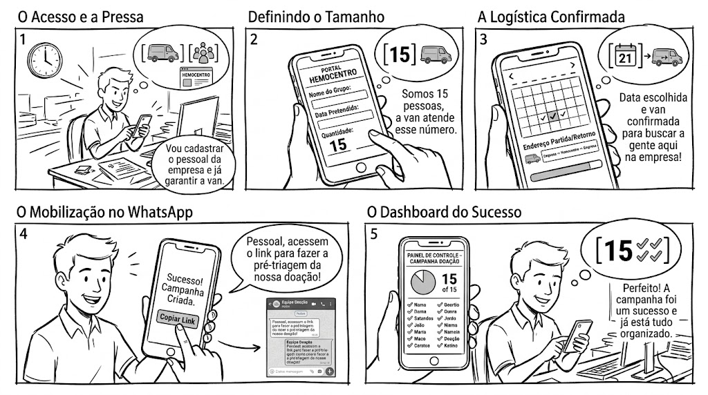
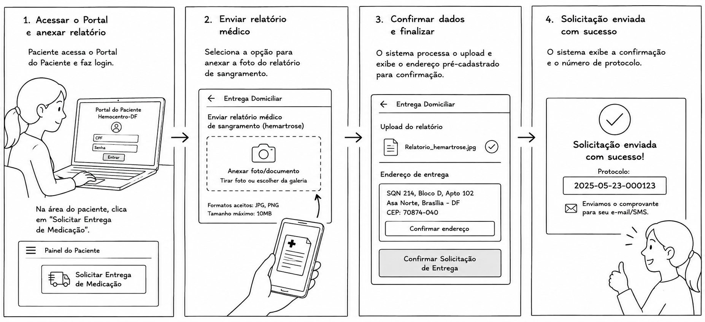
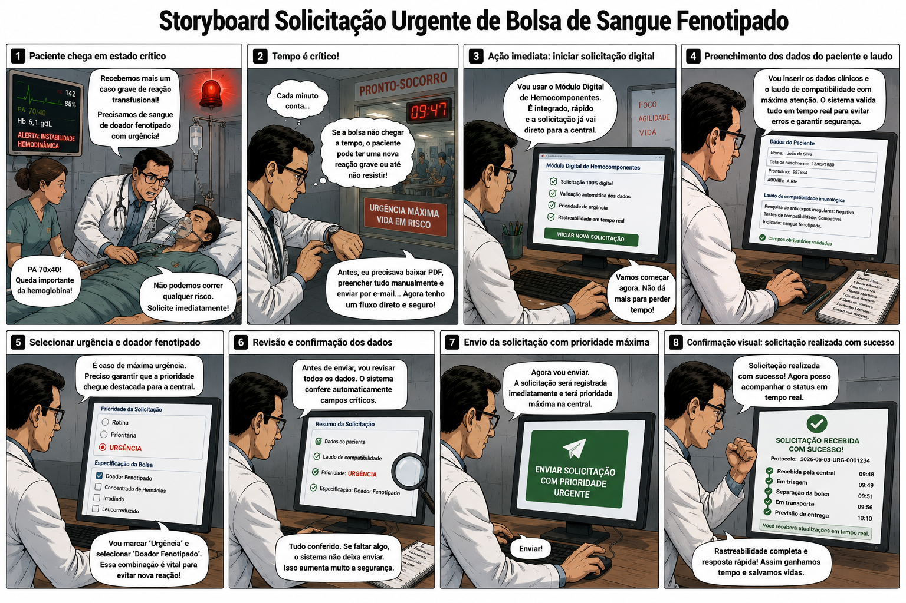
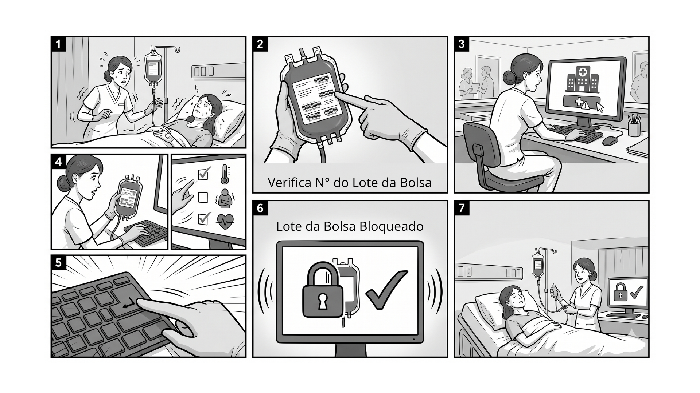
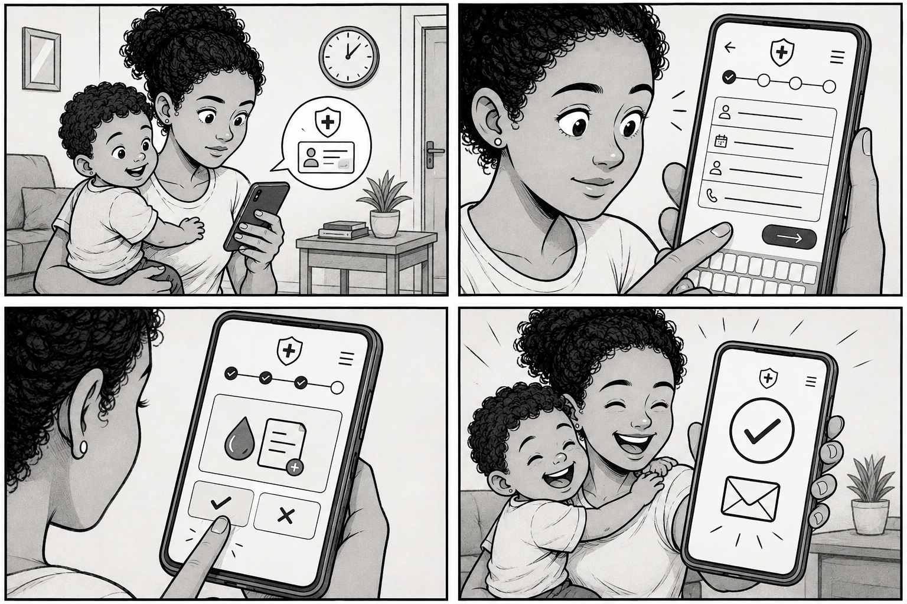
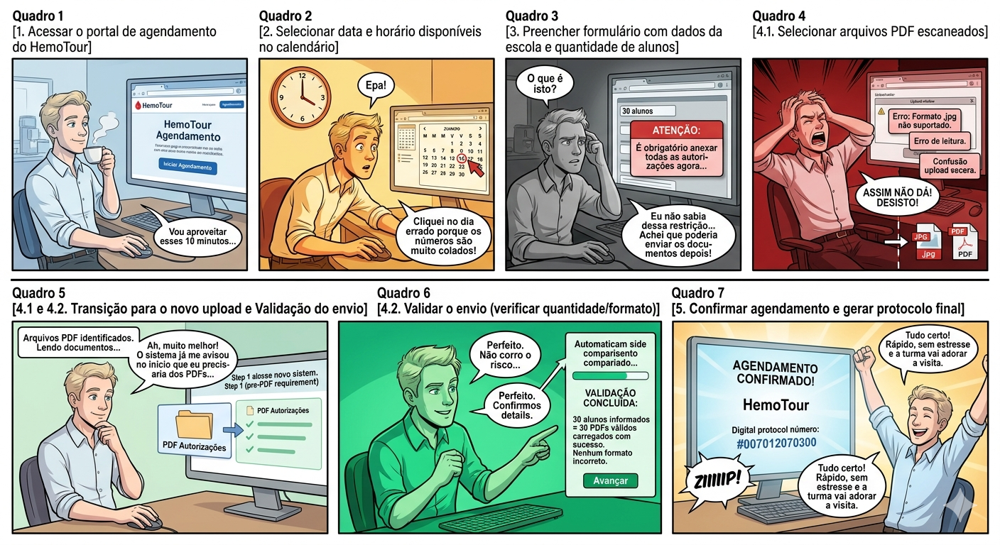
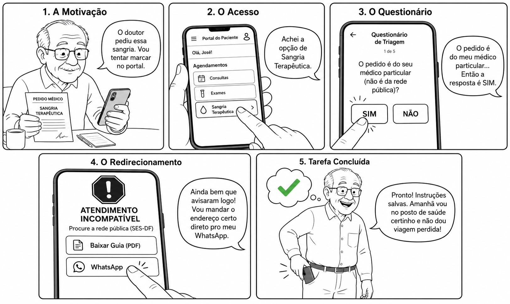

## Introdução

Esse artefato mostra os storyboards utilizados durante a avaliação, pela sua respectiva funcionalidade.

## Funcionalidade 1 - Agendamento em Grupo

  
<strong>Figura 1</strong> - Funcionalidade de Agendamento em Grupo

  
  

  
Fonte: <a href="#ref1" style="color: red; text-decoration: none;">Gerada por IA</a> (2026).

## Funcionalidade 2 - Solicitar dispensação domiciliar de medicação

  
<strong>Figura 2</strong> - Solicitar dispensação domiciliar de medicação

  
  

  
Fonte: <a href="#ref1" style="color: red; text-decoration: none;">Gerada por IA</a> (2026).

## Funcionalidade 3 - Solicitar Sangue Fenotipado

  
<strong>Figura 3</strong> - Solicitar Sangue Fenotipado

  
  

  
Fonte: <a href="#ref1" style="color: red; text-decoration: none;">Gerada por IA</a> (2026).

## Funcionalidade 4 - Notificar Reação Transfunsional

  
<strong>Figura 4</strong> - Notificar Reação Transfunsional

  
  

  
Fonte: <a href="#ref1" style="color: red; text-decoration: none;">Gerada por IA</a> (2026).

## Funcionalidade 5 - Emitir a Carteirinha de Identificação

  
<strong>Figura 5</strong> - Funcionalidade de Emitir a Carteirinha de Identificação

  
  

  
Fonte: <a href="#ref1" style="color: red; text-decoration: none;">Gerada por IA</a> (2026).

## Funcionalidade 6 - Agendamento do HemoTour

  
<strong>Figura 6</strong> - Funcionalidade de Agendamento do HemoTour

  
  

  
Fonte: <a href="#ref1" style="color: red; text-decoration: none;">Gerada por IA</a> (2026).

## Funcionalidade 7 - Triagem Digital (Sangria Terapêutica)

  
<strong>Figura 7</strong> - Funcionalidade da Triagem Digital (Sangria Terapêutica)

  
  

  
Fonte: <a href="#ref1" style="color: red; text-decoration: none;">Gerada por IA</a> (2026).

## Referências

>  [1] OPENAI. ChatGPT. Versão 3.5. São Francisco, Califórnia, 2026. Inteligência Artificial. Disponível em: <https://chatgpt.com/>. Acesso em: 20 maio. 2026.

## Histórico de Versão

| Versão | Descrição | Data | Autor(es) | Data de revisão | Revisor(es) |
| :---: | :--- | :---: | :---: | :---: | :---: |
| 1.0 | Storyboards 1 - Esquecemos de adicionar o artefato no repositório | 31/05/2026 | [Pedro Américo](https://github.com/dev-americo) | 31/05/2026 | [Julia Gabriella](https://github.com/juliagabriellafs) |
| 1.1 | Storyboards 4 | 31/05/2026 | [Gabriel Diniz](https://github.com/GabrielDiniz12) | 31/05/2026 | [Pedro Américo](https://github.com/dev-americo) |
| 1.2 | Adição do Storyboards 5 | 31/05/2026 | [Julia Gabriella](https://github.com/juliagabriellafs) | 31/05/2026 | [Breno Teixeira](https://github.com/BrenoLTeixeira) |
| 1.3 | Storyboards 6 | 31/05/2026 | [Lucas Oliveira](https://github.com/dev-LucasDpaula) | 31/05/2026 | [Pedro Ian](https://github.com/pedroiaan) |
| 1.4 | Storyboards 2 | 31/05/2026 | [Breno Teixeira](https://github.com/BrenoLTeixeira) | 31/05/2026 | [Pedro Lucas](https://github.com/Pwdrinho) |
| 1.5 | Storyboards 3 | 31/05/2026 | [Pedro Lucas](https://github.com/Pwdrinho) | 31/05/2026 | [Lucas Oliveira](https://github.com/dev-LucasDpaula) |
| 1.6 | Storyboards 7 | 31/05/2026 | [Pedro Ian](https://github.com/pedroiaan) | 31/05/2026 | [Gabriel Diniz](https://github.com/GabrielDiniz12) |
| 1.7 | Atualização Storyboards 5 pós reprojeto do relato | 27/06/2026 | [Julia Gabriella](https://github.com/juliagabriellafs) | 27/06/2026 | [Gabriel Diniz](https://github.com/GabrielDiniz12) |