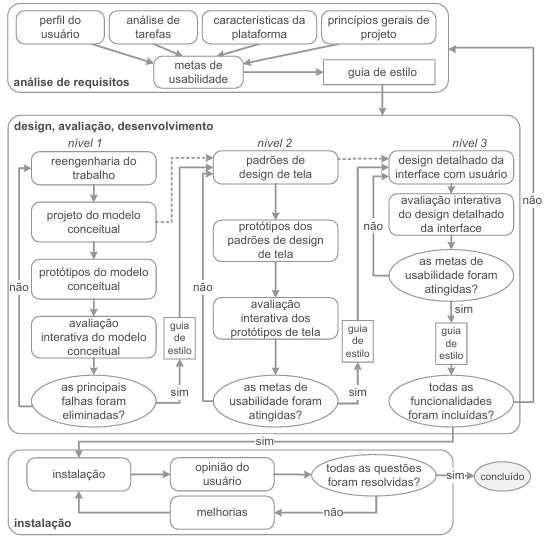

# O Ciclo de Vida Utilizado no Projeto e a Justificativa da Escolha

## 1. O Ciclo de Vida de Mayhew

A Engenharia de Usabilidade de Mayhew, proposta por Deborah Mayhew (1999), oferece uma visão holística e estruturada do processo de design em IHC, organizando suas atividades em três fases principais que orientam de forma rigorosa a concepção de uma solução interativa: a **Análise de Requisitos**, que define as metas de usabilidade do sistema; o ciclo de **Design, Avaliação e Desenvolvimento**, que conduz a concepção da solução por níveis iterativos de refinamento e prototipação; e a **Instalação**, etapa responsável por coletar o feedback dos usuários após o uso real do sistema, servindo de base para melhorias contínuas.

  
<strong>Figura 1 - Atividades do Modelo de Ciclo de Vida de Mayhew</strong>

  
  

  
Fonte: <a href="#ref1">BARBOSA e SILVA, 2011, p.106.¹</a> (2011).

## 2. Justificativa da Escolha do Modelo

A Engenharia de Usabilidade de Mayhew foi a metodologia escolhida para guiar a análise e o aprimoramento do site do Hemocentro devido à sua abordagem estruturada e ao alto nível de detalhamento de suas fases, características que reduzem a subjetividade no processo de design. Tratando-se de um sistema voltado para a saúde pública, onde falhas de comunicação ou fluxos de interface confusos podem desmotivar doadores, a adoção de um roteiro seguro e iterativo é indispensável.

Além disso, por se tratar de uma plataforma que já está em produção, o modelo de Mayhew permitiu à equipe uma aplicação prática e estratégica. O processo de avaliação foi iniciado a partir da perspectiva da fase de **Instalação**, que consistiu em analisar o feedback e as opiniões dos usuários diante da experiência de uso do sistema atual. A partir do diagnóstico desses dados reais para identificar pontos de melhoria, o processo retrocedeu para a fase de **Análise de Requisitos**. Essa dinâmica viabilizou a estruturação de mudanças mais assertivas, que passaram por um **ciclo iterativo**, com avaliações diversas — formativas e somativas — de refinamento e validação ao longo dos níveis de prototipação, assegurando que o aprimoramento das interfaces atendesse de fato às necessidades dos doadores.

### Referências Bibliográficas

> [1] BARBOSA, Simone Diniz Junqueira et al. *Interação Humano-Computador e Experiência do Usuário*. 1. ed. Rio de Janeiro: Autopublicação, 2021.

---

## Histórico de Versões 

| Versão | Descrição | Data | Autor(es) | Data de revisão | Revisor(es) |
| :---: | :--- | :---: | :---: | :---: | :---: |
| 1.0 | Criação do documento de Ciclo de Vida | 30/06/2026 | [Júlia Gabriella](https://github.com/juliagabriellafs) | 30/06/2026 | [Pedro Lucas](https://github.com/Pwdrinho) |