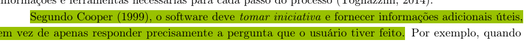
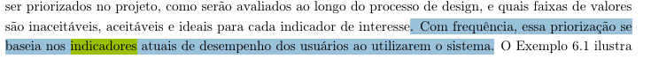
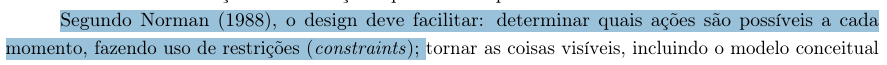
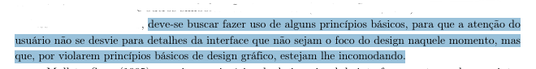
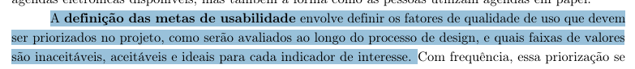
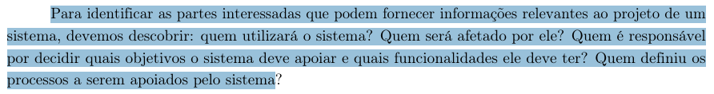
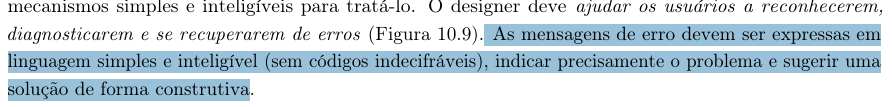

# Verificação da Entrega 3

## Introdução

A verificação de uma entrega é fundamental no desenvolvimento de um projeto, nesse momento que os artefatos criados são analisados para verificar se atendem aos requisitos especificados. Dessa forma, este documento detalha o planejamento e o relato da verificação dos artefatos desenvolvidos pelo [Grupo 4](../../index.md) na Etapa 3.

## Objetivo

Este documento tem como objetivo verificar se os artefatos desenvolvidos na Etapa 3 pelo [Grupo 4](../../index.md) estão em conformidade aos padrões esperados.

## Metodologia

A metodologia selecionada para esta verificação é a inspeção. Fundamentada na técnica proposta por Michael Fagan (IBM, 1976), esta análise formal visa a detecção precoce de defeitos nos artefatos. O procedimento estrutura-se no uso de checklists que contemplam os erros mais frequentes, permitindo a detecção, análise e categorização rigorosa de inconsistências. Conforme as boas práticas da técnica, a revisão é realizada por pares, garantindo que o autor não seja o revisor do próprio trabalho. Como produto final, os resultados serão consolidados e apresentados por meio de gráficos quantitativos.

## Participantes e Artefatos

Os artefatos analisados e os seus respectivos responsáveis por sua verificação estão descritos na tabela abaixo.

<b>Tabela 1</b> - Artefatos analisados e Participantes Responsáveis 

| Artefato | Responsável |
| --- | --- |
| Guia de Estilo | [Breno Teixeira](https://github.com/BrenoLTeixeira), [Gabriel Diniz](https://github.com/GabrielDiniz12), [Julia Gabriella](https://github.com/juliagabriellafs), [Lucas Oliveira](https://github.com/dev-LucasDpaula), [Pedro Américo](https://github.com/dev-americo), [Pedro Ian](https://github.com/pedroiaan), [Pedro Lucas](https://github.com/Pwdrinho) |
| Características Gerais | [Breno Teixeira](https://github.com/BrenoLTeixeira), [Gabriel Diniz](https://github.com/GabrielDiniz12), [Julia Gabriella](https://github.com/juliagabriellafs), [Lucas Oliveira](https://github.com/dev-LucasDpaula), [Pedro Américo](https://github.com/dev-americo), [Pedro Ian](https://github.com/pedroiaan), [Pedro Lucas](https://github.com/Pwdrinho) |
| Princípios Gerais | [Breno Teixeira](https://github.com/BrenoLTeixeira), [Gabriel Diniz](https://github.com/GabrielDiniz12), [Julia Gabriella](https://github.com/juliagabriellafs), [Lucas Oliveira](https://github.com/dev-LucasDpaula), [Pedro Américo](https://github.com/dev-americo), [Pedro Ian](https://github.com/pedroiaan), [Pedro Lucas](https://github.com/Pwdrinho) |
| Metas de Usabilidade | [Breno Teixeira](https://github.com/BrenoLTeixeira), [Gabriel Diniz](https://github.com/GabrielDiniz12), [Julia Gabriella](https://github.com/juliagabriellafs), [Lucas Oliveira](https://github.com/dev-LucasDpaula), [Pedro Américo](https://github.com/dev-americo), [Pedro Ian](https://github.com/pedroiaan), [Pedro Lucas](https://github.com/Pwdrinho) |

Autor: [Breno Teixeira](https://github.com/BrenoLTeixeira), 2026

## Cronograma

A verificação foi realizada no dia 14/05/2026, a tabela 2 a seguir apresenta o cronograma da verificação de cada item.

<b>Tabela 2</b> - Cronograma de avaliação dos Artefatos

| Artefato | Data |
| --- | --- |
| Itens Gerais | 14/05/2026 |
| Guia de Estilo | 14/05/2026 |
| Características Gerais | 14/05/2026 |
| Princípios Gerais | 14/05/2026 |
| Metas de Usabilidade | 14/05/2026 |

Autor: [Breno Teixeira](https://github.com/BrenoLTeixeira), 2026

## Itens da avaliação de produção do Grupo

Seguindo o princípio "quanto mais itens melhor", cada membro do grupo desenvolveu itens de verificação para que a avaliação seja o mais completa possível, essa seção trata da comprovação de que cada item tem um fundamento de exigência.

### Item 01

Este item foi desenvolvido por [Julia Gabriella](https://github.com/juliagabriellafs).

**Item:** O software toma iniciativa para fornecer informações adicionais úteis (princípio da antecipação) ao usuário?

  
<strong>Figura 1</strong> - Comprovação do Item 01

  
  

  
Fonte: <a href="#1">(Barbosa et al., 2021, p. 227)</a>

### Item 02

Este item foi desenvolvido por [Pedro Ian](https://github.com/pedroiaan).

**Item:** Foram definidos indicadores de IHC (métricas de inspeção) que permitam avaliar as metas sem necessariamente recrutar participantes externos nesta fase?

  
<strong>Figura 2</strong> - Comprovação do Item 02

  
  

  
Fonte: <a href="#1">(Barbosa et al., 2021, p. 103)</a>

### Item 03

Este item foi desenvolvido por [Pedro Américo](https://github.com/dev-americo).

**Item:** O sistema faz uso de restrições (constraints) para impedir que o usuário realize ações inválidas acidentalmente?

  
<strong>Figura 3</strong> - Comprovação do Item 03

  
  

  
Fonte: <a href="#1">(Barbosa et al., 2021, p. 222)</a>

### Item 04

Este item foi desenvolvido por [Breno Teixeira](https://github.com/BrenoLTeixeira).

**Item:** O guia define o Layout (grids e proporção) para que a atenção do usuário não se desvie por violações de design gráfico?

  
<strong>Figura 4</strong> - Comprovação do Item 04

  
  

  
Fonte: <a href="#1">(Barbosa et al., 2021, p. 231)</a>

### Item 05

Este item foi desenvolvido por [Pedro Lucas](https://github.com/Pwdrinho).

**Item:** Foram estabelecidas as faixas de valores (inaceitável, aceitável e ideal) para cada indicador de meta de usabilidade?

  
<strong>Figura 5</strong> - Comprovação do Item 05

  
  

  
Fonte: <a href="#1">(Barbosa et al., 2021, p. 103)</a>

### Item 06

Este item foi desenvolvido por [Gabriel Diniz](https://github.com/GabrielDiniz12).

**Item:** As funcionalidades da plataforma estão detalhadas no documento?

  
<strong>Figura 6</strong> - Comprovação do Item 06

  
  

  
Fonte: <a href="#1">(Barbosa et al., 2021, p. 124)</a>

### Item 07

Este item foi desenvolvido por [Lucas Oliveira](https://github.com/dev-LucasDpaula).

**Item:** As mensagens de erro sugerem uma solução de forma construtiva em vez de apenas criticar a ação do usuário?

  
<strong>Figura 7</strong> - Comprovação do Item 07

  
  

  
Fonte: <a href="#1">(Barbosa et al., 2021, p. 231)</a>

## Lista de Verificação de Itens Gerais

| Item | Avaliação | Observação | Avaliador(es) |
| :------------------------------------------------------------------------------------- | :----------: | :-------------------------------------------: | :--------------: |
| **_01:_** O artefato apresenta uma bibliografia/referência bibliográfica? | Conforme |  | [Breno Teixeira](https://github.com/BrenoLTeixeira) |
| **_02:_** O artefato apresenta um histórico de versões com id, item das versões, autores e revisores? | Conforme |  | [Gabriel Diniz](https://github.com/GabrielDiniz12) |
| **_03:_** As tabelas e imagens apresentam legenda e fonte? | Conforme |  | [Julia Gabriella](https://github.com/juliagabriellafs) |
| **_04:_** O artefato apresenta uma introdução? | Conforme |  | [Lucas Oliveira](https://github.com/dev-LucasDpaula) |
| **_05:_** A linguagem utilizada é formal e adequada ao contexto técnico/acadêmico? | Conforme |  | [Pedro Américo](https://github.com/dev-americo) |
| **_06:_** Há coerência entre o conteúdo textual e os artefatos gráficos (tabelas, imagens, fluxogramas)? | Conforme |  | [Pedro Ian](https://github.com/pedroiaan) |
| **_07:_** A gravação da reunião do grupo foi disponibilizada? | Conforme |  | [Pedro Lucas](https://github.com/Pwdrinho) |

Autor: <a href="https://github.com/BrenoLTeixeira">Breno Teixeira</a>

## Guia de Estilo

| Item | Avaliação | Observação | Avaliador(es) |
| :------------------------------------------------------------------------------------- | :----------: | :-------------------------------------------: | :--------------: |
| **_01:_** Existe um tópico de introdução com objetivo e público-alvo? | Conforme |  | [Breno Teixeira](https://github.com/BrenoLTeixeira) |
| **_02:_** O guia define o Layout (grids e proporção) para evitar que a atenção do usuário se desvie por violações de design? | Conforme |  | [Breno Teixeira](https://github.com/BrenoLTeixeira) |
| **_03:_** Existe um subtópico sobre a organização e como manter o guia? | Conforme |  | [Gabriel Diniz](https://github.com/GabrielDiniz12) |
| **_04:_** Há descrição do ambiente de trabalho do usuário nos resultados de análise? | Conforme |  | [Gabriel Diniz](https://github.com/GabrielDiniz12) |
| **_05:_** O guia especifica padrões de janelas, tipografia e cores? | Conforme |  | [Julia Gabriella](https://github.com/juliagabriellafs) |
| **_06:_** Existem definições para símbolos não tipográficos (ícones) e animações? | Conforme |  | [Julia Gabriella](https://github.com/juliagabriellafs) |
| **_07:_** O guia detalha os estilos de interação e como selecionar um deles? | Conforme |  | [Lucas Oliveira](https://github.com/dev-LucasDpaula) |
| **_08:_** Estão definidos aceleradores (teclas de atalho) para o sistema? | Conforme |  | [Lucas Oliveira](https://github.com/dev-LucasDpaula) |
| **_09:_** Existe um tópico para Elementos de Ação (preenchimento e ativação)? | Conforme |  | [Pedro Américo](https://github.com/dev-americo) |
| **_10:_** Há uma seção de Vocabulário e Padrões de terminologia? | Conforme |  | [Pedro Américo](https://github.com/dev-americo) |
| **_11:_** O guia define tipos de tela padrão para tarefas comuns? | Conforme |  | [Pedro Ian](https://github.com/pedroiaan) |
| **_12:_** Estão documentadas as sequências de diálogos da interface? | Conforme |  | [Pedro Ian](https://github.com/pedroiaan) |
| **_13:_** O guia explica como os Princípios Gerais são aplicados na prática? | incompleto | Trata de maneira implícita | [Pedro Lucas](https://github.com/Pwdrinho) |
| **_14:_** O guia trata as metas de usabilidade que foram priorizadas? | incompleto | Trata de maneira implícita | [Pedro Lucas](https://github.com/Pwdrinho) |

Autor: <a href="https://github.com/BrenoLTeixeira">Breno Teixeira</a>

## Características Gerais

| Item | Avaliação | Observação | Avaliador(es) |
| :------------------------------------------------------------------------------------- | :----------: | :-------------------------------------------: | :--------------: |
| **_01:_** São identificadas as características principais da plataforma escolhida para o projeto? | Conforme |  | [Breno Teixeira](https://github.com/BrenoLTeixeira) |
| **_02:_** São identificados os navegadores ou dispositivos específicos que podem acessar o sistema? | Conforme |  | [Breno Teixeira](https://github.com/BrenoLTeixeira) |
| **_03:_** Foram coletados dados sobre a tecnologia disponível para o usuário que podem limitar o uso? | Conforme |  | [Gabriel Diniz](https://github.com/GabrielDiniz12) |
| **_04:_** As funcionalidades da plataforma estão detalhadas no documento de projeto? | Conforme |  | [Gabriel Diniz](https://github.com/GabrielDiniz12) |
| **_05:_** As tecnologias utilizadas (linguagens e frameworks) foram listadas e justificadas? | não se aplcia |  | [Julia Gabriella](https://github.com/juliagabriellafs) |
| **_06:_** O perfil do usuário (público-alvo) está bem definido tecnicamente? | incompleto | Não tratado diretamente | [Julia Gabriella](https://github.com/juliagabriellafs) |
| **_07:_** A infraestrutura de hardware necessária foi devidamente especificada? | Conforme |  | [Lucas Oliveira](https://github.com/dev-LucasDpaula) |
| **_08:_** O sistema prevê integração com outras plataformas ou APIs externas? | Conforme |  | [Lucas Oliveira](https://github.com/dev-LucasDpaula) |
| **_09:_** A plataforma suporta os requisitos de desempenho esperados para as tarefas? | conforme |  | [Pedro Américo](https://github.com/dev-americo) |
| **_10:_** Foi verificada a compatibilidade da interface com diferentes resoluções de tela? | conforme |  | [Pedro Américo](https://github.com/dev-americo) |
| **_11:_** O ambiente de implantação (web, mobile ou desktop) está claramente definido? | Conforme |  | [Pedro Ian](https://github.com/pedroiaan) |
| **_12:_** Existem restrições de software (Sistemas Operacionais, plugins) identificadas? | Conforme |  | [Pedro Ian](https://github.com/pedroiaan) |
| **_13:_** A plataforma permite a escalabilidade futura das funcionalidades propostas? | Conforme |  | [Pedro Lucas](https://github.com/Pwdrinho) |
| **_14:_** O custo ou a viabilidade técnica da tecnologia adotada foi mencionado? | Não se aplica |  | [Pedro Lucas](https://github.com/Pwdrinho) |

Autor: <a href="https://github.com/BrenoLTeixeira">Breno Teixeira</a>

## Princípios Gerais

| Item | Avaliação | Observação | Avaliador(es) |
| :------------------------------------------------------------------------------------- | :----------: | :-------------------------------------------: | :--------------: |
| **_01:_** Os princípios gerais apresentam embasamento teórico (Norman, Nielsen, Tognazzini, etc)? | Conforme |  | [Breno Teixeira](https://github.com/BrenoLTeixeira) |
| **_02:_** Foram explicitadas eventuais violações desses princípios no projeto? | Conforme |  | [Breno Teixeira](https://github.com/BrenoLTeixeira) |
| **_03:_** Há correspondência entre os princípios do projeto e as expectativas dos usuários? | Conforme |  | [Gabriel Diniz](https://github.com/GabrielDiniz12) |
| **_04:_** O projeto contém simplicidade nas estruturas das tarefas para reduzir o esforço? | Conforme |  | [Gabriel Diniz](https://github.com/GabrielDiniz12) |
| **_05:_** O sistema faz uso de restrições (constraints) para impedir ações inválidas acidentalmente? | Conforme |  | [Pedro Américo](https://github.com/dev-americo) |
| **_06:_** O projeto mantém consistência e padronização visual e funcional em todo o sistema? | Conforme |  | [Julia Gabriella](https://github.com/juliagabriellafs) |
| **_07:_** O sistema promove a eficiência do usuário através de atalhos ou fluxos otimizados? | Conforme |  | [Lucas Oliveira](https://github.com/dev-LucasDpaula) |
| **_08:_** O software toma iniciativa para fornecer informações adicionais úteis (antecipação)? | Conforme |  | [Julia Gabriella](https://github.com/juliagabriellafs) |
| **_09:_** A interface prioriza a visibilidade e o reconhecimento em vez da memorização? | Conforme |  | [Pedro Américo](https://github.com/dev-americo) |
| **_10:_** O conteúdo apresentado é relevante e utiliza expressão adequada ao contexto do usuário? | Conforme |  | [Pedro Ian](https://github.com/pedroiaan) |
| **_11:_** As mensagens de erro sugerem soluções de forma construtiva e clara? | Conforme |  | [Lucas Oliveira](https://github.com/dev-LucasDpaula) |
| **_12:_** O sistema fornece feedback constante sobre o estado das ações do usuário? | Conforme |  | [Pedro Ian](https://github.com/pedroiaan) |
| **_13:_** A linguagem utilizada na interface é simples e natural para o público-alvo? | Conforme |  | [Pedro Lucas](https://github.com/Pwdrinho) |
| **_14:_** O sistema evita que o usuário cometa erros fatais através de mecanismos de prevenção? | Conforme |  | [Pedro Lucas](https://github.com/Pwdrinho) |

Autor: <a href="https://github.com/BrenoLTeixeira">Breno Teixeira</a>

<!-- ## Metas de Usabilidade

| Item | Avaliação | Observação | Avaliador(es) |
| :------------------------------------------------------------------------------------- | :----------: | :-------------------------------------------: | :--------------: |
| **_01:_** A meta de Eficácia (capacidade de conclusão de tarefas) foi claramente definida? | Não se Aplica |  | [Breno Teixeira](https://github.com/BrenoLTeixeira) |
| **_02:_** A meta de Eficiência (tempo ou esforço para realizar tarefas) foi quantificada? |  |  | [Breno Teixeira](https://github.com/BrenoLTeixeira) |
| **_03:_** A meta de Segurança (capacidade de evitar erros graves) foi estabelecida? |  |  | [Gabriel Diniz](https://github.com/GabrielDiniz12) |
| **_04:_** Existe uma meta para a Utilidade (se as funções atendem às necessidades reais)? |  |  | [Gabriel Diniz](https://github.com/GabrielDiniz12) |
| **_05:_** Foi definida a meta de Aprendizado (facilidade de uso no primeiro contato)? |  |  | [Julia Gabriella](https://github.com/juliagabriellafs) |
| **_06:_** Há uma meta de Memorização (facilidade de reuso após um período sem utilizar)? |  |  | [Julia Gabriella](https://github.com/juliagabriellafs) |
| **_07:_** Foi estabelecido um nível aceitável de satisfação subjetiva do usuário? |  |  | [Lucas Oliveira](https://github.com/dev-LucasDpaula) |
| **_08:_** As metas de usabilidade são mensuráveis através de indicadores claros e verificáveis? |  |  | [Lucas Oliveira](https://github.com/dev-LucasDpaula) |
| **_09:_** Foram estabelecidas faixas de valores (inaceitável, aceitável e ideal) para cada indicador? |  |  | [Pedro Lucas](https://github.com/Pwdrinho) |
| **_10:_** O projeto define critérios objetivos para o que é considerado um "erro de usabilidade"? |  |  | [Pedro Américo](https://github.com/dev-americo) |
| **_11:_** As metas estabelecidas levam em conta o nível de experiência prévia do usuário? |  |  | [Pedro Ian](https://github.com/pedroiaan) |
| **_12:_** Há critérios para avaliar a carga cognitiva imposta pela interface ao usuário? |  |  | [Pedro Ian](https://github.com/pedroiaan) |
| **_13:_** Foram definidos indicadores de IHC (métricas de inspeção) para avaliar as metas sem recrutamento externo? |  |  | [Pedro Ian](https://github.com/pedroiaan) |
| **_14:_** Foram definidos cenários de uso específicos para validar cada meta de usabilidade? |  |  | [Pedro Lucas](https://github.com/Pwdrinho) |

Autor: <a href="https://github.com/BrenoLTeixeira">Breno Teixeira</a>
 -->

## Link do Vídeo da Avaliação

    <iframe width="100%" height="400" src="https://www.youtube.com/embed/-0AxAR6EDwg" title="Vídeo de avaliação da entrega 3 do grupo 5" frameborder="0" allowfullscreen></iframe>
    <figcaption>
        Fonte: <a href="https://github.com/dev-americo">Pedro Americo</a> (2026).
        <a href="https://youtu.be/-0AxAR6EDwg">Clique para assistir no YouTube</a>.
    </figcaption>

## Referências Bibliográficas

> 
 BARBOSA, Simone Diniz Junqueira et al. <b>Interação Humano-Computador e Experiência do Usuário</b>. 1. ed. Rio de Janeiro: Simone Diniz Junqueira Barbosa, 2021. E-book. 

> 
 UNIVERSIDADE DE BRASÍLIA. Campus UnB Gama. <b>Plano de Ensino: Interação Humano Computador</b>. Professor: Dr. André Barros de Sales. Semestre 01/2026. Brasília, DF: UnB, 2026. Disponível em: <https://aprender3.unb.br/pluginfile.php/3335948/mod_resource/content/61/Plano_de_Ensino%20FIHC%20012026%20Turma%2003%20v2.pdf>. Acesso em: 14 maio 2026.

## Histórico de Versões

| Versão | Descrição | Data | Autor(es) | Data de revisão | Revisor(es) |
| :---: | :--- | :---: | :---: | :---: | :---: |
| 1.0 | Criação da tabela de verificação entrega 01 | 14/05/2026 | [Breno Teixeira](https://github.com/BrenoLTeixeira) | 14/05/2026 | [Pedro Américo](https://github.com/dev-americo) |