## Introdução

Seguindo o principio "quanto mais itens melhor", cada membro do grupo desenvolvel itens de verificação para que a avaliação seja o mais completa possível, esse artefato trata da comprovação de que cada item tem um fundamento de exigência. Dessa forma, este documento detalha os itens de verificação da inspeção dos artefatos desenvolvidos na Etapa 1.

## Metodologia

A metodologia selecionada para esta verificação é a inspeção. Fundamentada na técnica proposta por Michael Fagan (IBM, 1976), esta análise formal visa a detecção precoce de defeitos nos artefatos. O procedimento estrutura-se no uso de checklists que contemplam os erros mais frequentes, permitindo a detecção, análise e categorização rigorosa de inconsistências. Conforme as boas práticas da técnica, a revisão é realizada por pares, garantindo que o autor não seja o revisor do próprio trabalho. Como produto final, os resultados serão consolidados e apresentados por meio de gráficos quantitativos.

## Participantes e Artefatos

os artefatos analisádos e os seus respectivos responsáveis por sua verificação estão descritos na tabela abaixo.

<b>Tabela 1</b> - Artefatos analisados e Participantes Responsáveis 

| Artefato | Responsável |
| --- | --- |
| Cronograma | [Breno](https://github.com/BrenoLTeixeira), [Gabriel Diniz](https://github.com/GabrielDiniz12), [Júlia Gabriella](https://github.com/juliagabriellafs), [Lucas Oliveira](https://github.com/dev-LucasDpaula), [Pedro Ian](https://github.com/pedroiaan), [Pedro Lucas](https://github.com/Pwdrinho) |
| Ferramentas | [Gabriel Diniz](https://github.com/GabrielDiniz12), [Júlia Gabriella](https://github.com/juliagabriellafs), [Lucas Oliveira](https://github.com/dev-LucasDpaula), [Pedro Américo](https://github.com/dev-americo), [Pedro Ian](https://github.com/pedroiaan), [Pedro Lucas](https://github.com/Pwdrinho) |
| Mapa de Energia | [Breno](https://github.com/BrenoLTeixeira), [Gabriel Diniz](https://github.com/GabrielDiniz12), [Júlia Gabriella](https://github.com/juliagabriellafs), [Lucas Oliveira](https://github.com/dev-LucasDpaula), [Pedro Américo](https://github.com/dev-americo), [Pedro Ian](https://github.com/pedroiaan) |
| Processo de Desing | [Breno](https://github.com/BrenoLTeixeira), [Gabriel Diniz](https://github.com/GabrielDiniz12), [Pedro Américo](https://github.com/dev-americo), [Pedro Ian](https://github.com/pedroiaan), [Pedro Lucas](https://github.com/Pwdrinho) |
| Sites Avaliados | [Breno](https://github.com/BrenoLTeixeira), [Gabriel Diniz](https://github.com/GabrielDiniz12), [Júlia Gabriella](https://github.com/juliagabriellafs), [Lucas Oliveira](https://github.com/dev-LucasDpaula), [Pedro Américo](https://github.com/dev-americo), [Pedro Lucas](https://github.com/Pwdrinho) |
| Site Escolhido | [Breno](https://github.com/BrenoLTeixeira), [Júlia Gabriella](https://github.com/juliagabriellafs), [Lucas Oliveira](https://github.com/dev-LucasDpaula), [Pedro Américo](https://github.com/dev-americo), [Pedro Ian](https://github.com/pedroiaan), [Pedro Lucas](https://github.com/Pwdrinho) |

Autor: [Pedro Américo](https://github.com/dev-americo), 2026

## Itens

Abaixo estão os itens referentes a cada artefato ou tópico analisado.

### Itens Gerais

**Item 01**

Este item foi retirado do [Plano de Ensino](#2).

**Item:** Existe uma página apresentando os integrantes da equipe com foto, nome e sem matrícula?

  
<strong>Figura 1</strong> - Comprovação do Item 01

  
  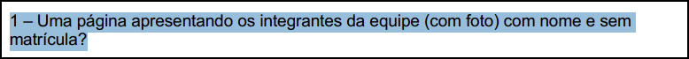

  
Fonte: <a href="#2">(Universidade de Brasília, 2026, p. 7)</a>

**Item 02**

Este item foi retirado do [Plano de Ensino](#2).

**Item:** Estão presentes todos os artefatos básicos exigidos: Planejamento do Projeto, equipe, lista de sites avaliados, site selecionado, Ferramentas, Processo de Design e cronograma das atividades?

  
<strong>Figura 8</strong> - Comprovação do Item 08

  
  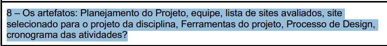

  
Fonte: <a href="#2">(Universidade de Brasília, 2026, p. 7)</a>

**Item 03**

Este item foi retirado do [Plano de Ensino](#2).

**Item:** Possui opção de contraste de cores?

  
<strong>Figura 7</strong> - Comprovação do Item 07

  
  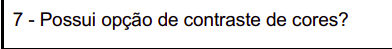

  
Fonte: <a href="#2">(Universidade de Brasília, 2026, p. 7)</a>

**Item 04**

Este item foi retirado do [Plano de Ensino](#2).

**Item:** O histórico de versão está padronizado?

  
<strong>Figura 10</strong> - Comprovação do Item 01

  
  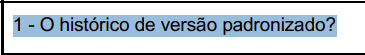

  
Fonte: <a href="#2">(Universidade de Brasília, 2026, p. 7)</a>

**Item 05**

Este item foi retirado do [Plano de Ensino](#2).

**Item:** O(s) autor(es) e o(s) revisor(es) estão indicados em cada artefato?

  
<strong>Figura 11</strong> - Comprovação do Item 02

  
  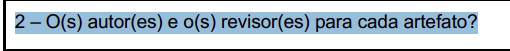

  
Fonte: <a href="#2">(Universidade de Brasília, 2026, p. 7)</a>

**Item 06**

Este item foi retirado do [Plano de Ensino](#2).

**Item:** Referências bibliográficas e/ou bibliografia em todos os artefatos?

  
<strong>Figura 12</strong> - Comprovação do Item 03

  
  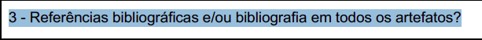

  
Fonte: <a href="#2">(Universidade de Brasília, 2026, p. 7)</a>

**Item 07**

Este item foi retirado do [Plano de Ensino](#2).

**Item:** As tabelas e imagens possuem legenda e fonte e elas chamadas dentro do texto?

  
<strong>Figura 13</strong> - Comprovação do Item 04

  
  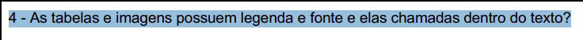

  
Fonte: <a href="#2">(Universidade de Brasília, 2026, p. 7)</a>

**Item 08**

Este item foi retirado do [Plano de Ensino](#2).

**Item:** Existe um texto fazendo uma introdução dos artefatos?

  
<strong>Figura 14</strong> - Comprovação do Item 05

  
  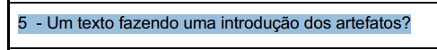

  
Fonte: <a href="#2">(Universidade de Brasília, 2026, p. 7)</a>

**Item 09**

Este item foi retirado do [Plano de Ensino](#2).

**Item:** As Atas de reuniões possuem data, horário de início e fim, participantes, objetivo e atividades definidas?

  
<strong>Figura 16</strong> - Comprovação do Item 07

  
  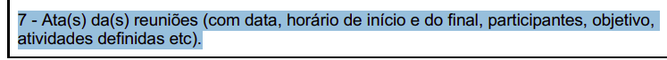

  
Fonte: <a href="#2">(Universidade de Brasília, 2026, p. 7)</a>

**Item 10**

Este item foi retirado do [Plano de Ensino](#2).

**Item:** Há a gravação da reunião do grupo?

  
<strong>Figura 17</strong> - Comprovação do Item 08

  
  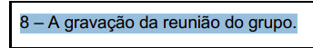

  
Fonte: <a href="#2">(Universidade de Brasília, 2026, p. 8)</a>

**Item 11**

Este item foi retirado do [Plano de Ensino](#2).

**Item:** Uma página com as atas de reunião com o acesso a gravação (vídeo), quando houver.

  
<strong>Figura 9</strong> - Comprovação do Item 09

  
  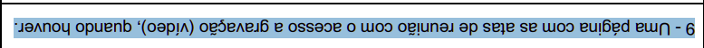

  
Fonte: <a href="#2">(Universidade de Brasília, 2026, p. 7)</a>

**Item 12**

Este item foi retirado do [Plano de Ensino](#2).

**Item:** Vídeo de apresentação está na categoria “não listado” no YouTube?

  
<strong>Figura 18</strong> - Comprovação do Item 09

  
  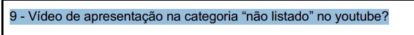

  
Fonte: <a href="#2">(Universidade de Brasília, 2026, p. 8)</a>

**Item 13**

Este item foi retirado do [Plano de Ensino](#2).

**Item:** Há uma Tabela de Contribuições com o nome de todos os integrantes, a contribuição exata de cada um e a hiperligação para a respectiva atividade e gravação, se houver?

  
<strong>Figura 19</strong> - Comprovação do Item 10

  
  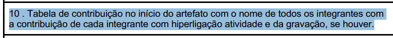

  
Fonte: <a href="#2">(Universidade de Brasília, 2026, p. 8)</a>

**Item 14**

Este item foi retirado do [Plano de Ensino](#2).

**Item:** A seção de agradecimentos apresenta a declaração de uso de Inteligência Artificial (IA) Generativa?

  
<strong>Figura 20</strong> - Comprovação do Item 11

  
  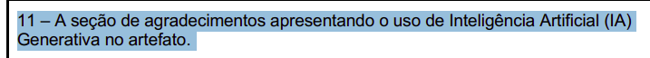

  
Fonte: <a href="#2">(Universidade de Brasília, 2026, p. 8)</a>

### Cronograma

**Item 01**

Este item foi retirado do [Plano de Ensino](#2).

**Item:** O cronograma apresenta todas as atividades de todas as etapas para cada integrante, com as datas de início e fim das entregas e com o período de revisão?

  
<strong>Figura 2</strong> - Comprovação do Item 02

  
  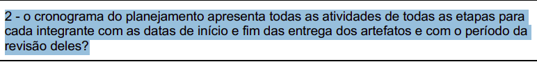

  
Fonte: <a href="#2">(Universidade de Brasília, 2026, p. 7)</a>

**Item 02**

Este item foi retirado do [Plano de Ensino](#2).

**Item:** O cronograma prevê um período de gravação da apresentação de cada etapa?

  
<strong>Figura 3</strong> - Comprovação do Item 03

  
  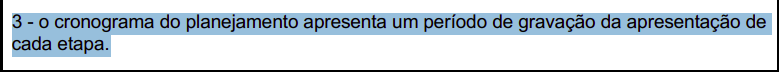

  
Fonte: <a href="#2">(Universidade de Brasília, 2026, p. 7)</a>

**Item 03**

Este item foi retirado do [Plano de Ensino](#2).

**Item:** O cronograma prevê um período de revisão/ajustes nos artefatos após receber o feedback dos monitores/professor?

  
<strong>Figura 4</strong> - Comprovação do Item 04

  
  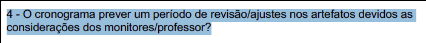

  
Fonte: <a href="#2">(Universidade de Brasília, 2026, p. 7)</a>

**Item 04**

Este item foi retirado do [Plano de Ensino](#2).

**Item:** Existe o cronograma executado com quem realizou cada artefato/atividade com as datas de início e fim da construção/realização do artefato/atividade?

  
<strong>Figura 15</strong> - Comprovação do Item 06

  
  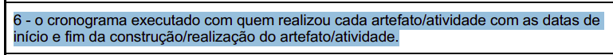

  
Fonte: <a href="#2">(Universidade de Brasília, 2026, p. 7)</a>

**Item 05**

Este item foi desenvolvido por [Breno Teixeira](https://github.com/BrenoLTeixeira).

**Item:** O **Cronograma** planejado e o Heatmap ajudam a administrar as questões práticas do projeto, organizando os prazos disponíveis e distribuindo a mão de obra (equipe) de forma eficiente para as atividades?

<strong>Figura 29</strong> - Comprovação do Item 09

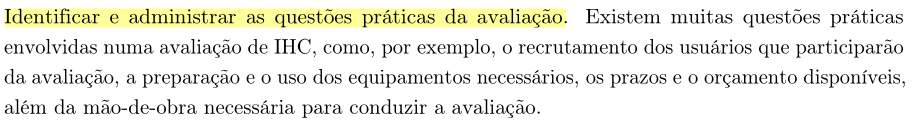

Fonte: <a href="#1">(Barbosa et al., 2021, p. 264)</a>

### Ferramentas

**Item 01**

Este item foi desenvolvido por [Pedro Américo](https://github.com/dev-americo).

**Item:** O planejamento geral e a seleção de **Ferramentas** de colaboração viabilizam o trabalho de uma equipe multidisciplinar, permitindo interpretar a situação atual por diferentes pontos de vista?

<strong>Figura 33</strong> - Comprovação do Item 13

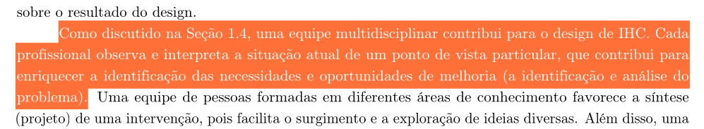

Fonte: <a href="#1">(Barbosa et al., 2021, p. 100)</a>

**Item 02**

Este item foi desenvolvido por [Pedro Ian](https://github.com/pedroiaan).

**Item:** O planejamento e a seleção das **Ferramentas** do projeto suportam o princípio de utilizar "representações de design simples", garantindo que o resultado do trabalho seja facilmente compreensível para os usuários e demais envolvidos?

<strong>Figura 34</strong> - Comprovação do Item 14

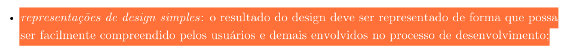

Fonte: <a href="#1">(Barbosa et al., 2021, p. 116)</a>

### Mapa de Energia

**Item 01**

Este item foi desenvolvido por [Breno Teixeira](https://github.com/BrenoLTeixeira).

**Item:** O **Cronograma** planejado e o Heatmap ajudam a administrar as questões práticas do projeto, organizando os prazos disponíveis e distribuindo a mão de obra (equipe) de forma eficiente para as atividades?

<strong>Figura 29</strong> - Comprovação do Item 09

Fonte: <a href="#1">(Barbosa et al., 2021, p. 264)</a>

### Processo de Design

**Item 01**

Este item foi retirado do [Plano de Ensino](#2).

**Item:** Existe uma justificativa da escolha do Processo de Design? Essa justificativa deve conter a referência bibliográfica da fonte, foto do texto da referência e Autor(es)

  
<strong>Figura 21</strong> - Comprovação do Item 01

  
  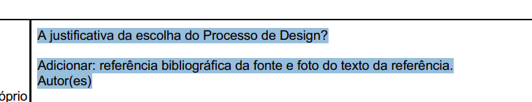

  
Fonte: <a href="#2">(Universidade de Brasília, 2026, p. 8)</a>

**Item 02**

Este item foi desenvolvidor por [Júlia Gabriella](https://github.com/juliagabriellafs).

**Item:** O documento do Processo de Design explicita detalhadamente as três atividades básicas do design (Análise da situação atual, Síntese de intervenção e Avaliação)?

  
<strong>Figura 22</strong> - Comprovação do Item 02

  
  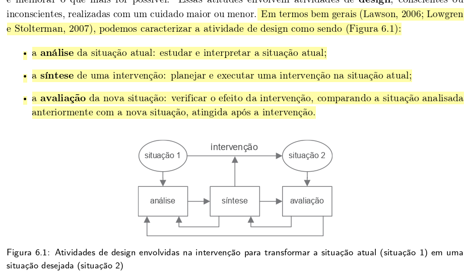

  
Fonte: <a href="#1">(Barbosa et al., 2021, p. 94)</a>

**Item 03**

Este item foi desenvolvidor por [Pedro Ian](https://github.com/pedroiaan).

**Item:** A página de Processo de Design justifica que a escolha do método e do ciclo de vida visa garantir especificamente a "qualidade de uso" (usabilidade/experiência do usuário) do sistema?

  
<strong>Figura 23</strong> - Comprovação do Item 03

  
  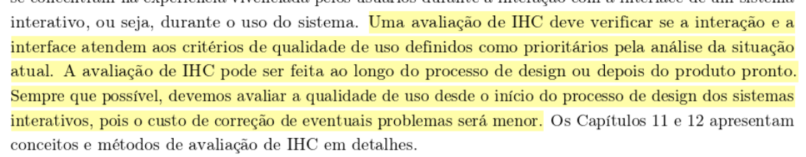

  
Fonte: <a href="#1">(Barbosa et al., 2021, p. 96)</a>

**Item 04**

Este item foi desenvolvidor por [Pedro Américo](https://github.com/dev-americo).

**Item:** O processo de design documentado no repositório deixa claro que o ciclo de desenvolvimento adotado pela equipe será executado de forma iterativa (com refinamentos sucessivos)?

  
<strong>Figura 24</strong> - Comprovação do Item 04

  
  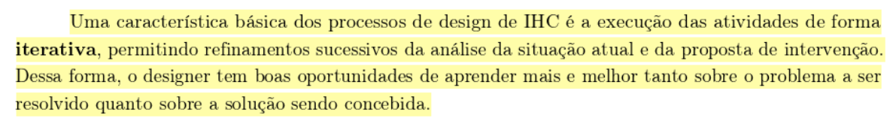

  
Fonte: <a href="#1">(Barbosa et al., 2021, p. 98)</a>

**Item 05**

Este item foi desenvolvidor por [Breno](https://github.com/BrenoLTeixeira).

**Item:** O planejamento e o processo de design escolhido consideram explicitamente o "foco no usuário" (envolvimento, necessidades e objetivos) como princípio central do projeto?

  
<strong>Figura 25</strong> - Comprovação do Item 05

  
  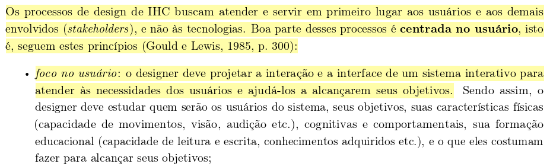

  
Fonte: <a href="#1">(Barbosa et al., 2021, p. 99)</a>

**Item 06**

Este item foi desenvolvidor por [Pedro Lucas](https://github.com/Pwdrinho).

**Item:** O artefato de Processo de Design descreve rigorosamente as fases corretas do ciclo de vida escolhido pelo grupo (ex: as 3 fases de Mayhew, ou as atividades da Estrela)?

  
<strong>Figura 26</strong> - Comprovação do Item 06

  
  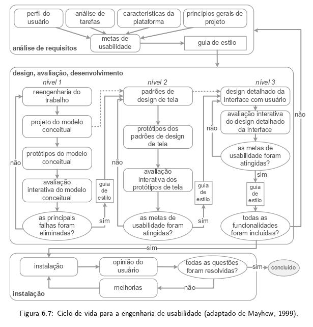

  
Fonte: <a href="#1">(Barbosa et al., 2021, p. 106)</a>

**Item 07**

Este item foi desenvolvidor por [Gabriel Diniz](https://github.com/GabrielDiniz12).

**Item:** O documento de Processo de Design prevê a elaboração de protótipos (mesmo que de baixa fidelidade) em suas etapas, para materializar as alternativas de design antes da implementação?

  
<strong>Figura 27</strong> - Comprovação do Item 07

  
  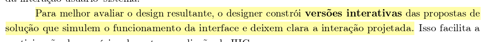

  
Fonte: <a href="#1">(Barbosa et al., 2021, p. 100)</a>

**Item 08**

Este item foi desenvolvidor por [Lucas Oliveira](https://github.com/dev-LucasDpaula).

**Item:** O texto do Processo de Design especifica que as avaliações ocorrerão durante a concepção da solução (avaliação formativa) para a correção rápida de problemas, e não apenas no final?

  
<strong>Figura 28</strong> - Comprovação do Item 08

  
  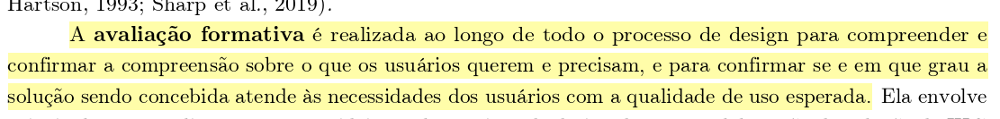

  
Fonte: <a href="#1">(Barbosa et al., 2021, p. 251)</a>

### Sites Avaliados

**Item 01**

Este item foi retirado do [Plano de Ensino](#2).

**Item:** O planejamento e a avaliação dos sites candidatos estão presentes?

  
<strong>Figura 6</strong> - Comprovação do Item 06

  
  

  
Fonte: <a href="#2">(Universidade de Brasília, 2026, p. 7)</a>

**Item 02**

Este item foi desenvolvido por [Gabriel Diniz](https://github.com/GabrielDiniz12).

**Item:** A avaliação registrada no documento de **Sites Avaliados** foi planejada e orientada utilizando os passos do framework DECIDE?

<strong>Figura 30</strong> - Comprovação do Item 10

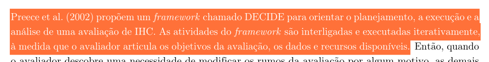

Fonte: <a href="#1">(Barbosa et al., 2021, p. 264)</a>

**Item 03**

Este item foi desenvolvido por [Lucas Oliveira](https://github.com/dev-LucasDpaula).

**Item:** O artefato de **Sites Avaliados** buscou analisar outros sites a fim de identificar problemas na interação e na interface que prejudicam a qualidade de uso desses sistemas?

<strong>Figura 32</strong> - Comprovação do Item 12

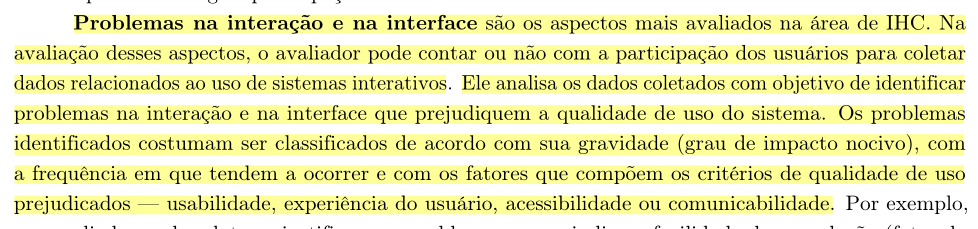

Fonte: <a href="#1">(Barbosa et al., 2021, p. 249)</a>

### Site Escolhido

**Item 01**

Este item foi retirado do [Plano de Ensino](#2).

**Item:** A motivação e os critérios para a escolha do site estão documentados?

  
<strong>Figura 5</strong> - Comprovação do Item 05

  
  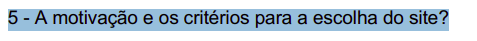

  
Fonte: <a href="#2">(Universidade de Brasília, 2026, p. 7)</a>

**Item 02**

Este item foi desenvolvido por [Júlia Gabriella](https://github.com/juliagabriellafs).

**Item:** A documentação do **Site Escolhido** realiza uma "análise da situação atual", apontando as necessidades e as oportunidades de melhoria que justificam a necessidade do reprojeto?

<strong>Figura 31</strong> - Comprovação do Item 11

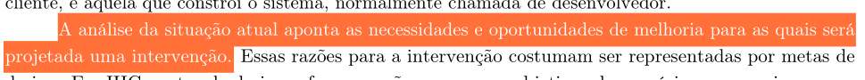

Fonte: <a href="#1">(Barbosa et al., 2021, p. 95)</a>

**Item 03**

Este item foi desenvolvido por [Pedro Lucas](https://github.com/Pwdrinho).

**Item:** A motivação do **Site Escolhido** é pautada no "foco no usuário", buscando um sistema de alto impacto social para melhor atender às necessidades dos cidadãos para alcançar seus objetivos?

<strong>Figura 35</strong> - Comprovação do Item 15

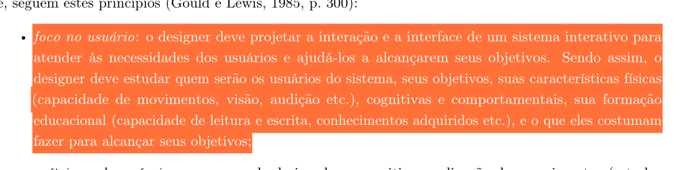

Fonte: <a href="#1">(Barbosa et al., 2021, p. 99)</a>

---

## Tabelas de Verificação por Artefato

Abaixo estão os itens de verificação reorganizados e divididos de acordo com os artefatos e temas específicos analisados nesta etapa.

### Itens Gerais

<b>Tabela 1</b> - Lista de Verificação: Itens Gerais

| Item | Avaliação | Observação | Revisor(es) |
| :--- | :---: | :--- | :---: |
| **_01:_** Existe uma página apresentando os integrantes da equipe com foto, nome e sem matrícula? |  |  | [Breno Teixeira](https://github.com/BrenoLTeixeira) |
| **_02:_** Estão presentes todos os artefatos básicos exigidos: Planejamento do Projeto, equipe, lista de sites avaliados, site selecionado, Ferramentas, Processo de Design e cronograma das atividades? |  |  | [Gabriel Diniz](https://github.com/GabrielDiniz12) |
| **_03:_** Possui opção de contraste de cores? |  |  | [Júlia Gabriella](https://github.com/juliagabriellafs) |
| **_04:_** O histórico de versão está padronizado? |  |  | [Lucas Oliveira](https://github.com/dev-LucasDpaula) |
| **_05:_** O(s) autor(es) e o(s) revisor(es) estão indicados em cada artefato? |  |  | [Pedro Américo](https://github.com/dev-americo) |
| **_06:_** Referências bibliográficas e/ou bibliografia em todos os artefatos? |  |  | [Pedro Ian](https://github.com/pedroiaan) |
| **_07:_** As tabelas e imagens possuem legenda e fonte e elas chamadas dentro do texto? |  |  | [Pedro Lucas](https://github.com/Pwdrinho) |
| **_08:_** Existe um texto fazendo uma introdução dos artefatos? |  |  | [Breno Teixeira](https://github.com/BrenoLTeixeira) |
| **_09:_** As Atas de reuniões possuem data, horário de início e fim, participantes, objetivo e atividades definidas? |  |  | [Gabriel Diniz](https://github.com/GabrielDiniz12) |
| **_10:_** Há a gravação da reunião do grupo? |  |  | [Júlia Gabriella](https://github.com/juliagabriellafs) |
| **_11:_** Uma página com as atas de reunião com o acesso a gravação (vídeo), quando houver? |  |  | [Lucas Oliveira](https://github.com/dev-LucasDpaula) |
| **_12:_** Vídeo de apresentação está na categoria “não listado” no YouTube? |  |  | [Pedro Américo](https://github.com/dev-americo) |
| **_13:_** Há uma Tabela de Contribuições com o nome de todos os integrantes, a contribuição exata de cada um e a hiperligação para a respectiva atividade e gravação, se houver? |  |  | [Pedro Ian](https://github.com/pedroiaan) |
| **_14:_** A seção de agradecimentos apresenta a declaração de uso de Inteligência Artificial (IA) Generativa? |  |  | [Pedro Lucas](https://github.com/Pwdrinho) |

Autor: [Pedro Américo](https://github.com/dev-americo), 2026

### Cronograma

<b>Tabela 2</b> - Lista de Verificação: Cronograma

| Item | Avaliação | Observação | Revisor(es) |
| :--- | :---: | :--- | :---: |
| **_01:_** O cronograma apresenta todas as atividades de todas as etapas para cada integrante, com as datas de início e fim das entregas e com o período de revisão? |  |  | [Gabriel Diniz](https://github.com/GabrielDiniz12) |
| **_02:_** O cronograma prevê um período de gravação da apresentação de cada etapa? |  |  | [Júlia Gabriella](https://github.com/juliagabriellafs) |
| **_03:_** O cronograma prevê um período de revisão/ajustes nos artefatos após receber o feedback dos monitores/professor? |  |  | [Lucas Oliveira](https://github.com/dev-LucasDpaula) |
| **_04:_** Existe o cronograma executado com quem realizou cada artefato/atividade com as datas de início e fim da construção/realização do artefato/atividade? |  |  | [Breno Teixeira](https://github.com/BrenoLTeixeira) |
| **_05:_** O Cronograma planejado ajuda a administrar as questões práticas do projeto, organizando os prazos disponíveis? |  |  | [Pedro Ian](https://github.com/pedroiaan) |

Autor: [Pedro Américo](https://github.com/dev-americo), 2026

### Ferramentas

<b>Tabela 3</b> - Lista de Verificação: Ferramentas

| Item | Avaliação | Observação | Revisor(es) |
| :--- | :---: | :--- | :---: |
| **_01:_** O planejamento geral e a seleção de Ferramentas de colaboração viabilizam o trabalho de uma equipe multidisciplinar, permitindo interpretar a situação atual por diferentes pontos de vista? |  |  | [Pedro Américo](https://github.com/dev-americo) |
| **_02:_** O planejamento e a seleção das Ferramentas do projeto suportam o princípio de utilizar "representações de design simples", garantindo que o resultado do trabalho seja facilmente compreensível para os usuários e demais envolvidos? |  |  | [Pedro Ian](https://github.com/pedroiaan) |

Autor: [Pedro Américo](https://github.com/dev-americo), 2026

### Mapa de Energia

<b>Tabela 4</b> - Lista de Verificação: Mapa de Energia

| Item | Avaliação | Observação | Revisor(es) |
| :--- | :---: | :--- | :---: |
| **_01:_** O Heatmap (Mapa de Energia) ajuda a administrar as questões práticas do projeto, distribuindo a mão de obra (equipe) de forma eficiente para as atividades? |  |  | [Breno Teixeira](https://github.com/BrenoLTeixeira) |

Autor: [Pedro Américo](https://github.com/dev-americo), 2026

### Processo de Design

<b>Tabela 5</b> - Lista de Verificação: Processo de Design

| Item | Avaliação | Observação | Revisor(es) |
| :--- | :---: | :--- | :---: |
| **_01:_** Existe uma justificativa da escolha do Processo de Design? Essa justificativa deve conter a referência bibliográfica da fonte, foto do texto da referência e Autor(es) |  |  | [Pedro Lucas](https://github.com/Pwdrinho) |
| **_02:_** O documento do Processo de Design explicita detalhadamente as três atividades básicas do design (Análise da situação atual, Síntese de intervenção e Avaliação)? |  |  | [Breno Teixeira](https://github.com/BrenoLTeixeira) |
| **_03:_** A página de Processo de Design justifica que a escolha do método e do ciclo de vida visa garantir especificamente a "qualidade de uso" (usabilidade/experiência do usuário) do sistema? |  |  | [Gabriel Diniz](https://github.com/GabrielDiniz12) |
| **_04:_** O processo de design documentado no repositório deixa claro que o ciclo de desenvolvimento adotado pela equipe será executado de forma iterativa (com refinamentos sucessivos)? |  |  | [Júlia Gabriella](https://github.com/juliagabriellafs) |
| **_05:_** O planejamento e o processo de design escolhido consideram explicitamente o "foco no usuário" (envolvimento, necessidades e objetivos) como princípio central do projeto? |  |  | [Lucas Oliveira](https://github.com/dev-LucasDpaula) |
| **_06:_** O artefato de Processo de Design descreve rigorosamente as fases corretas do ciclo de vida escolhido pelo grupo (ex: as 3 fases de Mayhew, ou as atividades da Estrela)? |  |  | [Pedro Américo](https://github.com/dev-americo) |
| **_07:_** O documento de Processo de Design prevê a elaboração de protótipos (mesmo que de baixa fidelidade) em suas etapas, para materializar as alternativas de design antes da implementação? |  |  | [Pedro Ian](https://github.com/pedroiaan) |
| **_08:_** O texto do Processo de Design especifica que as avaliações ocorrerão durante a concepção da solução (avaliação formativa) para a correção rápida de problemas, e não apenas no final? |  |  | [Pedro Lucas](https://github.com/Pwdrinho) |

Autor: [Pedro Américo](https://github.com/dev-americo), 2026

### Sites Avaliados

<b>Tabela 6</b> - Lista de Verificação: Sites Avaliados

| Item | Avaliação | Observação | Revisor(es) |
| :--- | :---: | :--- | :---: |
| **_01:_** O planejamento e a avaliação dos sites candidatos estão presentes? |  |  | [Pedro Ian](https://github.com/pedroiaan) |
| **_02:_** A avaliação registrada no documento de Sites Avaliados foi planejada e orientada utilizando os passos do framework DECIDE? |  |  | [Gabriel Diniz](https://github.com/GabrielDiniz12) |
| **_03:_** O artefato de Sites Avaliados buscou analisar outros sites a fim de identificar problemas na interação e na interface que prejudicam a qualidade de uso desses sistemas? |  |  | [Lucas Oliveira](https://github.com/dev-LucasDpaula) |

Autor: [Pedro Américo](https://github.com/dev-americo), 2026

### Site Escolhido

<b>Tabela 7</b> - Lista de Verificação: Site Escolhido

| Item | Avaliação | Observação | Revisor(es) |
| :--- | :---: | :--- | :---: |
| **_01:_** A motivação e os critérios para a escolha do site estão documentados? |  |  | [Pedro Américo](https://github.com/dev-americo) |
| **_02:_** A documentação do Site Escolhido realiza uma "análise da situação atual", apontando as necessidades e as oportunidades de melhoria que justificam a necessidade do reprojeto? |  |  | [Júlia Gabriella](https://github.com/juliagabriellafs) |
| **_03:_** A motivação do Site Escolhido é pautada no "foco no usuário", buscando um sistema de alto impacto social para melhor atender às necessidades dos cidadãos para alcançar seus objetivos? |  |  | [Pedro Lucas](https://github.com/Pwdrinho) |

Autor: [Pedro Américo](https://github.com/dev-americo), 2026

---

## Referências Bibliográficas

 > 
 BARBOSA, Simone Diniz Junqueira et al. <b>Interação Humano-Computador e Experiência do Usuário</b>. 1. ed. Rio de Janeiro: Simone Diniz Junqueira Barbosa, 2021. E-book. 

 > 
 UNIVERSIDADE DE BRASÍLIA. Campus UnB Gama. **Plano de Ensino: Interação Humano Computador**. Professor: Dr. André Barros de Sales. Semestre 01/2026. Brasília, DF: UnB, 2026. Disponível em: <https://aprender3.unb.br/pluginfile.php/3335948/mod_resource/content/61/Plano_de_Ensino%20FIHC%20012026%20Turma%2003%20v2.pdf>. Acesso em: 21 jun. 2026.

## Histórico de Versões

| Versão | Descrição | Data | Autor(es) | Data de revisão | Revisor(es) |
| :---: | :--- | :---: | :---: | :---: | :---: |
| 1.0 | Avaliação da entrega 1 | 21/06/2026 | [Pedro Américo](https://github.com/dev-americo) | 22/06/2026 | [Júlia Gabriella](https://github.com/juliagabriellafs) |