# Verificação

## Introdução

Seguindo o princípio "quanto mais itens melhor", cada membro do grupo desenvolveu itens de verificação para que a avaliação seja o mais completa possível, esse artefato trata da comprovação de que cada item tem um fundamento de exigência. Dessa forma, este documento detalha os itens de verificação da inspeção dos artefatos desenvolvidos na Etapa 2.

## Metodologia

A metodologia selecionada para esta verificação é a inspeção. Fundamentada na técnica proposta por Michael Fagan (IBM, 1976), esta análise formal visa a detecção precoce de defeitos nos artefatos. O procedimento estrutura-se no uso de checklists que contemplam os erros mais frequentes, permitindo a detecção, análise e categorização rigorosa de inconsistências. Conforme as boas práticas da técnica, a revisão é realizada por pares, garantindo que o autor não seja o revisor do próprio trabalho.

## Participantes e Artefatos

Os artefatos analisados e os seus respectivos responsáveis por sua verificação estão descritos na tabela abaixo.

<b>Tabela 1</b> - Artefatos analisados e Participantes Responsáveis 

| Artefato | Responsável |
| --- | --- |
| Aspectos éticos | [Breno](https://github.com/BrenoLTeixeira), [Gabriel Diniz](https://github.com/GabrielDiniz12), [Júlia Gabriella](https://github.com/juliagabriellafs), [Lucas Oliveira](https://github.com/dev-LucasDpaula), [Pedro Ian](https://github.com/pedroiaan), [Pedro Lucas](https://github.com/Pwdrinho) |
| Personas | [Gabriel Diniz](https://github.com/GabrielDiniz12), [Júlia Gabriella](https://github.com/juliagabriellafs), [Lucas Oliveira](https://github.com/dev-LucasDpaula), [Pedro Américo](https://github.com/dev-americo), [Pedro Ian](https://github.com/pedroiaan), [Pedro Lucas](https://github.com/Pwdrinho) |
| Cenários | [Breno](https://github.com/BrenoLTeixeira), [Gabriel Diniz](https://github.com/GabrielDiniz12), [Júlia Gabriella](https://github.com/juliagabriellafs), [Lucas Oliveira](https://github.com/dev-LucasDpaula), [Pedro Américo](https://github.com/dev-americo), [Pedro Ian](https://github.com/pedroiaan) |
| Analise de Tarefas | [Breno](https://github.com/BrenoLTeixeira), [Gabriel Diniz](https://github.com/GabrielDiniz12), [Pedro Américo](https://github.com/dev-americo), [Pedro Ian](https://github.com/pedroiaan), [Pedro Lucas](https://github.com/Pwdrinho) |

Autor: [Pedro Ian](https://github.com/pedroiaan), 2026

## Itens

Abaixo estão os itens referentes a cada artefato ou tópico analisado.

### Planejamento Geral do Projeto

**Item 1**

Este item foi retirado do [Plano de Ensino](#2).

**Item:** Existe uma página apresentando os integrantes da equipe com foto, nome e sem matrícula?

  
<strong>Figura 1</strong> - Comprovação do Item 1

  
  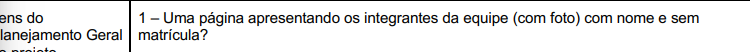

  
Fonte: <a href="#2">(Universidade de Brasília, 2026, p. 7)</a>

**Item 2**

Este item foi retirado do [Plano de Ensino](#2).

**Item:** O cronograma apresenta todas as atividades de todas as etapas para cada integrante, com as datas de início e fim das entregas e com o período de revisão?

  
<strong>Figura 2</strong> - Comprovação do Item 2

  
  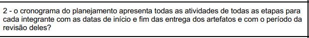

  
Fonte: <a href="#2">(Universidade de Brasília, 2026, p. 7)</a>

**Item 3**

Este item foi retirado do [Plano de Ensino](#2).

**Item:** O cronograma prevê um período de gravação da apresentação de cada etapa?

  
<strong>Figura 3</strong> - Comprovação do Item 3

  
  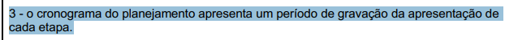

  
Fonte: <a href="#2">(Universidade de Brasília, 2026, p. 7)</a>

**Item 4**

Este item foi retirado do [Plano de Ensino](#2).

**Item:** O cronograma prevê um período de revisão/ajustes nos artefatos após receber o feedback dos monitores/professor?

  
<strong>Figura 4</strong> - Comprovação do Item 4

  
  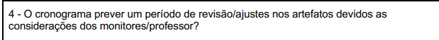

  
Fonte: <a href="#2">(Universidade de Brasília, 2026, p. 7)</a>

**Item 5**

Este item foi retirado do [Plano de Ensino](#2).

**Item:** A motivação e os critérios para a escolha do site estão documentados?

  
<strong>Figura 5</strong> - Comprovação do Item 5

  
  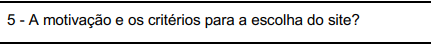

  
Fonte: <a href="#2">(Universidade de Brasília, 2026, p. 7)</a>

**Item 6**

Este item foi retirado do [Plano de Ensino](#2).

**Item:** O planejamento e a avaliação dos sites candidatos estão presentes?

  
<strong>Figura 6</strong> - Comprovação do Item 6

  
  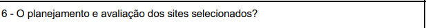

  
Fonte: <a href="#2">(Universidade de Brasília, 2026, p. 7)</a>

**Item 7**

Este item foi retirado do [Plano de Ensino](#2).

**Item:** Possui opção de contraste de cores?

  
<strong>Figura 7</strong> - Comprovação do Item 7

  
  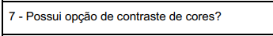

  
Fonte: <a href="#2">(Universidade de Brasília, 2026, p. 7)</a>

**Item 8**

Este item foi retirado do [Plano de Ensino](#2).

**Item:** Estão presentes todos os artefatos básicos exigidos: Planejamento do Projeto, equipe, lista de sites avaliados, site selecionado, Ferramentas, Processo de Design e cronograma das atividades?

  
<strong>Figura 8</strong> - Comprovação do Item 8

  
  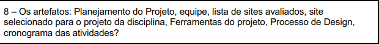

  
Fonte: <a href="#2">(Universidade de Brasília, 2026, p. 7)</a>

**Item 9**

Este item foi retirado do [Plano de Ensino](#2).

**Item:** Uma página com as atas de reunião com o acesso a gravação (vídeo), quando houver.

  
<strong>Figura 9</strong> - Comprovação do Item 9

  
  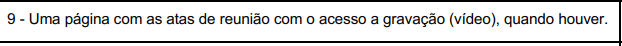

  
Fonte: <a href="#2">(Universidade de Brasília, 2026, p. 7)</a>

### Desenvolvimento do Projeto

**Item 1**

Este item foi retirado do [Plano de Ensino](#2).

**Item:** O histórico de versão está padronizado?

  
<strong>Figura 10</strong> - Comprovação do Item 1

  
  

  
Fonte: <a href="#2">(Universidade de Brasília, 2026, p. 7)</a>

**Item 2**

Este item foi retirado do [Plano de Ensino](#2).

**Item:** O(s) autor(es) e o(s) revisor(es) estão indicados em cada artefato?

  
<strong>Figura 11</strong> - Comprovação do Item 2

  
  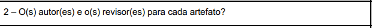

  
Fonte: <a href="#2">(Universidade de Brasília, 2026, p. 7)</a>

**Item 3**

Este item foi retirado do [Plano de Ensino](#2).

**Item:** Referências bibliográficas e/ou bibliografia em todos os artefatos?

  
<strong>Figura 12</strong> - Comprovação do Item 3

  
  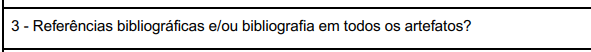

  
Fonte: <a href="#2">(Universidade de Brasília, 2026, p. 7)</a>

**Item 4**

Este item foi retirado do [Plano de Ensino](#2).

**Item:** As tabelas e imagens possuem legenda e fonte e elas chamadas dentro do texto?

  
<strong>Figura 13</strong> - Comprovação do Item 4

  
  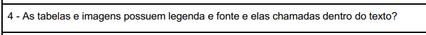

  
Fonte: <a href="#2">(Universidade de Brasília, 2026, p. 7)</a>

**Item 5**

Este item foi retirado do [Plano de Ensino](#2).

**Item:** Existe um texto fazendo uma introdução dos artefatos?

  
<strong>Figura 14</strong> - Comprovação do Item 5

  
  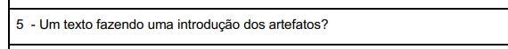

  
Fonte: <a href="#2">(Universidade de Brasília, 2026, p. 7)</a>

**Item 6**

Este item foi retirado do [Plano de Ensino](#2).

**Item:** Existe o cronograma executado com quem realizou cada artefato/atividade com as datas de início e fim da construção/realização do artefato/atividade?

  
<strong>Figura 15</strong> - Comprovação do Item 6

  
  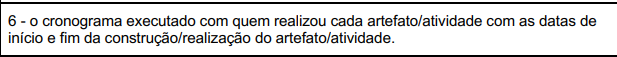

  
Fonte: <a href="#2">(Universidade de Brasília, 2026, p. 7)</a>

**Item 7**

Este item foi retirado do [Plano de Ensino](#2).

**Item:** As Atas de reuniões possuem data, horário de início e fim, participantes, objetivo e atividades definidas?

  
<strong>Figura 16</strong> - Comprovação do Item 7

  
  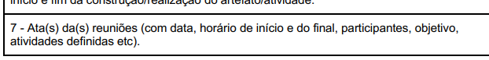

  
Fonte: <a href="#2">(Universidade de Brasília, 2026, p. 7)</a>

**Item 8**

Este item foi retirado do [Plano de Ensino](#2).

**Item:** Há a gravação da reunião do grupo?

  
<strong>Figura 17</strong> - Comprovação do Item 8

  
  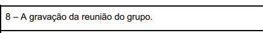

  
Fonte: <a href="#2">(Universidade de Brasília, 2026, p. 8)</a>

**Item 9**

Este item foi retirado do [Plano de Ensino](#2).

**Item:** Vídeo de apresentação está na categoria “não listado” no YouTube?

  
<strong>Figura 18</strong> - Comprovação do Item 9

  
  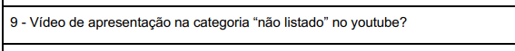

  
Fonte: <a href="#2">(Universidade de Brasília, 2026, p. 8)</a>

**Item 10**

Este item foi retirado do [Plano de Ensino](#2).

**Item:** Há uma Tabela de Contribuições com o nome de todos os integrantes, a contribuição exata de cada um e a hiperligação para a respectiva atividade e gravação, se houver?

  
<strong>Figura 19</strong> - Comprovação do Item 10

  
  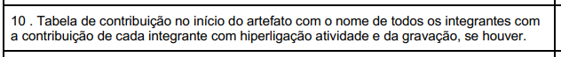

  
Fonte: <a href="#2">(Universidade de Brasília, 2026, p. 8)</a>

**Item 11**

Este item foi retirado do [Plano de Ensino](#2).

**Item:** A seção de agradecimentos apresenta a declaração de uso de Inteligência Artificial (IA) Generativa?

  
<strong>Figura 20</strong> - Comprovação do Item 11

  
  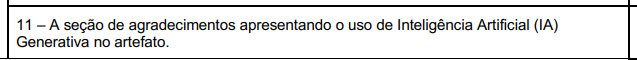

  
Fonte: <a href="#2">(Universidade de Brasília, 2026, p. 8)</a>

### Conteúdo da Disciplina

**Item 1**

Este item foi retirado do [Plano de Ensino](#2).

**Item:** Existe uma justificativa da escolha do Processo de Design? Essa justificativa deve conter a referência bibliográfica da fonte, foto do texto da referência e Autor(es).

  
<strong>Figura 21</strong> - Comprovação do Item 1

  
  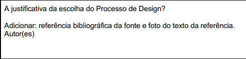

  
Fonte: <a href="#2">(Universidade de Brasília, 2026, p. 8)</a>

**Item 2**

Este item foi retirado do livro [Interação Humano-Computador e Experiência do Usuário](#1).

**Item:** O documento do Processo de Design explicita detalhadamente as três atividades básicas do design (Análise da situação atual, Síntese de intervenção e Avaliação)?

  
<strong>Figura 22</strong> - Comprovação do Item 2

  
  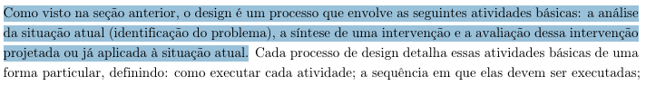

  
Fonte: <a href="#1">(Barbosa et al., 2021, p. 98)</a>

**Item 3**

Este item foi retirado do livro [Interação Humano-Computador e Experiência do Usuário](#1).

**Item:** A página de Processo de Design justifica que a escolha do método e do ciclo de vida visa garantir especificamente a 'qualidade de uso' (usabilidade/experiência do usuário) do sistema?

  
<strong>Figura 23</strong> - Comprovação do Item 3

  
  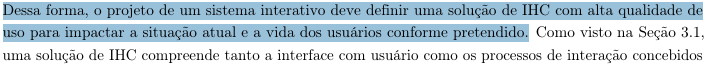

  
Fonte: <a href="#1">(Barbosa et al., 2021, p. 95 e 8)</a>

**Item 4**

Este item foi retirado do livro [Interação Humano-Computador e Experiência do Usuário](#1).

**Item:** O processo de design documentado no repositório deixa claro que o ciclo de desenvolvimento adotado pela equipe será executado de forma iterativa (com refinamentos sucessivos)?

  
<strong>Figura 24</strong> - Comprovação do Item 4

  
  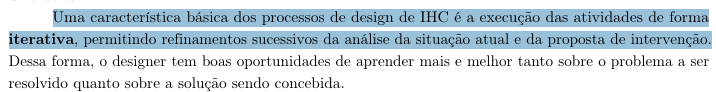

  
Fonte: <a href="#1">(Barbosa et al., 2021, p. 98)</a>

**Item 5**

Este item foi retirado do livro [Interação Humano-Computador e Experiência do Usuário](#1).

**Item:** O planejamento e o processo de design escolhido consideram explicitamente o 'foco no usuário' (envolvimento, necessidades e objetivos) como princípio central do projeto?

  
<strong>Figura 25</strong> - Comprovação do Item 5

  
  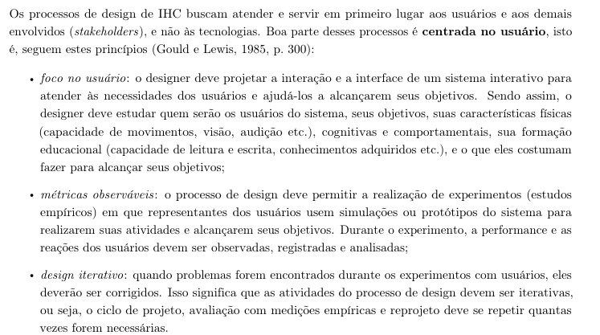

  
Fonte: <a href="#1">(Barbosa et al., 2021, p. 99)</a>

**Item 6**

Este item foi retirado do livro [Interação Humano-Computador e Experiência do Usuário](#1).

**Item:** O artefato de Processo de Design descreve rigorosamente as fases corretas do ciclo de vida escolhido pelo grupo (ex: as 3 fases de Mayhew, ou as atividades da Estrela)?

  
<strong>Figura 26</strong> - Comprovação do Item 6

  
  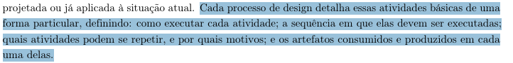

  
Fonte: <a href="#1">(Barbosa et al., 2021, p. 98)</a>

**Item 7**

Este item foi retirado do livro [Interação Humano-Computador e Experiência do Usuário](#1).

**Item:** O documento de Processo de Design prevê a elaboração de protótipos (mesmo que de baixa fidelidade) em suas etapas, para materializar as alternativas de design antes da implementação?

  
<strong>Figura 27</strong> - Comprovação do Item 7

  
  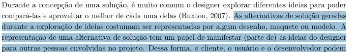

  
Fonte: <a href="#1">(Barbosa et al., 2021, p. 96 e 97)</a>

**Item 8**

Este item foi retirado do livro [Interação Humano-Computador e Experiência do Usuário](#1).

**Item:** O texto do Processo de Design especifica que as avaliações ocorrerão durante a concepção da solução (avaliação formativa) para a correção rápida de problemas, e não apenas no final?

  
<strong>Figura 28</strong> - Comprovação do Item 8

  
  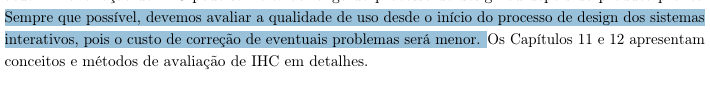

  
Fonte: <a href="#1">(Barbosa et al., 2021, p. 96 e 251)</a>

---

## Tabelas Utilizadas

### Planejamento Geral do Projeto

<b>Tabela 1</b> - Avaliação do Planejamento Geral do Projeto

| Item | Avaliação | Observação | Revisor(es) |
| :--- | :---: | :--- | :---: |
| **1:** Existe uma página apresentando os integrantes da equipe com foto, nome e sem matrícula? |  |  | [Breno Teixeira](https://github.com/BrenoLTeixeira) |
| **2:** O cronograma apresenta todas as atividades de todas as etapas para cada integrante, com as datas de início e fim das entregas e com o período de revisão? |  |  | [Gabriel Diniz](https://github.com/GabrielDiniz12) |
| **3:** O cronograma prevê um período de gravação da apresentação de cada etapa? |  |  | [Julia Gabriella](https://github.com/juliagabriellafs) |
| **4:** O cronograma prevê um período de revisão/ajustes nos artefatos após receber o feedback dos monitores/professor? |  |  | [Lucas Oliveira](https://github.com/dev-LucasDpaula) |
| **5:** A motivação e os critérios para a escolha do site estão documentados? |  |  | [Pedro Américo](https://github.com/dev-americo) |
| **6:** O planejamento e a avaliação dos sites candidatos estão presentes? |  |  | [Pedro Ian](https://github.com/pedroiaan) |
| **7:** Possui opção de contraste de cores? |  |  | [Pedro Lucas](https://github.com/Pwdrinho) |
| **8:** Estão presentes todos os artefatos básicos exigidos: Planejamento do Projeto, equipe, lista de sites avaliados, site selecionado, Ferramentas, Processo de Design e cronograma das atividades? |  |  | [Breno Teixeira](https://github.com/BrenoLTeixeira) |
| **9:** Uma página com as atas de reunião com o acesso a gravação (vídeo), quando houver. |  |  | [Gabriel Diniz](https://github.com/GabrielDiniz12) |

Autor: [Pedro Ian](https://github.com/pedroiaan), 2026

### Desenvolvimento do Projeto

<b>Tabela 2</b> - Avaliação do Desenvolvimento do Projeto

| Item | Avaliação | Observação | Revisor(es) |
| :--- | :---: | :--- | :---: |
| **1:** O histórico de versão está padronizado? |  |  | [Julia Gabriella](https://github.com/juliagabriellafs) |
| **2:** O(s) autor(es) e o(s) revisor(es) estão indicados em cada artefato? |  |  | [Lucas Oliveira](https://github.com/dev-LucasDpaula) |
| **3:** Referências bibliográficas e/ou bibliografia em todos os artefatos? |  |  | [Pedro Américo](https://github.com/dev-americo) |
| **4:** As tabelas e imagens possuem legenda e fonte e elas chamadas dentro do texto? |  |  | [Pedro Ian](https://github.com/pedroiaan) |
| **5:** Existe um texto fazendo uma introdução dos artefatos? |  |  | [Pedro Lucas](https://github.com/Pwdrinho) |
| **6:** Existe o cronograma executado com quem realizou cada artefato/atividade com as datas de início e fim da construção/realização do artefato/atividade? |  |  | [Breno Teixeira](https://github.com/BrenoLTeixeira) |
| **7:** As Atas de reuniões possuem data, horário de início e fim, participantes, objetivo e atividades definidas? |  |  | [Gabriel Diniz](https://github.com/GabrielDiniz12) |
| **8:** Há a gravação da reunião do grupo? |  |  | [Julia Gabriella](https://github.com/juliagabriellafs) |
| **9:** Vídeo de apresentação está na categoria “não listado” no YouTube? |  |  | [Lucas Oliveira](https://github.com/dev-LucasDpaula) |
| **10:** Há uma Tabela de Contribuições com o nome de todos os integrantes, a contribuição exata de cada um e a hiperligação para a respectiva atividade e gravação, se houver? |  |  | [Pedro Américo](https://github.com/dev-americo) |
| **11:** A seção de agradecimentos apresenta a declaração de uso de Inteligência Artificial (IA) Generativa? |  |  | [Pedro Ian](https://github.com/pedroiaan) |

Autor: [Pedro Ian](https://github.com/pedroiaan), 2026

### Conteúdo da Disciplina

<b>Tabela 3</b> - Avaliação referente ao Conteúdo da Disciplina

| Item | Avaliação | Observação | Revisor(es) |
| :--- | :---: | :--- | :---: |
| **1:** Existe uma justificativa da escolha do Processo de Design? Essa justificativa deve conter a referência bibliográfica da fonte, foto do texto da referência e Autor(es) |  |  | [Pedro Lucas](https://github.com/Pwdrinho) |
| **2:** O documento do Processo de Design explicita detalhadamente as três atividades básicas do design (Análise da situação atual, Síntese de intervenção e Avaliação)? |  |  | [Breno Teixeira](https://github.com/BrenoLTeixeira) |
| **3:** A página de Processo de Design justifica que a escolha do método e do ciclo de vida visa garantir especificamente a 'qualidade de uso' (usabilidade/experiência do usuário) do sistema? |  |  | [Gabriel Diniz](https://github.com/GabrielDiniz12) |
| **4:** O processo de design documentado no repositório deixa claro que o ciclo de desenvolvimento adotado pela equipe será executado de forma iterativa (com refinamentos sucessivos)? |  |  | [Julia Gabriella](https://github.com/juliagabriellafs) |
| **5:** O planejamento e o processo de design escolhido consideram explicitamente o 'foco no usuário' (envolvimento, necessidades e objetivos) como princípio central do projeto? |  |  | [Lucas Oliveira](https://github.com/dev-LucasDpaula) |
| **6:** O artefato de Processo de Design descreve rigorosamente as fases corretas do ciclo de vida escolhido pelo grupo (ex: as 3 fases de Mayhew, ou as atividades da Estrela)? |  |  | [Pedro Américo](https://github.com/dev-americo) |
| **7:** O documento de Processo de Design prevê a elaboração de protótipos (mesmo que de baixa fidelidade) em suas etapas, para materializar as alternativas de design antes da implementação? |  |  | [Pedro Ian](https://github.com/pedroiaan) |
| **8:** O texto do Processo de Design especifica que as avaliações ocorrerão durante a concepção da solução (avaliação formativa) para a correção rápida de problemas, e não apenas no final? |  |  | [Pedro Lucas](https://github.com/Pwdrinho) |

Autor: [Pedro Ian](https://github.com/pedroiaan), 2026

---

## Referências Bibliográficas

 > 
 BARBOSA, Simone Diniz Junqueira et al. <b>Interação Humano-Computador e Experiência do Usuário</b>. 1. ed. Rio de Janeiro: Simone Diniz Junqueira Barbosa, 2021. E-book. 

 > 
 UNIVERSIDADE DE BRASÍLIA. Campus UnB Gama. **Plano de Ensino: Interação Humano Computador**. Professor: Dr. André Barros de Sales. Semestre 01/2026. Brasília, DF: UnB, 2026. Disponível em: <https://aprender3.unb.br/pluginfile.php/3335948/mod_resource/content/61/Plano_de_Ensino%20FIHC%20012026%20Turma%2003%20v2.pdf>. Acesso em: 23 jun. 2026.

## Histórico de Versões

| Versão | Descrição | Data | Autor(es) | Data de revisão | Revisor(es) |
| :---: | :--- | :---: | :---: | :---: | :---: |
| 1.0 | Criação do documento de comprovação da Entrega 2 | 23/06/2026 | [Pedro Ian](https://github.com/pedroiaan) | 23/06/2026 | [Lucas Oliveira](https://github.com/dev-LucasDpaula) |