## Introdução

Seguindo o principio "quanto mais itens melhor", cada membro do grupo desenvolvel itens de verificação para que a avaliação seja o mais completa possível, esse artefato trata da comprovação de que cada item tem um fundamento de exigência. Dessa forma, este documento detalha os itens de verificação da inspeção dos artefatos desenvolvidos na Etapa 3.

## Metodologia

A metodologia selecionada para esta verificação é a inspeção. Fundamentada na técnica proposta por Michael Fagan (IBM, 1976), esta análise formal visa a detecção precoce de defeitos nos artefatos. O procedimento estrutura-se no uso de checklists que contemplam os erros mais frequentes, permitindo a detecção, análise e categorização rigorosa de inconsistências. Confrome as boas práticas da técnica, a revisão é realizada por pares, garantindo que o autor não seja o revisor do próprio trabalho. Como produto final, os resultados serão consolidados e apresentados por meio de gráficos quantitativos.

## Participantes e Artefatos

Os artefatos analisados e os seus respectivos responsáveis por sua verificação estão descritos na tabela abaixo.

<b>Tabela 1</b> - Artefatos analisados e Participantes Responsáveis 

| Artefato | Responsável |
| --- | --- |
| Guia de Estilo | [Breno Teixeira](https://github.com/BrenoLTeixeira), [Gabriel Diniz](https://github.com/GabrielDiniz12), [Julia Gabriella](https://github.com/juliagabriellafs), [Lucas Oliveira](https://github.com/dev-LucasDpaula), [Pedro Américo](https://github.com/dev-americo), [Pedro Ian](https://github.com/pedroiaan), [Pedro Lucas](https://github.com/Pwdrinho) |
| Características Gerais | [Breno Teixeira](https://github.com/BrenoLTeixeira), [Gabriel Diniz](https://github.com/GabrielDiniz12), [Julia Gabriella](https://github.com/juliagabriellafs), [Lucas Oliveira](https://github.com/dev-LucasDpaula), [Pedro Américo](https://github.com/dev-americo), [Pedro Ian](https://github.com/pedroiaan), [Pedro Lucas](https://github.com/Pwdrinho) |
| Princípios Gerais | [Breno Teixeira](https://github.com/BrenoLTeixeira), [Gabriel Diniz](https://github.com/GabrielDiniz12), [Julia Gabriella](https://github.com/juliagabriellafs), [Lucas Oliveira](https://github.com/dev-LucasDpaula), [Pedro Américo](https://github.com/dev-americo), [Pedro Ian](https://github.com/pedroiaan), [Pedro Lucas](https://github.com/Pwdrinho) |
| Metas de Usabilidade | [Breno Teixeira](https://github.com/BrenoLTeixeira), [Gabriel Diniz](https://github.com/GabrielDiniz12), [Julia Gabriella](https://github.com/juliagabriellafs), [Lucas Oliveira](https://github.com/dev-LucasDpaula), [Pedro Américo](https://github.com/dev-americo), [Pedro Ian](https://github.com/pedroiaan), [Pedro Lucas](https://github.com/Pwdrinho) |

Autor: [Lucas Oliveira](https://github.com/dev-LucasDpaula), 2026

---

## Itens

Abaixo estão os itens referentes a cada artefato ou tópico analisado.

### Itens Gerais

**Item 01**

Este item foi retirado do [Plano de Ensino](#2).

**Item:** O artefato apresenta uma bibliografia/referência bibliográfica?

  
<strong>Figura 1</strong> - Comprovação do Item 01

  
  

  
Fonte: <a href="#2">(Universidade de Brasília, 2026, p. 7)</a>

**Item 02**

Este item foi retirado do [Plano de Ensino](#2).

**Item:** O artefato apresenta um histórico de versões com id, item das versões, autores e revisores?

  
<strong>Figura 2</strong> - Comprovação do Item 02

  
  

  
Fonte: <a href="#2">(Universidade de Brasília, 2026, p. 7)</a>

**Item 03**

Este item foi retirado do [Plano de Ensino](#2).

**Item:** As tabelas e imagens apresentam legenda e fonte?

  
<strong>Figura 3</strong> - Comprovação do Item 03

  
  

  
Fonte: <a href="#2">(Universidade de Brasília, 2026, p. 7)</a>

**Item 04**

Este item foi retirado do [Plano de Ensino](#2).

**Item:** O artefato apresenta uma introdução?

  
<strong>Figura 4</strong> - Comprovação do Item 04

  
  

  
Fonte: <a href="#2">(Universidade de Brasília, 2026, p. 7)</a>

**Item 05**

Este item foi retirado do [Guia-ABNT-PUC Minas Gerais](#3).

**Item:** A linguagem utilizada é formal e adequada ao contexto técnico/acadêmico?

  
<strong>Figura 5</strong> - Comprovação do Item 05

  
  

  
Fonte: <a href="#3">(Pontifícia Universidade Católica de Minas Gerais, 2025, p. 4)</a>

**Item 06**

Este item foi retirado do [Plano de Ensino](#2).

**Item:** Há coerência entre o conteúdo textual e os artefatos gráficos (tabelas, imagens, fluxogramas)?

  
<strong>Figura 6</strong> - Comprovação do Item 06

  
  

  
Fonte: <a href="#2">(Universidade de Brasília, 2026, p. 7)</a>

**Item 07**

Este item foi retirado do [Plano de Ensino](#2).

**Item:** A gravação da reunião do grupo foi disponibilizada?

  
<strong>Figura 7</strong> - Comprovação do Item 07

  
  

  
Fonte: <a href="#2">(Universidade de Brasília, 2026, p. 7)</a>

### Guia de Estilo

**Item 01**

Este item foi desenvolvido por [Breno Teixeira](https://github.com/BrenoLTeixeira).

**Item:** Existe um tópico de introdução com objetivo e público-alvo?

  
<strong>Figura 15</strong> - Comprovação do Item 01

  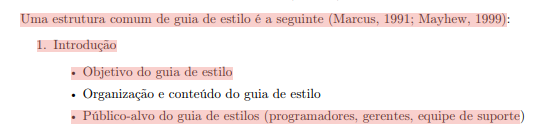
  
Fonte: <a href="#1">(Barbosa et al., 2021)</a>

**Item 02**

Este item foi desenvolvido por [Breno Teixeira](https://github.com/BrenoLTeixeira).

**Item:** O guia define o Layout (grids e proporção) para evitar que a atenção do usuário se desvie por violações de design?

  
<strong>Figura 16</strong> - Comprovação do Item 02

  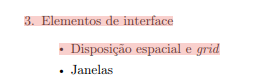
  
Fonte: <a href="#1">(Barbosa et al., 2021)</a>

**Item 03**

Este item foi desenvolvido por [Gabriel Diniz](https://github.com/GabrielDiniz12).

**Item:** Existe um subtópico sobre a organização e como manter o guia?

  
<strong>Figura 17</strong> - Comprovação do Item 03

  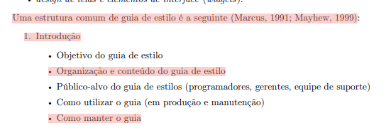
  
Fonte: <a href="#1">(Barbosa et al., 2021)</a>

**Item 04**

Este item foi desenvolvido por [Gabriel Diniz](https://github.com/GabrielDiniz12).

**Item:** Há descrição do ambiente de trabalho do usuário nos resultados de análise?

  
<strong>Figura 18</strong> - Comprovação do Item 04

  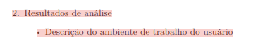
  
Fonte: <a href="#1">(Barbosa et al., 2021)</a>

**Item 05**

Este item foi desenvolvido por [Julia Gabriella](https://github.com/juliagabriellafs).

**Item:** O guia especifica padrões de janelas, tipografia e cores?

  
<strong>Figura 19</strong> - Comprovação do Item 05

  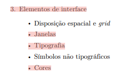
  
Fonte: <a href="#1">(Barbosa et al., 2021)</a>

**Item 06**

Este item foi desenvolvido por [Julia Gabriella](https://github.com/juliagabriellafs).

**Item:** Existem definições para símbolos não tipográficos (ícones) e animações?

  
<strong>Figura 20</strong> - Comprovação do Item 06

  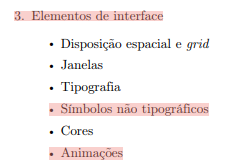
  
Fonte: <a href="#1">(Barbosa et al., 2021)</a>

**Item 07**

Este item foi desenvolvido por [Lucas Oliveira](https://github.com/dev-LucasDpaula).

**Item:** O guia detalha os estilos de interação e como selecionar um deles?

  
<strong>Figura 21</strong> - Comprovação do Item 07

  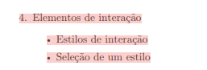
  
Fonte: <a href="#1">(Barbosa et al., 2021)</a>

**Item 08**

Este item foi desenvolvido por [Lucas Oliveira](https://github.com/dev-LucasDpaula).

**Item:** Estão definidos aceleradores (teclas de atalho) para o sistema?

  
<strong>Figura 22</strong> - Comprovação do Item 08

  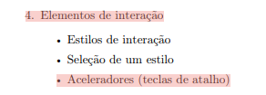
  
Fonte: <a href="#1">(Barbosa et al., 2021)</a>

**Item 09**

Este item foi desenvolvido por [Pedro Américo](https://github.com/dev-americo).

**Item:** Existe um tópico para Elementos de Ação (preenchimento e ativação)?

  
<strong>Figura 23</strong> - Comprovação do Item 09

  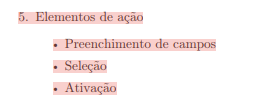
  
Fonte: <a href="#1">(Barbosa et al., 2021)</a>

**Item 10**

Este item foi desenvolvido por [Pedro Américo](https://github.com/dev-americo).

**Item:** Há uma seção de Vocabulário e Padrões de terminologia?

  
<strong>Figura 24</strong> - Comprovação do Item 10

  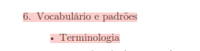
  
Fonte: <a href="#1">(Barbosa et al., 2021)</a>

**Item 11**

Este item foi desenvolvido por [Pedro Ian](https://github.com/pedroiaan).

**Item:** O guia define tipos de tela padrão para tarefas comuns?

  
<strong>Figura 25</strong> - Comprovação do Item 11

  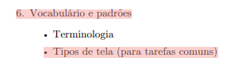
  
Fonte: <a href="#1">(Barbosa et al., 2021)</a>

**Item 12**

Este item foi desenvolvido por [Pedro Ian](https://github.com/pedroiaan).

**Item:** Estão documentadas as sequências de diálogos da interface?

  
<strong>Figura 26</strong> - Comprovação do Item 12

  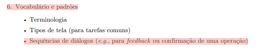
  
Fonte: <a href="#1">(Barbosa et al., 2021)</a>

**Item 13**

Este item foi desenvolvido por [Pedro Lucas](https://github.com/Pwdrinho).

**Item:** O guia define como as mensagens de erro devem ser construídas para ajudar o usuário a se recuperar de falhas?

  
<strong>Figura 27</strong> - Comprovação do Item 13

  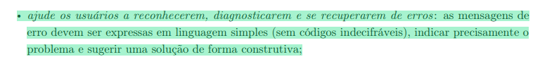
  
Fonte: <a href="#1">(Barbosa et al., 2021)</a>

**Item 14**

Este item foi desenvolvido por [Pedro Lucas](https://github.com/Pwdrinho).

**Item:** O guia garante a visibilidade do estado do sistema orientando o uso de respostas (feedback) no tempo certo após uma ação?

  
<strong>Figura 28</strong> - Comprovação do Item 14

  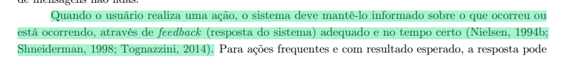
  
Fonte: <a href="#1">(Barbosa et al., 2021)</a>

### Características Gerais

**Item 01**

Este item foi desenvolvido por [Breno Teixeira](https://github.com/BrenoLTeixeira).

**Item:** São identificadas as características principais da plataforma escolhida para o projeto?

  
<strong>Figura 29</strong> - Comprovação do Item 01

  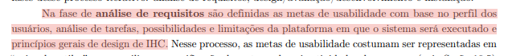
  
Fonte: <a href="#1">(Barbosa et al., 2021)</a>

**Item 02**

Este item foi desenvolvido por [Breno Teixeira](https://github.com/BrenoLTeixeira).

**Item:** São identificados os navegadores ou dispositivos específicos que podem acessar o sistema?

  
<strong>Figura 30</strong> - Comprovação do Item 02

  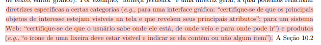
  
Fonte: <a href="#1">(Barbosa et al., 2021)</a>

**Item 03**

Este item foi desenvolvido por [Gabriel Diniz](https://github.com/GabrielDiniz12).

**Item:** Foram coletados dados sobre a tecnologia disponível para o usuário que podem limitar o uso?

  
<strong>Figura 31</strong> - Comprovação do Item 03

  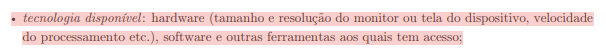
  
Fonte: <a href="#1">(Barbosa et al., 2021)</a>

**Item 04**

Este item foi desenvolvido por [Gabriel Diniz](https://github.com/GabrielDiniz12).

**Item:** As funcionalidades da plataforma estão detalhadas no documento de projeto?

  
<strong>Figura 32</strong> - Comprovação do Item 04

  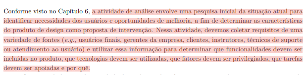
  
Fonte: <a href="#1">(Barbosa et al., 2021)</a>

**Item 05**

Este item foi desenvolvido por [Julia Gabriella](https://github.com/juliagabriellafs).

**Item:** O projeto prevê a adoção de abordagens tecnológicas para automatizar e simplificar a estrutura manual de tarefas?

  
<strong>Figura 33</strong> - Comprovação do Item 05

  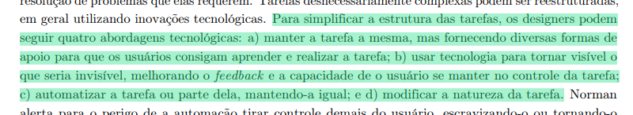
  
Fonte: <a href="#1">(Barbosa et al., 2021)</a>

**Item 06**

Este item foi desenvolvido por [Julia Gabriella](https://github.com/juliagabriellafs).

**Item:** A intervenção tecnológica prioriza a economia de tempo e esforço do usuário ao invés da máquina?

  
<strong>Figura 34</strong> - Comprovação do Item 06

  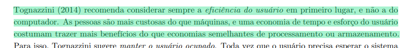
  
Fonte: <a href="#1">(Barbosa et al., 2021)</a>

**Item 07**

Este item foi desenvolvido por [Lucas Oliveira](https://github.com/dev-LucasDpaula).

**Item:** A infraestrutura de hardware necessária foi devidamente especificada?

  
<strong>Figura 35</strong> - Comprovação do Item 07

  
  
Fonte: <a href="#1">(Barbosa et al., 2021)</a>

**Item 08**

Este item foi desenvolvido por [Lucas Oliveira](https://github.com/dev-LucasDpaula).

**Item:** O sistema prevê integração com outras plataformas ou APIs externas?

  
<strong>Figura 36</strong> - Comprovação do Item 08

  
  
Fonte: <a href="#1">(Barbosa et al., 2021)</a>

**Item 09**

Este item foi desenvolvido por [Pedro Américo](https://github.com/dev-americo).

**Item:** A plataforma suporta os requisitos de desempenho esperados para as tarefas?

  
<strong>Figura 37</strong> - Comprovação do Item 09

  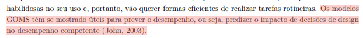
  
Fonte: <a href="#1">(Barbosa et al., 2021)</a>

**Item 10**

Este item foi desenvolvido por [Pedro Américo](https://github.com/dev-americo).

**Item:** Foi verificada a compatibilidade da interface com diferentes resoluções de tela?

  
<strong>Figura 38</strong> - Comprovação do Item 10

  
  
Fonte: <a href="#1">(Barbosa et al., 2021)</a>

**Item 11**

Este item foi desenvolvido por [Pedro Ian](https://github.com/pedroiaan).

**Item:** O ambiente de implantação (web, mobile ou desktop) está claramente definido?

  
<strong>Figura 39</strong> - Comprovação do Item 11

  
  
Fonte: <a href="#1">(Barbosa et al., 2021)</a>

**Item 12**

Este item foi desenvolvido por [Pedro Ian](https://github.com/pedroiaan).

**Item:** Existem restrições de software (Sistemas Operacionais, plugins) identificadas?

  
<strong>Figura 40</strong> - Comprovação do Item 12

  
  
Fonte: <a href="#1">(Barbosa et al., 2021)</a>

**Item 13**

Este item foi desenvolvido por [Pedro Lucas](https://github.com/Pwdrinho).

**Item:** A plataforma permite a escalabilidade futura das funcionalidades propostas?

  
<strong>Figura 41</strong> - Comprovação do Item 13

  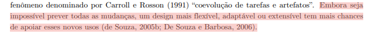
  
Fonte: <a href="#1">(Barbosa et al., 2021)</a>

**Item 14**

Este item foi desenvolvido por [Pedro Lucas](https://github.com/Pwdrinho).

**Item:** A análise identifica se a plataforma evita apresentar informações irrelevantes que competem pela atenção do usuário e reduzem seu foco na tarefa principal?

  
<strong>Figura 42</strong> - Comprovação do Item 14

  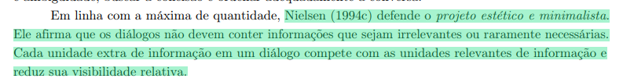
  
Fonte: <a href="#1">(Barbosa et al., 2021)</a>

### Princípios Gerais

**Item 01**

Este item foi desenvolvido por [Breno Teixeira](https://github.com/BrenoLTeixeira).

**Item:** Os princípios gerais apresentam embasamento teórico (Norman, Nielsen, Tognazzini, etc)?

  
<strong>Figura 43</strong> - Comprovação do Item 01

  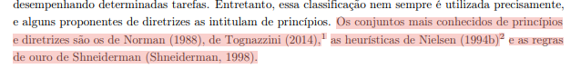
  
Fonte: <a href="#1">(Barbosa et al., 2021)</a>

**Item 02**

Este item foi desenvolvido por [Breno Teixeira](https://github.com/BrenoLTeixeira).

**Item:** Foram explicitadas eventuais violações desses princípios no projeto?

  
<strong>Figura 44</strong> - Comprovação do Item 02

  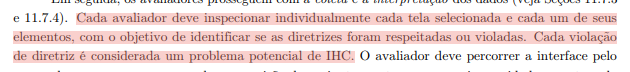
  
Fonte: <a href="#1">(Barbosa et al., 2021)</a>

**Item 03**

Este item foi desenvolvido por [Gabriel Diniz](https://github.com/GabrielDiniz12).

**Item:** Há correspondência entre os princípios do projeto e as expectativas dos usuários?

  
<strong>Figura 45</strong> - Comprovação do Item 03

  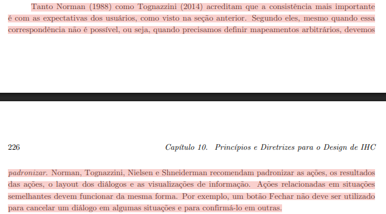
  
Fonte: <a href="#1">(Barbosa et al., 2021)</a>

**Item 04**

Este item foi desenvolvido por [Gabriel Diniz](https://github.com/GabrielDiniz12).

**Item:** O projeto contém simplicidade nas estruturas das tarefas para reduzir o esforço?

  
<strong>Figura 46</strong> - Comprovação do Item 04

  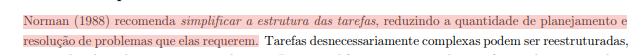
  
Fonte: <a href="#1">(Barbosa et al., 2021)</a>

**Item 05**

Este item foi desenvolvido por [Pedro Américo](https://github.com/dev-americo).

**Item:** O sistema faz uso de restrições (constraints) para impedir ações inválidas acidentalmente?

  
<strong>Figura 47</strong> - Comprovação do Item 05

  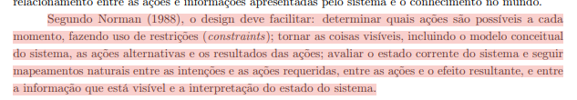
  
Fonte: <a href="#1">(Barbosa et al., 2021)</a>

**Item 06**

Este item foi desenvolvido por [Julia Gabriella](https://github.com/juliagabriellafs).

**Item:** O projeto mantém consistência e padronização visual e funcional em todo o sistema?

  
<strong>Figura 48</strong> - Comprovação do Item 06

  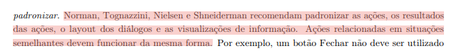
  
Fonte: <a href="#1">(Barbosa et al., 2021)</a>

**Item 07**

Este item foi desenvolvido por [Lucas Oliveira](https://github.com/dev-LucasDpaula).

**Item:** O sistema promove a eficiência do usuário através de atalhos ou fluxos otimizados?

  
<strong>Figura 49</strong> - Comprovação do Item 07

  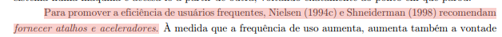
  
Fonte: <a href="#1">(Barbosa et al., 2021)</a>

**Item 08**

Este item foi desenvolvido por [Julia Gabriella](https://github.com/juliagabriellafs).

**Item:** O software toma iniciativa para fornecer informações adicionais úteis (antecipação)?

  
<strong>Figura 50</strong> - Comprovação do Item 08

  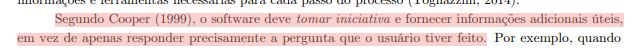
  
Fonte: <a href="#1">(Barbosa et al., 2021)</a>

**Item 09**

Este item foi desenvolvido por [Pedro Américo](https://github.com/dev-americo).

**Item:** A interface prioriza a visibilidade e o reconhecimento em vez da memorização?

  
<strong>Figura 51</strong> - Comprovação do Item 09

  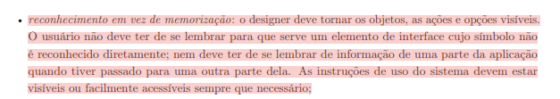
  
Fonte: <a href="#1">(Barbosa et al., 2021)</a>

**Item 10**

Este item foi desenvolvido por [Pedro Ian](https://github.com/pedroiaan).

**Item:** O conteúdo apresentado é relevante e utiliza expressão adequada ao contexto do usuário?

  
<strong>Figura 52</strong> - Comprovação do Item 10

  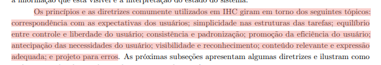
  
Fonte: <a href="#1">(Barbosa et al., 2021)</a>

**Item 11**

Este item foi desenvolvido por [Lucas Oliveira](https://github.com/dev-LucasDpaula).

**Item:** As mensagens de erro sugerem soluções de forma construtiva e clara?

  
<strong>Figura 53</strong> - Comprovação do Item 11

  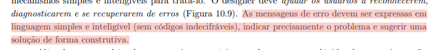
  
Fonte: <a href="#1">(Barbosa et al., 2021)</a>

**Item 12**

Este item foi desenvolvido por [Pedro Ian](https://github.com/pedroiaan).

**Item:** O sistema fornece feedback constante sobre o estado das ações do usuário?

  
<strong>Figura 54</strong> - Comprovação do Item 12

  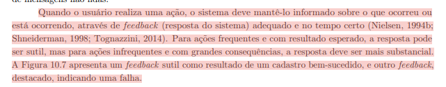
  
Fonte: <a href="#1">(Barbosa et al., 2021)</a>

**Item 13**

Este item foi desenvolvido por [Pedro Lucas](https://github.com/Pwdrinho).

**Item:** A linguagem utilizada na interface é simples e natural para o público-alvo?

  
<strong>Figura 55</strong> - Comprovação do Item 13

  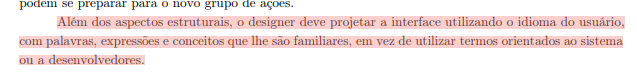
  
Fonte: <a href="#1">(Barbosa et al., 2021)</a>

**Item 14**

Este item foi desenvolvido por [Pedro Lucas](https://github.com/Pwdrinho).

**Item:** O sistema evita que o usuário cometa erros fatais através de mecanismos de prevenção?

  
<strong>Figura 56</strong> - Comprovação do Item 14

  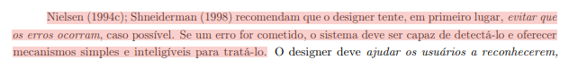
  
Fonte: <a href="#1">(Barbosa et al., 2021)</a>

### Metas de Usabilidade

**Item 01**

Este item foi desenvolvido por [Breno Teixeira](https://github.com/BrenoLTeixeira).

**Item:** O documento utiliza níveis de aceitação estritos (inaceitáveis, aceitáveis e ideais) para medir os indicadores de usabilidade?

  
<strong>Figura 57</strong> - Comprovação do Item 01

  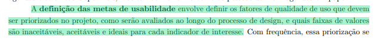
  
Fonte: <a href="#1">(Barbosa et al., 2021)</a>

**Item 02**

Este item foi desenvolvido por [Breno Teixeira](https://github.com/BrenoLTeixeira).

**Item:** As metas de usabilidade estabelecidas têm como base de priorização o desempenho ou a situação atual do sistema?

  
<strong>Figura 58</strong> - Comprovação do Item 02

  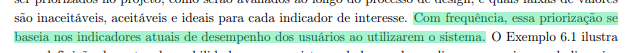
  
Fonte: <a href="#1">(Barbosa et al., 2021)</a>

**Item 03**

Este item foi desenvolvido por [Gabriel Diniz](https://github.com/GabrielDiniz12).

**Item:** O documento estabelece quantificadores exatos (números, proporções, taxas) para seus indicadores de usabilidade?

  
<strong>Figura 59</strong> - Comprovação do Item 03

  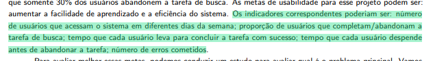
  
Fonte: <a href="#1">(Barbosa et al., 2021)</a>

**Item 04**

Este item foi desenvolvido por [Gabriel Diniz](https://github.com/GabrielDiniz12).

**Item:** As metas de usabilidade integram dados de perfis, tarefas, plataforma e princípios gerais?

  
<strong>Figura 60</strong> - Comprovação do Item 04

  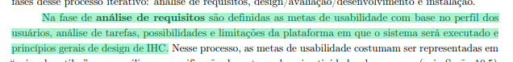
  
Fonte: <a href="#1">(Barbosa et al., 2021)</a>

**Item 05**

Este item foi desenvolvido por [Julia Gabriella](https://github.com/juliagabriellafs).

**Item:** O projeto de design é justificado expressamente pela diferença entre a situação atual do portal e a situação projetada ideal?

  
<strong>Figura 61</strong> - Comprovação do Item 05

  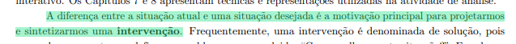
  
Fonte: <a href="#1">(Barbosa et al., 2021)</a>

**Item 06**

Este item foi desenvolvido por [Julia Gabriella](https://github.com/juliagabriellafs).

**Item:** A análise aprofunda-se para identificar a razão funcional real das atividades, indo além da simples constatação de como são feitas hoje?

  
<strong>Figura 62</strong> - Comprovação do Item 06

  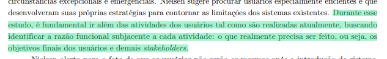
  
Fonte: <a href="#1">(Barbosa et al., 2021)</a>

**Item 07**

Este item foi desenvolvido por [Lucas Oliveira](https://github.com/dev-LucasDpaula).

**Item:** É prevista a execução de avaliações antecipadas utilizando métodos de inspeção, adequados para etapas de concepção inicial?

  
<strong>Figura 63</strong> - Comprovação do Item 07

  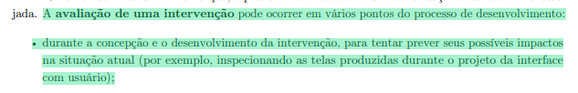
  
Fonte: <a href="#1">(Barbosa et al., 2021)</a>

**Item 08**

Este item foi desenvolvido por [Lucas Oliveira](https://github.com/dev-LucasDpaula).

**Item:** As decisões de design que originam a intervenção estão documentadas de forma explícita (design rationale)?

  
<strong>Figura 64</strong> - Comprovação do Item 08

  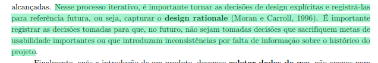
  
Fonte: <a href="#1">(Barbosa et al., 2021)</a>

**Item 09**

Este item foi desenvolvido por [Pedro Lucas](https://github.com/Pwdrinho).

**Item:** A necessidade da intervenção baseia-se em problemas identificados ativamente por uma análise do uso do sistema existente?

  
<strong>Figura 65</strong> - Comprovação do Item 09

  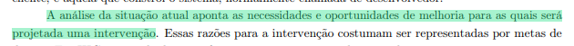
  
Fonte: <a href="#1">(Barbosa et al., 2021)</a>

**Item 10**

Este item foi desenvolvido por [Pedro Américo](https://github.com/dev-americo).

**Item:** As metas de usabilidade consideram o contexto físico da vida do usuário, não se limitando apenas à tela do computador?

  
<strong>Figura 66</strong> - Comprovação do Item 10

  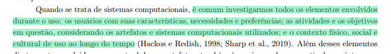
  
Fonte: <a href="#1">(Barbosa et al., 2021)</a>

**Item 11**

Este item foi desenvolvido por [Pedro Ian](https://github.com/pedroiaan).

**Item:** O documento comprova o esforço de avaliar a qualidade de uso já nas fases mais precoces do projeto?

  
<strong>Figura 67</strong> - Comprovação do Item 11

  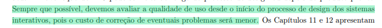
  
Fonte: <a href="#1">(Barbosa et al., 2021)</a>

**Item 12**

Este item foi desenvolvido por [Pedro Ian](https://github.com/pedroiaan).

**Item:** A solução está focada em ajudar os usuários a alcançarem seus objetivos e satisfazer as suas expectativas com a plataforma?

  
<strong>Figura 68</strong> - Comprovação do Item 12

  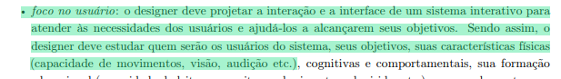
  
Fonte: <a href="#1">(Barbosa et al., 2021)</a>

**Item 13**

Este item foi desenvolvido por [Pedro Ian](https://github.com/pedroiaan).

**Item:** As metas de design adotam os próprios critérios de qualidade (usabilidade, comunicabilidade, etc.) para definir o que o sistema deve fazer?

  
<strong>Figura 69</strong> - Comprovação do Item 13

  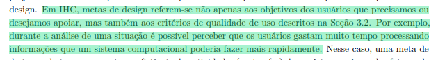
  
Fonte: <a href="#1">(Barbosa et al., 2021)</a>

**Item 14**

Este item foi desenvolvido por [Pedro Lucas](https://github.com/Pwdrinho).

**Item:** O processo apresentado adota uma visão holística que agrupa e integra sistematicamente diversas técnicas e artefatos de áreas complementares de IHC?

  
<strong>Figura 70</strong> - Comprovação do Item 14

  
  
Fonte: <a href="#1">(Barbosa et al., 2021)</a>

---

## Tabelas Utilizadas

### Itens Gerais

<b>Tabela 3</b> - Lista de Verificação de Itens Gerais

| Item | Avaliação | Observação | Avaliador(es) |
| :------------------------------------------------------------------------------------- | :----------: | :-------------------------------------------: | :--------------: |
| **_01:_** O artefato apresenta uma bibliografia/referência bibliográfica? |  |  | [Breno Teixeira](https://github.com/BrenoLTeixeira) |
| **_02:_** O artefato apresenta um histórico de versões com id, item das versões, autores e revisores? |  |  | [Gabriel Diniz](https://github.com/GabrielDiniz12) |
| **_03:_** As tabelas e imagens apresentam legenda e fonte? |  |  | [Julia Gabriella](https://github.com/juliagabriellafs) |
| **_04:_** O artefato apresenta uma introdução? |  |  | [Lucas Oliveira](https://github.com/dev-LucasDpaula) |
| **_05:_** A linguagem utilizada é formal e adequada ao contexto técnico/acadêmico? |  |  | [Pedro Américo](https://github.com/dev-americo) |
| **_06:_** Há coerência entre o conteúdo textual e os artefatos gráficos (tabelas, imagens, fluxogramas)? |  |  | [Pedro Ian](https://github.com/pedroiaan) |
| **_07:_** A gravação da reunião do grupo foi disponibilizada? |  |  | [Pedro Lucas](https://github.com/Pwdrinho) |

Autor: [Lucas Oliveira](https://github.com/dev-LucasDpaula), 2026

### Guia de Estilo

<b>Tabela 4</b> - Avaliação do Guia de Estilo

| Item | Avaliação | Observação | Avaliador(es) |
| :------------------------------------------------------------------------------------- | :----------: | :-------------------------------------------: | :--------------: |
| **_01:_** Existe um tópico de introdução com objetivo e público-alvo? |  |  | [Breno Teixeira](https://github.com/BrenoLTeixeira) |
| **_02:_** O guia define o Layout (grids e proporção) para evitar que a atenção do usuário se desvie por violações de design? |  |  | [Breno Teixeira](https://github.com/BrenoLTeixeira) |
| **_03:_** Existe um subtópico sobre a organização e como manter o guia? |  |  | [Gabriel Diniz](https://github.com/GabrielDiniz12) |
| **_04:_** Há descrição do ambiente de trabalho do usuário nos resultados de análise? |  |  | [Gabriel Diniz](https://github.com/GabrielDiniz12) |
| **_05:_** O guia especifica padrões de janelas, tipografia e cores? |  |  | [Julia Gabriella](https://github.com/juliagabriellafs) |
| **_06:_** Existem definições para símbolos não tipográficos (ícones) e animações? |  |  | [Julia Gabriella](https://github.com/juliagabriellafs) |
| **_07:_** O guia detalha os estilos de interação e como selecionar um deles? |  |  | [Lucas Oliveira](https://github.com/dev-LucasDpaula) |
| **_08:_** Estão definidos aceleradores (teclas de atalho) para o sistema? |  |  | [Lucas Oliveira](https://github.com/dev-LucasDpaula) |
| **_09:_** Existe um tópico para Elementos de Ação (preenchimento e ativação)? |  |  | [Pedro Américo](https://github.com/dev-americo) |
| **_10:_** Há uma seção de Vocabulário e Padrões de terminologia? |  |  | [Pedro Américo](https://github.com/dev-americo) |
| **_11:_** O guia define tipos de tela padrão para tarefas comuns? |  |  | [Pedro Ian](https://github.com/pedroiaan) |
| **_12:_** Estão documentadas as sequências de diálogos da interface? |  |  | [Pedro Ian](https://github.com/pedroiaan) |
| **_13:_** O guia define como as mensagens de erro devem ser construídas para ajudar o usuário a se recuperar de falhas? |  |  | [Pedro Lucas](https://github.com/Pwdrinho) |
| **_14:_** O guia garante a visibilidade do estado do sistema orientando o uso de respostas (feedback) no tempo certo após uma ação? |  |  | [Pedro Lucas](https://github.com/Pwdrinho) |

Autor: [Lucas Oliveira](https://github.com/dev-LucasDpaula), 2026

### Características Gerais

<b>Tabela 5</b> - Avaliação das Características Gerais

| Item | Avaliação | Observação | Avaliador(es) |
| :------------------------------------------------------------------------------------- | :----------: | :-------------------------------------------: | :--------------: |
| **_01:_** São identificadas as características principais da plataforma escolhida para o projeto? |  |  | [Breno Teixeira](https://github.com/BrenoLTeixeira) |
| **_02:_** São identificados os navegadores ou dispositivos específicos que podem acessar o sistema? |  |  | [Breno Teixeira](https://github.com/BrenoLTeixeira) |
| **_03:_** Foram coletados dados sobre a tecnologia disponível para o usuário que podem limitar o uso? |  |  | [Gabriel Diniz](https://github.com/GabrielDiniz12) |
| **_04:_** As funcionalidades da plataforma estão detalhadas no documento de projeto? |  |  | [Gabriel Diniz](https://github.com/GabrielDiniz12) |
| **_05:_** O projeto prevê a adoção de abordagens tecnológicas para automatizar e simplificar a estrutura manual de tarefas? |  |  | [Julia Gabriella](https://github.com/juliagabriellafs) |
| **_06:_** A intervenção tecnológica prioriza a economia de tempo e esforço do usuário ao invés da máquina? |  |  | [Julia Gabriella](https://github.com/juliagabriellafs) |
| **_07:_** A infraestrutura de hardware necessária foi devidamente especificada? |  |  | [Lucas Oliveira](https://github.com/dev-LucasDpaula) |
| **_08:_** O sistema prevê integração com outras plataformas ou APIs externas? |  |  | [Lucas Oliveira](https://github.com/dev-LucasDpaula) |
| **_09:_** A plataforma suporta os requisitos de desempenho esperados para as tarefas? |  |  | [Pedro Américo](https://github.com/dev-americo) |
| **_10:_** Foi verificada a compatibilidade da interface com diferentes resoluções de tela? |  |  | [Pedro Américo](https://github.com/dev-americo) |
| **_11:_** O ambiente de implantação (web, mobile ou desktop) está claramente definido? |  |  | [Pedro Ian](https://github.com/pedroiaan) |
| **_12:_** Existem restrições de software (Sistemas Operacionais, plugins) identificadas? |  |  | [Pedro Ian](https://github.com/pedroiaan) |
| **_13:_** A plataforma permite a escalabilidade futura das funcionalidades propostas? |  |  | [Pedro Lucas](https://github.com/Pwdrinho) |
| **_14:_** A análise identifica se a plataforma evita apresentar informações irrelevantes que competem pela atenção do usuário e reduzem seu foco na tarefa principal? |  |  | [Pedro Lucas](https://github.com/Pwdrinho) |

Autor: [Lucas Oliveira](https://github.com/dev-LucasDpaula), 2026

### Princípios Gerais

<b>Tabela 6</b> - Avaliação dos Princípios Gerais

| Item | Avaliação | Observação | Avaliador(es) |
| :------------------------------------------------------------------------------------- | :----------: | :-------------------------------------------: | :--------------: |
| **_01:_** Os princípios gerais apresentam embasamento teórico (Norman, Nielsen, Tognazzini, etc)? |  |  | [Breno Teixeira](https://github.com/BrenoLTeixeira) |
| **_02:_** Foram explicitadas eventuais violações desses princípios no projeto? |  |  | [Breno Teixeira](https://github.com/BrenoLTeixeira) |
| **_03:_** Há correspondência entre os princípios do projeto e as expectativas dos usuários? |  |  | [Gabriel Diniz](https://github.com/GabrielDiniz12) |
| **_04:_** O projeto contém simplicidade nas estruturas das tarefas para reduzir o esforço? |  |  | [Gabriel Diniz](https://github.com/GabrielDiniz12) |
| **_05:_** O sistema faz uso de restrições (constraints) para impedir ações inválidas acidentalmente? |  |  | [Pedro Américo](https://github.com/dev-americo) |
| **_06:_** O projeto mantém consistência e padronização visual e funcional em todo o sistema? |  |  | [Julia Gabriella](https://github.com/juliagabriellafs) |
| **_07:_** O sistema promove a eficiência do usuário através de atalhos ou fluxos otimizados? |  |  | [Lucas Oliveira](https://github.com/dev-LucasDpaula) |
| **_08:_** O software toma iniciativa para fornecer informações adicionais úteis (antecipação)? |  |  | [Julia Gabriella](https://github.com/juliagabriellafs) |
| **_09:_** A interface prioriza a visibilidade e o reconhecimento em vez da memorização? |  |  | [Pedro Américo](https://github.com/dev-americo) |
| **_10:_** O conteúdo apresentado é relevante e utiliza expressão adequada ao contexto do usuário? |  |  | [Pedro Ian](https://github.com/pedroiaan) |
| **_11:_** As mensagens de erro sugerem soluções de forma construtiva e clara? |  |  | [Lucas Oliveira](https://github.com/dev-LucasDpaula) |
| **_12:_** O sistema fornece feedback constante sobre o estado das ações do usuário? |  |  | [Pedro Ian](https://github.com/pedroiaan) |
| **_13:_** A linguagem utilizada na interface é simples e natural para o público-alvo? |  |  | [Pedro Lucas](https://github.com/Pwdrinho) |
| **_14:_** O sistema evita que o usuário cometa erros fatais através de mecanismos de prevenção? |  |  | [Pedro Lucas](https://github.com/Pwdrinho) |

Autor: [Lucas Oliveira](https://github.com/dev-LucasDpaula), 2026

### Metas de Usabilidade

<b>Tabela 7</b> - Avaliação das Metas de Usabilidade

| Item | Avaliação | Observação | Avaliador(es) |
| :------------------------------------------------------------------------------------- | :----------: | :-------------------------------------------: | :--------------: |
| **_01:_** O documento utiliza níveis de aceitação estritos (inaceitáveis, aceitáveis e ideais) para medir os indicadores de usabilidade? |  |  | [Breno Teixeira](https://github.com/BrenoLTeixeira) |
| **_02:_** As metas de usabilidade estabelecidas têm como base de priorização o desempenho ou a situação atual do sistema? |  |  | [Breno Teixeira](https://github.com/BrenoLTeixeira) |
| **_03:_** O documento estabelece quantificadores exatos (números, proporções, taxas) para seus indicadores de usabilidade? |  |  | [Gabriel Diniz](https://github.com/GabrielDiniz12) |
| **_04:_** As metas de usabilidade integram dados de perfis, tarefas, plataforma e princípios gerais? |  |  | [Gabriel Diniz](https://github.com/GabrielDiniz12) |
| **_05:_** O projeto de design é justificado expressamente pela diferença entre a situação atual do portal e a situação projetada ideal? |  |  | [Julia Gabriella](https://github.com/juliagabriellafs) |
| **_06:_** A análise aprofunda-se para identificar a razão funcional real das atividades, indo além da simples constatação de como são feitas hoje? |  |  | [Julia Gabriella](https://github.com/juliagabriellafs) |
| **_07:_** É prevista a execução de avaliações antecipadas utilizando métodos de inspeção, adequados para etapas de concepção inicial? |  |  | [Lucas Oliveira](https://github.com/dev-LucasDpaula) |
| **_08:_** As decisões de design que originam a intervenção estão documentadas de forma explícita (design rationale)? |  |  | [Lucas Oliveira](https://github.com/dev-LucasDpaula) |
| **_09:_** A necessidade da intervenção baseia-se em problemas identificados ativamente por uma análise do uso do sistema existente? |  |  | [Pedro Lucas](https://github.com/Pwdrinho) |
| **_10:_** As metas de usabilidade consideram o contexto físico da vida do usuário, não se limitando apenas à tela do computador? |  |  | [Pedro Américo](https://github.com/dev-americo) |
| **_11:_** O documento comprova o esforço de avaliar a qualidade de uso já nas fases mais precoces do projeto? |  |  | [Pedro Ian](https://github.com/pedroiaan) |
| **_12:_** A solução está focada em ajudar os usuários a alcançarem seus objetivos e satisfazer as suas expectativas com a plataforma? |  |  | [Pedro Ian](https://github.com/pedroiaan) |
| **_13:_** As metas de design adotam os próprios critérios de qualidade (usabilidade, comunicabilidade, etc.) para definir o que o sistema deve fazer? |  |  | [Pedro Ian](https://github.com/pedroiaan) |
| **_14:_** O processo apresentado adota uma visão holística que agrupa e integra sistematicamente diversas técnicas e artefatos de áreas complementares de IHC? |  |  | [Pedro Lucas](https://github.com/Pwdrinho) |

Autor: [Lucas Oliveira](https://github.com/dev-LucasDpaula), 2026

---

## Referências Bibliográficas

 > 
 BARBOSA, Simone Diniz Junqueira et al. <b>Interação Humano-Computador e Experiência do Usuário</b>. 1. ed. Rio de Janeiro: Simone Diniz Junqueira Barbosa, 2021. E-book. 

 > 
 UNIVERSIDADE DE BRASÍLIA. Campus UnB Gama. **Plano de Ensino: Interação Humano Computador**. Professor: Dr. André Barros de Sales. Semestre 01/2026. Brasília, DF: UnB, 2026. Disponível em: <https://aprender3.unb.br/pluginfile.php/3335948/mod_resource/content/61/Plano_de_Ensino%20FIHC%20012026%20Turma%2003%20v2.pdf>. Acesso em: 21 jun. 2026.

## Histórico de Versões

| Versão | Descrição | Data | Autor(es) | Data de revisão | Revisor(es) |
| :---: | :--- | :---: | :---: | :---: | :---: |
| 1.0 | Avaliação da entrega 3 | 21/06/2026 | [Lucas Oliveira](https://github.com/dev-LucasDpaula) | 22/06/2026 | [Pedro Ian](https://github.com/pedroiaan) |
| 2.0 | Re-avaliação da entrega 3 | 30/06/2026 | [Lucas Oliveira](https://github.com/dev-LucasDpaula) | 30/06/2026 | [Pedro Ian](https://github.com/pedroiaan) |
