## Introdução

Seguindo o principio "quanto mais itens melhor", cada membro do grupo desenvolveu itens de verificação para que a avaliação seja o mais completa possível, esse artefato trata da comprovação de que cada item tem um fundamento de exigência. Dessa forma, este documento detalha os itens de verificação da inspeção dos artefatos desenvolvidos na Etapa 4.

## Metodologia

A metodologia selecionada para esta verificação é a inspeção. Fundamentada na técnica proposta por Michael Fagan (IBM, 1976), esta análise formal visa a detecção precoce de defeitos nos artefatos. O procedimento estrutura-se no uso de checklists que contemplam os erros mais frequentes, permitindo a detecção, análise e categorização rigorosa de inconsistências. Conforme as boas práticas da técnica, a revisão é realizada por pares, garantindo que o autor não seja o revisor do próprio trabalho. Como produto final, os resultados serão consolidados e apresentados por meio de gráficos quantitativos.

## Participantes e Artefatos

Os artefatos analisados e os seus respectivos responsáveis por sua verificação estão descritos na tabela abaixo.

<b>Tabela 1</b> - Artefatos analisados e Participantes Responsáveis 

| Artefato | Responsável |
| --- | --- |
| Guia de Estilo | [Breno Teixeira](https://github.com/BrenoLTeixeira), [Gabriel Diniz](https://github.com/GabrielDiniz12), [Julia Gabriella](https://github.com/juliagabriellafs), [Lucas Oliveira](https://github.com/dev-LucasDpaula), [Pedro Américo](https://github.com/dev-americo), [Pedro Ian](https://github.com/pedroiaan), [Pedro Lucas](https://github.com/Pwdrinho) |
| Características Gerais | [Breno Teixeira](https://github.com/BrenoLTeixeira), [Gabriel Diniz](https://github.com/GabrielDiniz12), [Julia Gabriella](https://github.com/juliagabriellafs), [Lucas Oliveira](https://github.com/dev-LucasDpaula), [Pedro Américo](https://github.com/dev-americo), [Pedro Ian](https://github.com/pedroiaan), [Pedro Lucas](https://github.com/Pwdrinho) |
| Princípios Gerais | [Breno Teixeira](https://github.com/BrenoLTeixeira), [Gabriel Diniz](https://github.com/GabrielDiniz12), [Julia Gabriella](https://github.com/juliagabriellafs), [Lucas Oliveira](https://github.com/dev-LucasDpaula), [Pedro Américo](https://github.com/dev-americo), [Pedro Ian](https://github.com/pedroiaan), [Pedro Lucas](https://github.com/Pwdrinho) |
| Metas de Usabilidade | [Breno Teixeira](https://github.com/BrenoLTeixeira), [Gabriel Diniz](https://github.com/GabrielDiniz12), [Julia Gabriella](https://github.com/juliagabriellafs), [Lucas Oliveira](https://github.com/dev-LucasDpaula), [Pedro Américo](https://github.com/dev-americo), [Pedro Ian](https://github.com/pedroiaan), [Pedro Lucas](https://github.com/Pwdrinho) |

Autor: [Pedro Lucas](https://github.com/Pwdrinho), 2026

## Itens

Abaixo estão os itens referentes a cada artefato ou tópico analisado.

### Itens Gerais

**Item 01**

Este item foi retirado do [Plano de Ensino](#2).

**Item:** O artefato apresenta uma bibliografia/referência bibliográfica?

  
<strong>Figura 1</strong> - Comprovação do Item 01

  
  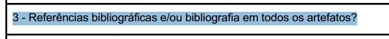

  
Fonte: <a href="#2">(Universidade de Brasília, 2026, p. 7)</a>

**Item 02**

Este item foi retirado do [Plano de Ensino](#2).

**Item:** O artefato apresenta um histórico de versões com id, item das versões, autores e revisores?

  
<strong>Figura 2</strong> - Comprovação do Item 02

  
  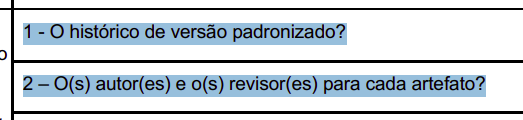

  
Fonte: <a href="#2">(Universidade de Brasília, 2026, p. 7)</a>

**Item 03**

Este item foi retirado do [Plano de Ensino](#2).

**Item:** As tabelas e imagens apresentam legenda e fonte?

  
<strong>Figura 3</strong> - Comprovação do Item 03

  
  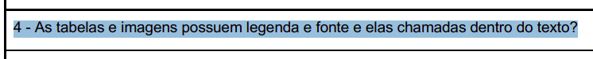

  
Fonte: <a href="#2">(Universidade de Brasília, 2026, p. 7)</a>

**Item 04**

Este item foi retirado do [Plano de Ensino](#2).

**Item:** O artefato apresenta uma introdução?

  
<strong>Figura 4</strong> - Comprovação do Item 04

  
  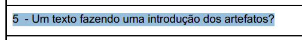

  
Fonte: <a href="#2">(Universidade de Brasília, 2026, p. 7)</a>

**Item 05**

Este item foi retirado do [Guia-ABNT-PUC Minas Gerais](#3).

**Item:** A linguagem utilizada é formal e adequada ao contexto técnico/acadêmico?

  
<strong>Figura 5</strong> - Comprovação do Item 05

  
  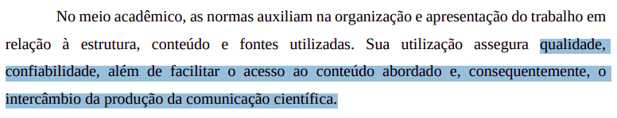

  
Fonte: <a href="#3">(Pontifícia Universidade Católica de Minas Gerais, 2025, p. 4)</a>

**Item 06**

Este item foi retirado do [Plano de Ensino](#2).

**Item:** Há coerência entre o conteúdo textual e os artefatos gráficos (tabelas, imagens, fluxogramas)?

  
<strong>Figura 6</strong> - Comprovação do Item 06

  
  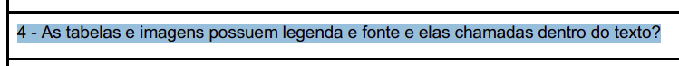

  
Fonte: <a href="#2">(Universidade de Brasília, 2026, p. 7)</a>

**Item 07**

Este item foi retirado do [Plano de Ensino](#2).

**Item:** A gravação da reunião do grupo foi disponibilizada?

  
<strong>Figura 7</strong> - Comprovação do Item 07

  
  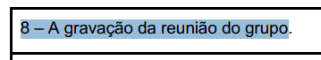

  
Fonte: <a href="#2">(Universidade de Brasília, 2026, p. 7)</a>

### Planejamento da Avaliação do Storyboard

**Item 01** 

Este item foi desenvolvido por [Breno Teixeira](https://github.com/BrenoLTeixeira).

**Item:** O artefato define claramente os objetivos da avaliação do storyboard e descreve-os nos tópicos de introdução ou na definição do DECIDE?

  
<strong>Figura 8</strong> - Comprovação do Item 01

  
  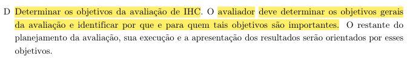

  
Fonte: <a href="#2">(Barbosa et al., 2021, p. 264)</a>

**Item 02** 

Este item foi desenvolvido por [Gabriel Diniz](https://github.com/GabrielDiniz12).

**Item:** O planejamento descreve as perguntas específicas a serem respondidas pela avaliação adaptadas ao contexto da narrativa visual do storyboard?

  
<strong>Figura 9</strong> - Comprovação do Item 02

  
  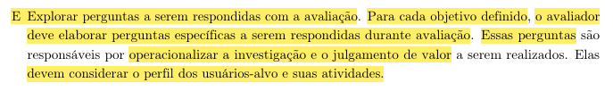

  
Fonte: <a href="#2">(Barbosa et al., 2021, p. 264)</a>

**Item 03** 

Este item foi desenvolvidor por [Júlia Gabriella](https://github.com/juliagabriellafs).

**Item:** O artefato preenche a metodologia escolhida e a justifica formalmente baseando-se em métodos de avaliação de IHC?

  
<strong>Figura 10</strong> - Comprovação do Item 03

  
  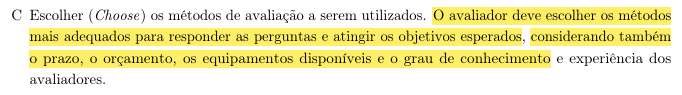

  
Fonte: <a href="#2">(Barbosa et al., 2021, p. 264)</a>

**Item 04** 

Este item foi desenvolvido por [Lucas Oliveira](https://github.com/dev-LucasDpaula).

**Item:** O perfil de participantes descrito no documento e a quantidade selecionada condizem com o Perfil de Usuário Alvo e Personas estipulados no projeto?

  
<strong>Figura 11</strong> - Comprovação do Item 04

  
  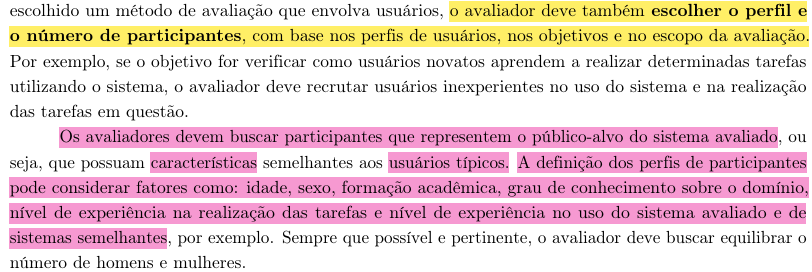

  
Fonte: <a href="#2">(Barbosa et al., 2021, p. 258)</a>

**Item 05** 

Este item foi desenvolvido por [Pedro Américo](https://github.com/dev-americo).

**Item:** As ferramentas, materiais e equipamentos necessários (incluindo o modo de apresentação do storyboard) estão preenchidos na seção de recursos?

  
<strong>Figura 12</strong> - Comprovação do Item 05

  
  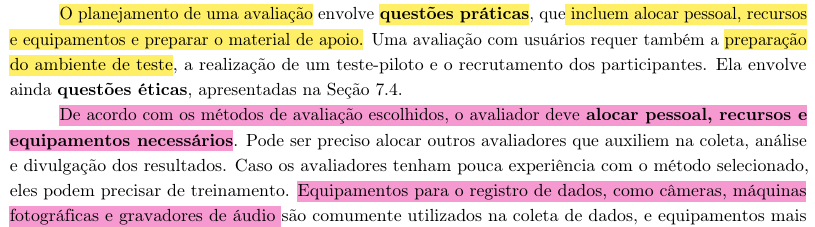

  
Fonte: <a href="#2">(Barbosa et al., 2021, p. 259)</a>

**Item 06** 

Este item foi desenvolvido por [Pedro Ian](https://github.com/pedroiaan).

**Item:** A tabela de Cronograma para a execução da avaliação foi preenchida adequadamente com datas, horários, local e avaliadores responsáveis?

  
<strong>Figura 13</strong> - Comprovação do Item 06

  
  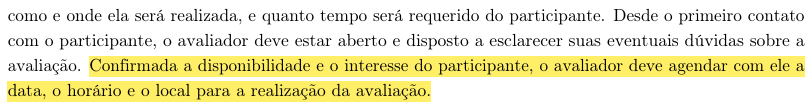

  
Fonte: <a href="#2">(Barbosa et al., 2021, p. 260)</a>

**Item 07** 

Este item foi desenvolvido por [Pedro Lucas](https://github.com/Pwdrinho).

**Item:** O planejamento explicita a utilização e a apresentação de um Termo de Consentimento Livre e Esclarecido (TCLE) aos participantes?

  
<strong>Figura 14</strong> - Comprovação do Item 07

  
  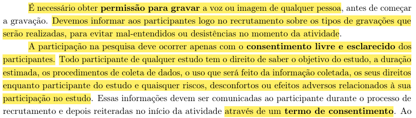

  
Fonte: <a href="#2">(Barbosa et al., 2021, p. 127)</a>

### Relato dos Resultados do Storyboard (Expectativas)

**Item 01** 

Este item foi desenvolvido por [Breno Teixeira](https://github.com/BrenoLTeixeira).

**Item:** O relato preenche adequadamente a seção de introdução descrevendo o objetivo e o escopo esperado para a avaliação do storyboard?

  
<strong>Figura 15</strong> - Comprovação do Item 01

  
  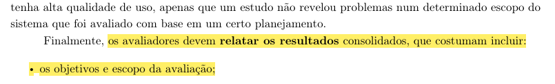

  
Fonte: <a href="#2">(Barbosa et al., 2021, p. 263)</a>

**Item 02** 

Este item foi desenvolvido por [Gabriel Diniz](https://github.com/GabrielDiniz12).

**Item:** A "Metodologia Esperada" está descrita e detalha como os avaliadores planejam conduzir a sessão e os papéis de cada um (entrevistador, anotador)?

  
<strong>Figura 16</strong> - Comprovação do Item 02

  
  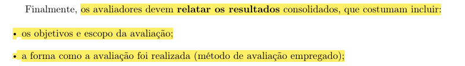

  
Fonte: <a href="#2">(Barbosa et al., 2021, p. 263)</a>

**Item 03** 

Este item foi desenvolvido por [Júlia Gabriella](https://github.com/juliagabriellafs).

**Item:** A seção de "Participantes Esperados" detalha as características almejadas para o usuário e o motivo dessa escolha teórica?

  
<strong>Figura 17</strong> - Comprovação do Item 03

  
  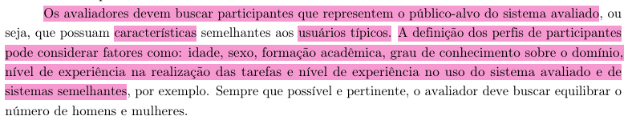

  
Fonte: <a href="#2">(Barbosa et al., 2021, p. 258)</a>

**Item 04** 

Este item foi desenvolvido por [Lucas Oliveira](https://github.com/dev-LucasDpaula).

**Item:** O documento prevê na fase de expectativas um roteiro/script de perguntas ou atividades que serão utilizadas para guiar o usuário?

  
<strong>Figura 18</strong> - Comprovação do Item 04

  
  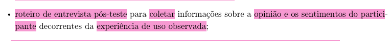

  
Fonte: <a href="#2">(Barbosa et al., 2021, p. 259)</a>

**Item 05** 

Este item foi desenvolvido por [Pedro Américo](https://github.com/dev-americo).

**Item:** O relato documenta a expectativa de como os dados serão registrados e documentados (gravação de áudio/vídeo, anotações de observação)?

  
<strong>Figura 19</strong> - Comprovação do Item 05

  
  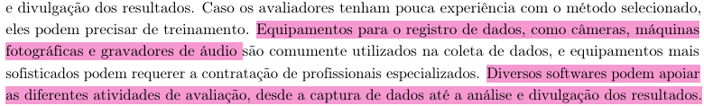

  
Fonte: <a href="#2">(Barbosa et al., 2021, p. 259)</a>

**Item 06** 

Este item foi desenvolvido por [Pedro Ian](https://github.com/pedroiaan).

**Item:** As expectativas abordam como os dados coletados serão tratados e consolidados para identificar problemas de compreensão ou interação?

  
<strong>Figura 20</strong> - Comprovação do Item 06

  
  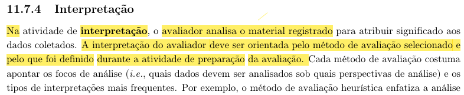

  
Fonte: <a href="#2">(Barbosa et al., 2021, p. 262)</a>

**Item 07** 

Este item foi desenvolvido por [Pedro Lucas](https://github.com/Pwdrinho).

**Item:** O documento estabelece de forma clara quais são os resultados esperados antes da realização das entrevistas práticas com o usuário?

  
<strong>Figura 21</strong> - Comprovação do Item 07

  
  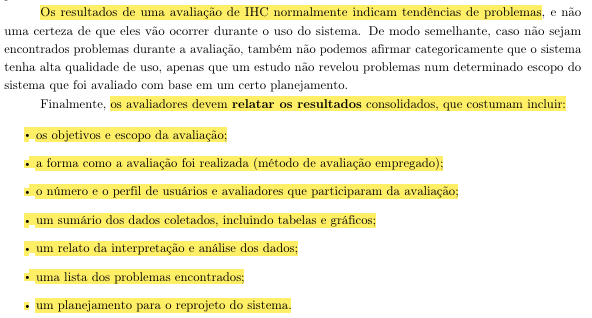

  
Fonte: <a href="#2">(Barbosa et al., 2021, p. 263)</a>

### Planejamento da Avaliação da Análise de Tarefas

**Item 01** 

Este item foi desenvolvido por [Breno Teixeira](https://github.com/BrenoLTeixeira).

**Item:** O documento formaliza as metas da avaliação detalhando o que se deseja validar nos diagramas de Análise de Tarefas (HTA e/ou GOMS)?

  
<strong>Figura 22</strong> - Comprovação do Item 01

  
  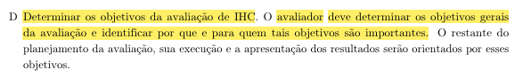

  
Fonte: <a href="#2">(Barbosa et al., 2021, p. 264)</a>

**Item 02** 

Este item foi desenvolvido por [Gabriel Diniz](https://github.com/GabrielDiniz12).

**Item:** As perguntas definidas para a avaliação verificam se os fluxos, sequências e operadores modelados refletem a realidade do usuário?

  
<strong>Figura 23</strong> - Comprovação do Item 02

  
  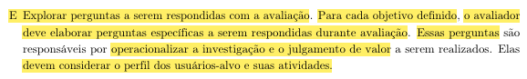

  
Fonte: <a href="#2">(Barbosa et al., 2021, p. 264)</a>

**Item 03** 

Este item foi desenvolvido por [Júlia Gabriella](https://github.com/juliagabriellafs).

**Item:** A metodologia detalha adequadamente como os modelos teóricos (HTA/GOMS) serão explicados e apresentados ao participante durante a avaliação?

  
<strong>Figura 24</strong> - Comprovação do Item 03

  
  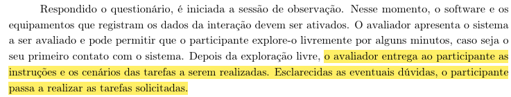

  
Fonte: <a href="#2">(Barbosa et al., 2021, p. 261)</a>

**Item 04** 

Este item foi desenvolvido por [Lucas Oliveira](https://github.com/dev-LucasDpaula).

**Item:** O recrutamento planejado especifica a seleção de participantes que realizariam as tarefas avaliadas em um contexto real de uso?

  
<strong>Figura 25</strong> - Comprovação do Item 04

  
  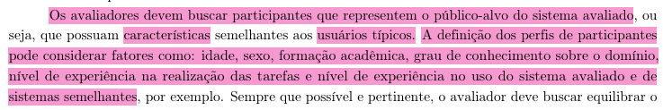

  
Fonte: <a href="#2">(Barbosa et al., 2021, p. 258)</a>

**Item 05** 

Este item foi desenvolvido por [Pedro Américo](https://github.com/dev-americo).

**Item:** Os recursos descritos na preparação (ex: diagramas impressos, telas de apoio, ferramentas de gravação) estão completos e documentados?

  
<strong>Figura 26</strong> - Comprovação do Item 05

  
  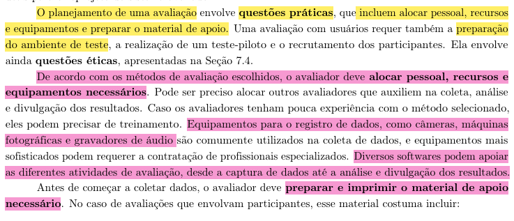

  
Fonte: <a href="#2">(Barbosa et al., 2021, p. 259)</a>

**Item 06** 

Este item foi desenvolvido por [Pedro Ian](https://github.com/pedroiaan).

**Item:** A tabela de cronograma da Análise de Tarefas está preenchida com as estimativas de tempo, data, local e envolvidos nas sessões de teste?

  
<strong>Figura 27</strong> - Comprovação do Item 06

  
  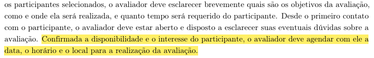

  
Fonte: <a href="#2">(Barbosa et al., 2021, p. 260)</a>

**Item 07** 

Este item foi desenvolvido por [Pedro Lucas](https://github.com/Pwdrinho).

**Item:** O planejamento descreve as diretrizes éticas (uso de TCLE) e assegura que o participante saiba que é o sistema/modelo sendo testado, e não ele?

  
<strong>Figura 28</strong> - Comprovação do Item 07

  
  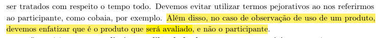

  
Fonte: <a href="#2">(Barbosa et al., 2021, p. 128)</a>

### Relato dos Resultados da Análise de Tarefas (Expectativas)

**Item 01** 

Este item foi desenvolvido por [Breno Teixeira](https://github.com/BrenoLTeixeira).

**Item:** O documento introduz a avaliação apontando claramente quais diagramas/modelos de Análise de Tarefas específicos (HTA/GOMS) serão validados?

  
<strong>Figura 29</strong> - Comprovação do Item 01

  
  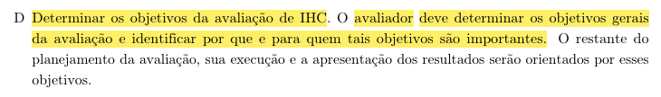

  
Fonte: <a href="#2">(Barbosa et al., 2021, p. 264)</a>

**Item 02** 

Este item foi desenvolvido por [Gabriel Diniz](https://github.com/GabrielDiniz12).

**Item:** O relato preenche as expectativas metodológicas definindo a dinâmica esperada de interação do usuário com a representação das tarefas?

  
<strong>Figura 30</strong> - Comprovação do Item 02

  
  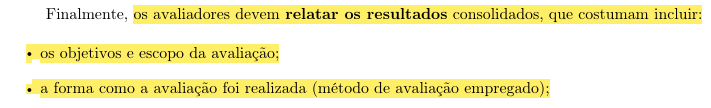

  
Fonte: <a href="#2">(Barbosa et al., 2021, p. 263)</a>

**Item 03** 

Este item foi desenvolvido por [Júlia Gabriella](https://github.com/juliagabriellafs).

**Item:** O documento atende aos requisitos teóricos na expectativa do perfil do usuário, relacionando-o com o domínio do problema modelado?

  
<strong>Figura 31</strong> - Comprovação do Item 03

  
  

  
Fonte: <a href="#2">(Barbosa et al., 2021, p. 263)</a>

**Item 04** 

Este item foi desenvolvido por [Lucas Oliveira](https://github.com/dev-LucasDpaula).

**Item:** A seção de expectativas prevê a utilização de um roteiro de introdução para evitar viés ao explicar os modelos de tarefas para o usuário?

  
<strong>Figura 32</strong> - Comprovação do Item 04

  
  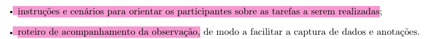

  
Fonte: <a href="#2">(Barbosa et al., 2021, p. 259)</a>

**Item 05** 

Este item foi desenvolvido por [Pedro Américo](https://github.com/dev-americo).

**Item:** O relato aponta na seção de expectativas as ferramentas ou métodos de anotação que serão empregados durante as entrevistas?

  
<strong>Figura 33</strong> - Comprovação do Item 05

  
  

  
Fonte: <a href="#2">(Barbosa et al., 2021, p. 259)</a>

**Item 06** 

Este item foi desenvolvido por [Pedro Ian](https://github.com/pedroiaan).

**Item:**  O artefato descreve a expectativa do grupo em relação aos tipos de feedbacks (ex: identificação de passos omitidos, tarefas desnecessárias)?

  
<strong>Figura 34</strong> - Comprovação do Item 06

  
  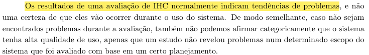

  
Fonte: <a href="#2">(Barbosa et al., 2021, p. 263)</a>

**Item 07** 

Este item foi desenvolvido por [Pedro Lucas](https://github.com/Pwdrinho).

**Item:** As expectativas deixam claro como os gargalos mapeados serão documentados para guiar as futuras correções nos artefatos HTA/GOMS?

  
<strong>Figura 35</strong> - Comprovação do Item 07

  
  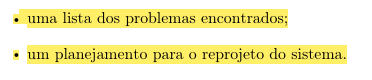

  
Fonte: <a href="#2">(Barbosa et al., 2021, p. 263)</a>

## Tabelas Utilizadas

### Lista de Verificação de Itens Gerais

| Item | Avaliação | Observação | Avaliador(es) |
| :--- | :---: | :---: | :---: |
| **_01:_** O artefato apresenta uma bibliografia/referência bibliográfica? |  |  | [Breno Teixeira](https://github.com/BrenoLTeixeira) |
| **_02:_** O artefato apresenta um histórico de versões com id, item das versões, autores e revisores? |  |  | [Gabriel Diniz](https://github.com/GabrielDiniz12) |
| **_03:_** As tabelas e imagens apresentam legenda e fonte? |  |  | [Júlia Gabriella](https://github.com/juliagabriellafs) |
| **_04:_** O artefato apresenta uma introdução? |  |  | [Lucas Oliveira](https://github.com/dev-LucasDpaula) |
| **_05:_** A linguagem utilizada é formal e adequada ao contexto técnico/acadêmico? |  |  | [Pedro Américo](https://github.com/dev-americo) |
| **_06:_** Há coerência entre o conteúdo textual e os artefatos gráficos (tabelas, imagens, fluxogramas)? |  |  | [Pedro Ian](https://github.com/pedroiaan) |
| **_07:_** A gravação da reunião do grupo foi disponibilizada? |  |  | [Pedro Lucas](https://github.com/Pwdrinho) |

Autor: <a href="https://github.com/pwdrinho">Pedro Lucas</a>

### Lista de Verificação: Planejamento da Avaliação do Storyboard

| Item | Avaliação | Observação | Avaliador(es) |
| :--- | :---: | :---: | :---: |
| **_01:_** O artefato define claramente os objetivos da avaliação do storyboard e descreve-os nos tópicos de introdução ou na definição do DECIDE? |  |  | [Breno Teixeira](https://github.com/BrenoLTeixeira) |
| **_02:_** O planejamento descreve as perguntas específicas a serem respondidas pela avaliação adaptadas ao contexto da narrativa visual do storyboard? |  |  | [Gabriel Diniz](https://github.com/GabrielDiniz12) |
| **_03:_** O artefato preenche a metodologia escolhida e a justifica formalmente baseando-se em métodos de avaliação de IHC? |  |  | [Júlia Gabriella](https://github.com/juliagabriellafs) |
| **_04:_** O perfil de participantes descrito no documento e a quantidade selecionada condizem com o Perfil de Usuário Alvo e Personas estipulados no projeto?|  |  | [Lucas Oliveira](https://github.com/dev-LucasDpaula) |
| **_05:_** As ferramentas, materiais e equipamentos necessários (incluindo o modo de apresentação do storyboard) estão preenchidos na seção de recursos? |  |  | [Pedro Américo](https://github.com/dev-americo) |
| **_06:_** A tabela de Cronograma para a execução da avaliação foi preenchida adequadamente com datas, horários, local e avaliadores responsáveis? |  |  | [Pedro Ian](https://github.com/pedroiaan) |
| **_07:_** O planejamento explicita a utilização e a apresentação de um Termo de Consentimento Livre e Esclarecido (TCLE) aos participantes? |  |  | [Pedro Lucas](https://github.com/Pwdrinho) |

Autor: <a href="https://github.com/pwdrinho">Pedro Lucas</a>

### Lista de Verificação: Relato dos Resultados do Storyboard (Expectativas)

| Item | Avaliação | Observação | Avaliador(es) |
| :--- | :---: | :---: | :---: |
| **_01:_** O relato preenche adequadamente a seção de introdução descrevendo o objetivo e o escopo esperado para a avaliação do storyboard? |  |  | [Breno Teixeira](https://github.com/BrenoLTeixeira) |
| **_02:_** A "Metodologia Esperada" está descrita e detalha como os avaliadores planejam conduzir a sessão e os papéis de cada um (entrevistador, anotador)? |  |  | [Gabriel Diniz](https://github.com/GabrielDiniz12) |
| **_03:_** A seção de "Participantes Esperados" detalha as características almejadas para o usuário e o motivo dessa escolha teórica? |  |  | [Júlia Gabriella](https://github.com/juliagabriellafs) |
| **_04:_** O documento prevê na fase de expectativas um roteiro/script de perguntas ou atividades que serão utilizadas para guiar o usuário? |  |  | [Lucas Oliveira](https://github.com/dev-LucasDpaula) |
| **_05:_** O relato documenta a expectativa de como os dados serão registrados e documentados (gravação de áudio/vídeo, anotações de observação)? |  |  | [Pedro Américo](https://github.com/dev-americo) |
| **_06:_** As expectativas abordam como os dados coletados serão tratados e consolidados para identificar problemas de compreensão ou interação? |  |  | [Pedro Ian](https://github.com/pedroiaan) |
| **_07:_** O documento estabelece de forma clara quais são os resultados esperados antes da realização das entrevistas práticas com o usuário? |  |  | [Pedro Lucas](https://github.com/Pwdrinho) |

Autor: <a href="https://github.com/pwdrinho">Pedro Lucas</a>

### Lista de Verificação: Planejamento da Avaliação da Análise de Tarefas

| Item | Avaliação | Observação | Avaliador(es) |
| :--- | :---: | :---: | :---: |
| **_01:_** O documento formaliza as metas da avaliação detalhando o que se deseja validar nos diagramas de Análise de Tarefas (HTA e/ou GOMS)? |  |  | [Breno Teixeira](https://github.com/BrenoLTeixeira) |
| **_02:_** As perguntas definidas para a avaliação verificam se os fluxos, sequências e operadores modelados refletem a realidade do usuário? |  |  | [Gabriel Diniz](https://github.com/GabrielDiniz12) |
| **_03:_** A metodologia detalha adequadamente como os modelos teóricos (HTA/GOMS) serão explicados e apresentados ao participante durante a avaliação? |  |  | [Júlia Gabriella](https://github.com/juliagabriellafs) |
| **_04:_** O recrutamento planejado especifica a seleção de participantes que realizariam as tarefas avaliadas em um contexto real de uso? |  |  | [Lucas Oliveira](https://github.com/dev-LucasDpaula) |
| **_05:_** Os recursos descritos na preparação (ex: diagramas impressos, telas de apoio, ferramentas de gravação) estão completos e documentados? |  |  | [Pedro Américo](https://github.com/dev-americo) |
| **_06:_** A tabela de cronograma da Análise de Tarefas está preenchida com as estimativas de tempo, data, local e envolvidos nas sessões de teste? |  |  | [Pedro Ian](https://github.com/pedroiaan) |
| **_07:_** O planejamento descreve as diretrizes éticas (uso de TCLE) e assegura que o participante saiba que é o sistema/modelo sendo testado, e não ele? |  |  | [Pedro Lucas](https://github.com/Pwdrinho) |

Autor: <a href="https://github.com/pwdrinho">Pedro Lucas</a>

### Lista de Verificação: Relato dos Resultados da Análise de Tarefas (Expectativas)

| Item | Avaliação | Observação | Avaliador(es) |
| :--- | :---: | :---: | :---: |
| **_01:_** O documento introduz a avaliação apontando claramente quais diagramas/modelos de Análise de Tarefas específicos (HTA/GOMS) serão validados? |  |  | [Breno Teixeira](https://github.com/BrenoLTeixeira) |
| **_02:_** O relato preenche as expectativas metodológicas definindo a dinâmica esperada de interação do usuário com a representação das tarefas? |  |  | [Gabriel Diniz](https://github.com/GabrielDiniz12) |
| **_03:_** O documento atende aos requisitos teóricos na expectativa do perfil do usuário, relacionando-o com o domínio do problema modelado? |  |  | [Júlia Gabriella](https://github.com/juliagabriellafs) |
| **_04:_** A seção de expectativas prevê a utilização de um roteiro de introdução para evitar viés ao explicar os modelos de tarefas para o usuário? |  |  | [Lucas Oliveira](https://github.com/dev-LucasDpaula) |
| **_05:_** O relato aponta na seção de expectativas as ferramentas ou métodos de anotação que serão empregados durante as entrevistas? |  |  | [Pedro Américo](https://github.com/dev-americo) |
| **_06:_** O artefato descreve a expectativa do grupo em relação aos tipos de feedbacks (ex: identificação de passos omitidos, tarefas desnecessárias)? |  |  | [Pedro Ian](https://github.com/pedroiaan) |
| **_07:_** As expectativas deixam claro como os gargalos mapeados serão documentados para guiar as futuras correções nos artefatos HTA/GOMS? |  |  | [Pedro Lucas](https://github.com/Pwdrinho) |

Autor: <a href="https://github.com/pwdrinho">Pedro Lucas</a>

---

## Referências Bibliográficas

 > 
 BARBOSA, Simone Diniz Junqueira et al. <b>Interação Humano-Computador e Experiência do Usuário</b>. 1. ed. Rio de Janeiro: Simone Diniz Junqueira Barbosa, 2021. E-book. 

 > 
 UNIVERSIDADE DE BRASÍLIA. Campus UnB Gama. **Plano de Ensino: Interação Humano Computador**. Professor: Dr. André Barros de Sales. Semestre 01/2026. Brasília, DF: UnB, 2026. Disponível em: <https://aprender3.unb.br/pluginfile.php/3335948/mod_resource/content/61/Plano_de_Ensino%20FIHC%20012026%20Turma%2003%20v2.pdf>. Acesso em: 21 jun. 2026.
 > 
 PONTIFÍCIA UNIVERSIDADE CATÓLICA DE MINAS GERAIS. Sistema Integrado de Bibliotecas. <b>Orientações para elaboração de projetos de pesquisa, trabalhos acadêmicos, relatórios técnicos e/ou científicos e artigos científicos</b>: conforme a Associação Brasileira de Normas Técnicas (ABNT). 6. ed. Belo Horizonte: PUC Minas, 2025. Disponível em: <https://www.pucminas.br/biblioteca/DocumentoBiblioteca/ABNT-GUIA-COMPLETO-Elaborar-formatar-trabalho-cientifico.pdf>. Acesso em: 23 jun. 2026. 

## Histórico de Versões

| Versão | Descrição | Data | Autor(es) | Data de revisão | Revisor(es) |
| :---: | :--- | :---: | :---: | :---: | :---: |
| 1.0 | Lista de verificação entrega 4 | 23/06/2026 | [Pedro Lucas](https://github.com/Pwdrinho) | 23/06/2026 | [Júlia Gabriella](https://github.com/juliagabriellafs) |

