## Introdução

Seguindo o principio "quanto mais itens melhor", cada membro do grupo desenvolveu itens de verificação para que a avaliação seja o mais completa possível, esse artefato trata da comprovação de que cada item tem um fundamento de exigência. Dessa forma, este documento detalha os itens de verificação da inspeção dos artefatos desenvolvidos na Etapa 5.

## Metodologia

A metodologia selecionada para esta verificação é a inspeção. Fundamentada na técnica proposta por Michael Fagan (IBM, 1976), esta análise formal visa a detecção precoce de defeitos nos artefatos. O procedimento estrutura-se no uso de checklists que contemplam os erros mais frequentes, permitindo a detecção, análise e categorização rigorosa de inconsistências. Conforme as boas práticas da técnica, a revisão é realizada por pares, garantindo que o autor não seja o revisor do próprio trabalho. Como produto final, os resultados serão consolidados e apresentados por meio de gráficos quantitativos.

## Itens

Abaixo estão os itens referentes a cada artefato ou tópico analisado.

### Itens Gerais

**Item 01**

Este item foi retirado do [Plano de Ensino](#2).

**Item:** O artefato apresenta uma bibliografia/referência bibliográfica?

  
<strong>Figura 1</strong> - Comprovação do Item 01

  
  

  
Fonte: <a href="#2">(Universidade de Brasília, 2026, p. 7)</a>

**Item 02**

Este item foi retirado do [Plano de Ensino](#2).

**Item:** O artefato apresenta um histórico de versões com id, item das versões, autores e revisores?

  
<strong>Figura 2</strong> - Comprovação do Item 02

  
  

  
Fonte: <a href="#2">(Universidade de Brasília, 2026, p. 7)</a>

**Item 03**

Este item foi retirado do [Plano de Ensino](#2).

**Item:** As tabelas e imagens apresentam legenda e fonte?

  
<strong>Figura 3</strong> - Comprovação do Item 03

  
  

  
Fonte: <a href="#2">(Universidade de Brasília, 2026, p. 7)</a>

**Item 04**

Este item foi retirado do [Plano de Ensino](#2).

**Item:** O artefato apresenta uma introdução?

  
<strong>Figura 4</strong> - Comprovação do Item 04

  
  

  
Fonte: <a href="#2">(Universidade de Brasília, 2026, p. 7)</a>

**Item 05**

Este item foi retirado do [Guia-ABNT-PUC Minas Gerais](#3).

**Item:** A linguagem utilizada é formal e adequada ao contexto técnico/acadêmico?

  
<strong>Figura 5</strong> - Comprovação do Item 05

  
  

  
Fonte: <a href="#3">(Pontifícia Universidade Católica de Minas Gerais, 2025, p. 4)</a>

**Item 06**

Este item foi retirado do [Plano de Ensino](#2).

**Item:** Há coerência entre o conteúdo textual e os artefatos gráficos (tabelas, imagens, fluxogramas)?

  
<strong>Figura 6</strong> - Comprovação do Item 06

  
  

  
Fonte: <a href="#2">(Universidade de Brasília, 2026, p. 7)</a>

**Item 07**

Este item foi retirado do [Plano de Ensino](#2).

**Item:** A gravação da reunião do grupo foi disponibilizada?

  
<strong>Figura 7</strong> - Comprovação do Item 07

  
  

  
Fonte: <a href="#2">(Universidade de Brasília, 2026, p. 7)</a>

### Relato dos Resultados do Storyboard

**Item 01**

Este item foi desenvolvido por [Breno Teixeira](https://github.com/BrenoLTeixeira).

**Item:** O relato descreve os objetivos da avaliação do storyboard que motivaram sua realização?

  
<strong>Figura 8</strong> - Comprovação do Item 01

  
  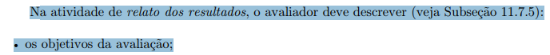

  
Fonte: <a href="#1">(Barbosa et al., 2021, p. 303)</a>

**Item 02**

Este item foi desenvolvido por [Gabriel Diniz](https://github.com/GabrielDiniz12).

**Item:** O relato inclui uma breve descrição do método utilizado para auxiliar o leitor a compreender como os resultados foram obtidos?

  
<strong>Figura 9</strong> - Comprovação do Item 02

  
  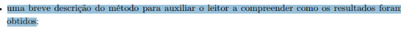

  
Fonte: <a href="#1">(Barbosa et al., 2021, p. 303)</a>

**Item 03**

Este item foi desenvolvido por [Júlia Gabriella](https://github.com/juliagabriellafs).

**Item:** O relato informa o número e o perfil dos avaliadores e dos participantes que tomaram parte na avaliação?

  
<strong>Figura 10</strong> - Comprovação do Item 03

  
  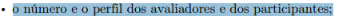

  
Fonte: <a href="#1">(Barbosa et al., 2021, p. 303)</a>

**Item 04**

Este item foi desenvolvido por [Lucas Oliveira](https://github.com/dev-LucasDpaula).

**Item:** O relato descreve as tarefas executadas pelos participantes durante a sessão de avaliação?

  
<strong>Figura 11</strong> - Comprovação do Item 04

  
  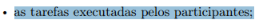

  
Fonte: <a href="#1">(Barbosa et al., 2021, p. 303)</a>

**Item 05**

Este item foi desenvolvido por [Pedro Américo](https://github.com/dev-americo).

**Item:** O relato apresenta os problemas de comunicabilidade encontrados, com indicação do local onde ocorreram e justificativa?

  
<strong>Figura 12</strong> - Comprovação do Item 05

  
  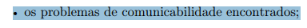

  
Fonte: <a href="#1">(Barbosa et al., 2021, p. 303)</a>

**Item 06**

Este item foi desenvolvido por [Pedro Ian](https://github.com/pedroiaan).

**Item:** O relato apresenta sugestões de melhoria para os problemas identificados na avaliação do storyboard?

  
<strong>Figura 13</strong> - Comprovação do Item 06

  
  

  
Fonte: <a href="#1">(Barbosa et al., 2021, p. 303)</a>

**Item 07**

Este item foi desenvolvido por [Pedro Lucas](https://github.com/Pwdrinho).

**Item:** O relato prioriza a correção dos problemas não resolvidos e apresenta propostas de encaminhamento para o reprojeto?

  
<strong>Figura 14</strong> - Comprovação do Item 07

  
  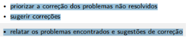

  
Fonte: <a href="#1">(Barbosa et al., 2021, p. 305)</a>

### Relato dos Resultados da Análise de Tarefas

**Item 01**

Este item foi desenvolvido por [Breno Teixeira](https://github.com/BrenoLTeixeira).

**Item:** O relato descreve os objetivos e o escopo da avaliação realizada sobre os modelos de análise de tarefas (HTA/GOMS)?

  
<strong>Figura 15</strong> - Comprovação do Item 01

  
  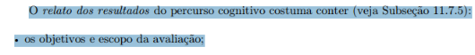

  
Fonte: <a href="#1">(Barbosa et al., 2021, p. 275)</a>

**Item 02**

Este item foi desenvolvido por [Gabriel Diniz](https://github.com/GabrielDiniz12).

**Item:** O relato inclui uma breve descrição do método de avaliação empregado para auxiliar o leitor a compreender como os resultados foram obtidos?

  
<strong>Figura 16</strong> - Comprovação do Item 02

  
  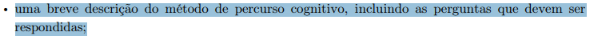

  
Fonte: <a href="#1">(Barbosa et al., 2021, p. 275)</a>

**Item 03**

Este item foi desenvolvido por [Júlia Gabriella](https://github.com/juliagabriellafs).

**Item:** O relato informa o número e o perfil dos avaliadores e dos participantes envolvidos na avaliação?

  
<strong>Figura 17</strong> - Comprovação do Item 03

  
  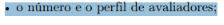

  
Fonte: <a href="#1">(Barbosa et al., 2021, p. 275)</a>

**Item 04**

Este item foi desenvolvido por [Lucas Oliveira](https://github.com/dev-LucasDpaula).

**Item:** O relato descreve as tarefas executadas pelos participantes durante a sessão de avaliação dos modelos de análise de tarefas?

  
<strong>Figura 18</strong> - Comprovação do Item 04

  
  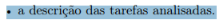

  
Fonte: <a href="#1">(Barbosa et al., 2021, p. 275)</a>

**Item 05**

Este item foi desenvolvido por [Pedro Américo](https://github.com/dev-americo).

**Item:** O relato apresenta uma lista dos problemas encontrados, indicando para cada um o local onde ocorreu, a descrição e justificativa, os fatores de usabilidade prejudicados e as sugestões de solução?

  
<strong>Figura 19</strong> - Comprovação do Item 05

  
  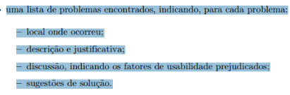

  
Fonte: <a href="#1">(Barbosa et al., 2021, p. 290)</a>

**Item 06**

Este item foi desenvolvido por [Pedro Ian](https://github.com/pedroiaan).

**Item:** O relato registra o feedback dos usuários, incluindo opiniões e dificuldades expressas durante ou após a execução das tarefas?

  
<strong>Figura 20</strong> - Comprovação do Item 06

  
  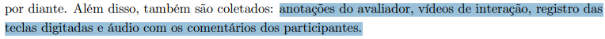

  
Fonte: <a href="#1">(Barbosa et al., 2021, p. 289)</a>

**Item 07**

Este item foi desenvolvido por [Pedro Lucas](https://github.com/Pwdrinho).

**Item:** O relato inclui um planejamento de reprojeto com indicações de correções nos modelos HTA/GOMS com base nos problemas identificados?

  
<strong>Figura 21</strong> - Comprovação do Item 07

  
  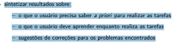

  
Fonte: <a href="#1">(Barbosa et al., 2021, p. 273)</a>

### Planejamento da Avaliação do Protótipo de Papel

**Item 01**

Este item foi desenvolvido por [Breno Teixeira](https://github.com/BrenoLTeixeira).

**Item:** O protótipo de papel representa e destaca os elementos principais da interface com os quais o usuário vai interagir durante a simulação, sem incluir detalhes gráficos irrelevantes para a avaliação?

  
<strong>Figura 22</strong> - Comprovação do Item 01

  
  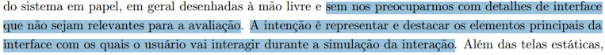

  
Fonte: <a href="#1">(Barbosa et al., 2021, p. 303)</a>

**Item 02**

Este item foi desenvolvido por [Gabriel Diniz](https://github.com/GabrielDiniz12).

**Item:** Foram preparados pedaços de papel avulsos para simular as partes da interface que se modificam dinamicamente durante a interação, como menus, listas e diálogos?

  
<strong>Figura 23</strong> - Comprovação do Item 02

  
  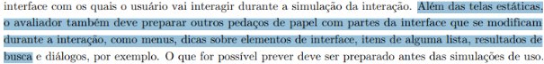

  
Fonte: <a href="#1">(Barbosa et al., 2021, p. 303)</a>

**Item 03**

Este item foi desenvolvido por [Júlia Gabriella](https://github.com/juliagabriellafs).

**Item:** O planejamento define claramente as tarefas específicas que os participantes deverão executar durante a interação com o protótipo?

  
<strong>Figura 24</strong> - Comprovação do Item 03

  
  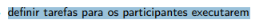

  
Fonte: <a href="#1">(Barbosa et al., 2021, p. 304)</a>

**Item 04**

Este item foi desenvolvido por [Lucas Oliveira](https://github.com/dev-LucasDpaula).

**Item:** O planejamento estabelece o perfil desejado dos participantes e descreve como será feito o seu recrutamento?

  
<strong>Figura 25</strong> - Comprovação do Item 04

  
  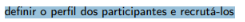

  
Fonte: <a href="#1">(Barbosa et al., 2021, p. 304)</a>

**Item 05**

Este item foi desenvolvido por [Pedro Américo](https://github.com/dev-americo).

**Item:** O planejamento especifica que a interação com o protótipo de papel ocorrerá com a mediação do avaliador, que simulará o comportamento do sistema sem fornecer explicações ou orientações ao usuário?

  
<strong>Figura 26</strong> - Comprovação do Item 05

  
  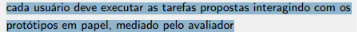

  
Fonte: <a href="#1">(Barbosa et al., 2021, p. 304)</a>

**Item 06**

Este item foi desenvolvido por [Pedro Ian](https://github.com/pedroiaan).

**Item:** O planejamento prevê a execução de um teste-piloto antes da avaliação real para verificar a adequação dos protótipos, dos materiais e das instruções?

  
<strong>Figura 27</strong> - Comprovação do Item 06

  
  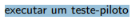

  
Fonte: <a href="#1">(Barbosa et al., 2021, p. 304)</a>

**Item 07**

Este item foi desenvolvido por [Pedro Lucas](https://github.com/Pwdrinho).

**Item:** O planejamento prevê o uso de um Termo de Consentimento Livre e Esclarecido (TCLE) e orienta o avaliador a enfatizar que é o protótipo — e não a capacidade do usuário — que está sendo avaliado?

  
<strong>Figura 28</strong> - Comprovação do Item 07

  
  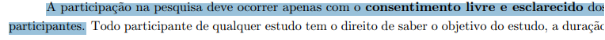

  
Fonte: <a href="#1">(Barbosa et al., 2021, p. 128)</a>

### Planejamento do Relato dos Resultados do Protótipo de Papel

**Item 01**

Este item foi desenvolvido por [Breno Teixeira](https://github.com/BrenoLTeixeira).

**Item:** O planejamento do relato prevê a descrição dos objetivos da avaliação e de uma breve descrição do método de prototipação em papel?

  
<strong>Figura 29</strong> - Comprovação do Item 01

  
  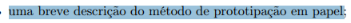

  
Fonte: <a href="#1">(Barbosa et al., 2021, p. 306)</a>

**Item 02**

Este item foi desenvolvido por [Gabriel Diniz](https://github.com/GabrielDiniz12).

**Item:** O planejamento do relato prevê o registro do número e do perfil dos avaliadores e dos participantes, bem como das tarefas executadas por eles?

  
<strong>Figura 30</strong> - Comprovação do Item 02

  
  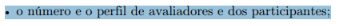

  
Fonte: <a href="#1">(Barbosa et al., 2021, p. 306)</a>

**Item 03**

Este item foi desenvolvido por [Júlia Gabriella](https://github.com/juliagabriellafs).

**Item:** O planejamento do relato prevê uma lista dos problemas de usabilidade corrigidos durante os ciclos de avaliação e reprojeto em papel, indicando: local onde ocorreu, fatores de usabilidade prejudicados, descrição e justificativa do problema, correção realizada e se o problema voltou a ocorrer após a correção?

  
<strong>Figura 31</strong> - Comprovação do Item 03

  
  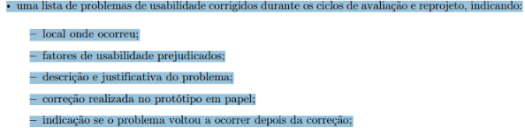

  
Fonte: <a href="#1">(Barbosa et al., 2021, p. 306)</a>

**Item 04**

Este item foi desenvolvido por [Lucas Oliveira](https://github.com/dev-LucasDpaula).

**Item:** O planejamento do relato prevê uma lista dos problemas de usabilidade ainda não corrigidos, indicando: local onde ocorreu, fatores de usabilidade prejudicados, descrição e justificativa do problema, prioridade para correção, sugestões de correção e indicações de partes do sistema que podem ser mais bem elaboradas?

  
<strong>Figura 32</strong> - Comprovação do Item 04

  
  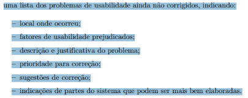

  
Fonte: <a href="#1">(Barbosa et al., 2021, p. 306)</a>

**Item 05**

Este item foi desenvolvido por [Pedro Américo](https://github.com/dev-americo).

**Item:** O planejamento do relato prevê a priorização dos problemas não corrigidos com base na gravidade (o quanto prejudicaram a interação) e na frequência com que ocorreram?

  
<strong>Figura 33</strong> - Comprovação do Item 05

  
  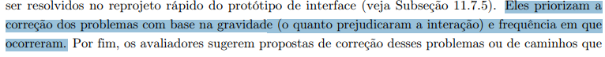

  
Fonte: <a href="#1">(Barbosa et al., 2021, p. 305)</a>

**Item 06**

Este item foi desenvolvido por [Pedro Ian](https://github.com/pedroiaan).

**Item:** O planejamento do relato prevê o registro do feedback dos participantes, incluindo opiniões e verbalizações espontâneas coletadas durante ou após a interação com o protótipo?

  
<strong>Figura 34</strong> - Comprovação do Item 06

  
  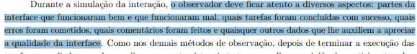

  
Fonte: <a href="#1">(Barbosa et al., 2021, p. 305)</a>

**Item 07**

Este item foi desenvolvido por [Pedro Lucas](https://github.com/Pwdrinho).

**Item:** O planejamento do relato prevê um planejamento de reprojeto que preserve a estrutura e a intenção original do design, realizando apenas as alterações necessárias para corrigir os problemas identificados?

  
<strong>Figura 35</strong> - Comprovação do Item 07

  
  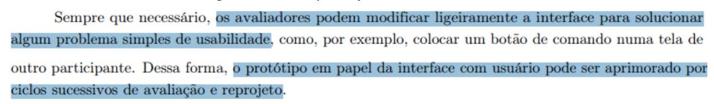

  
Fonte: <a href="#1">(Barbosa et al., 2021, p. 305)</a>

---

## Tabelas Utilizadas

### Lista de Verificação de Itens Gerais

| Item | Avaliação | Observação | Avaliador(es) |
| :--- | :---: | :---: | :---: |
| **_01:_** O artefato apresenta uma bibliografia/referência bibliográfica? |  |  | [Breno Teixeira](https://github.com/BrenoLTeixeira) |
| **_02:_** O artefato apresenta um histórico de versões com id, item das versões, autores e revisores? |  |  | [Gabriel Diniz](https://github.com/GabrielDiniz12) |
| **_03:_** As tabelas e imagens apresentam legenda e fonte? |  |  | [Júlia Gabriella](https://github.com/juliagabriellafs) |
| **_04:_** O artefato apresenta uma introdução? |  |  | [Lucas Oliveira](https://github.com/dev-LucasDpaula) |
| **_05:_** A linguagem utilizada é formal e adequada ao contexto técnico/acadêmico? |  |  | [Pedro Américo](https://github.com/dev-americo) |
| **_06:_** Há coerência entre o conteúdo textual e os artefatos gráficos (tabelas, imagens, fluxogramas)? |  |  | [Pedro Ian](https://github.com/pedroiaan) |
| **_07:_** A gravação da reunião do grupo foi disponibilizada? |  |  | [Pedro Lucas](https://github.com/Pwdrinho) |

Autor: <a href="https://github.com/GabrielDiniz12">Gabriel Diniz</a>

### Lista de Verificação: Relato dos Resultados do Storyboard

| Item | Avaliação | Observação | Avaliador(es) |
| :--- | :---: | :---: | :---: |
| **_01:_** O relato descreve os objetivos da avaliação do storyboard que motivaram sua realização? |  |  | [Breno Teixeira](https://github.com/BrenoLTeixeira) |
| **_02:_** O relato inclui uma breve descrição do método utilizado para auxiliar o leitor a compreender como os resultados foram obtidos? |  |  | [Gabriel Diniz](https://github.com/GabrielDiniz12) |
| **_03:_** O relato informa o número e o perfil dos avaliadores e dos participantes que tomaram parte na avaliação? |  |  | [Júlia Gabriella](https://github.com/juliagabriellafs) |
| **_04:_** O relato descreve as tarefas executadas pelos participantes durante a sessão de avaliação? |  |  | [Lucas Oliveira](https://github.com/dev-LucasDpaula) |
| **_05:_** O relato apresenta os problemas de comunicabilidade encontrados, com indicação do local onde ocorreram e justificativa? |  |  | [Pedro Américo](https://github.com/dev-americo) |
| **_06:_** O relato apresenta sugestões de melhoria para os problemas identificados na avaliação do storyboard? |  |  | [Pedro Ian](https://github.com/pedroiaan) |
| **_07:_** O relato prioriza a correção dos problemas não resolvidos e apresenta propostas de encaminhamento para o reprojeto? |  |  | [Pedro Lucas](https://github.com/Pwdrinho) |

Autor: <a href="https://github.com/GabrielDiniz12">Gabriel Diniz</a>

### Lista de Verificação: Relato dos Resultados da Análise de Tarefas

| Item | Avaliação | Observação | Avaliador(es) |
| :--- | :---: | :---: | :---: |
| **_01:_** O relato descreve os objetivos e o escopo da avaliação realizada sobre os modelos de análise de tarefas (HTA/GOMS)? |  |  | [Breno Teixeira](https://github.com/BrenoLTeixeira) |
| **_02:_** O relato inclui uma breve descrição do método de avaliação empregado para auxiliar o leitor a compreender como os resultados foram obtidos? |  |  | [Gabriel Diniz](https://github.com/GabrielDiniz12) |
| **_03:_** O relato informa o número e o perfil dos avaliadores e dos participantes envolvidos na avaliação? |  |  | [Júlia Gabriella](https://github.com/juliagabriellafs) |
| **_04:_** O relato descreve as tarefas executadas pelos participantes durante a sessão de avaliação dos modelos de análise de tarefas? |  |  | [Lucas Oliveira](https://github.com/dev-LucasDpaula) |
| **_05:_** O relato apresenta uma lista dos problemas encontrados, indicando para cada um o local onde ocorreu, a descrição e justificativa, os fatores de usabilidade prejudicados e as sugestões de solução? |  |  | [Pedro Américo](https://github.com/dev-americo) |
| **_06:_** O relato registra o feedback dos usuários, incluindo opiniões e dificuldades expressas durante ou após a execução das tarefas? |  |  | [Pedro Ian](https://github.com/pedroiaan) |
| **_07:_** O relato inclui um planejamento de reprojeto com indicações de correções nos modelos HTA/GOMS com base nos problemas identificados? |  |  | [Pedro Lucas](https://github.com/Pwdrinho) |

Autor: <a href="https://github.com/GabrielDiniz12">Gabriel Diniz</a>

### Lista de Verificação: Planejamento da Avaliação do Protótipo de Papel

| Item | Avaliação | Observação | Avaliador(es) |
| :--- | :---: | :---: | :---: |
| **_01:_** O protótipo de papel representa e destaca os elementos principais da interface com os quais o usuário vai interagir durante a simulação, sem incluir detalhes gráficos irrelevantes para a avaliação? |  |  | [Breno Teixeira](https://github.com/BrenoLTeixeira) |
| **_02:_** Foram preparados pedaços de papel avulsos para simular as partes da interface que se modificam dinamicamente durante a interação, como menus, listas e diálogos? |  |  | [Gabriel Diniz](https://github.com/GabrielDiniz12) |
| **_03:_** O planejamento define claramente as tarefas específicas que os participantes deverão executar durante a interação com o protótipo? |  |  | [Júlia Gabriella](https://github.com/juliagabriellafs) |
| **_04:_** O planejamento estabelece o perfil desejado dos participantes e descreve como será feito o seu recrutamento? |  |  | [Lucas Oliveira](https://github.com/dev-LucasDpaula) |
| **_05:_** O planejamento especifica que a interação com o protótipo de papel ocorrerá com a mediação do avaliador, que simulará o comportamento do sistema sem fornecer explicações ou orientações ao usuário? |  |  | [Pedro Américo](https://github.com/dev-americo) |
| **_06:_** O planejamento prevê a execução de um teste-piloto antes da avaliação real para verificar a adequação dos protótipos, dos materiais e das instruções? |  |  | [Pedro Ian](https://github.com/pedroiaan) |
| **_07:_** O planejamento prevê o uso de um Termo de Consentimento Livre e Esclarecido (TCLE) e orienta o avaliador a enfatizar que é o protótipo — e não a capacidade do usuário — que está sendo avaliado? |  |  | [Pedro Lucas](https://github.com/Pwdrinho) |

Autor: <a href="https://github.com/GabrielDiniz12">Gabriel Diniz</a>

### Lista de Verificação: Planejamento do Relato dos Resultados do Protótipo de Papel

| Item | Avaliação | Observação | Avaliador(es) |
| :--- | :---: | :---: | :---: |
| **_01:_** O planejamento do relato prevê a descrição dos objetivos da avaliação e de uma breve descrição do método de prototipação em papel? |  |  | [Breno Teixeira](https://github.com/BrenoLTeixeira) |
| **_02:_** O planejamento do relato prevê o registro do número e do perfil dos avaliadores e dos participantes, bem como das tarefas executadas por eles? |  |  | [Gabriel Diniz](https://github.com/GabrielDiniz12) |
| **_03:_** O planejamento do relato prevê uma lista dos problemas de usabilidade corrigidos durante os ciclos de avaliação e reprojeto em papel, indicando: local onde ocorreu, fatores de usabilidade prejudicados, descrição e justificativa do problema, correção realizada e se o problema voltou a ocorrer após a correção? |  |  | [Júlia Gabriella](https://github.com/juliagabriellafs) |
| **_04:_** O planejamento do relato prevê uma lista dos problemas de usabilidade ainda não corrigidos, indicando: local onde ocorreu, fatores de usabilidade prejudicados, descrição e justificativa do problema, prioridade para correção, sugestões de correção e indicações de partes do sistema que podem ser mais bem elaboradas? |  |  | [Lucas Oliveira](https://github.com/dev-LucasDpaula) |
| **_05:_** O planejamento do relato prevê a priorização dos problemas não corrigidos com base na gravidade (o quanto prejudicaram a interação) e na frequência com que ocorreram? |  |  | [Pedro Américo](https://github.com/dev-americo) |
| **_06:_** O planejamento do relato prevê o registro do feedback dos participantes, incluindo opiniões e verbalizações espontâneas coletadas durante ou após a interação com o protótipo? |  |  | [Pedro Ian](https://github.com/pedroiaan) |
| **_07:_** O planejamento do relato prevê um planejamento de reprojeto que preserve a estrutura e a intenção original do design, realizando apenas as alterações necessárias para corrigir os problemas identificados? |  |  | [Pedro Lucas](https://github.com/Pwdrinho) |

Autor: <a href="https://github.com/GabrielDiniz12">Gabriel Diniz</a>

---

## Referências Bibliográficas

 > 
 BARBOSA, Simone Diniz Junqueira et al. <b>Interação Humano-Computador e Experiência do Usuário</b>. 1. ed. Rio de Janeiro: Simone Diniz Junqueira Barbosa, 2021. E-book. 

 > 
 UNIVERSIDADE DE BRASÍLIA. Campus UnB Gama. **Plano de Ensino: Interação Humano Computador**. Professor: Dr. André Barros de Sales. Semestre 01/2026. Brasília, DF: UnB, 2026. Disponível em: <https://aprender3.unb.br/pluginfile.php/3335948/mod_resource/content/61/Plano_de_Ensino%20FIHC%20012026%20Turma%2003%20v2.pdf>. Acesso em: 21 jun. 2026.
 > 
 PONTIFÍCIA UNIVERSIDADE CATÓLICA DE MINAS GERAIS. Sistema Integrado de Bibliotecas. <b>Orientações para elaboração de projetos de pesquisa, trabalhos acadêmicos, relatórios técnicos e/ou científicos e artigos científicos</b>: conforme a Associação Brasileira de Normas Técnicas (ABNT). 6. ed. Belo Horizonte: PUC Minas, 2025. Disponível em: <https://www.pucminas.br/biblioteca/DocumentoBiblioteca/ABNT-GUIA-COMPLETO-Elaborar-formatar-trabalho-cientifico.pdf>. Acesso em: 23 jun. 2026. 

## Histórico de Versões

| Versão | Descrição | Data | Autor(es) | Data de revisão | Revisor(es) |
| :---: | :--- | :---: | :---: | :---: | :---: |
| 1.0 | Avaliação da entrega 1 | 21/06/2026 | [Gabriel Diniz](https://github.com/GabrielDiniz12) | 22/06/2026 | [Pedro Américo](https://github.com/dev-americo) |