## Introdução

Seguindo o principio "quanto mais itens melhor", cada membro do grupo desenvolvel itens de verificação para que a avaliação seja o mais completa possível, esse artefato trata da comprovação de que cada item tem um fundamento de exigência. Dessa forma, este documento detalha os itens de verificação da inspeção dos artefatos desenvolvidos na Etapa 6.

## Metodologia

A metodologia selecionada para esta verificação é a inspeção. Fundamentada na técnica proposta por Michael Fagan (IBM, 1976), esta análise formal visa a detecção precoce de defeitos nos artefatos. O procedimento estrutura-se no uso de checklists que contemplam os erros mais frequentes, permitindo a detecção, análise e categorização rigorosa de inconsistências. Conforme as boas práticas da técnica, a revisão é realizada por pares, garantindo que o autor não seja o revisor do próprio trabalho. Como produto final, os resultados serão consolidados e apresentados por meio de gráficos quantitativos.

## Participantes e Artefatos

Os artefatos analisados e os seus respectivos responsáveis por sua verificação estão descritos na tabela abaixo.

<b>Tabela 1</b> - Artefatos analisados e Participantes Responsáveis 

| Artefato | Responsável |
| --- | --- |
| Relato dos Resultados do Storyboard | [Breno Teixeira](https://github.com/BrenoLTeixeira), [Gabriel Diniz](https://github.com/GabrielDiniz12), [Julia Gabriella](https://github.com/juliagabriellafs), [Lucas Oliveira](https://github.com/dev-LucasDpaula), [Pedro Américo](https://github.com/dev-americo), [Pedro Ian](https://github.com/pedroiaan), [Pedro Lucas](https://github.com/Pwdrinho) |
| Relato dos Resultados da Análise de Tarefas | [Breno Teixeira](https://github.com/BrenoLTeixeira), [Gabriel Diniz](https://github.com/GabrielDiniz12), [Julia Gabriella](https://github.com/juliagabriellafs), [Lucas Oliveira](https://github.com/dev-LucasDpaula), [Pedro Américo](https://github.com/dev-americo), [Pedro Ian](https://github.com/pedroiaan), [Pedro Lucas](https://github.com/Pwdrinho) |
| Planejamento da Avaliação do Protótipo de Papel | [Breno Teixeira](https://github.com/BrenoLTeixeira), [Gabriel Diniz](https://github.com/GabrielDiniz12), [Julia Gabriella](https://github.com/juliagabriellafs), [Lucas Oliveira](https://github.com/dev-LucasDpaula), [Pedro Américo](https://github.com/dev-americo), [Pedro Ian](https://github.com/pedroiaan), [Pedro Lucas](https://github.com/Pwdrinho) |
| Metas de Usabilidade | [Breno Teixeira](https://github.com/BrenoLTeixeira), [Gabriel Diniz](https://github.com/GabrielDiniz12), [Julia Gabriella](https://github.com/juliagabriellafs), [Lucas Oliveira](https://github.com/dev-LucasDpaula), [Pedro Américo](https://github.com/dev-americo), [Pedro Ian](https://github.com/pedroiaan), [Pedro Lucas](https://github.com/Pwdrinho) |

Autor: [Breno Teixeira](https://github.com/BrenoLTeixeira), 2026

## Itens

Abaixo estão os itens referêntes a cada artefato ou tópico anaisado.

### Itens Gerais

**Item 01**

Este item foi retirado do [Plano de Ensino](#2).

**Item:** O artefato apresenta uma bibliografia/referência bibliográfica?

  
<strong>Figura 1</strong> - Comprovação do Item 01

  
  

  
Fonte: <a href="#2">(Universidade de Brasília, 2026, p. 7)</a>

**Item 02**

Este item foi retirado do [Plano de Ensino](#2).

**Item:** O artefato apresenta um histórico de versões com id, item das versões, autores e revisores?

  
<strong>Figura 2</strong> - Comprovação do Item 02

  
  

  
Fonte: <a href="#2">(Universidade de Brasília, 2026, p. 7)</a>

**Item 03**

Este item foi retirado do [Plano de Ensino](#2).

**Item:** As tabelas e imagens apresentam legenda e fonte?

  
<strong>Figura 3</strong> - Comprovação do Item 03

  
  

  
Fonte: <a href="#2">(Universidade de Brasília, 2026, p. 7)</a>

**Item 04**

Este item foi retirado do [Plano de Ensino](#2).

**Item:** O artefato apresenta uma introdução?

  
<strong>Figura 4</strong> - Comprovação do Item 04

  
  

  
Fonte: <a href="#2">(Universidade de Brasília, 2026, p. 7)</a>

**Item 05**

Este item foi retirado do [Guia-ABNT-PUC Minas Gerais](#3).

**Item:** A linguagem utilizada é formal e adequada ao contexto técnico/acadêmico?

  
<strong>Figura 5</strong> - Comprovação do Item 05

  
  

  
Fonte: <a href="#3">(Pontifícia Universidade Católica de Minas Gerais, 2025, p. 4)</a>

**Item 06**

Este item foi retirado do [Plano de Ensino](#2).

**Item:** Há coerência entre o conteúdo textual e os artefatos gráficos (tabelas, imagens, fluxogramas)?

  
<strong>Figura 6</strong> - Comprovação do Item 06

  
  

  
Fonte: <a href="#2">(Universidade de Brasília, 2026, p. 7)</a>

**Item 07**

Este item foi retirado do [Plano de Ensino](#2).

**Item:** A gravação da reunião do grupo foi disponibilizada?

  
<strong>Figura 7</strong> - Comprovação do Item 07

  
  

  
Fonte: <a href="#2">(Universidade de Brasília, 2026, p. 7)</a>

### Relato dos Resultados do Protótipo de Papel
**Item 01**

Este item foi desenvolvido por [Breno Teixeira](https://github.com/BrenoLTeixeira).

**Item:** O relato descreve os objetivos e o escopo da avaliação realizada sobre o protótipo de papel?

  
<strong>Figura 8</strong> - Comprovação do Item 01

  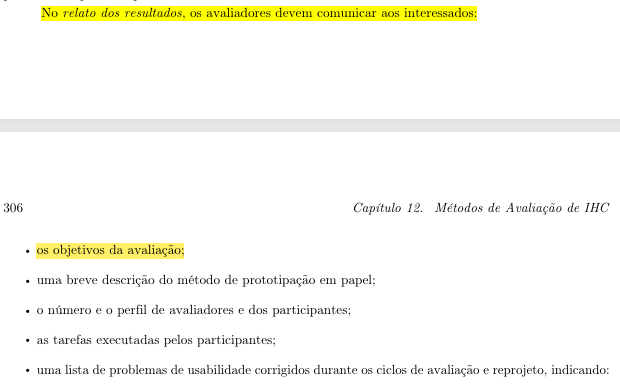

  
Fonte: <a href="#1">(Barbosa et al., 2021, p.305 e 306)</a>

**Item 02**

Este item foi desenvolvido por [Gabriel Diniz](https://github.com/GabrielDiniz12).

**Item:** O relato inclui uma breve descrição do método de avaliação (Prototipação em Papel) para auxiliar o leitor a compreender como os resultados foram obtidos?

  
<strong>Figura 9</strong> - Comprovação do Item 02

  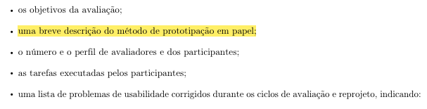

  
Fonte: <a href="#1">(Barbosa et al., 2021, p.306)</a>

**Item 03**

Este item foi desenvolvido por [Julia Gabriella](https://github.com/juliagabriellafs).

**Item:** O relato informa o número e o perfil dos avaliadores e dos participantes que interagiram com o protótipo?

  
<strong>Figura 10</strong> - Comprovação do Item 03

  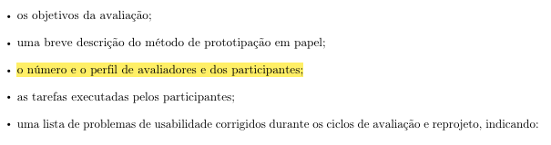

  
Fonte: <a href="#1">(Barbosa et al., 2021, p.306)</a>

**Item 04**

Este item foi desenvolvido por [Lucas Oliveira](https://github.com/dev-LucasDpaula).

**Item:** O relato descreve as tarefas propostas que foram executadas pelos participantes durante a simulação em papel?

  
<strong>Figura 11</strong> - Comprovação do Item 04

  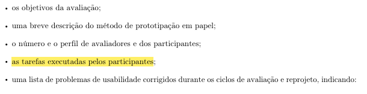

  
Fonte: <a href="#1">(Barbosa et al., 2021, p.306)</a>

**Item 05**

Este item foi desenvolvido por [Pedro Américo](https://github.com/dev-americo).

**Item:** O relato divide os problemas encontrados de forma clara em duas listas: problemas corrigidos durante os ciclos de teste e problemas ainda não corrigidos?

  
<strong>Figura 12</strong> - Comprovação do Item 05

  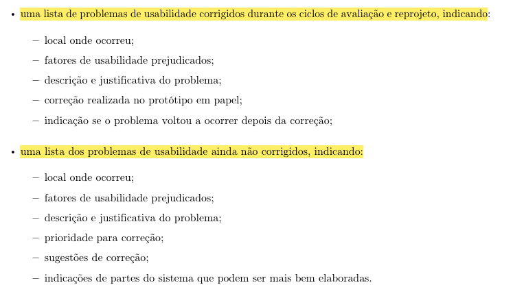

  
Fonte: <a href="#1">(Barbosa et al., 2021, p.306)</a>

**Item 06**

Este item foi desenvolvido por [Pedro Ian](https://github.com/pedroiaan).

**Item:** O relato registra o feedback dos usuários, incluindo opiniões e verbalizações espontâneas expressas durante a interação com o papel?

  
<strong>Figura 13</strong> - Comprovação do Item 06

  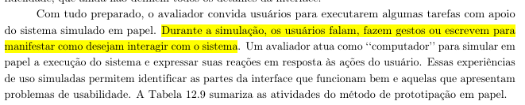

  
Fonte: <a href="#1">(Barbosa et al., 2021, p.304)</a>

**Item 07**

Este item foi desenvolvido por [Pedro Lucas](https://github.com/Pwdrinho).

**Item:** O relato inclui um planejamento de reprojeto orientando quais partes do sistema devem ser mais bem elaboradas antes do avanço para a alta fidelidade?

  
<strong>Figura 14</strong> - Comprovação do Item 07

  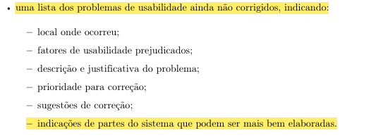

  
Fonte: <a href="#1">(Barbosa et al., 2021, p.306)</a>

### Planejamento da Avaliação dos Protótipos de Alta Fidelidade

**Item 01**

Este item foi desenvolvido por [Breno Teixeira](https://github.com/BrenoLTeixeira).

**Item:** O planejamento utiliza o Framework DECIDE (ou etapas correspondentes) para estruturar a condução da avaliação em alta fidelidade?

  
<strong>Figura 15</strong> - Comprovação do Item 01

  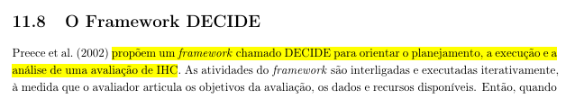

  
Fonte: <a href="#1">(Barbosa et al., 2021, p.264)</a>

**Item 02**

Este item foi desenvolvido por [Gabriel Diniz](https://github.com/GabrielDiniz12).

**Item:** O planejamento define claramente os objetivos da avaliação e explora as perguntas específicas a serem respondidas?

  
<strong>Figura 16</strong> - Comprovação do Item 02

  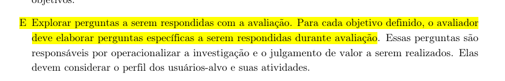

  
Fonte: <a href="#1">(Barbosa et al., 2021, p.264)</a>

**Item 03**

Este item foi desenvolvido por [Julia Gabriella](https://github.com/juliagabriellafs).

**Item:** O planejamento justifica a escolha do método de avaliação (ex: Teste de Usabilidade ou Avaliação Heurística) e sua adequação para um protótipo executável?

  
<strong>Figura 17</strong> - Comprovação do Item 03

  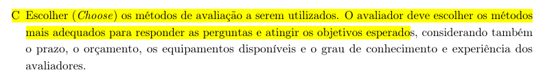

  
Fonte: <a href="#1">(Barbosa et al., 2021, p.264)</a>

**Item 04**

Este item foi desenvolvido por [Lucas Oliveira](https://github.com/dev-LucasDpaula).

**Item:** O planejamento identifica as questões práticas da avaliação, como o recrutamento de participantes, preparação do ambiente e equipamentos para registrar o uso (ex: gravação de tela)?

  
<strong>Figura 18</strong> - Comprovação do Item 04

  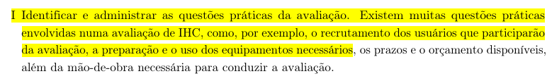

  
Fonte: <a href="#1">(Barbosa et al., 2021, p.264)</a>

**Item 05**

Este item foi desenvolvido por [Pedro Américo](https://github.com/dev-americo).

**Item:** O planejamento define previamente as tarefas que os participantes deverão realizar interagindo com o protótipo de alta fidelidade?

  
<strong>Figura 19</strong> - Comprovação do Item 05

  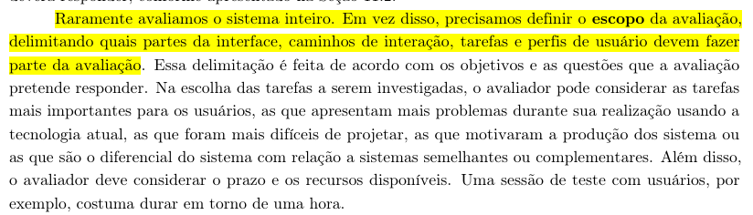

  
Fonte: <a href="#1">(Barbosa et al., 2021, p.258)</a>

**Item 06**

Este item foi desenvolvido por [Pedro Ian](https://github.com/pedroiaan).

**Item:** O planejamento aborda questões éticas, prevendo a aplicação de um Termo de Consentimento Livre e Esclarecido (TCLE) específico para a avaliação?

  
<strong>Figura 20</strong> - Comprovação do Item 06

  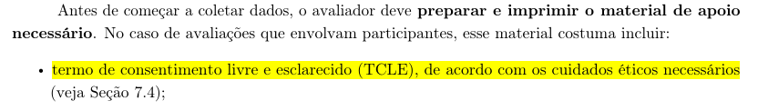

  
Fonte: <a href="#1">(Barbosa et al., 2021, p.259)</a>

**Item 07**

Este item foi desenvolvido por [Pedro Lucas](https://github.com/Pwdrinho).

**Item:** O planejamento prevê a realização de um teste-piloto antes da execução oficial para validar o protótipo interativo, o roteiro e os equipamentos?

  
<strong>Figura 21</strong> - Comprovação do Item 07

  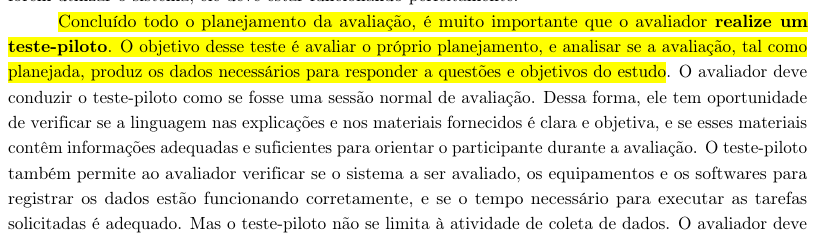

  
Fonte: <a href="#1">(Barbosa et al., 2021, p.260)</a>

### Planejamento do Relato dos Resultados dos Protótipos de Alta Fidelidade

**Item 01**

Este item foi desenvolvido por [Breno Teixeira](https://github.com/BrenoLTeixeira).

**Item:** O planejamento prevê que o relato descreva os objetivos e o escopo da avaliação do protótipo de alta fidelidade?

  
<strong>Figura 22</strong> - Comprovação do Item 01

  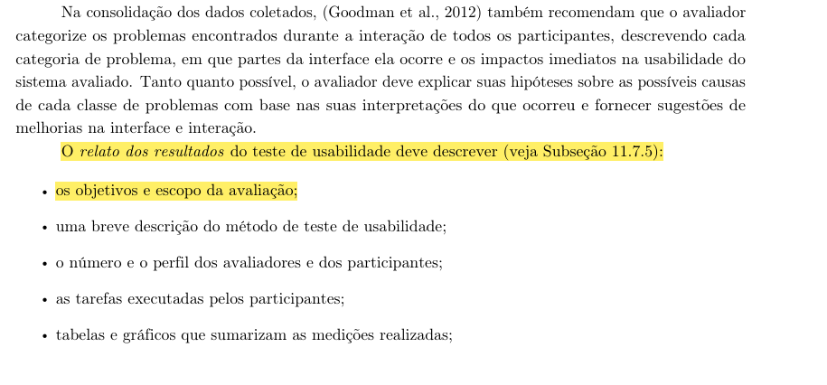

  
Fonte: <a href="#1">(Barbosa et al., 2021, p.289)</a>

**Item 02**

Este item foi desenvolvido por [Gabriel Diniz](https://github.com/GabrielDiniz12).

**Item:** O planejamento estipula que o relato deve conter uma breve descrição do método empregado na avaliação?

  
<strong>Figura 23</strong> - Comprovação do Item 02

  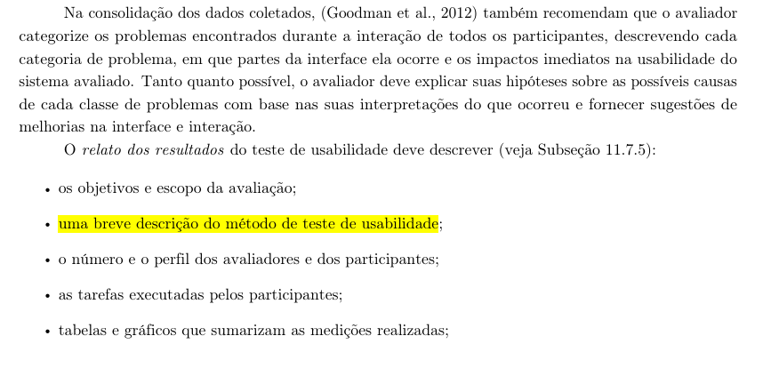

  
Fonte: <a href="#1">(Barbosa et al., 2021, p.289)</a>

**Item 03**

Este item foi desenvolvido por [Julia Gabriella](https://github.com/juliagabriellafs).

**Item:** O planejamento orienta que o relato apresente o número e o perfil dos avaliadores e dos participantes envolvidos nos testes?

  
<strong>Figura 24</strong> - Comprovação do Item 03

  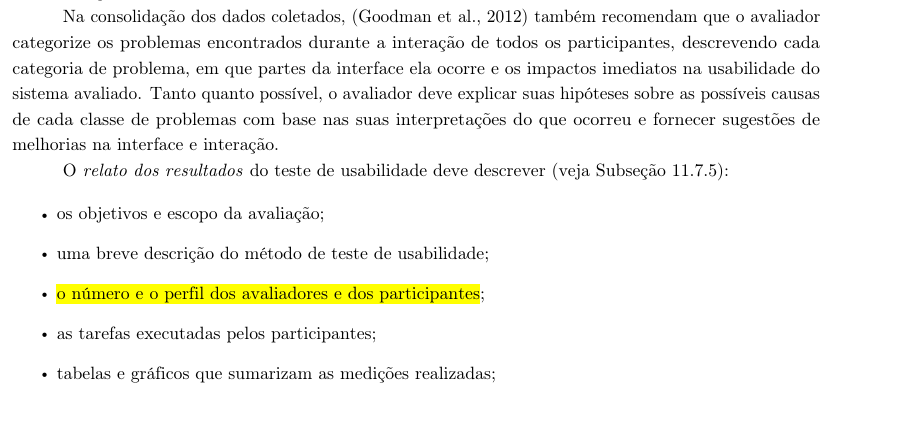

  
Fonte: <a href="#1">(Barbosa et al., 2021, p.289)</a>

**Item 04**

Este item foi desenvolvido por [Lucas Oliveira](https://github.com/dev-LucasDpaula).

**Item:** O planejamento prevê a inclusão de um tópico relatando as tarefas que foram efetivamente executadas pelos participantes durante o uso do protótipo?

  
<strong>Figura 25</strong> - Comprovação do Item 04

  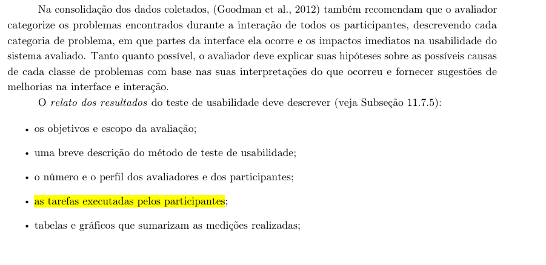

  
Fonte: <a href="#1">(Barbosa et al., 2021, p.289)</a>

**Item 05**

Este item foi desenvolvido por [Pedro Américo](https://github.com/dev-americo).

**Item:** O planejamento estipula a apresentação de tabelas e/ou gráficos que sumarizem os dados coletados e as medições realizadas na avaliação?

  
<strong>Figura 26</strong> - Comprovação do Item 05

  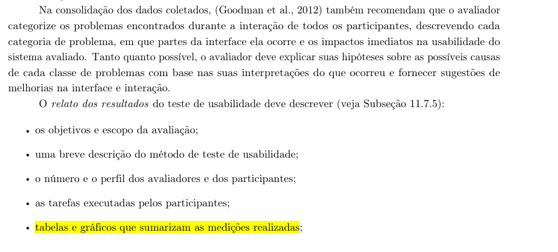

  
Fonte: <a href="#1">(Barbosa et al., 2021, p.289)</a>

**Item 06**

Este item foi desenvolvido por [Pedro Ian](https://github.com/pedroiaan).

**Item:** O planejamento exige que o relato apresente uma lista dos problemas encontrados, indicando o local de ocorrência, a descrição, a justificativa e sugestões de solução?

  
<strong>Figura 27</strong> - Comprovação do Item 06

  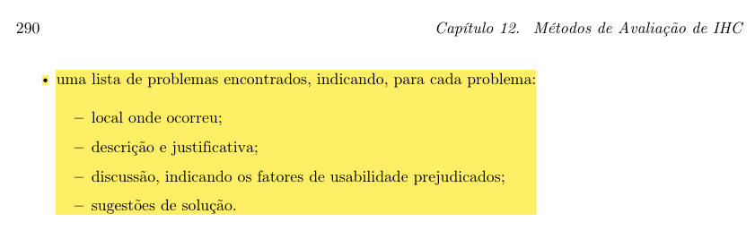

  
Fonte: <a href="#1">(Barbosa et al., 2021, p.289 e 290)</a>

**Item 07**

Este item foi desenvolvido por [Pedro Lucas](https://github.com/Pwdrinho).

**Item:** O planejamento determina que o relato incluirá um cronograma/plano de reprojeto para refinar o protótipo de alta fidelidade com base nos resultados consolidados?

  
<strong>Figura 28</strong> - Comprovação do Item 07

  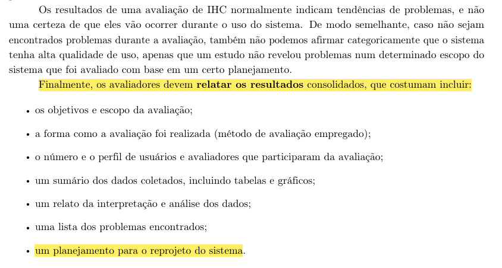

  
Fonte: <a href="#1">(Barbosa et al., 2021, p.263)</a>

---

## Tabelas Utilizadas

### Itens Gerais

<b>Tabela 1</b> - Avaliação Itens Gerais

| Item | Avaliação | Observação | Avaliador(es) |
| :--- | :---: | :---: | :---: |
| **_01:_** O artefato apresenta uma bibliografia/referência bibliográfica? | | | [Breno Teixeira](https://github.com/BrenoLTeixeira) |
| **_02:_** O artefato apresenta um histórico de versões com item das versões, autores e revisores? | | | [Gabriel Diniz](https://github.com/GabrielDiniz12) |
| **_03:_** As tabelas e imagens apresentam legenda e fonte? | | | [Julia Gabriella](https://github.com/juliagabriellafs) |
| **_04:_** O artefato apresenta uma introdução? | | | [Lucas Oliveira](https://github.com/dev-LucasDpaula) |
| **_05:_** A linguagem utilizada é formal e adequada ao contexto técnico/acadêmico? | | | [Pedro Américo](https://github.com/dev-americo) |
| **_06:_** Há coerência entre o conteúdo textual e os artefatos gráficos (tabelas, imagens, fluxogramas)? | | | [Pedro Ian](https://github.com/pedroiaan) |
| **_07:_** A gravação da reunião do grupo foi disponibilizada? | | | [Pedro Lucas](https://github.com/Pwdrinho) |

Autor: <a href="https://github.com/GabrielDiniz12">Gabriel Diniz</a>

### Relato dos Resultados do Protótipo de Papel

<b>Tabela 2</b> - Avaliação do Relato dos Resultados do Protótipo de Papel

| Item | Avaliação | Observação | Avaliador(es) |
| :--- | :---: | :---: | :---: |
| **_01:_** O relato descreve os objetivos e o escopo da avaliação realizada sobre o protótipo de papel? | | | [Breno Teixeira](https://github.com/BrenoLTeixeira) |
| **_02:_** O relato inclui uma breve descrição do método de avaliação (Prototipação em Papel) para auxiliar o leitor a compreender como os resultados foram obtidos? | | | [Gabriel Diniz](https://github.com/GabrielDiniz12) |
| **_03:_** O relato informa o número e o perfil dos avaliadores e dos participantes que interagiram com o protótipo? | | | [Julia Gabriella](https://github.com/juliagabriellafs) |
| **_04:_** O relato descreve as tarefas propostas que foram executadas pelos participantes durante a simulação em papel? | | | [Lucas Oliveira](https://github.com/dev-LucasDpaula) |
| **_05:_** O relato divide os problemas encontrados de forma clara em duas listas: problemas corrigidos durante os ciclos de teste e problemas ainda não corrigidos? | | | [Pedro Américo](https://github.com/dev-americo) |
| **_06:_** O relato registra o feedback dos usuários, incluindo opiniões e verbalizações espontâneas expressas durante a interação com o papel? | | | [Pedro Ian](https://github.com/pedroiaan) |
| **_07:_** O relato inclui um planejamento de reprojeto orientando quais partes do sistema devem ser mais bem elaboradas antes do avanço para a alta fidelidade? | | | [Pedro Lucas](https://github.com/Pwdrinho) |

Autor: <a href="https://github.com/dev-americo">Pedro Americo</a>

### Planejamento da Avaliação dos Protótipos de Alta Fidelidade

<b>Tabela 3</b> - Avaliação do Planejamento da Avaliação dos Protótipos de Alta Fidelidade

| Item | Avaliação | Observação | Avaliador(es) |
| :--- | :---: | :---: | :---: |
| **_01:_** O planejamento utiliza o Framework DECIDE (ou etapas correspondentes) para estruturar a condução da avaliação em alta fidelidade? | | | [Breno Teixeira](https://github.com/BrenoLTeixeira) |
| **_02:_** O planejamento define claramente os objetivos da avaliação e explora as perguntas específicas a serem respondidas? | | | [Gabriel Diniz](https://github.com/GabrielDiniz12) |
| **_03:_** O planejamento justifica a escolha do método de avaliação (ex: Teste de Usabilidade ou Avaliação Heurística) e sua adequação para um protótipo executável? | | | [Julia Gabriella](https://github.com/juliagabriellafs) |
| **_04:_** O planejamento identifica as questões práticas da avaliação, como o recrutamento de participantes, preparação do ambiente e equipamentos para registrar o uso (ex: gravação de tela)? | | | [Lucas Oliveira](https://github.com/dev-LucasDpaula) |
| **_05:_** O planejamento define previamente as tarefas que os participantes deverão realizar interagindo com o protótipo de alta fidelidade? | | | [Pedro Américo](https://github.com/dev-americo) |
| **_06:_** O planejamento aborda questões éticas, prevendo a aplicação de um Termo de Consentimento Livre e Esclarecido (TCLE) específico para a avaliação? | | | [Pedro Ian](https://github.com/pedroiaan) |
| **_07:_** O planejamento prevê a realização de um teste-piloto antes da execução oficial para validar o protótipo interativo, o roteiro e os equipamentos? | | | [Pedro Lucas](https://github.com/Pwdrinho) |

Autor: <a href="https://github.com/dev-americo">Pedro Americo</a>

### Planejamento do Relato dos Resultados dos Protótipos de Alta Fidelidade

<b>Tabela 4</b> - Avaliação do Planejamento do Relato dos Resultados dos Protótipos de Alta Fidelidade

| Item | Avaliação | Observação | Avaliador(es) |
| :--- | :---: | :---: | :---: |
| **_01:_** O planejamento prevê que o relato descreva os objetivos e o escopo da avaliação do protótipo de alta fidelidade? | | | [Breno Teixeira](https://github.com/BrenoLTeixeira) |
| **_02:_** O planejamento estipula que o relato deve conter uma breve descrição do método empregado na avaliação? | | | [Gabriel Diniz](https://github.com/GabrielDiniz12) |
| **_03:_** O planejamento orienta que o relato apresente o número e o perfil dos avaliadores e dos participantes envolvidos nos testes? | | | [Julia Gabriella](https://github.com/juliagabriellafs) |
| **_04:_** O planejamento prevê a inclusão de um tópico relatando as tarefas que foram efetivamente executadas pelos participantes durante o uso do protótipo? | | | [Lucas Oliveira](https://github.com/dev-LucasDpaula) |
| **_05:_** O planejamento estipula a apresentação de tabelas e/ou gráficos que sumarizem os dados coletados e as medições realizadas na avaliação? | | | [Pedro Américo](https://github.com/dev-americo) |
| **_06:_** O planejamento exige que o relato apresente uma lista dos problemas encontrados, indicando o local de ocorrência, a descrição, a justificativa e sugestões de solução? | | | [Pedro Ian](https://github.com/pedroiaan) |
| **_07:_** O planejamento determina que o relato incluirá um cronograma/plano de reprojeto para refinar o protótipo de alta fidelidade com base nos resultados consolidados? | | | [Pedro Lucas](https://github.com/Pwdrinho) |

---

## Referências Bibliográficas

 > 
 BARBOSA, Simone Diniz Junqueira et al. <b>Interação Humano-Computador e Experiência do Usuário</b>. 1. ed. Rio de Janeiro: Simone Diniz Junqueira Barbosa, 2021. E-book. 

 > 
 UNIVERSIDADE DE BRASÍLIA. Campus UnB Gama. **Plano de Ensino: Interação Humano Computador**. Professor: Dr. André Barros de Sales. Semestre 01/2026. Brasília, DF: UnB, 2026. Disponível em: <https://aprender3.unb.br/pluginfile.php/3335948/mod_resource/content/61/Plano_de_Ensino%20FIHC%20012026%20Turma%2003%20v2.pdf>. Acesso em: 21 jun. 2026.

## Histórico de Versões

| Versão | Descrição | Data | Autor(es) | Data de revisão | Revisor(es) |
| :---: | :--- | :---: | :---: | :---: | :---: |
| 1.0 | Avaliação da entrega 6 | 23/06/2026 | [Júlia Gabriella](https://github.com/juliagabriellafs) | 23/06/2026 | [Pedro Américo](https://github.com/dev-americo) | 